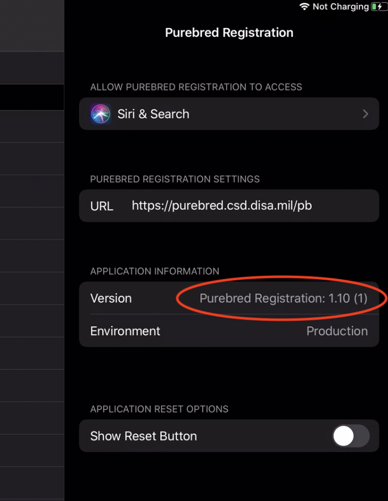
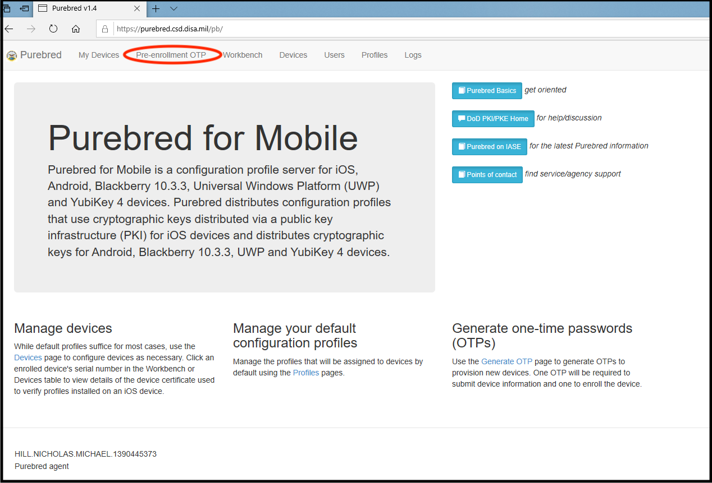
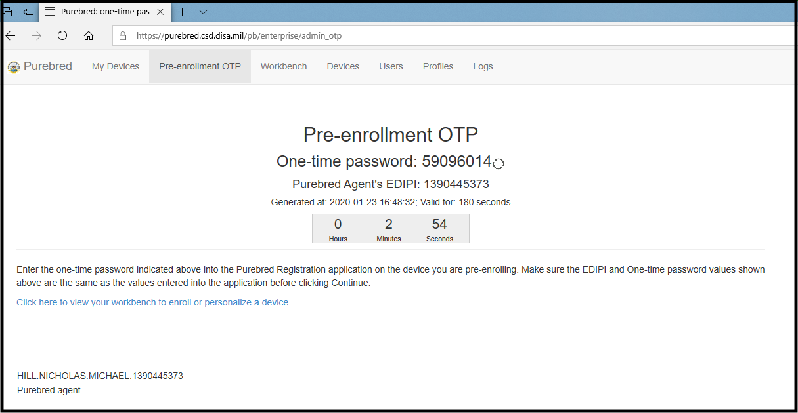
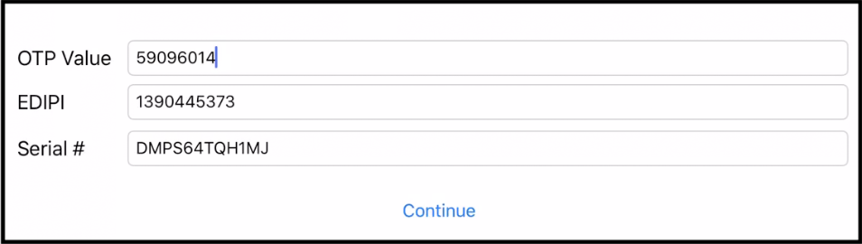
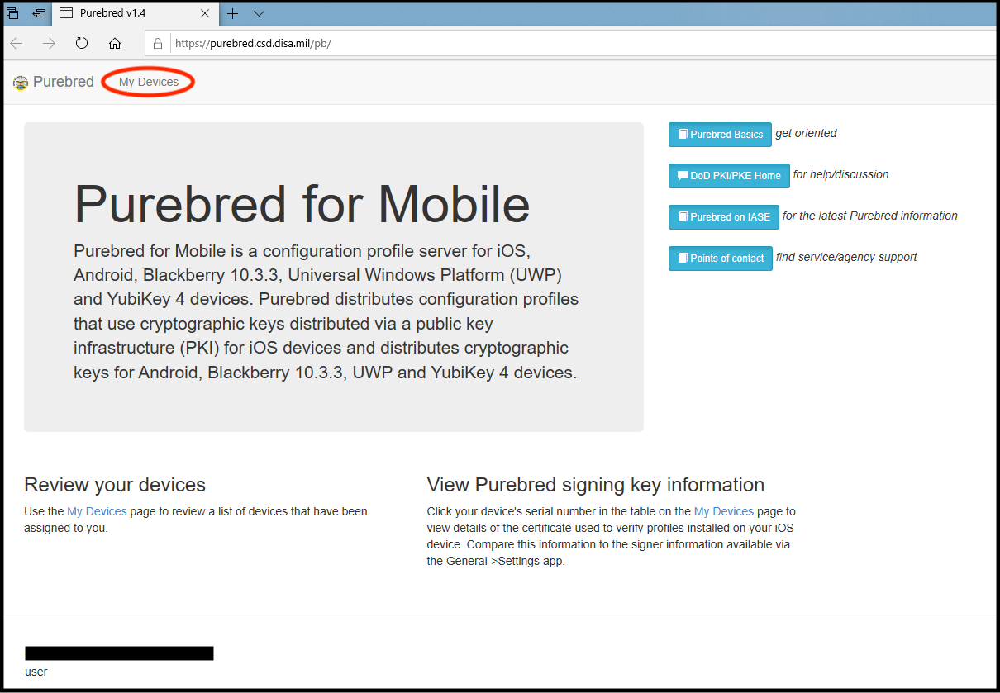
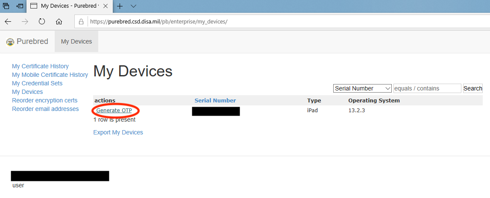
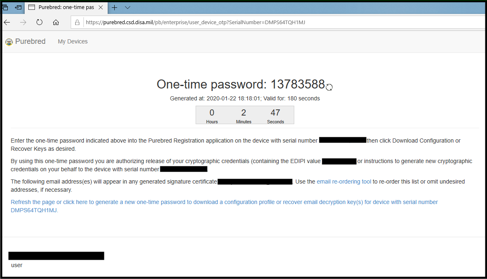
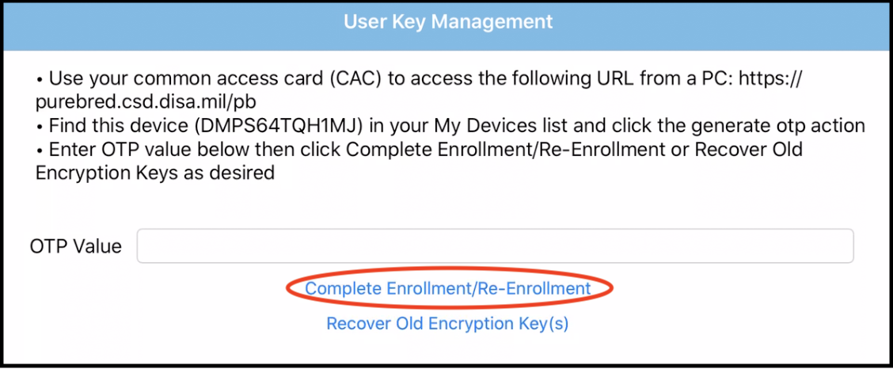
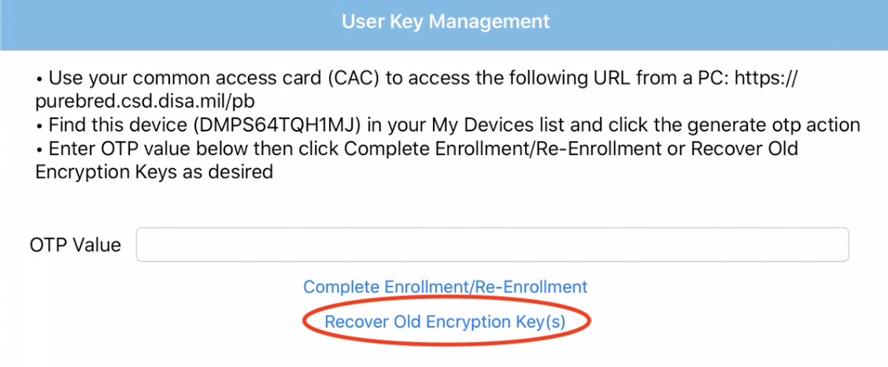

# DoD Certs on Mobile

## Purebred  
We use a website and App combo called Purebred to download and install certs onto the EFBs. The Purebred website can be found at [purebred.csd.disa.mil](http://purebred.csd.disa.mil/) and the Purebred App is found in your support folder on your EFB. Before you install any certs on the EFB, ensure that the Purebred app is updated to the most current version. The current version can be seen at [Mobile Device Baseline](../Mobile/SWBaseline.md#mobile-device-baseline) on the Status page.

#### Check App Version  
To verify the Apps version, follow the steps below  
1. Navigate to settings, and scroll all the way to the bottom of the page. On the right side, locate the Purebred App.  
{: style="height:75%;width:75%"}    
2. Touch the Purebred app and the application information will appear on the left of the screen.     
3. Verfiy that the version is the most up to date.  
{: style="height:75%;width:75%"}   
4. If App is not up to date, contact your EFB office to have them update the App  

## Initial DoD Cert Download And Installation
A Purebred adgent is the only one who can initially download and install your certs on your device, but you can reinstall them yourself when your certs are expired or any time you receive a new CAC. Those instructions can be found under [Expired Certs and New CAC DoD Cert Installation]() located fruther down the page.

Below are the steps for initailally installing DoD certs onto a new EFB.
### Step 1: Set up device
1. Open the Purebred App, located in the support folder, and enter you EDIPI (DoD number on the back of your CAC) into the block and touch continue.  
{: style="height:75%;width:75%"}  
2. A pop up window will appear asking to downlaod a configuration profile, touch "allow" and wait for the "Profile Downloaded" window.  
{: style="height:75%;width:75%"} 
{: style="height:75%;width:75%"}  
3. Once the pop up window appears, open up iPad settings and locate the downloaded profile on the left side. Touch the profile and and touch install in the upper right corner of the pop up window.  
{: style="height:75%;width:75%"}  
{: style="height:75%;width:75%"}  
4. It will prompt you for the users PIN, and then will say, "The profile is not signed". Touch install in the upper right hand corner and wait for the profile to install.
{: style="height:75%;width:75%"} 
5. Sometimes the profile will not install and you will get the following message, "Profile Installation Failed. The request timed out". If you get this message, restart the iPad and repeat steps 1-4.   
{: style="height:75%;width:75%"} 

### Step 2: Perform Purebred Set Up
1. Once the profile is downloaded, have the Purbred adgent log into the Purebred website. 
{: style="height:75%;width:75%"}  
2. Generate a Pre-enrollment OTP (One Time Password). 
{: style="height:75%;width:75%"}  
3. Enter that OTP into the purbred app and hit "continue.
{: style="height:75%;width:75%"}  

## Expired Certs And New CAC DoD Cert Installation 

The following steps can be done by you, the user, to install your new certs after you have received a new CAC. Before you begin, ensure that your Purebred App is updated to current version. Instructions are shown above.  

1. Using Explorer, navigate to the [Purebred](http://purebred.csd.disa.mil/) website and log in using your credentials.
2. Click on "My Devices" near the top to navigate to your device.    
{: style="height:75%;width:75%"} 
3. Click "Generate OTP" and on your EFB, open the Purebred App.
{: style="height:75%;width:75%"} 
{: style="height:75%;width:75%"} 
4. Enter the OTP (One-Time Password) from the purebred website into the "OTP Value" line in the purebred app. 
5. Click "Complete Enrollement/Re-Enrollment" and wait for a pop up block to appear.
{: style="height:75%;width:75%"}
6.
7.
8.
9. Enter a new OTP into the "OTP Value" line and this time click "Recover Old Encryption Key(s)" 
{: style="height:75%;width:75%"} 
10. Repeat steps 6-

---

Last update: {{ git_revision_date_localized }}