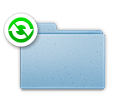
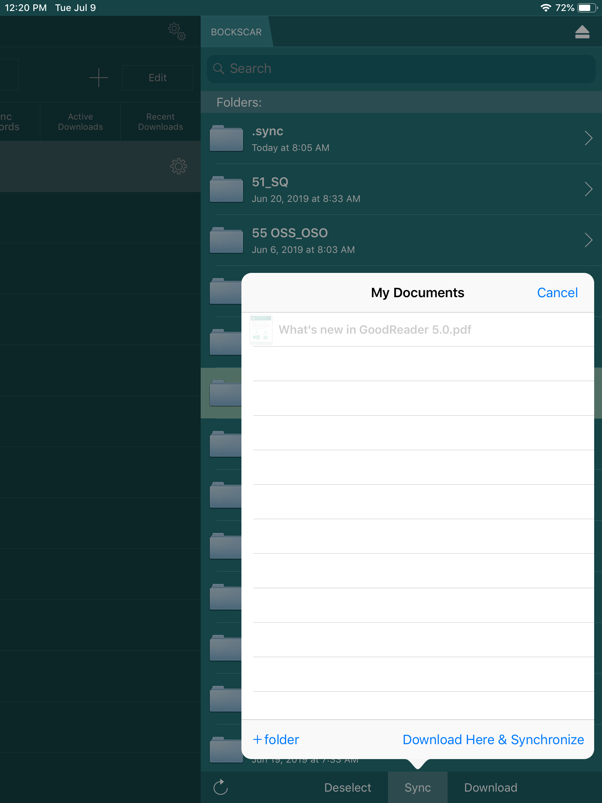

# Syncing Publications with GoodReader

## About File Syncing

Publications or other workcenter data are synced to your EFB/Mobile Device using an application called GoodReader.  
{: style="height:35%;width:35%"}

GoodReader can automatically sync individual files and entire
folders from their remote versions hosted on the BOCKSCAR server. In GoodReader, all files and folders that are a part of the sync process
are tagged with a special badge:  
{: style="height:50%;width:10%"}
{: style="height:50%;width:10%"}

You can choose whether or not you want to keep *modified* local files.
This option may preserve notes that you've put over a PDF file, even if
the corresponding remote file was deleted or modified on the server (Use
this feature with caution. Please see [I made notes/highlights to publications in GoodReader. Will they be lost when I sync?](FAQ.md#q-i-made-noteshighlights-to-publications-in-goodreader-will-they-be-lost-when-i-sync) in the Mobile FAQ.

There are two different types of sync: normal sync and download-only.

> A **normal** sync is two-way. It keeps the contents of a local file or a
folder identical to what you have on a server. During this process,
GoodReader analyzes the contents of both local and remote folders and
does the following:
>- Looks for modified files (for example, freshly annotated PDFs) on your device and uploads them to a server, replacing old ones there
>- Looks for modified files on a server and downloads them to your device, replacing old ones there
>- Looks for new files on a server and downloads them to your device
>- Looks for new local files and uploads them to a server
>- Looks for deleted files on a server that were previously present, and deletes them from your device.
>- Looks for deleted local files that were previously present, and deletes them from a server.

>A **download-only** sync is one-way, from the server to your device. It
is a convenient distribution method for frequently-updated documents.
This type of sync doesn't care what happens with your local files; It
never puts anything on the server, never deletes anything from it, it
only looks for **new** and modified remote files and downloads them as
needed. When correctly configured, files that were deleted from the
server will be deleted from your local device.  **The Aircrew Publications Library (APL) is a download-only sync.** OGV maintains APL content on the BOCKSCAR server in a folder called `55_OG`.

---

## Initial Setup

For aircrew, this is usually done just before the
device is issued to you. It only needs to be done once per each
file/folder you wish to synchronize. All relevant remote files will be automatically downloaded to your device when doing the very first synchronization.

Instructions for initial setup:

### Step 1: General App Settings

First, set up general settings in GoodReader.

1. Tap the `Settings` button on the main screen.  
{: style="height:75%;width:75%"}
2. Select the `General Settings` menu item.  
{: style="height:50%;width:50%"}
3. In **General Settings**, make the following changes:
    * Turn **off** `Use iCloud` folder
    * Turn **off** `Use Downloads` folder
    * Make sure that `Disable device auto-lock` is **on/enabled**  
{: style="height:75%;width:75%"}

---

### Step 2: Add the BOCKSCAR WebDAV server

Next, add the BOCKSCAR server

1. Tap the `Connect` button on the main screen.  
{: style="height:50%;width:50%"}
2. Tap to highlight `Saved Servers`, then the plus sign `+` to add a server.
3. Select `WebDAV Server`.  
{: style="height:75%;width:75%"}
4. Configure the new **WebDAV Server** as follows:
    * Readable Title: `BOCKSCAR`
    * URL-address: `pubs.bockscar.mil`
    * Turn **on/enable** `Windows-style name encoding`
    * Turn **off** `Use cookies`
    * Leave all the other fields/settings unchanged
{: style="height:75%;width:75%"}
5. Tap `Add`.
6. You should now see **BOCKSCAR** listed as a saved server.  
{: style="height:75%;width:75%"}

### Step 3: Set up a Sync Folder

Now that you have the server added, we’ll need to configure GoodReader to sync with a folder on that server.

!!! note "Note"
    55 OG Aircrew should sync the `55_OG` folder. If you’re unsure, that’s probably what you should select. You can come back anytime and sync additional folders.
!!! note "Note"
    Double-check the Sync Parameter settings on step 9. Incorrect settings here are a common source of sync-related issues.

1. Tap the Connect button on GoodReader's main screen.  
{: style="height:50%;width:50%"}
2. Tap to highlight Saved Servers.
 {: style="height:75%;width:75%"}
3. Select BOCKSCAR. A list of folders on the server are displayed.  
 {: style="height:50%;width:50%"}
4. Tap to highlight the folder you’d like to sync (We want to _select_ the folder, not view its contents. So tap the folder name, not the `>` to the right of it).
5. Tap `Sync`, at the bottom of the screen (Be careful **not** to tap _Download_ if it is an option here. We're setting up a sync, not a one-time download.)
6. If you get a pop-up that says _Folder Already Exists_ select `Proceed`.
7. Now we’ll tell GoodReader where to sync the folder to on your device. We want the folder in your top/root directory, called **My Documents**, so do not select any sub-folders. Tap `Download Here & Synchronize`.  
{: style="height:75%;width:75%"} 
8. If you see a _Folder Already Exists_ pop-up, tap `OK`.
9. Configure the Sync Parameters as follows:
    * Turn on/enable `Download only` sync.
    * Make sure `Delete local files` is on/enabled
    * Turn **on**/enable `…even if they were edited`.
    * POLICY ON SYNC CONFLICTS: `Action` needs to be `Remote files have priority`.
    * Tap `Sync` (or `Close`)
{: style="height:75%;width:75%"}
10. You’ve set up the folder to sync from the BOCKSCAR server. GoodReader will now begin to sync that folder. You should see:  
{: style="height:50%;width:50%"}

---

## Updating Synced Folders

To make sure you have the latest publications/T.O.s/files, update your synced folder(s). During the update, any synced configured during initial setup will pull updates from the server.

1. Connect to a BOCKSCAR Wi-Fi Access Point.  
{: style="height:75%;width:75%"}  
2. Open GoodReader. From the main screen, tap the `Sync` button.  
{: style="height:75%;width:75%"}
3. A progress pop-up appears during the sync process. You should see:  
{: style="height:50%;width:50%"}  
Press the Hide button to hide this pop-up and continue the sync in the background. You'll be able to continue reading your documents while the sync is working (Press the Sync button again to bring back the hidden progress popup). You can press the popup's schedule button to set up an automatic, periodic sync execution. If you switch to another app while GoodReader's Sync is in progress, iOS _may_ stop the sync.

---

## Failed Sync
{: style="height:75%;width:75%"}  
Please see [My Pubs Won't Sync](Troubleshooting.md#my-pubs-wont-sync) in the Troubleshooting section for further instructions.