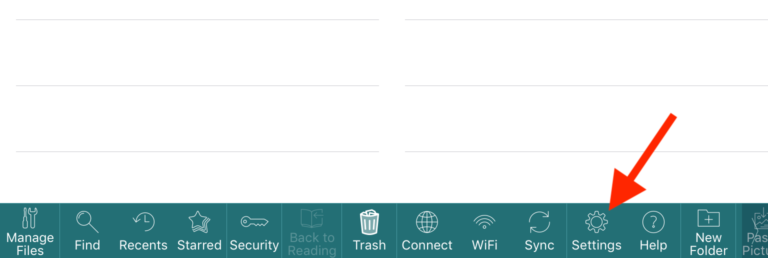
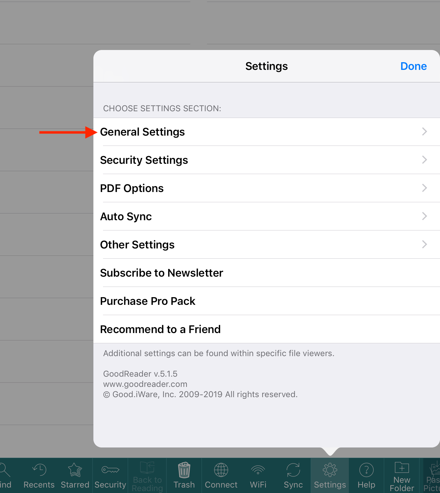

# Configure GoodReader to Sync Publications

Publications are Synced to your EFB/Mobile Device using an application called GoodReader.
{: style="height:50%;width:50%"}

---

## Step 1: General App Settings

First, set up general settings in GoodReader.

1. Tap the `Settings` button on the main screen.  
{: style="height:75%;width:75%"}
2. Select the `General Settings` menu item.  
{: style="height:50%;width:50%"}
3. In **General Settings**, make the following changes:
    * Turn **off** `Use iCloud` folder
    * Turn **off** `Use Downloads` folder
    * Make sure that `Disable device auto-lock` is **on/enabled**  
{: style="height:75%;width:75%"}

---

## Step 2: Add the BOCKSCAR WebDAV server

Next, add the BOCKSCAR server

1. Tap the `Connect` button on the main screen.  
{: style="height:50%;width:50%"}
2. Tap to highlight `Saved Servers`, then the plus sign `+` to add a server.
3. Select `WebDAV Server`.  
{: style="height:75%;width:75%"}
4. Configure the new **WebDAV Server** as follows:
    * Readable Title: `BOCKSCAR`
    * URL-address: `pubs.bockscar.mil`
    * Turn **on/enable** `Windows-style name encoding`
    * Turn **off** `Use cookies`
    * Leave all the other fields/settings unchanged
{: style="height:75%;width:75%"}
5. Tap `Add`.
6. You should now see **BOCKSCAR** listed as a saved server.  
{: style="height:75%;width:75%"}

---

## Step 3: Set up a Sync Folder

Now that you have the server added, we’ll need to configure GoodReader to sync with a folder on that server.

!!! note "Note"
    55 OG Aircrew should sync the `55_OG` folder. If you’re unsure, that’s probably what you should select. You can come back anytime and sync additional folders.
!!! note "Note"
    Double-check the Sync Parameter settings on step 9. Incorrect settings here are a common source of sync-related issues.

1. Tap the Connect button on GoodReader's main screen.  
{: style="height:50%;width:50%"}
2. Tap to highlight Saved Servers.
 {: style="height:75%;width:75%"}
3. Select BOCKSCAR. A list of folders on the server are displayed.  
 {: style="height:50%;width:50%"}
4. Tap to highlight the folder you’d like to sync (We want to _select_ the folder, not view its contents. So tap the folder name, not the `>` to the right of it).
5. Tap `Sync`, at the bottom of the screen.
6. If you get a pop-up that says _Folder Already Exists_ select `Proceed`.
7. Now we’ll tell GoodReader where to sync the folder to on your device. We want the folder in your top/root directory, called **My Documents**, so do not select any sub-folders. Tap `Download Here & Synchronize`.  
{: style="height:75%;width:75%"} 
8. If you see a _Folder Already Exists_ pop-up, tap `OK`.
9. Configure the Sync Parameters as follows:
    * Turn on/enable `Download only` sync.
    * Make sure `Delete local files` is on/enabled
    * Turn **on**/enable `…even if they were edited`.
    * POLICY ON SYNC CONFLICTS: `Action` needs to be `Remote files have priority`.
    * Tap `Sync` (or `Close`)
{: style="height:75%;width:75%"}
10. You’ve set up the folder to sync from the BOCKSCAR server. GoodReader will now begin to sync that folder. You should see:  
{: style="height:50%;width:50%"}

---

## Update your Synced Folder

To make sure you have the latest publications/T.O.s/files, update your synced folder(s).

1. Connect to a BOCKSCAR Wi-Fi Access Point.  
{: style="height:75%;width:75%"}  
2. Open GoodReader. From the main screen, tap the `Sync` button.  
{: style="height:75%;width:75%"}  

---

## Failed Sync

Please see [My Pubs Won't Sync](Troubleshooting.md#my-pubs-wont-sync) in the Troubleshooting section for further instructions.