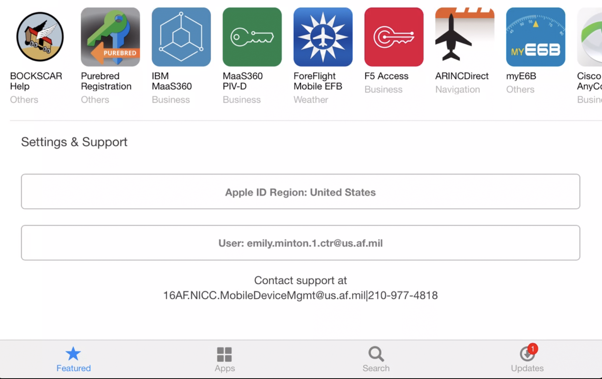
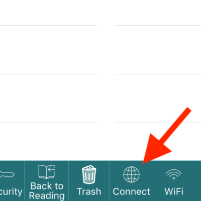

# Troubleshooting Common Problems

---

## I keep getting an _Apple ID_ pop-up

*Issue:* Recurring pop-up window promting the user to sign in with an Apple ID. If you don't have or wish to use an Apple ID on the device, do the following to stop the pop-ups:

1. Navigate to the app catalog and locate `Apple ID Region`, it will most likely say `United States`.  
{: style="height:75%;width:75%"}  
1. Click on the Apple ID Region and select `Do not have a Apple ID`.  
{: style="height:75%;width:75%"}

---

## My Pubs Won’t Sync

[!image](img/Troubleshooting/syncissue.png){: style="height:75%;width:75%"}

**Are you connected to BOCKSCAR Wi-Fi?**  
GoodReader Syncing only works when you’re connected to a BOCKSCAR Wi-Fi Access Point. You’ll be unable to sync when connected to any other Wi-Fi (e.g. home, billeting, starbucks, etc).  

1. Tap the iOS Settings icon (Looks like a gear).  
2. Make sure that `Airplane Mode` is turned **off** and that Wi-Fi is turned **on**.
3. Connect to the BOCKSCAR Wi-Fi network.  
{: style="height:75%;width:75%"}

**Is a VPN Enabled?**  
Some VPNs can prevent GoodReader from properly syncing.

1. Tap the iOS Settings icon (Looks like a gear).
2. If the `VPN` setting exists, ensure that the connection is *not* enabled.
3. Open GoodReader and try to sync. If you still get an error, continue below to step 3.

**Is GoodReader Configured Correctly?**  
If GoodReader _still_ won’t sync, follow these steps to clear your sync configuration and set it back up correctly.

1. Open GoodReader.  
2. Tap the `Connect` button on the main screen.  
{: style="height:50%;width:50%"}  
3. Tap to highlight `Sync Records`.
4. If the desired Sync Record is listed (e.g. `55_OG` if you are syncing the Aircrew Publications Library), tap the `trash can` icon to the right to delete the Sync Record. If there are no saved Sync Servers to delete, just go on to the next step.  
{: style="height:75%;width:75%"}  
5. Tap to highlight `Saved Servers`.  
{: style="height:75%;width:75%"}  
6. Swipe the `BOCKSCAR` server to the right and delete it.
7. Now that your Saved Server and Sync Record are removed, you'll need to re-add them. Please follow the instructions in [Syncing Pubs: Initial Setup](SyncingPubs.md#step-1-general-app-settings) to set things back up again.
