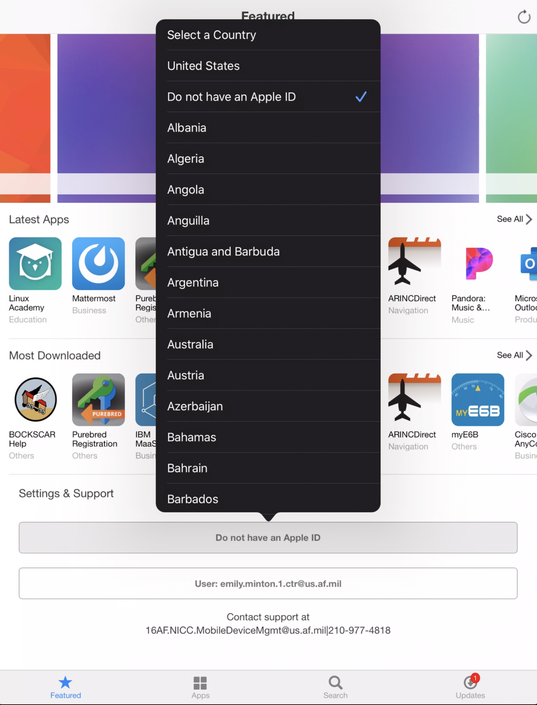
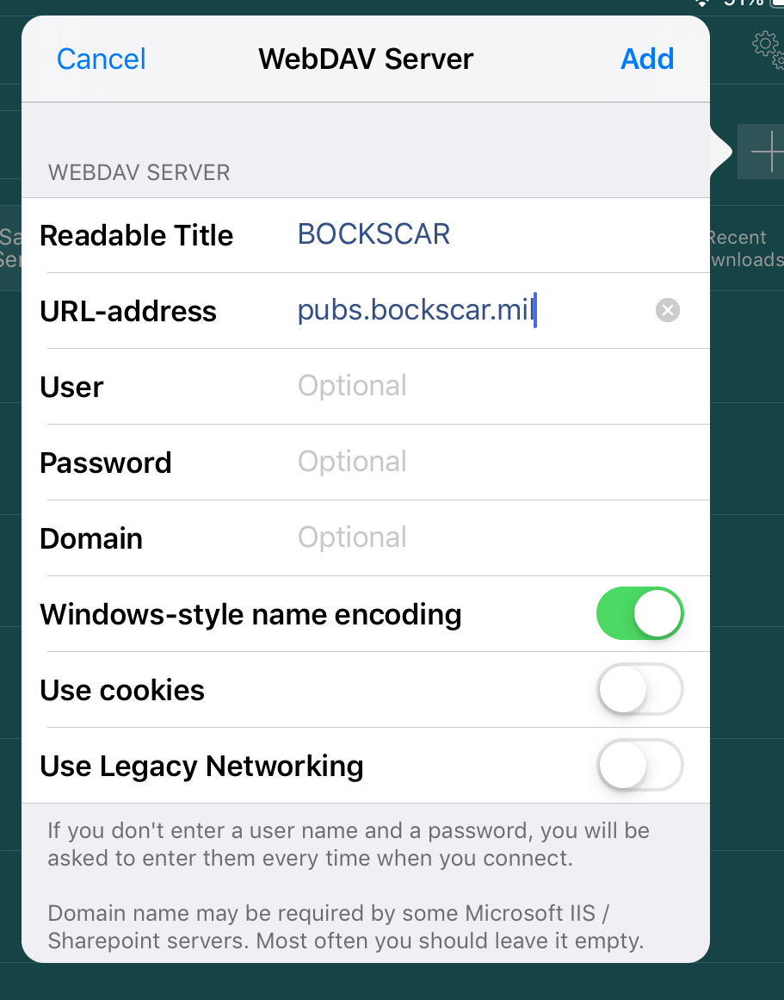

# Troubleshooting Common Problems

---

## I keep getting an _Apple ID_ pop-up

*Issue:* Recurring pop-up window promting the user to sign in with an apple ID. If you don't have or wish to use an Apple ID on the device, do the following to stop the pop-ups:

1. Navigate to the app catalog and locate `Apple ID Region`, it will most likely say `United States`.  

2. Click on the Apple ID Region and select `Do not have a Apple ID`.  

---

## My Pubs Won’t Sync

**Step 1: _Are you connected to BOCKSCAR?_**  
GoodReader Syncing only works when you’re connected to a BOCKSCAR Wi-Fi Access Point. You’ll be unable to syn when connected to any other Wi-Fi (e.g. home, billeting, starbucks, etc).  

 1. Tap the iOS Settings icon (Looks like a gear).  
 2. Make sure that `Airplane Mode` is turned *off* and that Wi-Fi is turned *on*.
 3. Connect to the BOCKSCAR Wi-Fi network.
   

**Step 2. _Is a VPN Enabled?_**  
Some VPNs can prevent GoodReader from properly syncing.

 1. Tap the iOS Settings icon (Looks like a gear).
 2. If the `VPN` setting exists, ensure that the connection is *not* enabled.
 3. Open GoodReader and try to sync. If you still get an error, continue below to step 3.

**Step 3. _GoodReader Sync Settings_**  
If GoodReader _still_ won’t sync, you can clear and re-add the synced folder.

 1. Open GoodReader.  
 
 2. Tap the `Connect` button on the main screen.  
 
 3. Tap to highlight `Sync Records`.
 4. If the desired Sync Record is listed (e.g. `55_OG`), tap the `trash can` icon to the right to delete the Sync Record. If there are no saved Sync Servers to delete, just go on to the next step.  
 
 5. Tap to highlight `Saved Servers`. If BOCKSCAR is listed, tap the gear icon to the right of it and go to step 7. If it is _not_ listed, tap the plus sign `+` to add a server.  
 
 6. Select `WebDAV Server`.  
 
 7. Configure the new WebDAV Server as follows:
    * Readable Title: `BOCKSCAR`
    * URL-address: `pubs.bockscar.mil`
    * Turn on/enable `Windows-style name encoding`
    * Turn off `Use cookies`
    * Leave all the other fields/settings unchanged

 8. Tap `Add`.
 9. You should now see `BOCKSCAR` listed as a saved server.  
 

**Step 4. _Sync a Folder_**  
Now that you have the server added, we’ll configure GoodReader to sync with a folder on that server.

1. Tap the `Connect` button on the main screen.
 
2. Tap to highlight Saved Servers.

3. Select BOCKSCAR. A list of folders on the server are displayed.
 
4. Tap to highlight the folder you’d like to sync (We want to select the folder, not see its contents. So tap the folder name, not the > to the right of it). 

        **Note**  
            _55 OG Aircrew should select the `55_OG` folder. If you’re unsure, that’s probably what you should select. You can come back anytime and sync additional folders._

5. Tap `Sync`, at the bottom of the screen.
6. If you get a pop-up that says _Folder Already Exists_ select `Proceed`.
7. Now we’ll tell GoodReader where to sync the folder to on your device. We want the folder in your top/root directory, called `My Documents`, so do not select any sub folders. 
8. Tap `Download Here & Synchronize`.
 
9. If you see a `Folder Already Exists` pop-up, tap `OK`.
10. Configure the Sync Parameters as follows:
    * Turn on/enable `Download only` sync.
    * Make sure `Delete local files` is on/enabled
    * Turn on/enable `…even if they were edited`.
    * POLICY ON SYNC CONFLICTS: `Action` needs to be *Remote files have priority*.
    * Tap `Sync` (or `Close`).
 
11. You’ve set up a local folder that will sync from the BOCKSCAR server. GoodReader will now begin to sync that folder. You should see:
   

**Step 5. _Sync your Folder(s)_**

Now that the folder setup is coorect, you can update your synced folders in GoodReader to make sure you have the latest publications/T.O.s/files.

1. Connect to a BOCKSCAR Wi-Fi Access Point.
 
2. Open GoodReader. From the main screen, tap the `Sync` button.
3.  

---