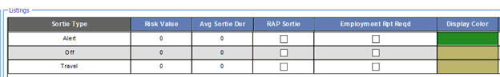

# Scheduling

## ATO - Import an Air Tasking Order

Introduction

PEX reads an Air Tasking Order \(ATO\) in the USMTF 2000/2004 and NATO formats, saves the general ATO

data, saves the mission data for your selected missions to help build your flying schedule, and permits you to update those missions based on an ATO change message.

Best Practice

Existing PEX sorties cannot be linked to imported ATO sorties. If you build a flying schedule in PEX, in anticipation of an ATO, when you subsequently import the ATO into PEX, you wil end up with two sets of sorties: your anticipated sorties and your imported ATO sorties. You do not want this. What you want is a single set of sorties with your ATO data. To do that:

1. Build your anticipated ATO flying schedule outside of PEX, in Excel for example. This anticipated schedule would include: \# of Lines and Formations, MDS, Tail Number, SCLs, Crew, Show, and Brief Times.

2. Import the ATO into PEX.

3. Let PEX build the draft flying schedule based on the ATO.

4. Transfer the data from your anticipated schedule \(Tail \#, SCLs, Crew, Show, and Brief Times\) into the ATO-imported sorties in PEX.

Import an ATO into PEX

In the ATO module, browse to the location of the ATO file. PEX reads the ATO and displays aircraft missions in the Mission Summary grid. Non-aircraft missions are not displayed, e.g., naval missile taskings \(a MTGTLOC data set with no accompanying MSNACFT data set\). The grid displays either all ATO missions or just the missions for the ATO units you have mapped to a PEX squadron, depending on your selection. By default, the ATO mission goes to the mapped squadron and is assigned to the default aircraft type \(MDS\) for that squadron, but these can be changed before importing. Select the missions you want to add to the PEX database. If required, update the squadrons and MDSs to which the missions wil be assigned in PEX and click Import/Update. After you import, PEX saves general ATO data and all the data tied to the missions you selected. Some of the imported mission data is not viewable in the PEX Mission Board but all data for a selected mission is available in the PEX database via web services. Data for missions not selected in the Mission Summary grid is not saved to the PEX database.

!!! Note
    A mission is identified as having a target \(TGT\) if it includes any of the following ATO data sets: GTGTLOC, MTGTLOC, or SHIPTGT. A mission is identified as having air refueling \(AR\) if it includes any of the following ATO data sets: ARINFO, 5REFUEL, or REFTSK.

Associate your PEX Squadron to an ATO Unit

As a time-saver, once you know how your PEX squadron is identified in the ATO, link it so you don’t have to select it in the Mission Summary grid for every mission you want imported. To do this, click the Display Only Mapped Squadrons hyperlink and a grid will appear listing all the PEX squadrons and a place to type in the ATO designation for each.

PEX Missions

ATO missions do not match one-for-one to PEX missions but they wil have the same mission number. An ATO mission may contain multiple MDSs. A PEX mission is created for each ATO mission MSNACFT data set. In other words, if the ATO mission contains a MSNACFT data set for F15E and another for B52H; PEX will create two missions, one for the F15E and another for the B52H.

PEX Sorties

PEX will create sorties based on the number of aircraft in the MSNACFT data set and/or the number of legs in AIRMOVE taskings. PEX will apply its formation logic to multi-aircraft \(MSNACFT\) missions.

Takeoff and Land Locations

PEX establishes these locations from the ATO AMSNDAT set DEPLOC and ARRLOC fields. If there are no values in those fields, then PEX uses the Mission Board user-defined default takeoff location.

!!! caution
    Your Database could have three instances of the same location, for example: PEX KDMA, ATO KDMA, and ACO KDMA. If you imported an ACO, then the locations have relatively complete definitions including Lat/Long coordinates. When the ATO import occurs, PEX will look to see if you have an ACO location that matches \(e.g., ACO KDMA\). If it finds it, then it uses that one on for the sortie. If it does not find it, it searches for an ATO location \(e.g., ATO KDMA\) and uses it. If it finds neither, it creates a new location of Source = ATO and uses that one. The issue for you is that PEX creates the ATO location KDMA, but it does not know its Lat/Long. Go to Setup > Locations and enter Lat/Longs for frequently used ATO locations.

Takeoff and Land Times

ATOs do not normally specify takeoff or land times. PEX calculates an estimated takeoff and land time for each ATO sortie. For speed, PEX uses the Speed entered in the Aircraft Module for the sortie MDS. If no speed is entered, PEX uses 350 knots ground speed. To determine takeoff time, PEX uses the first controlled \(frozen\) sortie event time, for example, a 5REFUEL with an ARCT of 10:40 at location EXXON BLUE. If PEX finds the Lat/Long of EXXON BLUE \(from the ACO import\) and if PEX finds the Lat/Long of the takeoff location, then PEX calculates a reasonable time enroute. If that turns out to be 35 minutes, then PEX calculates an estimated takeoff time of 10:05. If any of the required Lat/Long information is missing, PEX defaults to one hour prior, or 09:40 in our example. To calculate an estimated land time, PEX uses the last control ed \(frozen\) sortie event time.

Controlled \(Frozen\) Times

PEX creates Sortie Events with frozen times for the following ATO data sets:

* AIRDROP \(airdrop mission data\)
* AMSNLOC \(location data for missions with no target\)
* ARINFO \(refueling data for the receiver\)
* ASACSDAT \(air control data\) \(no time\)
* ASUPTFOR \(data on missions being supported\) \(no time\)
* CONTROLA \(control data\) \(no time\)
* GTGTLOC \(target location and description\)
* MTGTLOC \(missile target data\)
* PTRCPLOT \(reconnaissance mission location data\) \(no time\)
* RECCEDAT \(reconnaissance data\)
* REFTSK \(refueling data for the tanker\)
* SHIPTGT \(naval target data\)
* 1MSNRTE \(data on an established flight route\)
* 5REFUEL \(receiver refueling data for the tanker\)
* 7CONTROL \(data on controlled assets\)

ATO Changes

Handle an ATO update just like an original ATO: browse to the change ATO file, select your missions, and click Import/Update. Missions with a gray background in the Squadron and Aircraft fields are already in PEX and wil be updated when you select Import/Update. Missions with a white background in the Squadron and Aircraft fields are new missions and will be added to PEX when you select Import/Update. The log file will provide a list of cancelled, added, and updated missions.

!!! danger
    Before importing an ATO change, ensure the original ATO has been imported. Check the Log Files to verify which ATOs and updates have been imported. If you inadvertently import an older version of the ATO than the one already in PEX, all subsequent ATO changes must be re-imported to ensure you have the latest data.

!!! caution
    PEX pre-selects all the missions in the Mission Summary grid for updating and adding. Unless you have a good reason for not updating or adding a mission, do not un-check the box next to the mission before clicking Import/Update.

Missions. If an ATO mission is cancelled, it will be cancelled in PEX. If the ATO update adds a mission, it will display in the Mission Summary grid so that it can be selected and added to the PEX database.

Sorties. If an ATO MSNACFT data set and MDS/Call Sign combination matches one already in PEX, PEX updates the ATO data for the original mission. If an ATO MSNACFT data set and MDS/Call Sign combination has more aircraft than the original, an additional sortie\(s\) is added to PEX. If an ATO MSNACFT data set and MDS/Call Sign combination has fewer aircraft than the original, PEX cancels the extra sortie\(s\).

AIRMOVE. If the number of AIRMOVE taskings differs in the update from the current number of AIRMOVE taskings, PEX cancels all of that mission's sorties and adds new sorties in their place. If the number of AIRMOVE taskings is the same, PEX updates the data for the sorties.

Sortie Events. The data from the first updated ATO data set that matches an ATO data set in the original ATO is used to update only the ATO fields for that data set. For example, if the original ATO mission included a GTGTLOC, then the first GTGTLOC data set in the change ATO for that mission is used to update the original. Data entered manually through PEX for that GTGTLOC sortie event remains unaffected. If an additional ATO data set is in the change ATO, it is added to the mission. Using the previous example, if the original ATO had only one GTGTLOC and the change ATO includes two for the same mission, the additional GTGTLOC is added as another sortie event in PEX. If the change ATO does not contain a data set that was included in the original ATO, the sortie event is deleted from PEX for that mission.

Troubleshooting – Not All ATO Missions Show Up

When you browse to an ATO file, PEX parses out the units so you can pick which ones to import. If you know PEX did not list all the ATO units, there is a parsing problem, most likely caused by an ATO format error.

When PEX encounters an ATO format error, subsequent units do not show up in the PEX list. To troubleshoot a problematic ATO:

1. Save the original ATO and make five copies.

2. In the first ATO copy, delete an entire TASKCNTRY section \(including all its TASKUNITs\). Save the modified ATO and use the PEX ATO module to browse to it again. PEX will parse out the units. If all the correct units show up, the ATO format problem is somewhere in the TASKCNTRY section you deleted. If all the correct units still do not show up, the problem is in another TASKCNTRY section. Keep removing TASKCNTRY sections until the ATO parses ok and you wil have identified the problematic TASKCNTRY section.

3. In the second ATO copy, now that you’ve identified the problematic TASKCNTRY section, repeat the above removal procedures for TASKUNIT sections \(within the problematic TASKNTRY\) until you identify the problematic TASKUNIT.

4. In the third ATO copy, now that you've identified the problematic TASKUNIT, repeat the above removal procedures for each AMSNDAT group \(including all sub-sets, such as MSNACFT, ARINFO, AMPN, GTGTLOC, etc.\) until you identify the problematic mission \(AMSNDAT group\).

5. In the fourth ATO copy, now that you've identified the problematic mission group, remove its subsets, one-by-one, until the ATO parses ok. Once you've identified the problematic sub-set \(AMPN for example\), compare its format to the USMTF approved format and you should find the problem, for example, one too many slashes.

6. In the fifth ATO copy, fix the error manually and use the PEX ATO module to browse to it. It should parse correctly and list all units.

## Bids and Availability

Bids and Availability- Basics

Introduction

Bids and Availability is a tool used to analyze personnel “wants” with scheduling “needs”. Unit schedulers open and close bidding periods by month, add or remove bids, accept or reject bids and re-prioritize bids. Unit personnel make their priorities known to schedulers through their My Page > Bids & Availability page. When a scheduler accepts or rejects bids the person's status is auto-updated. Use these pages in conjunction with the Mission Board, Flying Schedule, Long Range Schedule or Commitments Board on a two-monitor set-up.

!!! Note
    Please check all AF/MAJCOM/NGB guidance for implementation.

Permissions

* Basic Users have full rights to their own “Bids & Availability” information from My Page.

* Ground and Flight Schedulers create / modify and active bids and availability times / dates.

Rules

Bids and Availability \(B&A\) consists of three steps to function properly.

* Setup of B&A.

* Schedulers use of B&A.

* Use of B&A from My Page.

Controls

These procedures are accessed by navigating to Scheduling > Bids and Availability.

Workspace

Bids and Availability- Setup

Personnel Availability Type

This defines the type of availability a person has \(e.g., AT\), within the B&A module. Ensure that you are in the correct squadron and go to Setup> Validation> Scheduling> Tools> Personnel Availability Types.

1. Right click in the Listings pane and select Add to select a Personnel Availability type from the he Master Grid pane. Select the Personnel Availability Type you would like to use for B&A.

2. To add a new Personnel Availability Category, right click in the Listings Pane and select View/Edit Master List. Right click Add and enter the Availability Type and Description. The Type is limited to a maximum two letter code \(e.g., AT\). Description \(e.g., Annual Training\). Click above or below the new line entered to save in the Master Grid pane. Click apply or okay to save and exit. Continue to add types as needed.

3. If you need to add the Personnel Availability Types to other squadrons that you may be responsible for. Click on the Listing pane >Send To. The squadrons wil be listed. Check all the squadrons that you need the information to be displayed. Click outside the Send To pane to save and close.

Personnel Commitment Type

Personnel Commitment types assist the scheduler in identifying the “type of Commitment an individual is being scheduled for \(e.g., TDY, Leave\). Ensure that you are in the correct squadron and go to Setup> Validation> Scheduling> Tools> Personnel Commitment Type.

1. Right click in the Listings pane and select Add. Select the Personnel Commitments Types you would like to use. Click Apply or OK.

2. To add a new Personnel Commitment type category, right click in the Listings Pane and select View/Edit Master List. Right click Add and enter the Enter the Personnel Commitment Type and choose the desired identifying color. Click off the line to save. Continue to add more types as needed. Once complete select OK.

3. If you need to add the Personnel Commitment Types to other squadrons that you may be responsible for. Click on the Listing pane >Send To. The squadrons will be listed. Check all the squadrons that you need the information to be displayed. Click outside the Send To pane to save and close.

4. Once the type has been added, under the Conflicts with Shift column, check the boxes as applicable if you want this commitment to identify when a conflict occurs.

Squadrons Availability

Squadron Availability will establish a squadron’s availability periods. Availability periods are broken down into manageable periods in which your unit operates. For example, 4 periods of 6 hours each \(00:00-06:00, 06:00-12:00, etc\) or 2 periods of 12 hours each \(06:00-18:00, 18:00-06:00\). To setup the Squadron Availability go to Setup >Squadrons.

!!! Note
    Only PEX Administrators can add Availability Periods you your squadron.

!!! Note "For PEX Administrators:"
    Select the unit. This wil activate the Availability Periods pane located at the bottom of your display. Right click in the pane and select Add to open the Add Availability Periods pop up. Select the number of “Availability Periods” to set from the Number drop. Up to six periods can be selected. Set the Start and End times for each period. Click OK to save.

!!! Note
    A warning notice wil appear. Once you add the availability periods it cannot be edited or deleted.

Periods can only be changed by adding a new availability period record. If you are sure the information is correct. Select OK in the warning notice to active the periods. Once activated, the availability periods created will appear within the grid. The first number represents the number of “total” periods for your squadron.

Next to the period number are the actual time periods that were entered.

Personnel Availability

Personnel Availability will allow personnel to be available for squadron available periods. To set the Personnel Availability for an individual, go to Setup >Personnel >Personnel Tab. Scroll to the right until you find the header/column labeled: “Avail Enabled?”. It is located approximately half way across the Personnel Pane. Check the box for each person that will be using Bids and Availability. This action will activate a person’s ability to use the bids and availability functions to indicate the period that they are available. Click off the individual to save the information.

Bids and Availability for Schedulers

Two-monitor Setup

The scheduler can have a two-monitor setup. The intention of the two-monitor setup allows the scheduler to have the B&A module displayed alongside another scheduling module such as Commitments Board, Flying schedule or Long Range schedule and others. Go to Scheduling>Bids and Availability.

Place cursor in the top right center of the display and click on “Open in new window,” next to the Cog setup wheel. Double Click. This will activate a separate window for B&A. This action allows you to move the B&A module display to another monitor so you can view B&A and another scheduling module simultaneously.

Scheduler Opens/Close Bids

The Scheduler uses the crew panel, calendar, details for people and bids for commitment areas to open and close bids. This location is customized. It wil also instruct you on how to open and close bids for your unit. A squadron scheduler wil open a bid for a commitment, to give personnel the opportunity to apply/be selected for a particular event \(e.g., NCO leadership school or ADLS Training\)

!!! Note
    In order for B&A to work correctly there must be other scheduling modules in use. For example, there must be a Commitment created in Commitments Board in order for a Scheduler to open up a bid on a group commitment \(i.e. a training group commitment for ALS training, or TDY to Hawaii\).

1. Crew Panel. The scheduler uses the Crew Panel to display personnel and when an individual is selected, to activate data within the other grids \(calendar, details for people and Bids for commitments\). Select a filter \(either use the funnel or use the drop down next to the funnel to select a filter\). Names will populate in crew panel. Select a name, some or all. Use shift/control keys to select multiple names. Once a name\(s\) is/are selected, their “details for People” information will appear to see their availability, commitments, or currency \(number 3 in the above graphic\). If a commitment has been created within the commitments board it will appear in the Calendar grid \(number 2 in the above graphic\).

2. Calendar. The Calendar Grid displays Commitments for the selected squadron. The information that is display is customizable by selecting the Settings \(the gear wheel in the upper right portion of the screen; near refresh button\) and select the data to be displayed. Click Okay to save and exit.

3. To open a bid, place your cursor within the Calendar grid area and use the left/right arrows \(below the Squadron name\) to move the calendar right or left one month at a time to the selected “bidding” month you desire \(i.e., Feb, and/or June\). You can also use the small calendar icon next to the arrows and select the month. Once a bidding month is selected, place your cursor on the “red" rectangle labeled “Closed” next to the words Bid Period, and slide the Closed to “Open.” This will all ow individuals within the squadron to bid on any commitments during that month they are available for. They will see these “open bid” commitments within their My Data, Bids and Availability section.

4. Display Data By: As a scheduler use the “display data by” drop down menu \(above the calendar/next to the squadron\) to look at the following display options once you have opened up bidding in a particular month

    1. Availability: Shows Shortnames next to the commitment if this commitment fits their period of availability \(if the individual entered their personnel availability within their MyData B&A\). This information can assist the scheduler in determining who might be present/available when he/she is trying to schedule personnel for a specific training slot/event.

    2. Bids: Will display commitments. When you click on a particular commitment it will show names in green color if they have been scheduled for this commitment.

        1. If they bid on this commitment you will see a red circle with a minus sign next to their name in the crew panel. And if you click on their name in the crew panel, you will see their bid priority number within the “Details for People” grid.

    3. Commitments: Displays the commitment data \(Commitment Name, start/end time and remarks\) only

5. To Close the bids. Place your cursor within the Calendar grid area and use the left/right arrows \(below the Squadron name\) to move the calendar right or left one month at a time to the selected “bidding” month you desire \(i.e., Feb, and/or June\). You can use the small calendar icon next to the arrows and select the month. Once a month is selected, place your cursor on the “green” rectangle labeled “open” next to the words Bid Period, and slide the open to “closed.” This wil close bidding for this month.

Accepting/Rejecting Bids

Display data by “Bids” from the drop-down menu. Place the cursor on a commitment to see who has placed a bid for that commitment. If an individual or individuals bid on a commitment you will see a red circle with a minus sign next to their name in the crew pane. If their name is highlighted in green that means they are already scheduled for that commitment using the Commitment Board Module. Place the cursor on the Submitted drop down menu within the Bids for Commitment grid \(bottom right\).

Select from the options to either Accept or Reject that persons bid. Continue this action as necessary. Select Save Changes button. This action allows the individual to see in their B&A that they were accepted or rejected.

!!! Note
    As a scheduler, when you Accept/Reject a bid you’re communicating with the person who entered a bid. Accepting/Rejecting does NOT schedule the person on that commitment. You must go into the Commitments Board module and actual y schedule the people for whom you have “Accepted” their bid.

Adding notes to Bids

Schedulers can leave a note for an individual concerning the acceptance or rejection of a Bid. Start by placing the cursor within the Bids for Commitment grid. Place/hover your cursor to the left side of the Short Name. The word “remarks” will appear, click on it. The Bid Remarks dialog box will appear. Add your remarks are required. The remarks can contain a MAX of 255 characters Click Ok when completed.

Add a Bid

Allows a scheduler to add an individual to an existing commitment once bids are placed by squadron personnel. Place your cursor within the Calendar, ensure Bids is showing within the drop-down menu next to SQ name.

Click on a commitment to see the proposed bids submitted by individuals \(bids for Commitment area; right side of display\). Within the Crew panel, select a name of an individual you want to add a bid for. Under Details for People their name will appear. If they have other bids they will appear. You should review these before adding a bid to ensure you will not “add” a bid for a commitment they can’t take. Hover cursor over the green \+ circle and the “add” bid option wil display. Click on the plus sign to add the bid. This action wil activate the Details for People grid \(Bids dropdown must show\), showing the person you selected, the priority of the bid, the commitment name, date, start/end time and type of commitment. It will also activate the Bids for Commitment grid. The individuals ShortName, and status wil now show that a bid was submitted.

Remove a Bid

Allows a scheduler to remove an individual from an existing commitment once bids are placed by squadron personnel. Place your cursor within the Calendar, ensure Bids is showing within the drop-down menu next to squadron name. Click on a commitment to see the proposed bids submitted by individuals \(bids for Commitment area; right side of display\). Within the Crew panel, select a name of an individual who has made a bid \(this person wil be denoted by a red circle with a minus sign next to their name\). Hover cursor over the red circle and the “remove” bid option will display. Hover cursor over the red circle and the “remove” bid option will display.

Re-prioritizes Bids

Local TTPs should be developed and used when a scheduler re-prioritizes a bid for other individuals within a squadron. Click on an individual’s Short Name within the Crew pane. Move cursor over to the Details for People grid \(right side\). Select “Bids” from drop down menu. The individual’s Short Name wil appear in blue at the top of the grid and any bids they made will be listed according to date, then time. The bid priority number for their specific bids, wil be in the white square next to the commitment information. Next click 84

on the bid you want to re-prioritize \(if there are multiple bids\). In the Bids for Commitment grid, all personnel who bid upon this commitment wil be listed. Within the bids for Commitment grid, use the scroll bar to scroll over to the Bid Priority column. Use the up down arrows to change/re-prioritize the individual’s bid priority. Next if you are ready to accept the individuals bid at the new bid priority, place your cursor below the status header, and select accept. Click on save changes button. Accepted bids and priority one bids wil go to the top of the Bids for Commitment list and in the Details for People grid, the bid priority square will turn from white to blue \(accepted\). Once the scheduler accepts/rejects bids the persons’ status is automatically updated in their My Data screen.

## Commitments Board

Commitments Board- Basics

Introduction

The Commitments Board \(CB\) module allows you to build a schedule of non-flying activities. These activities are cal ed commitments because resources which need to be scheduled can be both people and equipment, therefore this module provides the flexibility to commit either one or both of these types of resources. It is a multi-faceted module all owing a unit scheduler to tie multiple commitments together into Events, create specific crew templates to match desired qualifications and crew positions, or to use the product functionality of the module to generate a mission planning sheet \(MPS\) or output a date range of commitments to an excel spreadsheet.

Permissions

Three permission roles can access Commitment Board, in addition to PEXAdmin and Administrator: Operations Desk, Flying Schedule or Ground Scheduling permissions allow for access to work within the Commitment Board module.

Basis User permissions are required to create a personal commitment form an individual’s MyPage.

Permission roles are assigned in Users & Permissions.

Rules

Using the Events function, a scheduler can place an equipment commitment and a person commitment together within the CB module. However the equipment commitment portion wil not show up on the individuals MyPage. Only Personnel Commitments show on an individual’s MyPage.

Module Notes

There are two different selections to make on the PEX Main Menu depending if you are in WinPEX or ePEX.

For WinPEX, navigate to Scheduling > Commitments Board Web

For ePEX, navigate to Scheduling > Commitments Board

Workspace

{: style="height:100%;width:100%"}

1. Squadron selection. Ensure you chose the squadron that you are wanting to work with in Commitments Board.

2. Date/Time section. allows user to choose zulu or local time; start date/time and end date/time. Also resource types are available. Load commitments is how you activate your selection.

3. Personnel tab. Lists available personnel. Filter is available.

4. Equipment tab. Shows the equipment that you loaded in set up.

5. Add Commitment tab. allows you to create a person or equipment commitment.

6. Commitment example. You can move the columns around by clicking on a column header and dragging it. If you right click in the grid, you can change the “grid settings” to add or delete certain columns.

    * Filters. The standard Personnel Filter is available in the Personnel tab.

Commitments Board- Setup

Setup

Display

!!! Note
    Can only be modified if a Commitment exists.

* In the CB, right-click and pick Grid Settings

    * Set font size to 11.0

    * Pick only the following columns: Role, Ack, End Date, End Time, Name, Remarks, Resource, Resource Required, Start Date, Start Time, and Type. Click OK.

* Optional: Click on a column header to pick it and drag the columns into order desired.

    * Size the column widths so they just fit the data.

    * Right-click in the grid and select Save Settings

* Optional: Up at the top, click the Group By… button and pick No Grouping. \(You’ll need to do this step every time you login to PEX because it does not remember this as a preference\).

Managing Personnel Commitments

Personnel tab

View Personnel Commitments

To view available commitments:

1. In the Commitments Board module, Select a squadron.

2. Select Local or Zulu.

3. Select a start date/time and end date/time.

4. Select your desired Commitment Types.

5. Click Load.

Add a Personnel Commitment

First, create the commitment without any people associated to it. Then add people to the commitment.

1. Click the Add Commitment button and select Add a Person Commitment

2. On the new line, enter:

    1. Start Date and Time.

    2. End Date and Time.

    3. Commitment Type \(Mandatory Field\).

    4. Commitment Name, e.g., “Local Area Survival” \(Mandatory Field\).

    5. Remarks, e.g., “10 slots for 757 TS, 8 slots for 758 TS”.

3. Click on the blue line above the commitment that you created to save.

Add a Person/People to a Commitment

1. Select the Personnel tab in the Commitment Resources pane.

2. Just under the Personnel tab, select the Crew tab.

3. The Crew List initially populates with personnel from the selected squadron.

4. Click on the person you want and drag-and-drop the person to the commitment line. Repeat this step to add additional personnel. You can also multi-select people by using the Shift or Ctrl keys.

5. The commitment is complete and scheduled at this point.

!!! Note
    To get people from multiple squadrons to show up: Select a Personnel filter or create one.

Add a Crew Template to a Commitment

A Crew Template is a grouping of roles \(MDS, Qual Code, and Crew Position\) to be populated later with personnel. Crew Template must already be created. See below on Crew Template creation.

1. Under the Personnel tab, select the Crew Template tab.

2. Select the Squadron that manages the Crew Template.

3. Select the Crew Template and drag-and-drop the template onto the desired commitment.

!!! Note
    The Role Required and will show as red until filled with an individual that fits the required role.

Fill in Crew Template with Desired Qualifications

PEX can highlight those people qualified to fill a template position and show if they have a conflict.

1. Right-click Grid Settings to make sure you display the Role and Role Required columns.

2. Click exactly in the Role field \(just selecting the row is not enough\) and the personnel that are qualified to fill the role are highlighted in the Crew List.

3. At the top of the Crew tab, click the Filter Personnel to Selected Role button {: style="height:5%;width:5%"}, then click exactly in the Role field again \(just selecting the row is not enough\) and the list will shrink to only those qualified to fill the role.

4. At the top of the Crew tab, click the red flag button {: style="height:5%;width:5%"} and the list indicates with a red box those people with conflicts.

5. Using this filtered list, highlighting conflicts, should make it easier for you to pick people to fill the template roles. The status of fil ing the template with people can be seen on the header bar. Refer to the Legend for an explanation of the status symbol.

6. Click on a person that can fill the role and drag-and-drop them into the commitment line. A person can be added to multiple roles on a template as long as the roles do not have the same MDS and Crew Position. If a person is assigned to multiple roles, the role fields will color orange and there will be an indicator on the commitment header.

7. To add additional non-template people to a commitment with a crew template, select the person and drag-and-drop the person on the commitment header \(not one of the template rows\).

Remove a Crew Template from a Commitment

Right-click on any row on the commitment and select Remove Crew Template or click and drag the individual back to the Personnel > Crew location.

!!! Note
    Removing the template also removes all the people in template roles.

Set Up a Recurring Commitment

1. Selecting Replicate Commitment tab brings up a dialog where you can copy the selected commitment to other days.

2. The original commitment data is presented in the top Source Commitment area.

3. In the Target Commitment area, check the Remarks box if you want the original remarks copied to the new \(target\) commitment.

4. If you want the commitment copied to every Monday \(for example\), use the Select by Days of the Week area to select the date-range and the day\(s\).

5. If you want to select the days manually, use the Select by Day area and double-click on a day. Either method adds your target dates and commitment data to the New Commitments area below.

6. You can make adjustments to the Start Time and End Time \(if desired\) before you add the new commitments.

!!! Note
    Be careful not to replicate them too far out because although they are easy to replicate out, they must individual y be edited or deleted.

Edit a Commitment

1. Click on the commitment you want to edit to make it active.

2. Enter your changes.

3. Click off the data line to save.

Remove Personnel from a Commitment

1. Click on the person’s name \(or multi-select with the Shift or Ctrl key\).

2. Drag the person\(s\) back to the left Crew List.

Delete a Commitment

1. Click on the commitment you want to delete to make it active.

2. Click the Delete Commitment button.

3. Click OK to delete or Cancel to keep it.

!!! caution
    There is no undo function if you delete it by mistake.

Managing Crew Templates

Crew Templates

A Crew Template is a grouping of roles \(MDS, Qual Code, and Crew Position\) to be filled later with people. They are useful when a commitment needs a specific group of roles to fulfill a mission. For example, an alert commitment may need 5 Sensor Operators, 5 Pilots, 1 Supervisor, and 3 Linguists. You can setup a Crew Template for this which makes it easier to manage the commitment.

Create a Crew Template

1. Go to Scheduling> Commitments Board \(in ePEX\) or Commitments Board Web \(in WinPEX\)> Setup> Crew Templates.

2. Click the Add Crew Template button to open the Add Crew Template dialog.

3. Enter a Name for the template, up to 50 characters.

4. Check the Active box.

5. Enter a description up to 255 characters, if desired.

6. Select the squadron for the first role.

7. Select an MDS, Crew Position and/or Qual Code for the first template role \(MDS or Crew Position is required\).

8. Enter the total number of peopled desired in that role.

9. Enter the number of people required in that role.

10. Click the Add button.

11. Repeat steps above for additional roles.

12. Set the order of the roles by drag-and-drop.

13. In the Show In grid, check the squadrons you want to be able to use the template.

14. Click Save.

!!! Note
    You can remove unwanted roles by clicking on the role to select it and clicking the Remove Template Item\(s\) button. You may multi-select using the Shift or Ctrl keys.

Edit a Crew Template

1. Click on the Crew Template you want to edit to select it.

2. Click the Edit Crew Template button to open the Edit Crew Template dialog.

3. Enter your changes.

4. Add additional roles as desired.

5. Remove roles by clicking on the role to select it and clicking the Remove Template Item\(s\) button. You may multi-select using the Shift or Ctrl keys.

6. Click Save.

Change which Squadrons use a Crew Template.

1. Click on the Crew Template you want to edit to select it.

2. Enter your changes to the Active status or Squadron Visibility status.

3. Click the Save button.

Delete a Crew Template

1. Click on the Crew Template you want to delete to select it.

2. Uncheck visibility from all squadrons. Click the Save icon.

3. Click the Delete Crew Template button.

4. Click OK to delete or Cancel to retain.

!!! caution
    There is no undo function if you delete it by mistake.

Managing Equipment Commitments

Commitment Board – Equipment Setup

Concept. The Commitments Board \(CB\) allows you to build an equipment usage schedule. This is useful if you have limited equipment resources that must be scheduled in order to maximize usage and to prevent over-scheduling.

Permission Roles. To setup CB Equipment, you need one of the following permission roles: Administrator, Flight Scheduler, Ground Scheduler, or Operations Desk. To view the module you need Basic User.

Schedule Equipment

You need to identify your equipment types and your specific pieces of equipment:

Add an Equipment Type

1. Go to Scheduling> Commitments Board \(in ePEX\) or Commitments Board Web \(in WinPEX\)> Setup> Equipment Types.

2. Click the Add Equipment Type button to open the Add Equipment Type dialog.

3. Enter a Name for the equipment type, e.g., “Computer”, up to 50 characters \(required\).

4. Check the Active box.

5. Enter a description up to 255 characters, if desired.

6. In the Show In grid, check the squadrons you want to be able to use this equipment type.

7. Click Save.

Add a Piece of Equipment

1. Go to Scheduling> Commitments Board \(in ePEX\) or Commitments Board Web \(in WinPEX\)> Setup> Equipment.

2. Select a squadron.

3. Click the Add Equipment button to open the Add Equipment dialog.

4. Enter a Name for the piece of equipment, e.g., “Computer 15-001”, up to 50 characters \(required\).

5. Check the Active box.

6. Select a Type from the drop down list \(required\).

7. Enter a description up to 255 characters, if desired.

8. In the Track By section, select either ID or Quantity \(required\).

9. ID – This is a unique piece of equipment and must be tracked separately.

10. Quantity – We have many of these and want to track how many we use at a given time.

11. Enter ID or Quantity.

    1. If ID, enter the tracking number, up to 25 characters.

    2. If Quantity, enter how many you have, up to 99,999.

12. Click Save.

Edit Equipment Types and Equipment Lists

Edit an Equipment Type

1. Go to Scheduling> Commitments Board \(in ePEX\) or Commitments Board Web \(in WinPEX\)> Setup> Equipment Types.

2. Click on the Equipment Type you want to edit to select it.

3. Click the Edit Equipment Type button to open the Edit Equipment Type dialog.

4. Enter your changes.

5. Click Save.

Edit a Piece of Equipment

1. Go to Scheduling> Commitments Board \(in ePEX\) *or* Commitments Board Web \(in WinPEX\)> Setup> Equipment.

2. Select a squadron.

3. Click on the Equipment you want to edit to select it.

4. Click the Edit Equipment button to open the Edit Equipment dialog.

5. Enter your changes.

6. Click Save.

Delete an Equipment Type or a Piece of Equipment

Delete an Equipment Type

1. Go to Scheduling> Commitments Board \(in ePEX\) or Commitments Board Web \(in WinPEX\)> Setup> Equipment Types.

2. Click on the Equipment Type you want to delete to select it.

3. Click the Delete Equipment Type button and select Delete.

4. Click OK to delete or Cancel to retain.

!!! warning
    There is no undo function if you delete it by mistake.

Delete a Piece of Equipment

1. Go to Scheduling> Commitments Board \(in ePEX\) or Commitments Board Web \(in WinPEX\)> Setup> Equipment.

2. Select a squadron.

3. Click on the Equipment you want to delete to select it.

4. Click the Delete Equipment button.

5. Click OK to delete or Cancel to retain.

!!! warning
    There is no undo function if you delete it by mistake.

!!! caution
    A piece of equipment that is tied to a commitment wil not delete; it wil be set to inactive.

Add an Equipment Commitment

First create the commitment, then assign equipment to it. If the equipment is tracked by “ID”, PEX wil warn you if you try to schedule it for two things at once, much like a Personnel Commitment conflict notification. If the equipment is tracked by “Quantity”, PEX wil warn you when you try to schedule more than the quantity available.

1. Go to Scheduling> Commitments Board \(in ePEX\) *or* Commitments Board Web \(in WinPEX\).

2. Select a squadron.

3. Select Local or Zulu.

4. Select a start date/time and end date/time.

5. Click the Commitment Type drop-down to show Equipment Commitments.

6. Click Load.

7. Click the Add Commitment button.

8. On the new data line, enter a Commitment Name up to 50 characters \(required\).

9. Enter a Start Date and Time.

10. Enter an End Date and Time.

11. Enter Remarks up to 255 characters, if desired.

12. Click off the data line to save.

Associate Equipment to a Commitment

1. Select the Equipment tab \(next to Personnel tab\).

2. Click on the Equipment you want to place on the commitment and drag-and-drop the equipment onto the commitment.

3. Set the Equipment Quantity \(if applicable\).

4. Click off the data line to save.

Edit, Replicate, or Delete Equipment Commitments

The same as you would Personnel Commitments. Refer to the Personnel Commitments help topic.

Remove equipment from an Equipment Commitment

The same you would remove personnel from Personnel Commitments. Refer to the Personnel Commitments help topic.

Managing Events

PEX Events

When you have a major event coming up that wil require multiple personnel commitments and/or multiple equipment commitments, you can use PEX to group these many commitments into a single “Event.” This allows for simpler editing and deleting of Event-related commitments. It also provides a comprehensive Event Report that can be used for coordinating the event across multiple base agencies.

!!! Note
    When you create Events, you are opening a new window on Internet Explorer. To get back to ePEX click on Patriot Excalibur Tab.

Add an Event

1. Go to Scheduling> Commitments Board \(in ePEX\) *or* Commitments Board Web \(in WinPEX\)> Events.

2. Select a squadron.

3. Select Local or Zulu.

4. Select a start date/time and end date/time.

5. Click Load to see existing Events.

6. Click Add Event to open the Add Event dialog.

7. Enter an Event Name, up to 50 characters \(required\).

8. Enter a Start Date and Time.

9. Enter an End Date and Time.

10. Enter Remarks up to 2000 characters, if desired.

11. Click Save. Now that you have the Event defined, you should associate Commitments to it.

Associate a Commitment to an Event

1. On the Events dialog, click on the Event to select it.

2. In the Search Criteria located on the right of the pane, select the Squadron that owns the commitment and the date/time range that captures the commitment.

3. Select the Types of Commitments you want to see.

4. Click the Load Available Commitments button. Commitments already assigned to an Event will not show up.

5. Click on the commitment and drag-and-drop it to the event.

Print the Event Report

1. Right-click on the Event and select Print Event Report A. You have the option of including Commitment Remarks, Personnel Resources and the appearance of their name, and Equipment.

2. This PDF report wil print three separate sections with each section beginning a new page. The first includes a list of the commitments within the event. The second includes a list of resources \(personnel/equipment\) assigned to the commitments or blank if they are not filled. The last lists equipment with ID or quantity.

Edit an Event

1. Select the Event and click the Edit Event button to bring up the Edit Event dialog.

2. Make any desired changes.

3. Click Save.

Remove a Commitment from an Event

1. Click on the commitment you want to remove.

2. Drag the commitment to the Available Commitments pane.

Delete an Event

1. Click on the event you want to delete to select it.

2. Click on the Delete Event button it.

!!! warning
    There is no undo function if you delete it by mistake.

!!! Note
    Deleting an Event does not delete any commitments that were assigned to it, nor does it remove any people, equipment, or crew templates that were assigned to those commitments. It simply deletes the overall Event information.

Mission Planning Sheet

The Mission Planning Sheet \(MPS\) is designed for the Distributed Ground Control Station \(DCGS\) community. It resides in the Commitments Board and is designed to assist scheduling coordination. Commitment and personnel data automatically populate and additional remarks can be added. The MPS editor includes date/time stamped approval options. The MPS editor includes Letter of X warning flags when scheduled individuals are overdue, decertified, and/or expired for certifications.

Setup the Mission Planning Sheet \(MPS\)

Go to Setup> Personnel> Setup> Office Symbol

Right-click Add. Right-click Add again \(enter directly in the master list, not the unit’s list\).

Enter “\[Unit\]/CC” for the office symbol, with \[unit\] being the name of the unit in the PEX database. For example, if the name of the unit in the PEX database is 80 FS, then the office symbol needs to be entered as “80 FS/CC”. In the Personnel Tab, assign that office symbol to the unit commander. Only one person in the unit should have this office symbol, otherwise, it may not return the correct person. Regardless, this field in the MPS can be overwritten and/or manually entered.

How to Use the Mission Planning Sheet

In the Commitments Board, build a commitment using a Crew Template. Add personnel to fill the template positions.

!!! Note
    When building a crew template, a role can be required or optional. These people are listed in the MPS Editor as “Personnel with Roles”. Those in required roles are indicated as critical, while those in an optional role are not.

!!! NOTE
    * You can schedule additional people on that same commitment who do not go against any of the template roles. On the MPS, they are listed under “Personnel Without Roles.” You have the option to check any of these people as Critical.

    * Select the commitment, right-click, and select “MPS …” to open the MPS Editor. Fill in the fields.

    * Many of the fields all ow you to enter more text than that can possibly fit on the printed product. The extra text wil be truncated on the form.

    * Save the MPS or Save & Print the MPS.

    * Only someone with one of the following permission roles can make save or approve actions in the MPS editor: Administrator, Ops Desk, Flight Scheduling, or Ground scheduling.

    * After the initial save, when the commitment is approved, select DO Approve & Save.

    * DO Un-approve & Save removes approval date time stamp, and saves any modifications and updates the last saved date/time stamp.

    * DO Re-Approve & Save, activated after an Un-approve action, adds Last Approved date/time stamp and saves any modifications and updates the last saved date/time stamp.

Legend

* PED/POS: A person’s qualifications from Setup> Personnel> Quals tab.

* Red X: Anyone who has at least one certification that is Decertified for Cause, Decertified for Expiration, or, has an overdue training task associated to a certification.

## Flying Hours

Flying Hour Basics

Introduction

Use the Flying Hours Module to:

* Determine how many flying hours you need to accomplish training.

* Track flying hour execution.

* Reconcile PEX and REMIS flying hours.

Permissions

* PEX Administrator, Flying Hours, Flying Hours Squadron: Setup, configure, forecast, manage and reconcile Wing/Squadron flying hour plan.

* Flight Scheduler: Execute the flying hour plan via the Flying Schedule.

* Basic User, Read Only, Ops Desk, Ops Staff, SOF and MX Scheduler: View flying hours plan progress related to flight and maintenance scheduling.

Controls

These features are accessed from the PEX Main Menu by navigating to Scheduling -> Flying Hours.

Workspace

{: style="height:100%;width:100%"}

1. Flying Hours tab: Enter basic flying hours data to include allocated hours, expected attrition percentage, average sortie duration then compare target flying hours to actual flying hours.

2. AF Model Forecast tab: Determine how many hours your unit needs based on the number of crewmembers and their training requirements. Not required if you know how many hours you are going to need or request.

3. REMIS tab: Import a file from REMIS and contrast those hours with the hours in PEX to see any discrepancies.

4. Setup tab: Set Flying Hours module defaults and options to include Aviation Position Indicators, Budget Activities, Mission Utilization Codes and Program Element Codes.

!!! Note
    Some setup wil be required in both the Setup -> Squadrons and Validation modules.

Definitions

Actual Hours. Act Fly Hrs entered into the PEX Mission Board, Flying Schedule > Sorties tab, or AFTO 781 modules.

Allocated Hours. The total hours provided by headquarters \(HQ\); the total number of hours assigned to the yearly flying plan.

ASD. Average Sortie Duration in hours.

Attrition. Scheduled sorties that did not fly. A sortie scheduled to fly on yesterday or before, with scheduled flying time greater than zero, with zero Actual Hours is counted as a sortie that did not fly.

Calculated Hours. The daily hours PEX calculates that should be planned to attain the Allocated Hours goal, taking into account No-Fly days, surge \(locked\) days, planned attrition, and Actual Hours.

Contract Hours. Yearly Allocated Hours divided out amongst the months of the flying plan.

Delta \(Monthly or Weekly View Summary\). The difference between the Actual Sorties/Hours and the Planned Sorties/Hours.

Planned Sorties/Hours. Sorties/Hours entered into the PEX Flying Hours module through the Plan Sorties”

command and Locked hours \(on the Monthly or Weekly page\). Planned Sorties/Hours do not impact calculated or scheduled values.

Sch Dev \(Daily View\). The difference between the Actual Sorties/Hours and the Sch Sorties/Hours.

Scheduled Hours. Hours entered into the PEX Mission Board or Flying Schedule Sorties modules in the Sch Fly Hrs field and the sortie is associated to a flying hours plan.

Target Hours. The sum of Calculated hours from the beginning of the flying hours account through the end of yesterday. Where you should be by now.

Workflow

1. Use the AF Model Forecast tab to figure out how many hours you need \(optional.\)

2. Use the Flying Hours tab, Overview page to create all your different flying hour accounts and enter their monthly attrition, ASD, and contract hours.

3. Use the Flying Hours tab, Weekly and Monthly pages to develop more detailed, advanced, daily planning for your flying hour accounts \(optional.\)

4. Flight schedulers create sorties and associate each to a default flying hours account.

5. Ops Desk updates the sortie’s flying hour account, if required. For example, it was planned for an active duty sortie but was flown by a Guard member.

6. Crew fills out PEX AFTO 781 or Ops Desk enters Actual Takeoff and Land time in the PEX Mission Board or Flying Schedule modules.

7. Use the Flying Hours tab, Daily and Graphs pages to monitor execution.

Flying Hour Setup

!!! warning
    Setup the account in Zulu, not Local. Do not use the Local selection.

1. Go to Setup > Squadrons module, Setup tab.

2. Select MAJCOM. Verify your MAJCOM is listed. E.g., AFMC. If not, right-click Add it.

3. Select Wing. Verify your wing and description is listed and associated with your MAJCOM. E.g., 46TW, 46th Test Wing, AFMC. If not, right-click Add it.

4. Select Group. Verify your group and description is listed and associated with a wing. E.g., 46OG, 46th Operations Group, 46TW. If not, right-click Add it.

5. Return to the Squadrons tab and verify your squadron has Group, Wing, and MAJCOM assigned. Assign a Group, and the Wing and MAJCOM will automatically populate.

6. Go to Setup > Validation module > Scheduling > Mission Board > Sortie Type table. Over on the right, enter Average Sortie Durations for each of your Sortie Types.

7. Go to Scheduling > Flying Hours module, Setup tab.

8. Select API. Verify the Aviation Position Indicators and descriptions used by your unit are listed. E.g., 1, Pilot. If not, right-click Add them. \(Used only by the AF Model Forecast\)

9. Select BA. Verify the Budget Activities and descriptions used by your unit are listed. E.g., BA01, Operating Forces. If not, right-click Add them.

10. Select Experience Level. Verify the Experience Levels and descriptions used by your unit are listed. E.g., E, Experienced. If not, right-click Add them. \(Used only by the AF Model Forecast\)

11. Select Flying Hours Event. Verify the Events used to establish your flying hour requirements are listed. E.g., RAP Sortie, Initial Takeoff. If not, right-click Add them. \(Used only by the AF Model Forecast\)

12. Select Flying Hours Period. Verify the periods of time and description desired by your unit are listed. E.g., FY18, Fiscal Year 2018. If not, right-click Add them.

13. Select Msn Ready Status/Tng Level. Verify the Mission Ready Statuses or Training Levels used by your unit are listed. E.g., CMR, A. If not, right-click Add them.

14. Select MUC. Verify the Mission Utilization Codes \(Mission Symbols\) used by your unit are listed. E.g., T3M4. If not, right-click Add them.

15. Select PEC. Verify the Program Element Codes used by your unit are listed. E.g., 702314. If not, right-click Add them.

!!! Note
    ECAT, Fund Type, and Purpose are elements which wil be used in a future release. Ignore them.

AF Model Forecast

This tab is used to calculate the number of hours required to accomplish training and operational requirements. Using this tab is optional. If you already know how many hours you are going to ask for or how many hours you are going to get, you should skip this section.

1. Select the AF Model Forecast tab.

2. At the bottom of the page, select New Account. Select the Period, BA, MDS, and PEC for the account you want to forecast. PEX will default an account name for you. If you prefer a different name enter it. Enter a version name, e.g., A, 1, or With CSAR. Click Save.

3. In the Force Structure grid, enter the number of your Primary Authorized Aircraft \(PAA\) and Crew Ratio by quarter. If you enter the value for the first quarter and then click off the line, PEX will helpfully copy that value to the remaining quarters. You can change them individually if necessary. Using these values, PEX will calculate the number of API-1 crews your unit is authorized.

4. In the Calculations grid, right-click on the Force Support line and select Edit. In the Edit Crew Requirements dialog, in the \# Events field, enter the number of Force Support sorties you expect and in the Event Dur field, enter the average sortie duration of those Force Support sorties.

    1. CAF Model. In the Calculations grid, right-click in the grid and select Add. In the Edit Crew Requirements dialog, select the Standard button. Select the API, Training Level, and Experience Level of one type of crewmember, e.g., 1, CMR, Experienced. For that type of crewmember, enter how many you have in \# Crew, the Event that drives their requirement \(e.g., RAP Sortie\), the number of those events they are required in \# Events, and the average duration of that event in Event Dur. Click OK. Repeat this step for every different type of crewmember that drives requirements.

    2. MAF Model. In the Calculations grid, right-click in the grid and select Add. In the Edit Crew Requirements dialog, select the Additional button. Enter one type of crewmember, e.g., AC Experienced. For that type of crewmember, enter how many you have in \# Crew, the Event that drives their requirement \(e.g., Initial Takeoff\), the number of those events they are required in \#Events, and the average duration of that event in Event Dur. Click OK. Repeat this step for every different type of crewmember/event combination that drives requirements.

5. For additional crew requirements \(e.g., CSAR Exp Sorties, In-Unit AC Upgrades\), in the Calculations grid, right-click in the grid and select Add. In the Edit Crew Requirements dialog, select the Additional button. Enter one type of crewmember, e.g., CSAR Exp. For that type of crewmember, enter how many you have in \# Crew, the Event that drives their requirement \(e.g., CSAR Sortie\), the number of those events they are required in \# Events, and the average duration of that event in Event Dur. Click OK. Repeat this step for every different type of crewmember/event combination.

6. In the Summary grid, PEX calculates the number of sorties and hours required for this account based on the values you entered. These hours would be your requested Allocated hours.

Flying Hours, Quick Setup

These instructions will get your Flying Hour Plan \(FHP\) setup quickly to allow you time later on to become more familiar with other advanced features not addressed here. For many units, this quick setup may be enough, even long-term.

1. Go to PEX Scheduling > Flying Hours module > Flying Hours tab. In the Flying Hours Account grid, right-click and select Add. In the Flying Hours Account dialog, select the MDS\(s\) for the account, enter the Allocated Hours, Start Date \(usually 1 October\), End Date \(usually 30 Sep\), Version = 1, and give the Account a name \(e.g., FY15 F-16 O&M\). Click Save.

    !!! Note
        Enter the actual start date of the flying account, even if you are already in the midst of execution. PEX will allow you later on to tell it what’s already happened, using the Override Data command.

2. Notice the new account shows up in the grid. Click on it to select it. Notice in the bottom Attrition/ASD grid that the Total Hours have been spread out evenly across the months. Click on any of the Hours cells and a Total Allocated Hours dialog comes up. Change the monthly hours to match your contracted hours with Maintenance for each month, ensuring they still add up to the Total. When done, click Save.

3. A dialog will read: “You should now go to the Weekly or Monthly view…” Ignore this dialog for the moment and click OK. Back in the Attrition/ASD grid, enter your expected Attrition and ASD for each month.

4. Just before the flight schedulers start building missions that wil be charged to this FHP, have them go to Mission Board > Tools > Pre-Mission Settings > Add Sortie > and set the default FHP to what you just created. This way, when they add missions, the default FHP will already be set.

5. Stress to the flight schedulers that every sortie in PEX should have an FHP selected.

6. Stress to the Ops Desk that every sortie’s FHP should be double-checked after it flies.

7. As crews come back from flying and they fill out their PEX AFTO 781, the sortie flying time will automatically feed this Flying Hours module. If you don’t yet use PEX AFTO 781s, then make sure the Actual Takeoff and Land Times are entered in the Mission Board or Flying Schedule modules

8. Use the Flying Hours > Overview tab > Filter icon \(top right\) to select a particular FHP of interest. Use the Flying Hours > Daily and Graphs pages to monitor FHP execution.

Flying Hours, Advanced

First, follow the instructions from the Flying Hours, Quick Setup topic to identify and setup your flying hour accounts. Use these advanced instructions to specify no-fly and surge days. By doing so, PEX will calculate how many sorties and hours you should fly daily to properly execute your flying plan. You can then plan your daily flying in detail by identifying flying periods, times, sortie types, and/or number of sorties. Use the Weekly page for all your work as it displays extra data you will need; use the Monthly page for the bigger picture.

1. Pick the Plan. Go to Flying Hours > Weekly page. Select the Flying Hours Settings icon \(looks like a funnel\) at top-right. Filter down to the single flying plan you are interested in. Starting from the left, select the desired Wing, Group, Squadron, Period, Budget Activity, MDS, PEC, a single Account and a Version is necessary.

2. Establish the Override Date \(if required\). If you are already in the midst of a flying plan year, tel PEX what has already been flown on that account. On the Weekly page, right-click on any day and select Override Data. Select the month through which you wish to override data. Enter the flying data \(Forecast, Planned, Scheduled, and Actual Sorties and Hours\) through the end of that month in the plan. PEX uses these values as historical data. Overrides cannot be done by day, only by month. Click Save to save the override data. Click Cancel to exit the dialog without saving any changes. When the next dialog appears, redistribute the remaining monthly hours as desired. Each overridden day will display Data Overridden on the Weekly and Monthly views. You can delete an Override from the Flying Hours Override dialog by clicking on the Delete button. After overriding data, notice your Calc numbers are red indicating they are no longer valid.

3. Establish the No-Fly Dates. Tell PEX the dates you don’t plan to fly so it wil take those dates out of the calculation. Right-click on any day and select No Fly Days. Select your no fly days and click Save. At the top of the grid are some choices which help you select multiple days easily. For instance, if you choose Sunday then all Sundays will be marked as no-fly. You could then click on any individual Sunday to set it back to a fly day. Or you could choose Federal Holidays and all Federal Holidays will be marked as no-fly. Notice that your Calc numbers are red indicating they are no longer valid.

    !!! Note
        When required, No-Fly Days can quickly be set back to Fly Days \(and vice-versa\) by right- clicking on the day \(in the Weekly view\) and selecting the Set as No Fly Day or Set as Fly Day. When you do, notice your Calc numbers are red indicating they are no longer valid.

4. Establish your Surge or Minimum Fly \(Locked\) Dates. Tell PEX the dates you want to fly more or less than usual so it can use the information when calculating the required sorties/hours \(Calc\). Right-click on the desired date and select Change Sorties/Hours. Enter the number of sorties and hours you expect to schedule that day. After the values are entered, a lock will appear on that day. Later, when you re-calculate, PEX will use these manually entered values minus attrition for what you can expect to accomplish for that date. \(This is how you tell PEX what you are going to schedule for a given day, instead of PEX recommending what you should schedule.\) Notice that your Calc numbers are red indicating they are no longer valid.

5. Calculate the Plan. On the Weekly page, when the Calc numbers are red, this indicates the numbers are not valid and they need to be re-calculated for the changes you have made. To re-calculate your sorties/hours, first decide on a date from which to reflow the Calculated Hours.

    1. If your Flying Plan start date is in the future, you would choose the start date.

    2. If your start date is already in the past, you would normal y choose a date in the future \(possibly/probably the first of next month\), thereby leaving the already agreed upon sorties/hours the same up until the date you select.

        !!! Note
            On your selected date, right-click and select Calculate Plan. PEX will then calculate how many sorties/hours you should plan on a given day, taking into account your monthly contract hours, ASD, attrition, and Locked days. Notice that the Calc numbers are no longer red but are now black, indicating they are valid numbers with which to make scheduling decisions.

        PEX uses the following logic to calculate the sorties/hours on a given date:

    3. PEX takes the monthly Contract hours and increases them to account for the attrition factor. E.g., 1000 monthly Contract hours and 15% attrition. The 1000 hours is increased to 1176.47, so when you lose 15% \(176.47\), you end up with the 1000 desired hours.

    4. \(Current Month Only\) PEX then subtracts the actual hours you have already flown this month from the remaining hours. E.g., 1176.47 minus 100 actual hours equals 1076.47 left to fly this month.

    5. PEX then calculates that you want zero hours on No-Fly Days.

    6. PEX then uses the number of hours entered through the Change Sorties/Hours dialog on Changed \(Locked\) Days and lessens the amount by the monthly expected attrition.

    7. PEX then divides the remaining hours \(e.g., 1076.47\) by the monthly ASD to determine the number of sorties that should be flown that month. E.g., 1076.47 hours and ASD of 1.5 equals 717.6 sorties.

    8. PEX then distributes the remaining sorties equally among the remaining flying days in the month. It then multiplies the sorties by the monthly ASD to determine how many hours should be flown each day.

6. Plan Sorties/Hours in Detail. Now that PEX has calculated how many sorties/hours you should plan on any given day in your flying plan, you can specify in more detail how those sorties will be scheduled. Planning the sorties/hours to this level of detail is optional but many units find it helpful for coordination with Maintenance and outside organizations. To plan sorties/hours in detail, right-click on the desired date and select Plan Sorties. In the Planned Sorties dialog, right-click in the grid and select Add. Select a Flying Period from the list and enter a Start Time and End Time for that Flying Period. Select the Sortie Type and enter the Count. Modify the ASD, if required. Repeat, adding Flying Periods and Sorties until the Plan numbers equal \(or approximate\) the Calc numbers.

    TTP: Once you have a date completely planned, you can copy it to other dates by right-clicking on the date and selecting Copy Day. Then, select the days and/or dates you want to copy to and select Paste.

7. Update Total Allocated Hours. To add or subtract Total Allocated Hours while executing the Flying Hour Plan, in the Overview page left-click in the bottom row labeled Hours. A new dialog opens and Total Allocated Hours may be overwritten. Clicking off the line re-calculates the monthly Contract hours in that dialog. Clicking Save prompts you to re-calculate the Plan in the Calendar.

8. Copy Accounts. If you have multiple accounts to manage that are very similar in terms of no-fly days, ASDs, attrition, etc., instead of starting from scratch, you can copy an existing account and then make modifications to the new account. Once copied, the only things not modifiable are the account Start Date, End Date, Local/Zulu, and Location. To copy an account, select Flying Hours Tab, Overview page. Select the account, right-click and select Copy Account. Modify the Squadron, Period, BA, PEC, Name \(mandatory\), Version \(mandatory\), and MDS as desired. Click Save. Total hours can be modified by clicking on the Hours row in the Attrition/ASD gird after the account is copied.

9. New Version of an Account. Using versions allows you to develop what if.. scenarios. For example, you might need to calculate the number of sorties required with different monthly ASDs. To make another version of an account, right-click on an account and select Create New Version. In the dialog, enter a designation \(e.g., B or C\) for this version. PEX will copy everything about the original account into the new version. From there, you can modify attrition, ASDs, budgeted hours, and/or planned sorties/hours. Only one version of an account is active at any time. Inactivating all versions of an account inactivates the overall account. When you are done tracking an account, inactivate it so it doesn't show on lists anymore.

    1. To Set a Version to Active. Go to Flying Hours tab > Overview click on the account to be set to active under the accounts header. When the ‘Monthly’ view appears check the ‘Active Version’ checkbox in the upper left corner.

    2. To Set a Version to Inactive. Go to Flying Hours tab > Overview click on the active account \(shown in green\) to be set to inactive under the accounts header. When the ‘Monthly’ view appears uncheck the ‘Active Version’ checkbox in the upper left corner.

    3. Delete a Version. From the ‘Flying Hours’ tab right click and select the ‘Delete’ button. This wil not delete the overall account, only that version of it.

    4. View an Inactivated Account. From the ‘Flying Hours’ tab click on the funnel icon at the upper right corner of the display and checkmark ‘Show Inactive Accounts’ and continue the selection process as normal.

    5. Delete an Account. To completely delete an account all flying hour versions created for the account to be must be deleted.

        !!! Note
            Once sorties have been created and logged against a particular flying hour account and version it is impossible to delete it.

10. Single and Multi-Day Remarks. If desired, Single-Day Remark and Multi-Day Remarks can be set by right-clicking and selecting the appropriate command. These functions wil not work on dates in the past. Multi-Day Remarks are displayed on the Weekly view but not the Monthly.

11. Background Colors. If desired, to highlight a particular day\(s\), right-click and select Background Color. This function wil not work on dates in the past.

12. Starting Calendar Day. You can tell PEX what day of the week you want the weekly view to start on.

For instance, if you want this view to display Monday as the first day of information, right-click on a Monday and select Starting Calendar Day.

Flying Hours, Associate Units

If your flying organization is an association of Active Duty \(AD\), National Guard \(ANG\), and/or Reserve \(AFRC\) units, this topic details how to setup the PEX Flying Hours module. Let’s say the AD wing develops the overall flying plan for the base. They decide which days to fly and how many sorties to fly each day. After the sorties are flown, depending on whether the pilot and/or aircraft belonged to AD, ANG, or AFRC; the flying hours get charged to AD, ANG, or AFRC. If this is your situation, you need to setup an account for each MAJCOM \(AD, ANG, and AFRC\) plus an overall base \(e.g., Langley AFB\) account for them to feed into: 102

1. On the Overview page, create a PEX Flying Hours account for the overall base \(AD \+ ANG \+ AFRC\). In this account, identify the Total \(Allocated\) Hours for AD \+ ANG \+ AFRC. In this base account, identify the overall Expected Attrition, ASD, and monthly contract hours \(AD \+ ANG \+ AFRC\).

2. On the Overview page, create a PEX Flying Hours account for only the AD sorties. In this account, identify the Total \(Allocated\) Hours for AD only. In this AD account, identify the monthly breakout of AD hours. \(These are the flying hours that will feed ACC’s Flying Hours Online \(FHOL\) application.\) Adding more detail \(Att% or ASD\) to this account is optional.

3. On the Overview page, create a PEX Flying Hours account for only the ANG sorties. In this account, identify the Total \(Allocated\) Hours for ANG only. Adding more detail \(monthly breakout of hours, Att%, or ASD\) to this account is optional.

4. On the Overview page, create a PEX Flying Hours account for only the AFRC sorties. In this account, identify the Total \(Allocated\) Hours for AFRC only. Adding more detail \(monthly breakout of hours, Att%, or ASD\) to this account is optional.

5. On the Overview page, right-click on the AD account and select “Edit.” In the “Also Update” list, select the overall base account created in Step 1. This will feed scheduled/actual sorties/hours from the AD account to the overall base account.

6. Repeat Step 7 using the ANG and AFRC accounts. Have those accounts “Also Update” the overall base account created in Step 1.

7. In the PEX Mission Board > Tools > Pre-Mission Settings, Set the default Flying Plan to the overall base account created in Step 1. This will default all new sorties to the base flying hours account.

8. After sorties are flown, decide whether they are to be charged to AD, ANG, or AFRC and select the appropriate account in the Mission Board, Sorties grid, Flying Plan column.

9. Use the overall base account to monitor the overall progress of the geographic location and the associated accounts to monitor AD, ANG, or AFRC individually.

Flying Hours, Monitor Execution

First, pick the Flying Hours Account\(s\) you are interested in. On the Flying Hours tab > Overview page, click the Flying Hours Settings icon \(funnel\) at the top-right of the page. Make your selections and narrow down the list of Accounts to just the one\(s\) you are interested in.

Overview Page

* View Target Hours for the current date

* View Actual Hours flown to date

* View Hours Remaining to date

* View a Progress bar comparing Target Hours to Actual Hours

Daily Page \(Single Account Only\)

This page provides a detailed listing of hours and sortie data about a single account. It includes every day in the plan and a running sum of each category. Right-click to export the data to Excel. The day is displayed in either Zulu or Local, depending on your selections when the flying hours account was created. To determine whether your day is displayed in Zulu or Local, return to the overview page, right-click on the account, select Edit and look at the bottom left corner of the Edit dialog.

Graphs Page

New Graphs page functionality includes:

* Opening the page in a new, separate window.

* Colors matched to MAJCOM Flying Hour Program standards.

* The ability to export the graph as a PDF or image file, image option formats being PNG or SVG. While both PNG and SVG support transparency \(the ability to view background through the image\), SVG can be scaled to any size.

Five different graphs provide data about the flying plan Sorties, Hours \(\), Attrition, Average Sortie Duration, and Hours \(\).

Attrition. The Attrition graph displays sortie \(not hours\) attrition.

Hours \(Line, not Bars\). The Contract line on the Hours line graph resets to the Flown value at the end of each month. In other words, if you contracted for 350 hours for the month of October but flew 400, the October contract line would end at 350 but the November contract line would start at 400 hours. The Future Scheduled line on the Hours line graph takes attrition into account. In other words, the display assumes you will lose the specified percentage of the schedule. To attain your flying hour goal, you should schedule enough sorties so the Future Scheduled line ends at the same point as the Contract line.

View Summary Data

To view a monthly or weekly summary of the progress of your flying plan, go to either the Monthly or Weekly pages and click on the Summary link at the top right of the page. This will open the Summary dialog with data for the month of the date you had selected on the Monthly or Weekly page. The top half of the dialog breaks the month up by week. For each week, and for both Sorties and Hours, PEX displays the Contract, Plan, Sched, Actual and Delta hours for that week \(or partial week.\) The bottom half of the dialog has three date spans:

* The Plan through the end of last month

* The Plan for just this month

* The Plan through the end of this month.

Each date span includes the same data as the top half of the page as well as showing Plan vs Actual for Att Rate, ASD, and Fly Days.

Day-to-Day Use

When you get so far ahead or behind on flying hours that you need to re-plan: create another version of the account. Do not create a new Account. In that new version, change your planning factors \(Allocated Hours, ASD, attrition, no-fly days, surge days, etc.\). Then select a date from which to reflow the hours, and recalculate the plan. If you then decide to implement the modified plan, select it as the "Active Version" on the Weekly view. By creating another version, you retain your original plan in case you need to reference it later.

REMIS- Reconcile your hours

REMIS, Setup and Download File

The Reliability and Maintainability Information System \(REMIS\) tab allows you to upload a monthly REMIS export file and compare this information with the actual flight times logged in PEX AFTO 781s. This also provides the ability to view the progress of your flying plan in REMIS, even for units not using PEX for scheduling.

Setup

1. Setup > Users & Permissions. In order to use the REMIS tab, you must be assigned one of the following permission roles: Administrator, Flying Hours, Flying Hours Squadron, or Training Auditor/ARMS.

2. Maintenance > Aircraft. In the Aircraft MDS grid, select the REMIS MDS from the drop down list.

    !!! Note
        If the desired REMIS MDS is not listed, go to the Setup tab, lists sub tab, select REMIS MDS table, and check the appropriate MDS you want to appear. Click off line to savIn the Tail Number grid, enter the REMIS S/N. Hint: If you attempt a REMIS import first, you can use the REMIS Import Log to copy \(CTRL-C\) and paste \(CTRL-V\) the REMIS Serial Numbers to their respective tail numbers.

3. Setup > Squadrons. Associate your squadron to your group and wing.

4. Scheduling > Flying Hours > REMIS tab > Import page > PEX/REMIS Wing Association. Enter the REMIS Possessing Organization for your winThis must be entered exactly as it is displayed in REMIS. Hint: The import log will show the REMIS Wing.

5. Scheduling > Flying Hours > REMIS tab > Import page > MUC… griAssociate all MUCs to a flying hours account type.

Download REMIS Data Files from AF Portal

Log into the AF Portal at <https://www.my.af.mil/gcss-af/USAF/ep/home.do.>

1. On the Air Force Portal, in the upper ribbon menu, click Applications and select Applications A-Z.

2. In Applications A-Z, click the letter G, and click GCSS-AF Data Services \[.mil/com\].

    !!! Note
        In Applications A-Z, see the Description and Contact Info for GCSS-AF Data Services if you have any account or permissions-related issues. As of August 2015, their contact information is e-mail, AFLCMC/HNI GCSSDSHelpDesk, gcssaf.dataserviceshelpdesk@us.af.mil. Phone, \(334\) 416-5771, option 7. \(DSN 596\).

3. In the upper left of the GCSS-AF Data Services site \(SAP Business Objects\), click the Documents taClick the Folders bar in the lower left area of the screen.

4. In the folders area, expand Public Folders and select the Air National Guard \(ANG\) folder. Double click on Air National Guard Sortie Detail.

    !!! NOTE
        * All reports: ANG, AD, and AFRC reside in this folder.
        * If you do not see these folders, contact the GCSSDS Help Desk.

    The detailed sortie report provides individual sortie information for every sortie flown during the period selected, as reported to REMIS via CAMS/IMDS or GO81.

5. When the Prompts dialog opens, select a month, an Organization, and a Command before clicking Run Query. The following steps contain detailed instructions:

    1. At the top left of the Prompts dialog, click Util Month Year In List.

        !!! Note
            PEX imports REMIS data one month at a time.

    2. Enter the desired year and month \(YYYYMM format\) and use the > to populate in the list to the right. Select any additional Util Month Years in the list and click < to removEnsure your desired month is the only month listed.
        <!--again mostly sure remove ensure is wrong but hoping a user can fix it after verifying inside of PEX daveDailey-->

        !!! Note
            Dates entered in this dialog are in calendar year; take this into consideration when searching for fiscal year data.

    3. At top left of the Prompts dialog, click Possessing Organization Equal to

    4. Click the Refresh Data icon to populate the list of available Organizations.

        !!! NOTE
            * A search feature is available; enter your unit number and click the binoculars icon.
            * If nothing comes up after hitting refresh, you may need your Air Force Portal account modified. Contact AFLCMC/HNI GCSSDSHelpDesk at gcssaf.dataserviceshelpdesk@us.af.mil, or call DSN 596-5771, option 7.

    5. Select the appropriate possessing organization \(normally the wing\).

    6. Use the > button to set and the < button to remove your Possessing Organization.

        !!! Note
            The Possessing Organization Equal to is limited to one organization per Query

    7. At the top left of the Prompts dialog, click Possessing Command Equal to, and select the appropriate possessing organization \(normally the MAJCOM\).

    8. Use the > button to set and the < button to remove the Possessing Command.

    9. With the desired values selected, click the Run Query button.

    10. Once the report opens, click the Export button \(in the tool bar above the report\) and select Export Data to .CSV...

    11. In the Save as .CSV options, Text Qualifier should be a double quotation mark \(\) and the Column Delimiter should be a comma \(,\) and the Charset should be UTF-8 … \(these can be set as default values by checking the box\).

        !!! Note
            The report can be saved in PDF and Excel formats but requires .CSV format for PEX import.

6. To run another query, click the Refresh Data button to restart the process.

REMIS – Import File and Reconcile

!!! caution
    Do attempt to edit the resulting REMIS CSV report in Excel. If you open the REMIS CSV file in Excel, Excel will strip the leading zero\(s\) \(if any\) from the REMIS report. The tail numbers in PEX with leading zeros will not map properly.

Import REMIS .CSV File into PEX

The Import page allows you to browse to the location where the REMIS .CSV file is saved and to import the data into PEX. Imports are accomplished one month at a time for each winWhen a new import is accomplished, previous REMIS data is overwritten. The Import page also allows you to view log files from past imports. To import, first close the REMIS file, then:

1. Navigate to PEX Scheduling > Flying Hours > REMIS > Import page
2. Click Browse for REMIS File to Import button and browse to the REMIS file
3. Double-click on the file name or highlight the file name and select Open
4. Click on the log file name at the top of the list to view the results of your import
    !!! Note
        The REMIS file you are importing cannot be in use \(open\) when importing.

Reconciliation, Identify Discrepancies

The Reconciliation page shows you your PEX and REMIS sorties so you can match these sorties and identify discrepancies between PEX and REMIS. To reconcile:

1. Navigate to Scheduling > Flying Hours > REMIS > Reconciliation page
2. Select the Squadron\(s\) to display PEX sorties
3. Select the month to reconcile
4. To see all PEX sorties flown on shared tail numbers for any squadron, check the Show Shared Tails box
5. Click the Go\! button

PEX will do its best to match PEX and REMIS sorties. A sortie is considered a match if the following data are the same: MDS, Tail Number, MUC, T/O Date/Time, Land Date/Time, Sorties Flown, Total Landings, and Total Full Stops.

If the above data are not the same, PEX will attempt to match sorties and identify discrepancies. PEX will identify a sortie as a Match with Discrepancies if the Tail \# and Takeoff Date/Time are exactly the samFor the remaining sorties, PEX will match sorties in the same Tail \# with the same Takeoff Date and order them by Takeoff TimPEX will highlight discrepancies in the following areas: MDS, MUC, T/O Date/Time, Landing Date/Time, Hours Flown, Sorties Flown, Total Landing and Total Full Stops.

The first thing to do is to match unmatched sorties. View unmatched sorties by going to the Unmatched Sorties pagThen:

1. Select a PEX sortie from the Unmatched PEX Sorties grid to display in Selected Sorties Grid
2. Select a REMIS Sortie from the Unmatched REMIS Entries grid to display in Selected Sorties Grid
3. When you have decided these sorties should be matched, right-click on the PEX/REMIS sortie pair and click the Match button
4. To clear a PEX or REMIS sortie from the upper grid, select another sortie
5. To clear both sorties from the upper grid, hit the Clear selections button

Once the sorties are matched, they wil move to the Matches with Discrepancies taThere, you can edit PEX sortie data for sorties that have not been AFTO 781 SARM RevieweSorties that have been SARM reviewed are locked from editing and the SARM review must be unsigned before the PEX sortie data can be edited.
<!--they apparently don't know how to spell check, not fixing it until someone can confirm through use this isn't what the program actually says daveDailey-->

If you incorrectly match a pair, to un-match them:

1. From the Sortie Matches Tab or the Sortie Matches with Discrepancies Tab, Highlight the PEX/REMIS sortie pair.

2. Click Hit the Unmatch button.

Reconciliation, Edit PEX Data

If you decide the information from REMIS is correct and the data in PEX needs to be updated:

1. Navigate to Matches with Discrepancies page
2. On the PEX sortie row, select the field to be edited by clicking on it. The following PEX fields are editable: MDS, Tail \#, MUC, T/O Date/Time, Landing Date/Time, Sorties Flown, Total Landing and Total Ful Stops.
3. Click off the line to save the changes.
4. Once the fields of MDS, Tail Number, MUC, T/O Date/Time, Land Date/Time, Sorties Flown, Total Landings and Total Full Stops are exactly the same, the sortie pair will move to the Sortie Matches tab.

FY Progress from REMIS

Units not using PEX for scheduling can still view the progress of their flying plan from REMIS:

1. follow setup and import procedures listed above
2. Navigate to the Scheduling > Flying Hours > REMIS > FY Progress page
3. Select the appropriate MDS
4. Select the Fiscal Year you wish to view.
5. Click the Go\! button.
6. To view FY sorties flown, select the Sorties Flown radio button.
7. To view FY hours flown, select the Hours Flown radio button.

## Flying Schedule

FS - Setup

Introduction

The Flying Schedule - Setup page allows you to establish requirements for Pre-Sortie Crew Rest, Post-Sortie Crew Rest, and Post-Mission Crew Rest 1-to-3 Rule by squadron, MDS, and Crew Position.

Setup Pre-Sortie Crew Rest

Right-click in the grid and select Add. Select the MDS, the Crew Position \(select the letter indicator in the column of the crew position code that your activity uses. For example, for an F-16 Pilot, select MDS of F-16C and P in the D2 Column. \(The D columns are the five Sortie Duty Position characters.\) Under Pre Crew Rest, enter the number of hours required for Pre-Sortie Crew Rest and whether you want the crew rest added automatically when the person is scheduled on the first sortie of the day.

Setup Post-Sortie Crew Rest

On the same line as Pre-Sortie Crew Rest, under Post Crew Rest, enter the number of hours required for Post-Sortie Crew Rest, if any. This crew rest will not add automatically.

Setup Post-Mission Crew Rest 1-to-3 Rule

Click the Alternative Crew Rest checkbox. This is all you need to do. This is an alternative to only the Post-Sortie Crew Rest. It does not affect the Pre-Sortie Crew Rest, already established. The implementation is automatic when:

1. The sortie duration exceeds 16.0 hours.

2. The Mission Status - TDY checkbox is checked for the sortie

Post-Mission Crew Rest 1-to-3 Rule commitments have a duration of 1/3 of the sortie duration, not to exceed 96 hours. The generated commitment begins one minute after Scheduled Post Sortie End to prevent display of conflicts between the Post Sortie End and the Post Crew Rest Start. The commitment’s start and end times are adjusted when the schedule is changed, as wel as when Actual times are entered. Once generated, the commitment is not deleted if the duration drops below 16.1 flying hours. The scheduler must remove personnel from the sortie or use the crew details dialog to delete post crew rest commitments. Duration of Post-Mission Crew Rest is calculated in hours and rounded to the tenths, e.g., a 26-hour sortie generates an 8.7 hour commitment. To use this feature for off-station missions, ensure that schedulers enter the mission as a single sortie, where the sortie takeoff time is the takeoff time of the first off-station mission and the sortie land time is the land time of the last off-station mission.

FS - Sorties

Concept. This page is used to build sorties. It is not used to crew those sorties or to add loads/weapons to those sorties. If you are a flight scheduler, we recommend you do not use this Sorties page. Instead, use the WinPEX-only Mission Board to build your sorties. Then, come back to the Flying Schedule module to crew the sorties and to add loads/weapons. The Mission Board has much more sortie building functionality than this Sorties page. If for some reason, the Mission Board is not available to you, the following instructions explain how to use the less functional Sorties page.

Setup the Sorties page

First, hide all the columns that aren’t required: right-click in the header row just below the Date to invoke a context menu, select Grid Settings. At least one mission must be available to invoke the context menu. Click the buttons in the “eye” column that are required, un-check those not required. The Squadrons/Calendar selection grid on left may be hidden by clicking the left-pointing arrow next to “Squadrons”, affording a full Sorties Board view.

Second, configure column order: click-and-drag the column header and drop to desired placement. Third, and importantly, save these changes by right-click select Save Settings.

Click Settings> User Preferences. Show cancelled sorties, when checked, the sortie grid displays cancelled missions. These sorties are designated with a strike-through.

Click Settings> Squadron Preferences. These apply to all users in the squadron. Create mission as RPA mission, when checked, all missions for that squadron are created as RPA missions and are configurable on the RPA schedule. !!! Note RPA missions are not displayed on the Crew page and therefore cannot be crewed in Flying Schedule module. You must use the RPA Schedule module to add crew.

Difference between a Mission and a Sortie

A mission consists of one or more sorties. A mission always has at least one sortie. A mission could be a trip with multiple segments \(sorties\). A mission could also be a formation, where all the sorties belong together.

Add a single sortie

Click Add Mission and a new line will be generated to enter sortie data. Fill in as many fields as possible. Come back later and fill in the remaining fields as the data is known.

Add a formation

Click Add Formation to open a dialog where formation information can be added, previewed and edited prior to adding it to the schedule. The data entered will display for all sorties in that formation. Fill in as many fields as possible. Come back later and fill in the remaining fields as the data is known.

Add a sortie to an existing mission or formation

Click on the mission or formation. Click Add Mission> Add Sortie to Msn/Formation. This adds a sortie to an existing mission or formation. If a mission, the new sortie’s takeoff time wil be one minute after the previous sortie’s land time. If a formation, the new sortie will assume the settings of the formation’s existing sorties.

Copy an existing mission to another day

Multiple missions may be duplicated to multiple days within a user-selected period of time. To replicate, select Replicate Mission. When the dialog opens, select a squadron and date. When the missions appear, select the source mission or missions. Select which data is to be replicated and the date \(or dates\) for your target missions. You can choose to replicate missions by days of the week within a date span, and by specific dates. Preview your missions with the Add to Preview button. In Preview, mission numbers and start date/time may be edited. Missions can be removed from preview if no longer desired. Click OK to create the mission\(s\) and close the dialog, Cancel to abort, or Apply to create the mission\(s\) and keep the dialog open.

Enter actual takeoff and land times

Double-clicking in the Actual Takeoff and Land Time fields fills them in with current time. To set a different time, select Actions> Adjust Actuals. If you’re entering actual times from a previous day, you must select to show both the actual date and time columns. When you adjust actual, you have to set both the date and time. Enter the takeoff time first then the land time.

What’s the difference between deleting a mission and cancelling it?

Deleting missions removes them from PEX. Cancelling missions leaves them in PEX but removes all the associated personnel and location commitments. Before going firm on a schedule, delete the mission. After going firm, cancel the mission so it can be tracked historically.

Delete missions

Delete Mission allows you to delete missions individually or multiple missions simultaneously. To delete a single mission, highlight the mission, right-click and select Delete Mission. For multiple missions, a dialog appears allowing you to select missions within a specified date range. Missions created from the replicate process display "Source Mission" information. Missions that were created from scratch will not show any source mission information. Sorties can be deleted from a mission and, if no sorties remain, the mission will be deleted. Missions committed \(firm\) in the Mission Board cannot be deleted here.

Cancel missions

From Actions drop-down, Cancel Mission and Cancel Sortie allow you to cancel missions or sorties. To see canceled sorties, click Settings \(gear icon\), User Preferences, Show cancelled sorties; the cancelled sortie\(s\) will display with strike-through. To uncancel a sortie, highlight the sortie, right-click and select Uncancel Sortie. Committed \(firm\) Missions can be canceled but not deleted. If a committed mission with multiple sorties is cancelled, sorties may be uncanceled individually. An entire mission cannot be uncanceled.

Use all the different page controls

Squadrons

Selects which squadrons’ missions/sorties are displayed. Select any combination of squadrons by holding the Ctrl key while clicking.

!!! Note
    if two or more squadrons are selected for display, Add Mission and Delete Mission are disabled.

Calendar

Zulu: When selected, the sortie times are based on Zulu. Also, it allows editing dates and times in Zulu but not Local.

Local: When selected, the sortie times are based on Local. Also, it allows editing dates and times in Local but not Zulu.

!!! Note
    Local date is determined by the user's location set in the Users & Permissions module. Start/End Date/Time: Defines the time span in which to display missions/sorties.

Load Sorties: Refreshes the sortie display after changing squadron or dates.

Page refresh: \(counter-clockwise-open-arrows\) Refreshes the page.

Pin page \(thumbtack icon\): Any of the four Flying Schedule pages \(Sorties, Crew, Loads, or Setup\) may be “pinned’ to open first. This is a user preference.

Date Display: Displays date or date span as selected in the Calendar control, in both normal and Julian formats. Arrow keys allow movement of the date or, if selected, a date span. If a date span is displayed, the span retains the selected number of days.

Legend: Displays a legend describing the color lines used to detail sorties.

FS - Crew

Concept. The main purpose of the Crew tab is to schedule people onto sorties. Use the Mission Board to build the sorties, then come here to crew the sorties. A secondary purpose is to schedule people for non-sortie duties, such as meetings and training.

Setup the Crew tab

1. Set either a Five-Day or One-Day View. To switch to a One-Day View, right-click on the desired day below any existing sorties \(in blank area\) to invoke Expand Day and click it. To toggle back to Five-Day, right-click and click Collapse Day.

2. Choose which Sortie data to display by clicking the Page Settings icon at top-right \(white box with green arrow\). Go to Setup> Five-Day View. The Five Day View Settings dialog will open. Select either 1 or 2 Row option, then drag/drop your desired Sortie data columns into Table Columns and order them by drag-and-drop. Click OK. The One-Day View is configured separately using the same procedure.

3. Choose which Commitment Types to show below the Sorties. This is done from the same Five-Day or One-Day View Settings dialog launched from Page Settings. Simply check desired “Multiple Commitment Types Shown” and “Single Commitment Type Shown”. Most units select Leave/TDY for the Single Commitment Type in order to break out these long-term commitments from the daily meetings and training. Click OK.

    !!! Note
        We recommend not selecting the Mission and Sortie commitment types because they already display above in the Sortie list.

4. Display a Crew list by selecting an existing personnel filter or creating a new one. Create a new filter by clicking the “funnel” icon, upper-left in the Crew grid. Clear the filter by clicking the red X.

    !!! Caution
        When using the Flying Schedule Crew tab to schedule personnel onto sorties, you wil experience faster performance by filtering the Crew List to as few people as possible. With a Crew List of about 30 people you will experience satisfactory speed. With a Crew List of over 200 people it will take three to four times longer to crew a sortie. If you experience performance outside these parameters, please contact the PEX Help Desk.

5. Configure the Crew List to show or hide Availability, Squadron, Stan Eval, and/or RAP: From the Page Settings icon select Setup, then check/un-check from the menu \(below Five-Day and One-Day options\).

    !!! Note
        Hiding the Stan Eval and RAP columns will increase the speed of this page.

Pick the sorties to work on

You can see only one squadron’s sorties at a time. You can see people from multiple squadrons in the Crew List area but in the Sorties area, it’s one squadron at a time. Use the squadron selector above the Crew List to pick the squadron sorties you want to see. Next, select either Z or L, depending on whether you normal y schedule in Zulu or Local. Finally, select the date that you want your five-day view to start on.

Schedule crew members onto sorties

1. Click on the “Check Schedule Report” icon at the top of the Crew List \(green checkmark\). This report identifies scheduling priorities for the selected time frame. Move the report to another monitor or print it. The report includes data for all the personnel in the Crew List.

2. Click on a sortie to be crewed. Notice the crew list now displays information about each person. Referring to the legend, you can tell if the person is overdue for training, on DNIF, on a Restriction, on Supervised Status, already committed, in the zone for an evaluation, and/or their RAP count. Using the information from the Check Schedule report for priorities, schedule a person onto the sortie by drag-and-drop from the Crew List to the Sortie. When your sorties are all crewed, run the Check Schedule report again to see any missed priorities.

3. To remove someone from a sortie, click on the name and drag it back to the Crew List. You can also drag a person from one sortie to another. You cannot drag a person from a sortie to a commitment below or from a commitment to a sortie.

    !!! Note
        When a person is selected in the Crew List, the name is highlighted everywhere it appears. This wil help you view a person’s weekly schedule at a glance. This is useful for spotting tight turn times between finishing night duty and starting morning duty.

    !!! Note
        If a person is dragged onto a sortie that creates a conflict with another commitment, a Conflict Dialog will display. This dialog will enable you to “Schedule” the person anyway or to “Cancel,” which does not put the person on the sortie.

Enter flight authorization and 781 data for the crew

Once the crew is scheduled, right-click on the sortie and select Crew Details. This Crew Details dialog allows you to order the crew by drag-and-drop. It is also the place to fill in the details of Duty Position, Crew Codes, etc. that populate the flight authorization and AFTO 781. The crew member at the top of the list is considered the Aircraft Commander and will be able to sign off the PEX AFTO 781 Pilot review. To designate the aircraft commander formally for the AF Form4327a, set the first Crew Code to “A”.

Hide Tail Numbers for No-Go personnel

1. In the Mission Board> Tools> Options> Squadron Preferences, check the Auto No-Go box. This automatically checks the manual No-Go box for anyone added to a sortie. When the manual No-Go box is checked for any person on the crew, the sortie’s tail number will not be visible to anyone on the crew on the Mission Board, Squadron Daily Schedule, or any Scheduling report.

2. Back on the Crew tab, once someone verifies a crewmember is good to go, go to the Crew Details dialog and manual y uncheck the No-Go box. Once all crew members on the sortie are unchecked, the tail number will display.

    !!! Note
        This manual checkbox is not tied at all to the automatic Go/No-Go page in PEX.

Add Crew Rest

In the Crew Details dialog, if the Crew Rest and Post Crew Rest columns are not visible, right-click and select Grid Settings. Check the box next to them and click OK. You can setup PEX to auto-add Pre-Sortie Crew Rest. This Crew Details dialog is where you can manually add Post-Sortie Crew Rest.

!!! Note
    To add Post-Sortie Crew Rest automatically using the 1-to-3 rule, refer to the instructions at PEX Help> Scheduling> Flying Schedule – Setup> “setup Post-Mission Crew Rest 1-to-3 Rule”.

Build and use Crew Templates

1. A Crew Template is a grouping of crew positions, e.g., two pilots, one navigator, two loadmasters \(P, P, N, L, L\). To create a Crew Template, right-click on a sortie which has been crewed with the desired crew makeup. Right-click and select Save As: Crew Template. Provide the template a Name, e.g., “Overwater Nav Crew.” Description is optional.

2. To apply a Template to a Sortie, select the Crew Set tab at lower-left, and drag/drop the Crew Template Name to the sortie. To view the crew positions on a Crew Template, click the “\+” icon. To fil the template with actual people, use the Crew tab and drag/drop.

Build and use Hard Crews \(Crew Set\)

1. A Crew Set is a group of specific people \(not crew positions\). To create a Crew Set, right-click on a sortie which has been crewed and select Save As: Crew Set. Provide the crew set a Name, e.g., “R-21”. Description is optional.

2. To schedule a hard crew to a sortie, select the Crew Set tab at lower-left, and drag/drop the Crew Set Name to the sortie. To view people on a Crew Set, click the “\+” icon.

Schedule ground commitments from here

To add a new commitment. While holding down the Ctrl key, drag a person from the Crew List to the Commitment area at lower-right to the desired day. Release the mouse button while still holding the Ctrl key. A Commitment dialog for the person wil appear. Enter the commitment data, click off the row to save, and close the dialog. The commitment will appear on the Crew tab. If it does not, you have probably chosen to not see this type of commitment. To make it show up, go to Page Settings \(upper-right icon\) and check the desired “Multiple Commitment Types Shown”.

To add a person to an existing commitment. Drag-and-drop the person from the Crew List onto the commitment. You can build shell commitments, such as Alert, Duty Officer, or SOF on the Commitments Board, then use the Crew tab to fil the commitments.-

To remove a person from a commitment. Drag-and-drop the person’s name from the commitment back to the Crew List. When you drag the last person off a commitment, you wil be asked if you want the entire commitment deleted. You may want to leave the commitment in place to be filled by someone else later.

Schedule an evaluation. The person must have an open evaluation in Stan Eval Management and be scheduled on a sortie. Right-click on the sortie and, in the context menu, click Crew Details. On the evaluatee's details row, click on the field in the Evaluation column and view all open evaluations for that person. Select the desired evaluation and click OK. The scheduled evaluation now appears in Stan Eval Management > Eval Details and the evaluatee's My Page under the Stan/Eval section.

FS - Loads

Concept. The purpose of the Loads page is to schedule loads \(weapons, ammunition, chaff, flares, cargo, etc.\) on the sortie. The sorties are created in the Mission Board, then come here to schedule the loads on those sorties. Loads can be assigned individually to a sortie or as part of a set \(SCL – Standard Configuration Load\).

Setup the Loads tab

There is no setup to be done on the Loads tab itself. Go to another module, the Weapons module, to identify your MDS stations, load items, and build your SCLs.

Assign an individual load item to a sortie

In the grid on the left, select the Loads tab \(at the bottom of the grid.\) Select a Category of load. Then, click on the sortie you wish to assign the load. At the bottom, the Stations Grid will populate with available stations for the MDS assigned the sortie. Finally, click the desired Load Item, and drag it to the desired station \(not to the upper sorties area\).

Assign an SCL to a sortie

In the grid on the left, select the SCLs tab \(at the bottom of the grid.\) \(!!! Note ensure “Req SCL” is selected to display in the Sortie column header, configured from Crew page, Page Settings, Five-Day and/or One day View.\) Click the desired SCL and drag it to the target Sortie \(not to the bottom Stations area\). The SCL name will display in the “Req SCL” column on the sortie grid. \(!!! Note When building SCLs in the Weapons module, we recommend, in addition to listing every named station on the aircraft, also include separate stations for Ammo, Chaff, and/or Flares; if these are applicable to your MDS. Normally these items do not go on numbered stations so this is a good way to manage them.

Auto-build an SCL number from individual load items

Many units schedule loads/munitions onto sorties by individual items, each having a code number. The combination of these individual code numbers generates the overall requested loading for the sortie, which in PEX is called Load Code. For example, the first two digits of the code would represent the air-to-ground munition, the second two digits the air-to-air munition, the third two digits the ECM pod, and the last two digits the ammunition. For example, a sortie with an AIM-9X air-to-air missile with a code of 22, a Mk-84 air-to-ground bomb with a code of 37, an ECM pod of code 41, and an ammo loading of 2500 rounds of code 25; would generate an overall Load Code number of 22374125. To use Load Codes in PEX, do the following:

* Use only a single station on the sortie. Call it whatever you like, “Sortie” would be fine.
* Schedule individual load items onto that station and use drag-and-drop to order them.
* PEX will generate the Load Code and display it on the Mission Board and the Aircraft Status Board.

Page Controls

* Squadron: Selects which squadron's missions/sorties and ground commitments are displayed.

* MDS: Selects which sorties, by MDS, are displayed. Only sorties that are assigned this MDS will display so if you have sorties that do not have an MDS assigned they will not show up or if you have sorties with a different MDS assigned, you wil need to change the MDS selection to view them.

* Local/Zulu: Selects whether the missions/sorties displayed for a given date are for that local date or Zulu date. Local date is determined by the user's location set in the Users & Permissions module.

* Calendar Control: The double arrows move the display five days at a time. The single arrow moves the display one day at a time. The calendar icon brings up a control that will allow you to select any date.

* Last Updated Time: The last time sortie data was updated.

* Formation Replication: This is the icon with the capital F located at the top right of the loads grid. When selected it has a down arrow beside it to indicate activation. When activated, any changes made to lead’s load/SCL will be replicated to the wingmen in the formation.

* Celestial Data: Sunrise/Sunset, Moonrise/Moonset, and Percent Moon Illumination are calculated based on the user's location's latitude/longitude and date.

    1. Right-Click on a Sortie Functions:

        1. Edit Munition Proj \#: When selected, a dialog opens allowing you to select a Munitions Project Number for the sortie.

        2. Clear All Load Items: When selected, clears all loads from the sortie.

        3. Expand Day: Right-click on a day when in Five-Day view, select Expand Day and it expands the display to show the One-Day View.

        4. Collapse Day: Right-click on a day when in One-Day view, select Collapse Day and it collapses the display to show the Five-Day View.

    2. Right-Click on a Station Functions:

        1. Delete Load Item: When selected, the load item wil be deleted.

        2. Add Station: When selected, adds a new station to the end of your list of stations cal ed New Station. You can rename the station and otherwise use it as you would any other station. This allows you to account for a tail number that has an extra station.

        3. Delete Station: When selected, deletes the station you right clicked in, along with any loads on the station.

        4. Clear Station Load Items: When selected, all load items on the station wil be deleted.

FS - ICBM Schedule

Concept. The Intercontinental Ballistic Missile \(ICBM\) Schedule page is used to develop an alert schedule for up to two months. These alerts take place at various locations. Each alert mission comprises three phases: Alert, Travel \(leaving from the location\), and Off Days. The length of each phase is 24 hours but can be modified.

What logic does PEX use to build the alert schedule?

PEX will auto-schedule personnel onto alert missions using the following rules:

* The alert schedule can be generated for 62 days max

* The alert is manned with an MCCC \(Mission Commander\). Additional crew members can be MCCCs or DMCCCs \(Deputy Mission Commanders\)

    * If you check the box Create Schedule with Incomplete Manning \(recommended\) and an MCCC is not available, PEX will build the schedule without an MCCC

    * If you don’t check the box Create Schedule with Incomplete Manning and an MCCC is not available, PEX wil not build the schedule

* If a person’s crew position is not MCCC or DMCCC, the person wil not be scheduled

* If a person's Max Alerts per Month = 0, the person wil not be scheduled

* If a person has another commitment on a day, the person wil not be scheduled

* If the alert location requires a specific certification, the crew must have that certification with a status of "Is Certified"

* A person cannot be scheduled for more than his/her established Max Alerts per Month

* If a person's Max Alerts per Month is equal to 1 or 2, that person is not scheduled for an Alert sortie that falls on Saturday or Sunday. Travel and Off Days can fall on the weekend but not the Alert.

* People with the same crew number sit alert together, when able

* If a location specifies a Flight, crew from that flight sit alert together, when able

* Available personnel are randomized, so the A’s don't always end up manning the 1st of the month

* Available personnel are weighted, so those who got fewer alerts "last period" have a greater probability of getting an alert this period

Set this up

1. Maintenance> Aircraft: Ensure an MDS of LGM-30G is listed
2. Setup> Squadrons: Ensure LGM-30G is selected for Show in Dropdown
3. Setup> Validation> expand Scheduling> expand Mission Board> click on Sortie Type. Right-click Add new Sortie Types: Alert, Off, and Travel. See figure below for example:
    {: style="height:100%;width:100%"}
4. Setup> Personnel> Setup tab> select Crew Number. On the Listings grid, right click and select Add. Add the Crew Numbers specific to your unit.
5. In the same area, select Crew Position. In the Listings grid, right-click and select Add. Add DMCCC and MCCC.
    {: style="height:100%;width:100%"}
6. In the same area, select Flight. Add the Flights specific to your unit.
7. Switch to the Quals tab, select a shortname, set each person’s primary MDS, Qual Code, Crew Pos, and MAJCOM Quals \(if used\). See sample below:
    {: style="height:100%;width:100%"}
8. Switch to the Personnel tab, right-click and select Grid Settings. Set your grid settings as follows and save:

    * Records per page: 350

    * Grid Columns: Select the Unselect ALL button, then check the following boxes:

    * Short Name

    * Name Last

    * Name First

    * Name Middle

    * Flight

    * Aircrew Qual Code

    * CP

    * Crew Number

    * Max Alerts / Month

9. Still on Personnel tab, for each person that has Crew Position of DMCCC-A or MCCC-A, set the following:

    * Crew Number \(Optional\)

    * Flight \(Optional\)

    * Max Alerts / Month \(Required\): Set any number from 0 \(min\) – 31 \(max\).

10. Setup> Locations> Setup tab> Country/Location Type. On the right panel, add a Location Type of Silo.

11. Switch to the Locations tab. In the Selection Criteria area, select Source as PEX, select the Type of Silo, then select Display data. Right-click, select ADD, and enter all your silo location names, e.g., “A10\_1010\_MALM”.

12. Ops> Letter of X. Assign your personnel their certifications and set status to “is certified”. If required for a certain alert location, PEX will look for these certifications when the schedule is generated.

13. In WinPEX \(not ePEX\)> Scheduling> Mission Board> Tools> Pre-Mission Settings> Add Sortie Tab> Set MDS to LGM-30G. Switch to the Add Sortie Events tab. Set the T/O Location to PEX and your base location \(not a silo location\). Select OK to save the pre-mission settings. all ICBM schedulers should perform this user preference step.

Generate the alert schedule

1. Navigate to Scheduling> Flying Schedule> Sorties tab. Click the ICBM Schedule icon in the top Tool bar.
2. The ICBM Auto Schedule dialog opens. Fill in the data similar to the following figure:
    {: style="height:100%;width:100%"}
3. Click Create Schedule. When complete a log file is generated. Save this slog file. Close the dialog.
4. Once generated, it should look similar to:
    {: style="height:100%;width:100%"}

Pull someone off alert

On the Flying Schedule> Crew tab, drag the name off the mission, all three phases \(Alert, Travel, and Off\). Replace with another name.

Delete a mission

From the Flying Schedule> Sortie tab, use the Delete Mission Option. Deleting the alert mission\(s\), deletes all three phases.

FS - DMO

Concept. The PEX Distributed Mission Operations \(DMO\) module allows geographically separated PEX units to share scheduling information for the purpose of maximizing training. Local PEX units register with their MAJCOM and this registration allows the local units to see the PEX flying/simulator schedules of other registered units.

After seeing their schedules, you can use PEX to send out support requests.

Register my squadron

1. Navigate to Setup > Squadrons > MAJCOM Registration tab
2. Click the Register Squadron button
3. In the Register Squadron with MAJCOM dialog, from Info Type drop-down select Scheduling
4. From the squadron drop-down select the squadron to register
5. Enter POC information as required. If your squadron already has POC information entered in the PEX Squadrons module, this information wil be pre-populated here. If the POC for DMO will be different from the one listed, overwrite the data. This will not override the POC information from the squadron page; it will be additional just for DMO.
6. Enter the MAJCOM Name. MAJCOM name wil be pre-populated with the value from the Squadrons module. You can overwrite the information as required. To register a squadron with more than one MAJCOM DMO system, just repeat the process using a different MAJCOM name and MAJCOM URL. The MAJCOM URL wil be sent to you; once you have it, copy/paste into the space provided.
7. Click Save. Clicking Save and New saves the information and clears the form to allow another entry. Clicking “Cancel” closes the dialog and no information is saved.

Once your squadron is registered, the squadron’s status at MAJCOM wil be “waiting for approval.” Your MAJCOM will then approve your registration. Syncing of scheduling data is automatic at pre-determined intervals or can be done manually via the Sync to MAJCOM button in the Flying Scheduling > Sorties tab. There is no notification to you that your MAJCOM status has changed. Simply revisit the page or contact your MAJCOM by email or phone if you have any questions.

We’re registered. How do we see another unit’s schedule

1. Go to scheduling > Flying schedule > MAJCOM schedule
2. One time, setup your view. Right-click > Grid Settings and select to view DMO Support Requests. Select the eyeball for other columns you want to see and the padlock if you want that column locked to the left side of the grid.
3. Select the registered MAJCOM you wish to view
4. Set the date range you want to view. The filter selections display items that are scheduled. E.g., if you set a date range and don’t see MC-130P in the MDS list, it means none are scheduled for the selected dates.
5. You could load the schedule at this time, but you’ll get all missions/sorties for all registered squadrons. This may be too large a list to be of practical use. Pare it down by using the filter selection controls which will narrow your choices as you select each section. The list of squadrons will depend on the MDSs selected. The list of sortie types wil depend on the squadrons selected.
6. You can Load Sorties any time after you’ve set a date range. After you load the schedule, when you click on a sortie, the support request wil populate under the Msn Support Request at the bottom of page. The POC Information will also display. You can send a request email directly to the POC.

Send a support request

1. Click to highlight the desired sortie/formation > DMO Support Request
2. The dialog will contain the Mission Number, Call Sign, and Msn Start/End times. Fill in information pertaining to your request using calendar/time controls and the 250-character window for Mission Scenario.
3. All other blocks are drop-down choices
4. Click Save or Save and Close. After saving the request, you are also able to Send Request Notifications. This tells the POC at the other unit to check PEX. It emails the details of your support request to one/some/al of the registered squadrons. When you select "Generate Email" the pre-populated email will appear. Proofread it and send.

Temporarily suspend sending my scheduling data

1. Navigate to Setup > Squadrons > MAJCOM Registration tab
2. Click to highlight the squadron and MAJCOM you wish to deactivate
3. Click the Deactivate Connection button, and select OK at the confirmation dialog. The squadron’s record wil be highlighted grey in the display to indicate suspension.

Turn it back on

Select your squadron and click the Renew Connection button. The grey background wil go away and the MAJCOM Approval status wil change to Waiting. Once the MAJCOM approves your connection, your scheduling information will be once again shared.

## Long Range Schedule

Long Range Schedule Basics

Introduction

Use the Long Range Schedule \(LRS\) to:

* Display a 31-day personnel commitment schedule of your ful -range of Commitment types including shifts, utilizing Personnel filters, Letter of X Certifications and Teams.

* Schedule non-flying commitments.

* Determine manning levels; adequate manning on certain commitments \(e.g., Supervisors or Shifts\) and/or inadequate manning on other types of commitments \(e.g., Leave or TDY\).

Permission Roles

* Update the LRS: PEXAdmin, Administrator, Flight Scheduling and Ground Scheduling.

* Read Only: Basic User, Read Only, Ops Desk, Ops Staff and SOF.

Rules

* None.

Controls

These features are accessed from the PEX Main Menu by navigating to Scheduling > Long Range Schedule.

Workspace
{: style="height:100%;width:100%"}

1. Save, add or delete a View.

2. Add a Commitment, as done in Commitments Board.

3. Set minimum and maximum staffing requirements to display red, yellow and green, in Totals \(14\).

4. Add and remove people from Shifts, and manage Shift Patterns.

5. Select which commitment types to display, Team, in Totals \(14\).

6. Email a ToDo List, including schedule to selected recipients.

7. Legend of commitment type colors, conflict and review symbology, and warning colors.

8. Configure number of operators per page, and whether to chow commitment text.

9. 31-day calendar controls.

10. Qualification and Certification selecter.

11. Operator selector.

12. Commitment squadron selector.

13. Commitments, with Reviewed and Conflict symbols.

14. Totals, based on Team and Warning Flag settings.

15. View selector.

Definitions

For Supervisor or Shift commitments

* With Spares. The number of people scheduled is greater than the minimum.

* No Spares. The minimum number of people are scheduled.

* Under Manned. The number of people scheduled is less than the minimum.

For all other commitment types \(e.g., Leave or TDY\)

* With Spares. The number of people scheduled is greater than the maximum.

* No Spares. The maximum number of people are scheduled.

* Under Manned. The number of people scheduled is less than the maximum.

Long Range Schedule Setup

The Long Range Schedule \(LRS\) displays scheduling data in customized views. These data pul from their respective modules.

* Commitment Types. Your full-range of Commitment Types \(Duty, TDY, etc.\)

* Shift Types. Your full-range of Shift Types \(AM, PM, etc.\)

* Personnel filters.

* Letter of X Certifications.

* Personnel > Teams.

There are two drop-down controls on the page. In the Personnel filter drop-down, select “\(None\)”. In the Squadron drop-down, select your squadron. You should see a list of people in your squadron and their commitments.

Views

Views allow you to look at different groups of people \(e.g., Pilots, Loadmasters, A Flight, B Flight, Team Alpha, or Team Bravo\) and for each group, a different set of mission requirements \(Shifts, Certifications, and/or Commitments\), and a different set of mission requirement warning flags for each. To setup a view:

1. Decide on a group of people to manage, for example “A Flight.” Use the Personnel Filter selector to pick your A Flight filter. Use drag-and-drop to order personnel.
2. Click the Totals Displayed button. In the dialog, click the arrowheads to expand all the entries.

    1. For Shifts, select the Letter of X certifications \(e.g., Supervisor\) you need to monitor for minimum manning. For example, if you need at least two Supervisors per Shift.
    2. For Commitments, select the Commitment Types \(e.g., Leave\) you need to monitor for maximum allowable. For example, if you want no more than 5 people on leave per day.

Warning Flags
<!--you've found one of the ATROCIOUS fumbles of the PEX community, good luck figuring this out daveDailey-->

1. Warning Flags button. Click Yes to the Confirm dialog about “… no views created.”

    1. For Shifts:

        1. In the header, where the Shift name is, enter the minimum number of people needed on the shift overall.

        2. Under the Shift name, for each certification, enter the minimum number of people, with that certification, needed on the shift.

            !!! Note
                Even though all the certifications show up, you only need to enter minimum values for the certifications in view \(on the screen behind the dialog.\)

    2. For Commitments, under the Team name, for each Commitment Type, enter the maximum number of people per day desired.

        !!! Note
            Even though all the commitment types show up, you only need to enter maximum values for the commitment types in view \(on the screen behind the dialog.\)

2. At top-left, click View > Add. Type in the name of this View, e.g., “A Flight” and click OK. Notice the View shows up as a button at the bottom of the screen. From here on, when you want to see this view, click the button.

    !!! NOTE
        Views are by-person. If someone else in your unit needs the same view, they need to create it individually – they cannot be shared.

3. Repeat these steps for additional Views, e.g., “B Flight”.

Settings
<!--and it gets worse... daveDailey-->

1. Click the Settings button. These settings are not by View; they are by-page. Each of your Views will use these settings.

    1. Number of operators per page. Computer performance permitting, select a high number \(e.g., 999\) that captures all your personnel.

    2. Show commitment text. In the LRS schedule blocks for each person/day, PEX wil show the first three characters of the Commitment Name if you check this box.

Edit or delete a View. To edit a view: select it, make the changes, and click View > Save. To delete it: select it and click View > Delete.

Use the Long Range Schedule

Use the Long Range Schedule to:

* Check for scheduling issues, undermanned shifts, and/or excessive commitments.

* Add, edit, and delete personnel commitments.

* Email PDF schedules to your personnel.

* Manage shift patterns, and to add or remove people from shifts. You cannot create Shifts or Shift Templates from the LRS module. Those must be managed in the Shift Schedule module.

The instructions below apply to a View \(a grouping of people\). If you manage multiple Views \(groups of people\), accomplish the steps below for each View.

Check for scheduling issues

In the calendar area, scroll down and look for any person/date blocks that have a blue triangle at top-right or a red triangle at bottom-right.

1. Blue triangle indicates multiple commitments are scheduled on that day and one needs to be identified as the primary commitment.

    1. Click on the person/date block to open the Commitments dialog.

    2. Click on the person’s name to see that person’s commitments that day.

        !!! NOTE
            The red X in the Conflict column simply means the Reviewed checkbox is not checked. It does not mean there is or is not a conflict.

    3. In the Display column, pick the main commitment for the day. This one shows on the calendar and is the one that counts in the totals below.

    4. In the Reviewed column, check the box and click OK.

    5. Notice in the person/date block, the main commitment is displayed and the blue triangle is gone \(indicating you’ve reviewed this block\).

2. Red Triangle indicates conflicting commitments.

    1. Click on the person/date block to open the Commitments dialog.

    2. Click on the person’s name to see that person’s commitments that day.

    3. Edit the commitments to eliminate the conflict or accept the conflict.

Check for undermanned shifts

In the bottom section of the screen, under Shift Types, look for any blocks in red. This is where you have either a Shift undermanned and/or a specific certification on a Shift undermanned.

Check for excessive commitments

In the bottom section of the screen, under Teams, look for any blocks in red. This is where you have too many people on that Commitment Type that day.

Check personnel by Qualifications & Certifications

This displays individuals' MDS/CP qualifications and LoX Certifications.

1. At top-left, directly below View, click the > icon. This opens the Quals & Certs grid.

2. Drag the gray vertical bar to the right to expand the grid area. You should see a blank panel with "Select operator\(s\) to view quals and certs."

3. Populate the Quals & Certs grid. In the Operators list area, check the individual personnel checkboxes, or right-click and click Select All Operators.

4. In the Quals & Certs grid, right-click > Grid Settings to select which columns to view.

Add a commitment

Normally, commitments are managed in the Commitments Board module due to its greater functionality.

However, to enter commitments directly from the LRS, the following is the best way:

1. On the person/date block, right-click and select Add Commitment
2. Notice the date and person are already filled in. Enter the remaining data and click Save and Close.

Edit a Commitment

Click on a person’s commitment block to open the dialog showing all commitments for that person on that date. Highlight the Commitment and click Edit Commitment. Make the change and click Save.

!!! NOTE
    You cannot edit sorties or shifts from the LRS. Edit those in the Flying Schedule and Shift Schedule modules.

See all commitment details for a single day

Click on the date at the top of the column. A dialog displays the personnel. Right-click and select Expand All.

Email the schedule to people

1. Click the Email icon

2. Pick the date range for the schedule you want to send
3. n addition to the schedule \(Commitments\), select which other sections to include
4. Pick the personnel you want the email to go out to
5. Click Edit Remarks and enter any comments you want to go out
6. Click View PDF to see what the report wil look like
7. In the Email area, type in your email address and click the Send Email button. Each person will get an individual email with only their report. The Cc person will get copies of all the individual emails, not a single email with a consolidated report.

How do I build recurring shift patterns using the LRS?  A recurring shift pattern is something like four days on, two days off, etc. You can build a shift pattern from the LRS module or the Shift Schedule module. To build one from the LRS, click the Shifts icon and Manage Shift Patterns command. For detailed instructions, see Managing Your Shifts.

## Mission Board

Setup

Concept. The Mission Board \(MB\) is used to build a flying schedule. Individual missions are created as either single sorties, formations, or trips. Airspace sortie events are added here. Once the missions are created in the MB, Crew and Loads are scheduled to those missions in the Flying Schedule module. You can tailor the MB to your flying mission.

How do I setup the MB?  following are the steps needed to configure the MB for your unique flight scheduling operation. However, you may not need to do them if someone in your office has created a MB template. To find out, go to MB> Tools> Template Manager and see if your office has a template listed. It would normally be named something like “757TS Flight Scheduling”. If so, go ahead and Open it, close the MB, and come back to the MB. If you applied a template, you should skip the steps below.

1. Pick your View, Fighter or Standard. There are two available views. The Standard View \(S icon below the menu bar\) is for missions requiring a large amount of detailed information regarding sorties, events, and timing. This “S” view is normally used by Airlift, Bombers, Tankers, and other large aircraft. The Fighter View \(F icon below the menu bar\) is normally used by Fighters and Trainer aircraft.

2. Pick your columns. Go to View> Hide/Unhide Columns and select the columns to display \(you need to have a least one selection in each list\).

3. Order and size your columns. Drag-and-drop the columns to the order you want by double left clicking on them, holding the column header, and dragging it to the proper location. Size the column by left clicking and holding on the right edge of the column and drag it either right or left to size it appropriately.

4. Set your Add Sortie preferences. Go to Tools> Pre-Mission Settings> Add Sortie tab. Select the MDS and Flying Plan to default when you add a sortie.

5. Set your Add Sortie Event preferences. Go to Tools> Pre-Mission Settings> Add Sortie Events tab. Select the default takeoff and land locations, crew show time, crew brief time, and crew post-sortie end time. Post-sortie end time is how much time you want to all ow the crew after they land to complete paperwork before you schedule them for something else.

6. Change Takeoff Time preference. Go to Tools> Pre-Mission Settings> Change Takeoff Time tab. Tell PEX what to do when you change the takeoff time. We recommend you select Changes Show and Brief Dates/Times by Offset.

7. Set MB User Options. Go to Tools> Options.

    1. Set the Location Source to PEX
    2. If your part-time personnel use the PEX Availability inputs, enable the Availability selection
    3. Select Sorties by Takeoff Date to exclude sorties that took off yesterday but land today
    4. Choose whether to see Cancelled Missions/Sorties
    5. If you schedule traditional formations \(all sorties on one flight plan\), check the box for Auto Replicate Formation Data

8. Set MB Squadron Options

    1. Airspace

        1. Fighters and Trainers. If your sorties typically go to one airspace per sortie, pick “Airspace” once. Leave the others blank. If your sorties go to two airspaces per sortie, like a MOA and an AR Track, pick Airspace twice. And so on, up to five.
        2. Airlift, Bombers, Tankers, etc. Leave Blank. Use Sortie Event Sets instead.
        3. Adjust your columns in the Sorties grid to account for these new columns.

    2. Actual Takeoff and Land Time Deviations. The MB will highlight actual takeoff and land times outside the minutes you set here.

    3. PFPS. Leave blank.

    4. Supervisor Types. You can schedule up to three types of supervisors from the MB. Pick the three types here.

    5. RPA Unit. Select the box for “Create MSN as RPA MSN”. This sets different logic on the missions add and allows the use of the RPA Scheduler module.

    6. Auto No-Go. The MB includes a manual No-Go process, not linked to the Go/No-Go module in PEX. Enable Auto No-Go to mark all your people as No-Go on the MB until you manual y check them as Go. This feature is used in our tail number denial process.

    7. Auto Sortie Numbering. The “Enable Auto Sortie \#/Line \#” adds a sortie number and line number to each sortie. Enter the starting Line Number. When you add sorties, PEX wil number them for you.

    8. Change Notifications. The “Set Change Notifications” button allows you to select which fields trigger change notification actions.

9. Save your setup as a template for others. To save others in your office the time of setting up their MBs from scratch and to have a standardized view across the office, save your MB as a template. To do so, go to Tools> Template Manager and select Save As. Give the template a name such as “757TS Flight Scheduling.”

Build Sorties

What’s the difference between a Mission and a Sortie?  In PEX, sorties belong to a mission. A mission could have just one sortie, plain and simple, think bombers and tankers. Alternatively, a mission could include multiple sorties, a trip, an aircraft and crew that fly multiple sorties, think airlift. A mission could also be comprised or formation sorties, think fighters and trainers.

How do I build a single-sortie mission?  Click the "\+ M" icon on the menu bar. A new line will be generated in the Mission and Sorties grids. In the Mission grid, enter a Mission Number. In the Sorties grid, enter your sortie data. The Sortie times will drive the Mission Times.

How do I build a trip mission?

1. Go to Tools> Options and turn off Sorties by Takeoff Date. If you don’t do this, when you add a sortie on a different day, the sortie will “disappear” to its assigned takeoff date.

2. To build a mission with multiple legs, start by adding a mission with a single sortie as described above. Once the mission is added and the data is added for the first sortie, right-click on that sortie and select Add Sortie to Mission. Once this is done a sortie wil be added with the takeoff time being one minute after the land time of the previous sortie. Also, the takeoff location be set to the land location of the previous sortie. Edit the second sortie data as necessary. To add another sortie, just repeat the process.

How do I build a formation mission?  Click the "\+ F" icon on the menu bar. Once you get the Add Formation dialog, enter your data. A field marked with an asterisk “\*” is mandatory. The dialog is divided into three areas: Basic Sortie Data, Airspace, and View. The first two areas are self-explanatory. The View grid is useful for adding additional formation data. The crew members and call signs can be entered on “Summary/Crewmembers” page. By clicking on the “Other Formation Data” you can enter other data pertaining to the formation. Once you complete the dialog data entry, click OK to add the formation to the MB.

How can I break up a 4-ship into two 2-ships \(or vice versa\)?  Right-click on a sortie and select Move Selected Sortie to Formation. “New” wil create a new formation. The sortie wil keep the line \# and the tail number when moved.

How do I copy a sortie, a formation, an entire day, or an entire week?  You can replicate a mission or multiple missions to different days using the Replicate Mission\(s\) function. To replicate a mission, right-click in the Missions grid and select Replicate Mission\(s\). A dialog will appear that will allow you to select a date range to choose which missions you want to replicate \(use the CTRL key to multi-select\). Then choose what data you want to replicate. Finally, you can select a date range and add the missions by the day of the week or just a day. Once the missions and dates are selected, click Apply or OK. If you click Apply, the dialog will remain open for more replication.

How do I delete a single sortie?  Right-click delete. The last sortie in a mission wil not delete. You need to delete the mission in this case.

How do I delete a mission?  Show the Mission grid if it’s hidden \(the M icon with a red slash\). To delete a single mission, highlight the mission, right-click and select Delete Mission. To delete multiple missions, right-click in the Missions grid and select Delete Missions. . A dialog will appear that allows you to select missions within a specified date range. Missions that were created from the replication process display Source Mission information. Missions that were created from scratch will not show any source mission information.

!!! NOTE
    once a mission has been committed, it cannot be deleted, only canceled.

Mission Events

What are Mission Events?  Mission Events are action items associated to the mission. Example mission events are: Coordinate PPR, Submit ICAO Flight Plan, Mobility Processing, briefings, etc. Mission Events are a good place to track these things.

How do I add a Mission Event?  Place the cursor in the Mission Events grid, right-click and select Add Mission Event. A line will be generated to enter the event.

How do I delete a Mission Event?  Right-click on it and select Delete Mission Event.

How do I add a group of Mission Events?  Mission Event Sets are useful when the same mission events are used repeatedly with maybe only the dates changing. Using a Mission Event Set you don’t have to build the profile from scratch each time, only the first time. Subsequently, you can simply add a Mission Event Set to a mission and identify a new base date. all the other dates wil adjust accordingly.

How do I create a Mission Event Set?  Enter the individual events in the Mission Events grid with dates and then right-click and select Save Mission Event Set. A dialog box will appear asking for a name and description for the set. When completed, the set will be saved and the set name will appear in the Available Mission Event Sets grid on the Mission Events Builder tab.

How do I add a Mission Event Set to a mission?  Highlight the desired mission and select the Mission Events Builder tab. Highlight the set in the Available Mission Event Sets grid and click the Add Set to Mission button. A dialog will appear requesting a date to offset. All the events will offset from that date. A dialog will appear asking what to do about existing Mission Events, always select Yes.

How do I clear all Mission Events?  Click Clear Mission Events. This deletes all mission events except Show and Post Mission End.

How can I freeze a Mission Event date/time?  Click Freeze/Unfreeze Date/Time. Freezing a date/time prevents cascade options from taking effect. Frozen date/times are displayed with a blue background.

Sortie Events

What are Sortie Events?  Sortie Events are defined as a group of events that will be accomplished just before, during, and after the sortie. When you add a sortie in PEX, it comes with five standard sortie events: Show, Brief T/O, Land, and Post Sortie End. You can add others such as: ARIP, ARCP, AREX, Area Entry, and Area Exit. Sortie events can be added in the Standard view on the Mission Builder or by clicking on the Sortie Events tab. The Sortie Events grid or tab displays sortie events assigned to the highlighted sortie. Sortie events can be assigned individually or as a set to a selected sortie.

How do I add individual sortie events?  Right-click in the Sortie Events grid and select Add Sortie Event. A new line wil be generated to enter the event.

How do I delete an individual sortie event?  Right-click on it and select Delete Sortie Event.

What are Sortie Event Sets?  Sortie Event Sets are useful when the same sortie profile is flown repeatedly with maybe only the times/dates changing. You don’t have to build the sortie profile from scratch each time, only the first time. Subsequently, you can simply add a Sortie Event set to a sortie and identify a new base time. All the other times will be adjusted accordingly.

How do I build a Sortie Event Set?  Enter the individual events in the Sortie Events grid or the Sortie Events Builder tab with dates and times and then right-click in the grid and select, Save Sortie Event Set. A dialog box will appear asking for a name and description for the set. When completed, the set will be saved and the set name will appear in the Available Sortie Event Sets grid on the Sortie Events Builder tab.

How do I use a Sortie Event Set?  To add a set to a sortie in the Sortie Events Builder tab, highlight the set and click the Add Set to Sortie button. A dialog will appear requesting a date and time to offset. All the other sortie events will offset from that date and time. Once you set the times and click “OK” another dialog will appear that says “Some events in the set already exist in the Sortie”. You have three options but we recommend that you use “Yes” which wil replace all the sortie events.

How can I use a Sortie Event Set and still retain my original ARCT data?  When PEX sees an ARCT sortie event on your original sortie, the Add Set to Sortie dialog wil come up with the Sortie Event Set ARCT event pre-selected and the checkbox "Retain Original ARCT Data" deselected. If you want to apply your standard routing and retain the ARCT and associated \(altitudes, call signs, etc.\) then all you have to do is select the “Retain Original ARCT Data” and click OK.

How do I delete a Sortie Event Set?  Right-click on it and select Delete Sortie Event Set.

How do I clear the sortie events off a sortie?  Right-click on the sortie and select Clear Sortie Events on the Mission Builder/Standard View or the Sortie Events Builder tab. This deletes all except Show, Brief, Takeoff, Land, and Post Sortie End.

How do I freeze sortie event times so they don’t change?  Right-click Freeze/Unfreeze Date/Time. Freezing a date/time prevents cascade options from taking effect. Frozen date/times are displayed with a blue background. Checking the CT box wil do the same.

Schedule AR Tracks

How do I schedule Air Refueling \(AR\)?

Use Sortie Events to schedule the AR. In every case, enter the pertinent AR data \(Cal Sign, Onload, Altitude, etc.\) on the ARCP sortie event. AR Track Duration is calculated between the ARCP time and AREX time. In the case of a Reverse Track, enter the pertinent AR data on the first ARCP sortie event of the sequence and the Track Duration is calculated between the first ARCP and the final AR point in the sequence. There are four options for scheduling AR. Use the one that best suits your mission:

1. Simple. Schedule just an ARCP sortie event.

2. Standard. Schedule ARIP, ARCP, and AREX sortie events.

3. Multiple ARs. Schedule the first one as a standard AR track \(ARIP, ARCP, and AREX\), insert some other, non-AR, sortie event\(s\) after the AREX, then add the next AR track \(ARIP, ARCP, and AREX\).

4. Reverse AR. On the first ARCP sortie event, check the Reverse Track checkbox. Schedule the sequence as either:

    1. ARIP, ARCP, AREX, ARCP, and ARIP \(if the time to the AREX is also scheduled/control ed\)
    2. ARIP, ARCP, ARIP \(if the time to the AREX is not scheduled/control ed\)

Scheduling Supervisors

Concept. PEX allows you to schedule up to three different kinds of squadron supervisors, e.g., SOF, Top 3, and Mobile. You decide as a squadron which three types to schedule. The supervisor schedule is displayed on the Mission Board, Commitments Board, and the scheduling reports.

How do I set it up?

1. The first thing to do is to setup your squadron’s Letter of X in PEX so that PEX knows who your supervisors are.

2. Once you have created and assigned the certifications, go to the Mission Board> Tools> Options> Squadron Preferences. In the Supervisor Type area, select one Supervisor Type per line, up to three, e.g., SOF, Mobile, and TOP 3. Then click OK. Now that PEX knows your desired Supervisor Types and who meets those Certifications, you can schedule them.

It’s setup. How do I schedule them?

To schedule supervisors, go to Mission Board> Tools> Schedule Supervisors. A dialog will appear. Right-click in the grid and select Add Supervisor Commitment. Select a Supervisor Type, then in the Short Name list select the person you want to schedule. Final y, enter the length of the commitment, any remarks, and click on another row to save \(if only one row is in view, click on the header to save\). Once you have entered all supervisors’ commitments, click OK to close the dialog. To display or check the supervisor’s schedule, click on the Faces” icon on the toolbar.

Troubleshooting

A supervisor wil not appear in the supervisor drop down for one of three reasons:

* They are not assigned an “is certified” status in Letter of X

* They are expired in the respective certification in Letter of X

* They are “decertified” with cause in the respective certification in Letter of X

Lock Schedule

Concept. After the flying schedule is built, you can lock key portions to prevent changes or at least require coordination between Operations and Maintenance before making the change. You can lock one sortie, a day, or a span of days. You can lock Takeoff Time, Land Time, SCL, Aircraft Configuration, MX Line Number, Tail Number, and SCL.

Permissions

PEXAdmin and squadron administrators.

How do I lock the schedule?  To lock a day or multiple days at once, display the day\(s\) you want to lock on the Mission Board, then click the Lock icon on the toolbar. To lock one sortie at a time, right-click on the sortie and select Lock Sortie.

!!! Note If you do not have a Tail \# or MDS identified in the sortie line, those fields will not lock. Once you add the Tail \# or MDS you will have to re-lock the sortie.

How do I unlock the schedule?  Once a schedule is locked, it can be unlocked only one sortie at a time. Right-click on the sortie and select "Unlock Sortie." Once unlocked, changes can be made and the sortie can be locked again.

Track Changes

Concept. While working in the MB, changes are not tracked until you “Commit” the mission \(go firm\). Once committed, when you make a change to a tracked item, PEX allows you to enter details about the change.

To identify which items are tracked, go to Tools> Options> Squadron Preferences> Set Change Notifications.

Once the tracking data is entered, you can notify the change to personnel.

How do I commit missions?  Normal y, they should be committed when higher authority approves the schedule. To commit a mission, right-click in the Missions grid and select Commit Mission\(s\). This allows you to commit all or some missions on a day or a range of days.

My missions are committed. What happens now?  When you make a change to a tracked field and click off the mission \(not just the sortie\), PEX launches a change notification dialog where you type in why the change was made. In this dialog, fill in the Authorized By, Description, Item Affected, and Remarks, Effective Date \(L\), and Effective Time \(L\) fields. This data wil be sent to recipients and entered on your PEX-generated AF

2407. If you simply want to track this change, click OK. If you want to notify the change, continue reading.

How do I notify the change?  In the Mission Change dialog, click the Add Mission Crew button, then click OK.

This will launch your email with the crew already addressed. Use your email software to add other recipients as desired. When complete, send the email.

Can I delete a committed mission?  No, once a mission is committed, it cannot be deleted, only canceled.

Cancellation may be recorded as a mission change.

How do I cancel a mission?  To cancel a mission that has been committed, highlight the mission, right-click and select Cancel Mission or check the Cnx box on the Mission line. Once a mission is canceled, all sorties, location, aircraft, and personnel commitment records attached to that mission are cancelled too. Missions that are canceled are not editable except for the Cnx and Msn Cancel Cause columns. If the mission is not canceled, the Msn Cancel Cause field is not editable.

How do I un-cancel a mission?  Uncheck the Cnx checkbox in the Missions grid. When a mission is uncanceled, all associated sorties will be un-canceled and commitments will be re-engaged for personnel, aircraft, and locations.

How do I cancel a single sortie, not the entire mission?  Only sorties of committed missions may be cancelled. The cancel sortie checkbox, Cnx, is located in the Sortie grid. Once a sortie has been canceled, all location, aircraft, and personnel commitment records attached to that sortie are cancelled.

How do I un-cancel a sortie?  Un-cancel a sortie by un-checking the Cnx checkbox in the Sorties grid. When a sortie is un-canceled, all commitments are re-engaged. A sortie can be un-canceled if its mission is not canceled.

Tail Number Denial

Concept. You can hide aircraft tail numbers from the crew until they are in a "Go” status. The purpose of this feature is to prevent crew from stepping to the aircraft before accomplishing required items. This is a completely manual process not linked to the PEX Go/No-Go page.

How do I set this up?

1. On the MB, go to View> and unselect Show Tail Numbers.

2. On the MB, go to Tools> Options> Squadron, and enable Auto No-Go. When you add people to sorties, PEX will automatically mark their manual No-Go box.

How do I use it?

1. Add people to sorties as you normal y would. They come in with the manual No-Go box checked.

The sortie tail number is hidden if anyone on the crew is marked No-Go.

2. Verify a person has completed all required actions for proceeding to the aircraft and uncheck their box. For one or two person crews, the box can be unchecked from the MB Sorties grid. For crews of three or more, the box must be unchecked in the Flying Schedule> Crew tab> Crew Details dialog. Only 132

the following permission roles can uncheck the box: Ops Desk, Training Auditor/Arms, Administrator, and Flight Schedulers.

3. When all crew on a sortie have unchecked No-Go boxes, the tail number will display.

How does this affect Maintenance?  The MX Scheduling permission role has permission to see tail numbers at all times.

Export to TAP

Concept. This function allows you to export PEX mission data to a file that can be imported by the TBMCS

\(Theater Battle Management Core Systems\) Force Level TAP \(Theater Air Planner\). Use this function to add missions developed in PEX to the Air Tasking Order \(ATO\). This function is mostly used by Special Forces.

How do I use it?

1. Build your missions/sorties normally in PEX. Enter as much TAP data as you have for the sortie on each of the sortie events you want to export to TAP. Check the Sortie Event "CT" block for sortie events with control times.

2. PEX data exported to the TAP file comes from the following fields: TAP FILE FIELD

PEX DATABASE FIELD

NA. STATIC TEXT "HDR"

ATO ID

NA. TYPE IN FROM PEX - TAP INTERFACE

SOURCE APP

NA. STATIC TEXT "PEX"

SOURCE INSTANCE

PEX VERSION NUMBER

REVISION ID

NA. TYPE IN FROM PEX - TAP INTERFACE

REVISION DATE/TIME

NA. FROM COMPUTER CLOCK \(Z\)

AIRMSN

NA. STATIC TEXT "AIRMSN"

SOURCE MSN ID

LEAD SORTIE MISSION NUMBER

CHANGE TYPE

TYPE IN FROM GRID \(DEFAULT "N"\)

PRI MSN TYPE

STATIC TEXT "SOF"

SEC MSN TYPE

STATIC TEXT "SOF"

TASK UNIT

LEAD SORTIE SQUADRON

UNIT ID

TYPE IN FROM GRID

UNIT COUNTRY

STATIC TEXT "US"

UNIT SERVICE

TYPE IN FROM GRID

AIRCRAFT TYPE

LEAD SORTIE MDS

NUMBER OF AIRCRAFT NUMBER OF SORTIES IN THE FORMATION

TAKEOFF TIME

LEAD SORTIE TAKEOFF TIME \(Z\)

RECOVERY TIME

LEAD SORTIE LAND TIME \(Z\)

LEAD SORTIE SCL \(AUTO-SCL IF INDIV. LOAD ITEMS\)

PRIMARY WEAPON

LEAD SORTIE LOAD ITEM \(GREATEST QUANTITY\) NAME

PRIM WPN COUNT

\# OF LEAD SORTIE LOAD ITEM OF GREATEST QUANTITY

LAUNCH BASE ID

LEAD SORTIE TAKEOFF LOCATION

RECOVERY BASE ID

LEAD SORTIE LAND LOCATION

PACKAGE ID

MISSION PACKAGE

MSN COMMANDER

STATIC TEXT "Y"

TASK

STATIC TEXT "TASK"

MISSION TYPE

LEAD SORTIE, SORTIE EVENT \(SE\) TAP MISSION TYPE

MISSION TYPE SOURCE STATIC TEXT "U"

PRIORITY

LEAD SORTIE SE TAP MISSION PRIORITY

TOT/TOS/NET

LEAD SORTIE SE TIME \(Z\)

TFS/NLT

CALCULATED BY PEX \(BASED ON STATION TIME\)

STATION TIME

LEAD SORTIE SE DURATION

ALERT STATUS

LEAD SORTIE SE ALERT STATUS

EC SUPPORT

LEAD SORTIE SE EC SPT

SEAD SUPPORT

LEAD SORTIE SE SEAD SPT

CA SUPPORT

LEAD SORTIE SE CA SPT

TARGET NAME

LEAD SORTIE SE LOCATION SHORT NAME

BEN/UIC

LEAD SORTIE SE LOCATION BEN/UIC

DMPI ID

LEAD SORTIE SE LOCATION DMPI ID

TNL NAME

LEAD SORTIE SE LOCATION TNL

AIRSPACE ID

LEAD SORTIE SE AIRSPACE LOC. NAME

AIRSPACE NAME

LEAD SORTIE SE AIRSPACE LOCATION SHORT NAME

ACO VERSION

TYPE IN ON PEX TAP INTERFACE

LOCATION POSITION

LEAD SORTIE SE LOCATION LAT/LONG

ALTITUDE

LEAD SORTIE SE LOCATION ALTITUDE

TASK TYPE

LEAD SORTIE SE TAP TASK TYPE

SOURCE REQUEST ID

LEAD SORTIE SE TAP SOURCE REQ ID

NOTE

MISSION REMARKS

!!! Note PEX automatically removes dashes from MDSs. E.g., "MC-130" will export as "MC130".

3. When ready to create the TAP export file, in the PEX MB, select "Tools, Export to TAP…" The "Export to TAP" dialog will appear. The dialog will display all the same missions/sorties displayed on the Mission Board.

1. Using the "Export TAP File Location/Name" browse button, select the location and name to save the file about to be created.

2. \(If known\) Type in the ATO ID, ACO, and Revision \#.

3. Enter your ATO Unit ID and Service. Click "Save Settings" to enter this Unit ID and Service for all your missions.

4. Select the missions you want exported to the file. Each PEX mission selected wil generate an

"AIRMSN" record on the export file.

5. From among the missions you select for export, select the events you want to export. Clicking the "Show only CT Events" box wil filter your list down to just events that have control times. Each PEX sortie event selected wil generate a "TASK" record on the export file.

6. When you have all the missions and events selected, click "Export." The generated file can be imported by TAP.

Distance, Time, and Fuel

Concept. The Mission Board, Sortie Events grid displays the exact distance, approximate time, and approximate fuel between event points. It also provides totals of all the above in the Post Sortie End line.

These figures provide the scheduler an estimate of fuel required for the sortie. It does not, obviously, replace detailed crew mission planning.

How do I set this up?

1. Aircraft Module. In the Aircraft MDS grid, enter the average speed \(KTAS\) and average fuel flow for the MDS. Fuel flow can be entered as any amount per hour, e.g., pounds per hour or gal ons per hour.

2. Locations Module. Enter latitudes and longitudes for all your flying locations or at least the ones you use frequently.

OK, how do I use it?

1. Schedule sortie events the way you normally do, making sure a location is specified.

2. Distance. PEX calculates the great circle distance \(NM\) between your sortie event points. If an event has no location specified or the location has all zeroes for the lat/long, PEX wil skip over that event and calculate the distance to the next event.

3. Time. PEX divides the distance by the average speed to derive a calculated \(approximate\) time, then PEX uses the greater of Calculated Time or Scheduled Time.

1. If the Calculated Time between two Sortie Events is less than the Scheduled Time, PEX wil use the Scheduled Time. For example, if PEX calculates it wil take 15 minutes to get somewhere but you schedule 30 minutes, PEX wil use 30 minutes as the time.

2. If the Calculated Time between two Sortie Events is more than the Scheduled Time, PEX uses the Calculated Time. For example, if PEX calculates it will take 15 minutes to get somewhere but you schedule only 10 minutes, PEX wil 15 minutes as the time.

4. Fuel. PEX multiplies the time by the average fuel flow to calculate the approximate fuel \(pounds or gal ons depending on how the fuel flow was entered\).

5. Use the bottom-line \(Post Sortie End\) sortie event to get an idea of how much fuel is needed for the sortie.
Miscellaneous

Deconfliction. As you add people and aircraft to the schedule, PEX compares the mission start date/time and the mission end date/time to other commitments. If there are conflicts, a message box will appear that asks, "Possible conflicts. Do you still want to add item?” If you select “Yes”, the person or aircraft will be added to the schedule.

Can I use the MB for display?  The Squadron Daily Schedule module was designed as a replacement for using the MB as a flight schedule display. However, if you prefer to use the MB in a Full Screen, Auto-Refresh mode, select File> Ful Screen. While in Ful Screen mode, the record of interest is not indicated by a dark blue line like it normally is, but all MB functionality is available. To exit Ful Screen, hold down the Alt key and hit F twice.

Can I use the MB for JTAC Scheduling?  Yes, you should. Joint Terminal Air Control \(JTAC\) missions could be scheduled using the Commitments Board \(CB\); however, better functionality is obtained by using the MB.

Using the MB, you can copy and paste large Remarks into the Mission Remarks field. With the CB, the Remarks have to be copied one line at a time. Using the MB, you generate a Sortie Details Report on My Page, where your JTAC personnel can see what they are scheduled for and the other personnel on the mission \(neither of which is obtained by using the CB\).

What do the colored names mean?

* Red indicates overdue a Priority 1 training task \(supervision required\)

* Orange indicates manual No-Go

* Blue indicates both of the above

How do I enter actual takeoff and land times?  Click on the “clock with an A” icon and the actual time fields wil display in the Sortie grid. If you want to enter the current time, just click in the time field. If you want to change it from current time, click in the field and edit. If the time has already been saved, you will need to right-click on the time field and select “Adjust Actual” then you can change the times. This is to prevent accidental changes. If you click on the field for sorties at least one day in the past it will put scheduled time in the field.

Can I filter the list of sorties?  Yes, click on the Filter icon. You can filter by MDS, Sortie Type, or both. This is useful if you want to filter out simulators and/or alert sorties.

What do the other icons do?

* M Icon with a slash through it - will hide the Mission grid if you have the Fighter view Selected

* The M icon with a line up and down - expands the Mission grid in the Standard view

* The S icon with a line up and down - expands the Sorties grid in the Standard view

* The S\# icon - will re-number your sorties

* The L\# icon - will re-number your line numbers

* The icon with two heads - displays the Supervisor schedule

Custom Flight Schedule

This function is no longer available; it has been made obsolete by the Scheduling Reports, especially the Custom Schedule.

## Personnel Availability

Displaying Personnel Availability Data

1. Select a squadron in the Squadron drop-down list that has scheduled availability periods.

2. Select a person from the Personnel drop-down list. When a person is selected, the Availability grid will display the selected person’s availability data from the database and the date it was last updated.

In the Availability grid, ToolTip notations on the Date field will list the day of the week/Julian Scheduling date and ToolTips on the Availability Type code field will list the Availability Type Description.

Updating Personnel Availability Electronically

This is a three-step process. First, create a Personnel Availability Import File and send it to your personnel.

Second, as the files are returned completed, you store them in a folder. Third, when you are ready, import the data.

1. Creating the Personnel Availability Import File. This is a single file that you will send out to your squadron personnel where they can fill in, by month, when and how they are available. The file will automatically include your squadron's Availability Periods and Availability Types. Select "Tools, Create Import File. ." to launch the dialog. Then, select the Month/Year for which you want availability entered and click "Create File." The file will automatically be saved to Patriot Excalibur/Personnel Availability/Outgoing folder unless you specify otherwise. Now that the file is created, use your Email software to send it to your personnel. The file includes instructions on how to fill it out.

2. Storing Filled-In Import Files. As your personnel return the files filled in with their availability, save them to Patriot Excalibur/Personnel Availability/Incoming folder or as desired.

3. Importing Personnel Availability Files. Select the squadron for which you want to import personnel availability data. Then, select "Tools, Import Availability. ." to launch the dialog. Click "Select Files" to see a list of all the files available for import, these files will normally be located at Patriot Excalibur/Personnel Availability/Incoming folder unless you have specified otherwise. Once you have selected your desired files, normally select all of them, click OK. The selected files will be listed and you can then click "Import." Once a file has been successfully read and entered into the PEX database, the file will be automatically renamed "Imported" \+ the original file name.

Changes. Personnel can use the same import file to update availability data they previously sent you. They simply re-do their availability for the month and send it to you. You will know they are changing their availability by receipt of a another file for the same month. When you import the updated file, it will delete their previous inputs for the month and replace it with the new.

Errors. A log file is created each time files are imported. If personnel make errors filling out the import file, the specific error is listed so you can go into the file and fix it. Any file with errors will remain in the Patriot Excalibur/Personnel Availability/Incoming directory until successfully imported.

Adding Personnel Availability Data Manually

1. For one or few days: Select the days on the calendar in the Select By Day section and click Add. This wil move the selected day to the Selected Days list box. Or,

2. For many days, use the Select by Days of Week grouping: A. Set the Date Span inside of which the available days will fall.

2. Select the All Days radio button to set all of the days in the Date Span inside the Selected Days window or select the By Day radio button to set multiple instances of a certain day, and select the check boxes of the days to place in the Selected Days list.

3. Once the days are selected, set period availability by highlighting the days in the Selected Days list.

The highlighting may be done individually or all days may be highlighted using the Select all button. The Unselect All button will remove the highlighting from all highlighted days in the list box.

4. Use the Set Availability group to assign availability either All Day or By Period, the periods as Hard or Soft, and the Availability Types. Click Add to send the date\(s\) and availability to the Availability grid.

Select Apply to save the data to the database.

!!! Note The meaning of Hard and Soft is unit-defined. E.g., Hard could mean the crewmember will show up for whatever is scheduled without the scheduler double-checking. Soft could mean that the crewmember is probably available but the scheduler should check before relying on the crewmember to actual y show up.

!!! Note Availability Types are unit-defined in Setup, Validation.

Removing Personnel Availability Data Manually

Remove days from the Availability grid by selecting one or more days and pressing the Remove button. The dates will be moved from the Availability grid to the Selected Days list. To remove a day completely, highlight it and click Remove in the Selected Days group. To change the availability, see next paragraph.

Editing Personnel Availability Data Manually

1. Select the date in the Availability grid, and click the Remove button.

2. The date will be removed from the Availability grid and added to the Selected Days list.

3. Select the day in the list and set the Period Availability, then select Hard or Soft and Availability Type for the period\(s\).

4. Click the Add button to add the date to the Availability grid.

5. Click Apply to save the data to the database

Canceling Availability Data Changes. Clicking Cancel aborts all changes from the current session since the data was last saved.

Personnel Availability Menu

* File - Same as PEX

* Edit -

    * Clear Availability Days – With a squadron and individual selected there are three options: o Yes – Deletes the Availability dates starting today and clears the availability indicator for the selected individual, marking the individual available at all times for tasking.

o No – Deletes the Availability dates starting today, leaving the individual marked as unavailable for tasking except as indicated in the Availability grid.

    * Cancel – Closes the dialog and makes no changes.

    * Toolbar – Turns off and on the Toolbar.

    * Status Bar – Turns off and on the Status Bar.

    * Squadron Availability Periods - Displays the selected Squadron’s availability periods entered in the Setup, Squadrons module. The "A” icon on the toolbar performs the same function.

    * Refresh - Regenerates the screen displayed to present the most current information.

* Tools -

    * Create Import File - Launches a dialog to allow you to create an import file and specify where to save it.

    * Import Availability - Launches a dialog to allow you to import multiple personnel availability files.

* Window - Same as PEX

* Help - Same as PEX

## RPA Schedule

RPA Schedule Basics

Introduction

The RPA Schedule module schedules crews onto RPA Missions using Vulnerability or “Vul” Periods. The actual missions are created in the Flying Schedule \(or Mission Board\). Build the Vulnerability Periods your unit is responsible for and assign crew members to cover the entire Vulnerability Period.

Permissions

Ops Desk, Flight Scheduling or Administrator.

Module Notes

* A squadron must select "Create mission as RPA mission." RPA Missions are created in Flying Schedule

> Sorties or in Mission Board.

* Once created, RPA Missions do not display in Flying Schedule > Crew, they display in the RPA Schedule.

* Only missions scheduled as RPA missions wil display in the RPA Schedule.

Controls

These procedures are accessed from the PEX Main Menu > Scheduling > RPA Schedule.

Workspace

1. Crew an RPA mission from an existing and crewed shift.

2. Crew an RPA mission using filters for Crew Position, DAFSC, or Certification.

3. Identify your Ground Control Stations \(GCS\).

4. Identify Other Mission units.

Page Display Menu \(upper right\)

Group Role By: Select which of the five-digit crew positions you would like to use to define the role, as displayed in the expanded RPA Mission grid.

Legend: Display the legend defining Vulnerability Period / Crew Coverage coding.

Green = *overalll coverage*. This coverage bar indicates the portions of the Vulnerability Period that are col ectively covered by that respective role.

Orange = *Not covered*. This coverage bar indicates the portions of the Vulnerability Period that are col ectively NOT covered by that respective role.

Blue = *Individual coverage*. This coverage bar indicates the portions of the Vulnerability Period that are covered by that individual person/role.

Red = *Individual coverage that is outside of the Vulnerability Period*. This is displayed in the event you want to adjust coverage.

Nothing = Indicate that the specific role is not covered for that indicated span of the Vulnerability Period.

These colors quickly identify whether the personnel you have scheduled can ful y cover the entire Vulnerability period. If for example you see a partial Green and then Orange color, the person is only able to cover a portion of the shift and the orange portion of the mission is not covered. If that is the case, drag/drop another person to complete the required Vulnerability Period.

Right-Click Menu

Vulnerability Periods: Displays the Vulnerability Periods dialog. Edit existing Vulnerability Periods, or add another Vulnerability Period for the selected mission.

Crew Details: Access a dialog to enter the duty position, MAJCOM Quals, flight authorization codes, crew rest, pay status, scheduled evaluations, and remarks for everyone on the sortie and/or formation. Use this dialog to identify the formation Flight Lead, formation Deputy Flight Lead, and Mission Essential Ground Personnel.

Crew Coverage: Once selected, the Crew Coverage dialog for the selected Mission is displayed. To adjust a crew member’s coverage time for Vulnerability Period, simply edit the start and end date/times. When you are finished, click “OK.”

Expand all : Expands all missions reflected on the Mission Grid, revealing all Vulnerability Periods assigned.

Col apse All: Collapses all missions reflected on the Mission Grid, hiding all Vulnerability Periods assigned.

Legend: Display the legend defining Vulnerability Period / Crew Coverage coding \(as described above.\) Workflow

RPA Schedule Setup

Setup tab

Select the Setup tab, then the appropriate squadron from the drop down list.

Add Ground Control Stations \(GCS\)

1. In the Tables menu, select Stations

2. Right click in Listings area and select Add from the context menu.

3. In the Listings area, add a Ground Control Station \(required\), then click off to save.

4. Add a Serial Number \(optional\), then click off to save.

Add Other Mission Units

1. In the Tables menu, select Other Mission Units

2. Right click in Listings area and select Add from the context menu.

3. In the Listings area, add Other Mission Unit \(required\), then click off to save.

4. Add Contact Info \(optional\), then click off to save.

RPA Scheduling

Select the RPA tab, the squadron from the dropdown list, the date from the calendar, and Zulu or Local time.

Add Vulnerability Periods

1. View the RPA mission, previously built in the Flying Schedule or Mission Board.

2. Right-click on the mission \(or use the caret at the end of the line\) and select Vulnerability Periods.

3. A Vulnerability Periods by Sortie dialog box displays with the first Vulnerability period.

4. Enter:

1. Hand Off Unit – Unit previously controlling the asset for this mission \(if applicable\).

2. GCS – The ground control station your unit is using for the Vulnerability Period.

3. Start Date/Start Time of your unit’s Vulnerability Period.

4. End Date/End Time of your unit’s Vulnerability Period.

5. Hand Back Unit – Unit gaining control of the asset for this mission \(if applicable\).

!!! Note Times may be the same as the takeoff and land time \(e.g. 0600-1200\) or only the time the crew works the mission \(e.g. 0700-1100\).

5. Right Click in the Vulnerability Periods grid and select “Add” to continue to add additional Vulnerability Periods or click “OK” When you are finished.

!!! Note If the Hand-off Unit, GCS or Hand-back Unit columns do not appear as described, right-click within the Vulnerability Periods by Sortie dialog box and ensure those columns are checked.

Display Personnel by shifts or personnel filters

Shifts

* Select the Shifts tab, lower left.

* If personnel are assigned to shifts in the Shift Schedule module, covering the day selected, they wil display here, grouped by shift.

* If personnel are not assigned to shifts, use the filters described next.

Filters

* Select the Crew tab, lower left.

* Personnel can be displayed in three panels: Crew Position, Duty AFSC and Certification.

* In each, select an appropriate filter.

Manage Crewmembers on missions

* Once crewmembers are displayed in the Crew or Shifts panel, drag the desired individual with the desired role on to the Vulnerability Period.

* To un-assign crew members from a Vulnerability Period, drag the crewmember back to the Shift/Crew Pane.

* Right-click on the Mission header and select Legend to show color codes.

## Shift Schedule

Shift Schedule Basics

Introduction

The Shifts Scheduler module allows you to schedule personnel to shifts. You can create shifts for any length of time assigned to a date range. You can create unit specific shift names, shift types, crew compositions, background colors to represent a specific shift types and create and manage shift patterns which support a rotational and recurring shift.

Permissions

Ground Scheduling, and Administrator: can add/edit/delete shift schedules.

Ops Desk, Ops Staff, SOF, Training Admin, Course Admin, CT Admin and Task List Admin: can view but not make changes.

Controls

Access these procedures by navigating from the PEX main menu to Scheduling > Shift Scheduler.

Workspace

1. Shifts and Setup tab: shifts tab displays shifts and allows modification of shifts. The setup tab supports setting up the module for use.

2. Crew

1. Position grid: use filters to bring in a list of personnel based upon crew position.

2. DAFSC grid: use filters to bring in a list of personnel based upon a DAFSC or a certification.

3. Certification grid: use filters to bring in a list of personnel based upon a DAFSC or a certification.

3. Crew and Crew Set tab: crew tab displays the CP, DAFSC and certifications pane. The crew set tab displays crew sets or crew templates built by the scheduler.

Workflow

Shift Schedule Setup

Squadron Management Setup

Setup- Personnel module

!!! Note the Personnel module supports the shift schedule module by returning MDS, CP, Qual code, DAFSC

and/or teams for unit personnel based on a scheduler’s filter choices within the shift schedule.

1. Go to Setup > Personnel.

2. To view a Squadron roster to ensure all personnel have a CP, Qual codes, DAFSC and/or teams perform the following:

1. Click on Roster tab.

2. On the left side \(select/order fields\) click on DAFSC, Teams.

3. On the right side \(select sections and types\) click on MDS Qual, LoX; Certifications and Remarks.

4. Click print/export.

5. A roster will be created indicating personnel who have their Personnel information filled in and when it was last updated.

3. If for some reason, personnel don’t have their CP/Qual/DAFSC filled in, perform the following: A. Within the Details tab, select a short name, and enter a DAFSC for the person.

2. If you use teams, identify personnel using their short name to identify the team they belong to.

3. Within the Quals tab, select a short name, and ensure the individual has a primary crew position and qualifications identified. If not enter it within this tab.

Setup- Letter of X module

!!! Note if you plan to use certifications to schedule personnel, ensure personnel are identified within the LoX

module as having certifications.

1. Go to Ops and select Letter of X module.

2. Select radio button for Personnel Filter.

3. Select a Personnel filter from the drop down menu to view personnel in your squadron.

4. Within view Template grid; ensure the correct Squadron displays.

5. Template: Select a SQ template from drop down menu.

6. Click Load letter of X; personnel will appear on right side.

7. Personnel with certifications will have an X displayed within the status column for the certification that is applicable to the person.

Setup- Identify conflicts

!!! Note If you want PEX to warn you about commitments that conflict with a shift \(e.g., leaves, TDY\), you can indicate that within the Validation module.

1. Go to Setup > Validation > Scheduling > Commitments Board > Personnel Commitment Type table.

2. Within the Listings grid, each Personnel Commitment Type has a ‘Conflicts with Shift’ column which can be checked.

3. Scheduling a person on a shift and a checked commitment type with overlapping times will generate a conflict warning.

4. Exit the module.

Setup- Shift Types

!!! Note Shift types is the category of shifts \(e.g., days, swings, UTA, exercise\). Additionally, it identifies the color of the shift type which is displayed on the Shift Schedule calendar.

1. Go to Scheduling and select Shift Schedule.

2. Click the Setup tab and click the List link.

3. In the Shift Type grid, right-click Add.

4. In the Master Shift Type Grid dialog, right-click Add.

1. Enter the Shift Type name and pick a color for it.

2. Light pastel background colors are easier to read.

5. Click off the line to save and click OK.

Setup- Shift Template

!!! Note A Shift Template is a standardized template which can be used over and over again as a model for subsequent shifts: same start time, same end time, etc.

1. Go to Scheduling and select shift schedule

2. Click the setup tab

3. Click the Template blue link \(top left corner of the display\) 4. In the Shift Templates grid, right-click Add

5. In the Add Shift Template dialog, enter all the shift details 6. Click Save

Delete a Shift Template

!!! caution A shift Template can be deleted when personnel are assigned to it. We recommend checking its current and future use within the schedule prior to deleting.

* Within the Setup Tab, click on the Template blue link \(top left corner of the display\).

* In the Shift Templates grid \(right side of display\), click on a shift template to delete.

* Right click and select delete.

* Answer the confirmation statement.

Setup- Crew Template

!!! Note A Crew Template is the crew positions \(CPs\) and roles you need for a shift. You can add a shift, add a crew template onto the shift, and then fill in/select the people later. Additionally, once a crew template has been created, you can only edit its name and description, not the CPs or roles. It is best to delete it, if the entire template needs modifications \(see Delete instructions below\).

1. Within the Shifts Tab, select any date, right click and select Add Template.

2. Add the crew to the shift by using your filters; select CP and Quals needed and or DAFSCs or certifications needed for the shift.

1. Drag drop selected CPs/roles onto the shift.

3. When the correct role and/or qualification of the crew is correct, right-click and Save as a Crew Template.

4. Enter a Name for the crew template.

5. Enter a Description as needed.

6. Select OK.

7. The crew template will be saved within a folder labeled Crew Templates.

8. View this by clicking the Crew Set tab \(bottom left of the display\).

Delete a Crew Template

1. Within the Crew Set tab \(bottom left of the display\), click on the crew template folder to be deleted 2. Right click and select Delete

Setup- Crew Set

!!! Note A Crew Set specifies personnel by name. Use Crew Sets on a shift if you want the same people to be used. Additional y, once a crew set has been created, you can only edit its name and description, not the personnel. It is best to delete it, if the entire crew set needs modifications \(see Delete instructions below\).

1. Within the Shifts Tab, select any date, right click and select Add Template.

2. Add the specific personnel you want on a shift using filters in either the CP, DAFSC or Certifications grid.

3. Drag drop selected personnel onto the shift.

4. When the correct personnel are on the shift, right-click and Save as a Crew Set.

5. Enter a Name for the crew set.

6. Enter a Description as needed.

7. Select OK.

8. The crew set will be saved within a folder labeled Crew Set.

9. View this by clicking the Crew Set tab \(bottom left of the display\).

Delete a Crew Set

1. Within the Crew Set tab \(bottom left of the display\), click on the crew set folder to be deleted.

2. Right click and select Delete.

Setup- Shift Patterns

!!! Note A Shift Pattern is a pattern of shifts \(time on shift and time off shift\), rotated over a period of time \(e.g., three day shifts, followed by three night shifts, followed by three days off\). Shift Templates must be set up prior to setting up and using Shift Patterns.

1. Within the shifts tab, select any date within the five day calendar and right click.

2. Select Manage Shift Pattern.

3. The Manage Shift Patterns pop up wil display. Ensure the correct squadron displays.

4. Click the Add button; the add shift patterns dialog box displays.

1. Enter Pattern Name \(e.g., Panama Schedule\).

2. Enter Pattern Description \(e.g., 3 days, 3 swings, 3 nights off rotation\). Use a pattern description that wil make sense to your unit.

5. Within Shift Pattern Details grid:

1. Click on Add button.

2. Enter the \# of Days using the arrows.

3. Click the radio button to represent on shift or off shift.

4. Click in the shift template column, and select from the drop down menu the shift template for that line.

5. Repeat until the shift pattern is finished.

6. Select Save; the Shift Pattern wil appear within the Pattern Name column for future use.

7. To view Shift Patterns previously setup, click on the pattern name and it will appear below in the Shift Pattern Details grid.

8. Click close to close the dialog box.

Edit Shift Patterns

1. Select the Shifts tab and select any date within the five day calendar and right click.

2. Select Manage Shift Patterns; the manage shifts dialog box displays.

3. Select a Shift Pattern you want to edit by clicking on it.

4. Click on the Edit button.

5. Make your edits \(i.e., add another on/off shift or change the shift template\) and save.

6. Or click on an “On/Off line” and select the remove button.

7. Answer yes, to the question and the \# Day, on/off line, and shift template will be removed from that shift pattern.

Delete Shift Patterns already created

1. Select the Shifts tab and select any date within the five day calendar and right click.

2. Select Manage Shift Patterns; the manage shifts dialog box displays.

3. Click on a Shift Pattern you want to Delete.

4. Select the Delete button.

5. Answer yes to the question and the Shift Pattern wil be deleted.

Shifts- Managing Your Shifts

Use a Shift Template

1. Go to Scheduling and select shift schedule.

2. Working in the Shifts tab, right-click within the 5-day calendar on a date you want to use a shift template.

3. Click Add Template.

4. Pick the desired template and the shift template is added to the calendar.

Add/Create a Shift Manual y

1. Working in the Shifts tab, right-click within the 5-day calendar on a date you want to create a manual shift \(not using a shift template\).

2. Click Add Shift.

3. The Add Shift dialog box will display. Insert the required shift information: A. Shift Name \(e.g., UEI shift\).

2. Optional – Description \(e.g., ANG day shift\).

3. Optional – Team if you are structured by Teams .

4. Shift Type \(e.g., Days\).

5. Shift Information; start date/time, end date/time and debrief duration are required fields \(red asterisk indicates a required field\).

4. Select Save & New or just Save.

5. To edit this shift at anytime, right click on the shift itself within the 5-day calendar and select edit shift.

Copy a shift

1. Working in the Shifts tab and within the 5-day calendar.

2. Right-click on the shift you want to copy .

3. Click copy shift.

4. The copy shift dialog will list all shifts for the day, as source shifts for you to choose from \(select by clicking within the checkbox\).

5. Designate the day\(s\) to copy the shift, by either selecting the Select by Days of Week \(enter start/end date and radial button\) or Select by Day calendar \(click on calendar dates\).

1. As dates are selected they will appear in the Preview grid.

2. If you see an error in the Preview grid, right-click and Clear All.

3. When the preview is correct, click OK.

Edit a Shift on the schedule

1. Working in the Shifts tab and within the 5-day calendar.

2. Right-click on the shift you want to edit .

3. Select Edit Shift.

4. Make your edits .

5. Save.

Delete a Shift on the schedule

1. Working in the Shifts tab and within the 5-day calendar.

2. Right-click on the Shift.

3. Select Delete Shift.

4. If you need to delete multiple shifts, select Delete Multiple Shifts .

1. Select a date range and select all or pick and choose which shifts to delete.

2. Click OK to delete the selected shifts.

Schedule Personnel

1. Working in the Shifts tab and within the 5-day calendar.

2. Place a shift or shift template on a desired date.

3. Within the Position, DAFSC or Certification grids, use a filter.

4. From the returned Crew list, drag-and-drop personnel to the Shift.

Schedule Personnel– Crew Set or Crew Template

If using a Crew set or a Crew Template on the shift:

1. Select the Crew Set tab \(bottom left of your display\).

2. Within the Crew Set grid there are two folders; Crew Sets \(people\) and Crew Templates \(role/DAFSC/Certification\).

1. For Crew Set: Double-click on the Crew Sets folder to reveal the contents and double-click to reveal the crew shortnames.

1\) Drag the folder onto the Shift Template.

2\) Shortnames of personnel will appear on the shift.

3\) To remove a person from a shift, select the person, drag them off the shift and back to the left grid.

2. For Crew Template: Double-click on the Crew Templates folder to reveal the contents .

1\) Select a Crew Template .

2\) Drag/drop the folder onto the Shift Template for the desired day.

3\) Switch over to Crew tab \(bottom left of the display\).

a\) Use filters in the Position, DAFSC or Certifications to pull up a list of qualifying personnel.

b\) Drag and drop personnel to the specific role/DAFSC/Cert.

c\) To remove a person from a shift, select the person, drag them off the shift and back to the left grid.

Use a Shift Pattern

1. Working in the Shifts tab and within the 5-day calendar.

2. Right click anywhere within the right side of your screen display.

3. Select Manage Shift Patterns; the manage shifts dialog box appears.

4. Click on a Shift Pattern you want to use \(previously created in setup shift patterns\).

5. Click on the Schedule button; the Manage Shift Pattern dialog box will display.

6. Assign Personnel \(right side of dialog box\):

1. Click on the Filter ICON and/or select a filter for people using the drop down menu.

7. Check mark personnel for the shift.

8. Choose Date for Shift Pattern:

9. Click on the start date/end date for the shift pattern.

10. Select the appropriate radio button; Stop Pattern/Schedule on the End date or Complete Pattern/Schedule Beyond End Date.

11. Select Add to Summary button; personnel scheduled wil appear in the Shift Pattern Summary grid.

12. Select the Schedule button \(bottom of dialog box\).

13. the message, Personnel have been applied to the selected shift pattern wil display.

14. Select OK and close.

## Scheduling Reports

Flying Schedules - General

How do I use the Flying Schedule Reports?  These are the new schedules, found under Scheduling> Reports.

1. Select the format of the schedule you want, e.g., Fighter Schedule or Bomber Schedule. For Fighter and Trainer units, we recommend the Custom Schedule Report.

2. Start by selecting the date range, time display \(local or ZULU\) and Only Sorties that Flew \(sorties with Actual Takeoff and Land times entered on the Mission Board\) as required. Select the Squadron\(s\) from which you want sorties. Select the MDS\(s\) you want to appear on the report. Show \(Rows\) allows you to pick more qualifiers for the data you want to display.

3. Move on to the "Ground" tab and select what ground scheduling data \(Personnel Commitments\) you want to appear on the report.

1. In the "Show" area, select whether to even display the "Ground" data at all and whether to label the entire schedule as "SECRET."

2. Select the squadron\(s\) from which you want personnel commitments to appear.

3. Select the Supervisor types from the selected squadrons.

4. Select the Commitment types you want to appear from the selected squadrons.

4. Select "PDF" to get a read-only type file or "Excel" to get an editable file.

5. Your selections for each schedule \(e.g., Fighter or Bomber\) are saved as user preferences.

6. Times. "\(L\)" times on the schedule are local times at the location specified, e.g., landing at KHIF at 09:00 \(L\) is Hill AFB local time. Ground events and the supervisor schedule display the local time of the user logged in based on their location. The celestial data \(L\) time is also the local time of the PEX user logged in. User locations are set in the Users and Permissions module.

7. Changes in Red. The schedule can show in red, data that has changed since the schedule was committed. To setup this feature, go to the Mission Board, Tools, Options, Squadron Preferences tab, and select the items to track \(show in red\) if changed. Later, commit the schedule as normal. If any tracked item changes after the commit, it will show in red on the schedule. Certain calculated values \(i.e., Pattern Time and AR Track Duration\) will never show red, even if they changed. Neither wil the following values show in red: Actual Takeoff Time, Actual Land Time, and a person's Weather Category \("WX"\).

8. Air Refueling \(AR\) Data. PEX looks for the following Mission Board Sortie Events: ARIP, ARET, ARCP, ARCT, AREX, AREXIT, and ARINFO. If it finds any of them, they wil appear on the schedule. AREX or AREXIT defines the end of a sequence of AR events, e.g., ARIP, ARCP, and AREX would define a single AR

sequence. Within an AR sequence, the first supporting data entered against any of the AR events wil show up on the schedule. For example, if you load some of the AR data \(Seq \#, Alt, Rz Type, for example\) on the ARIP line and the rest \(Onload, Priority, for example\) on the ARCP line, that will work fine. If you load the same type of data, e.g., Seq \#, on two different lines within the same sequence, the schedule wil print only the first one. For example, if you enter Sequence Number "1201" on the ARIP line and

"1502" on the ARCP line; it's the "1201" that wil show up. Bottom-line, enter the supporting data on any line of the AR sequence but only once. AR track duration is calculated as the time between the ARCP/ARCT and the AREX sortie events.

Reverse Track. Define a Reverse AR track in PEX by checking the ”Reverse Track” box on the first

”AREX” sortie event. PEX wil then disregard the second AREX and ARCP times and use the final ARIP

time as real AREX time. PEX assumes a reverse AR track has the following sortie events sequence: ARIP, ARCP, AREX, AREX, ARCP, and ARIP. AR Track duration is the time between the ARCP/ARCT and the final AREX \(which is really the geographic ARIP\).

9. Airspace and Range Data. The flying schedules \(except Custom Schedule\) provide options to show airspace/range Name, Entry Time, IP \(Initial Point\) Time, and/or Exit Time.

1. If you use the Sortie Events Builder tab to schedule your airspace/ranges, PEX looks for the following Mission Board Sortie Events to populate the following airspace/range data: 1\) Entry time: "LL EP", "Area Entry", and "ALTN EP"

2\) IP time: "IP" \(but will display only if followed by LL EX, Area Exit, or ALTN EX\) 3\) Exit time: "LL EX", "Area Exit", and "ALTN EX"

!!! Note If the Entry, IP, and Exit locations are the same \(e.g., IR 275\), PEX will list the times on one line.

If the locations are different \(e.g., IR 175 PtA, IR 175 IP, and IR 175 PtZ\), PEX will list the times on separate lines.

2. If you use the Mission Builder tab, Sorties grid, Airspace columns to schedule your airspace/ranges, PEX include whatever you schedule for airspace/range Start Time and End Time.

3. If you use the Custom Schedule report, the airspace process is simpler and more generic. Any PEX Sortie Event or Airspace that you schedule between the Takeoff and Land times, that has a Location Name specified, wil show up on the report when you select Location, Airspace Entry, or Airspace Exit. Exit/End Time is based on Sortie Event Duration or Airspace End Time.

10. Miscellaneous.

1. If "IAF" is entered as a sortie event on the Bomber Schedule, the IAF time wil display on the schedule and "Pattern Time" wil calculate as the time between the IAF time and Land time.

2. If ”Bus” is entered as a sortie event, the ”Bus” local time will show.

3. Crew will show up in the same order as on the Flying Schedule/Crew module. If the order is not as desired on this report, make the change on the Flying Schedule> Crew tab.

4. If a person is assigned a WX Cat \(Personnel> Quals & Certs\), the fighter schedule will display the category in parentheses to the right of the crew position. This applies when the person has a MDS

qualification matching that scheduled on the sortie. If the MDS is different, the parentheses are empty.

MADO \(Missile Alert Duty Order\)

The MADO authorizes missile crews to perform alert duty. The form auto-populates with PEX data from the Scheduler and you can create templates.

Generate the MADO

1. Navigate to Scheduling > Reports > MADO tab.

2. Select the date for which you want to create a MADO.

3. Select a squadron\(s\).

4. Select a template, if desired.

5. Click View.

MADO data sources

Block item fields listed below as "Template" means it is a template item or can be manually added when the form opens in PDF.

Block 1, NUMBER: Year followed by Julian Date \(e.g. 2015-339\).

Block 2, THE FOLLOWING MISSILE COMBAT CREWS ARE ASSIGNED MISSILE ALERT DUTY DURING THE

PERIOD: From the Scheduler using ICBM \(e.g. 05 Dec 15-06 Dec 15\).

Block 3, LOC/TRIP\#: Trip \# populates with the first two numbers as the date using a leading zero if necessary.

The first two numbers are followed by a hyphen. The next character will be the first character of the location \(LCC\). The last digit is the sequential numbering within the crew \(1 or 2\). Example: B01/06-B1 \(MCCC\) and B01/06-B2 \(DMCCC\). A1/A2 crew example: addition of “B01/06-B3” and “B01/06-B4”. If only 2 crew members for the LCC location/Mission then the sequential numbers will be 1 for the MCCC line and 2 for the DMCCC. If it is a 4 person crew for the LCC location/Mission then it will be 1 for the MCCC line, 2 for the DMCCC, 3 for the MCCC, and 4 for the DMCCC. Each MADO line Duty Position field is hard coded to MCCC

then the next line is DMCC and so on.

Block 4, CREW \#: From the Personnel module field “Crew \#” for the scheduled person.

Block 5, DUTY POSITION: Pre-populated - Hard Coded MCCC followed by DMCCC on the next line. Each line alternates MCCC then DMCCC.

Block 6, RANK: Pre-populated with OFF.

Bock 7, CREW POSITION: From the Personnel module, full 5 char ARMS crew position of the person scheduled.

Block 8, LAST NAME, FIRST NAME: From the Personnel module Last Name and First Name fields for the crew assigned the alert.

Block 9, DoD ID\#: Ten-digit DoD ID Number from the associated user account \(if available\) of the person scheduled.

Block 10, Standby Scheduler: Template.

Block 11, Work Phone: Template.

Block 12, Cell Phone: Template.

Block 13, SCP Locations for this MADO are: Template. Up to three can be entered.

Block 14, KCCC RECEIVED: N/A

Block 15, KCCC PROCESSED: N/A

Block Remarks. These remarks can be supplemented or overwritten with a template. Pre-populated with:

“Remarks: All MCCMs are authorized for entry to all MAFs, LCEBs and LCCs. All individuals are formally PRP Certified in a critical position, possess a Top Secret security clearance and are authorized to accept custody of nuclear weapons and nuclear warheads IAW AFI21-203. For emergencies and PRP

notifications, contact the standby scheduler. The utilization of the backup crew wil be authorized by the standby scheduler."

All personnel verified as formally PRP certified with squadron PRP monitor. Squadron leadership will conduct a PRP status check prior to departure from support base. Top Secret NC2-ESI clearance verified by an Operations Group Security Monitor. MAF entry is not contingent upon MCCC or DMCCC

position.

Go/No-Go Verification: The Authentication Officials certify go/no-go checks were accomplished for the alert members listed above/reverse. As a minimum, physical availability, PRP status and currency events were checked. Loss of currency on any item indicates a No-Go status.

!!! Note Reverse side of this form may be left blank when not required."

Block 16, INITIATING AGENCY: Template.

Block 17, SIGNATURE: Click to Sign button that brings up a CAC signature dialog, or a previously-applied CAC

signature.

Block 18, DATE: Auto-populates the date when the CAC signature is applied.

Block 19, DISPATCHING AGENCY: Template.

Block 20, SIGNATURE: Click to Sign button that brings up a CAC signature dialog, or a previously-applied CAC

signature.

Block 21, DATE: Auto-populates the date when the CAC signature is applied.

Block 22, 1C0 VALIDATION: Template.

Block 23, SIGNATURE: Click to Sign button that brings up a CAC signature dialog, or a previously-applied CAC

signature.

Block 24, DATE: Auto-populates the date when the CAC signature is applied.

!!! Note Blocks 1, 2, and 17-24 are repeated on the back. Blocks 1 and 2 carry over the same information. Blocks 17-24 can be different.

Create a template

1. Navigate to Scheduling > Reports > MADO tab.

2. Click the Template Management button.

3. Select a Squadron.

4. Check the Squadron Template box to share it across the squadron. If you don’t, only you wil see it.

5. Enter a Name for the template.

6. Click the Continue button to open the form in PDF.

7. Fields that can be part of the template will have a blue background. Enter data as required for the template.

8. Click the Click to Submit Template button.

Range Report

Concept. The Range Report is used to list to which airspaces aircraft are going. The report is found at Scheduling> Reports> Range Report. It can be used by the squadron to see where the sorties are going. It can be used by the range controllers to see the schedule of aircraft coming to the range.

How do I run the report?

1. Pick where you have your locations sourced, usually PEX

2. Pick the date range of interest and whether you want to see the times in Local or Zulu 154

3. Pick the unit\(s\) and MDS\(s\) of interest. Normal y, a unit would select only their squadron and MDS.

A range controller would select all units and MDSs.

4. Pick the Location Types and specific Locations of interest. Normally, a unit would select all Locations.

A range controller would select only their ranges.

5. Pick the Load Types of interest. The report wil show the load items carried on the aircraft.

6. Pick if you want Alert, TDY, Cancelled, or Spare sorties to show up. Normally, a range controller will not be interested in Alert, Cancelled, or Spare sorties. Those sorties don’t make it to the range.

7. Finally, pick desired additional columns to display on the report. “Proj” is the Range Project Number.

8. Click PDF or Excel. The report is ordered by range entry time “ENT.”

AF 4327, ARMS Fighter Flight Authorization

Concept. Use PEX data to generate your AF 4327.

How do I generate the 4327?

1. Navigate to Scheduling> Reports> AF 4327 tab

2. Select the date you want

3. Select whether you want the sorties grouped By Formation or ordered by Line Number 4. Select the squadrons that own the sorties

5. Select the MDSs you want on the 4327

6. Select which data to show up

1. Show Only Sorties That Flew is used for an after-action report B. Show Tail Numbers is provided in case you use a Tail Number Denial process 7. Select the Day/Time combination you prefer

8. Select the template you prefer. Templates that all ow for saving the Signature of Authenticating Official.

9. Click View

To use the 4327a

AF 4327a, Crew Flight Authorization

How do I generate a 4327a for a sortie?

1. Navigate to Scheduling > Reports> AF 4327a tab

2. Select either the PEX mission number or the AMC mission number 3. Select the sortie for which you want a 4327a

4. Select the data you want to include, e.g., Show Overdue No-Go Events, etc.

5. Click View to open the form

From where in PEX does the form pull the data?

Block 1, PREPARED DATE: The date the form is created.

Block 2, MISSION NUMBER: From the Mission Board, Mission Builder tab, Missions grid, Msn \# field.

Block 3, DEPARTURE LOCATION: From the Mission Board, Mission Builder tab, Sorties grid, T/O Location field.

Block 4, DESTINATION: From the Mission Board, Mission Builder tab, Sorties grid, Land Location field.

Block 5, MISSION SYMBOL AND PURPOSE: Mission Symbol from the Mission Board, Mission Builder tab, Sorties grid, MUC field. Purpose from MUC Description in Validation.

Block 6, SCHEDULED DEP DATE/TIME: From the Mission Board, Mission Builder tab, Sorties grid, T/O Time field.

Bock 7, SCHEDULED RET DATE AND TIME: From the Mission Board, Mission Builder tab, Sorties grid, Land Time field. If "Al " sorties selected, uses the last landing date/time.

Block 8, AERO VEHICLE: From ARMS MDS field in Aircraft, for the MDS selected on the Mission Board, Mission Builder tab, Sorties grid, MDS field. If "All" sorties selected, includes all MDSs.

Block 9, ACFT TAIL \#: From ARMS ID field in Aircraft, for the Tail Number selected on the Mission Board, Mission Builder tab, Sorties grid, Tail \# field. If "All" sorties selected, includes all tail numbers.

Block 10, CALL SIGN: From the Mission Board, Mission Builder tab, Sorties grid, C/S field.

Block 11A, NAME: From the Flying Schedule, Crew Details dialog. If "All" sorties selected, includes all crewmembers.

Block 11B, GRADE RANK/GS: Rank/Civ Rank from Personnel.

Block 11C, SSAN: SSN from Personnel.

Block 11D, SEC CLR: Clearance from Personnel.

Block 11E, CREW POS: Cert Code, Crew Pos, and MAJCOM Quals 3-5 from Personnel.

Block 11F, DUTY POS: From the Flying Schedule, Crew Details dialog.

Block 11G, REMARKS/RES CODE: From the Flying Schedule, Crew Details dialog.

Block 11H, UNIT: For each person, the four-character Flying Organization Unit ID at Training> Continuation > ARMS> ARMS Data > 781 Data "4-Char Flying Org Unit ID".

Block 11I, CREW \#: Crew \# from Personnel.

Block 12, REMARKS: Entered manually or from a saved 4327a template.

Block 13, AUTHORIZATION DATE: The date the form is created.

Block 14, FA NUMBER: From the Mission Board, Mission Builder tab, Sorties grid, Flt Auth \# field.

Block 15, and 17-19: Entered manually or from a saved 4327a template.

Block 20, CREW INFORMATION: Same as block 11. Prints additional back pages if the number of crewmembers exceeds one page.

Block 21, REMARKS: Entered manual y or if Show Non-Current Events checked, lists crewmembers with non-current events. MEPs, as designated in the Flying Schedule, Crew Details dialog, will show up here.

AFSOC 40, Mission Summary Report

Concept. PEX will fill out your AFSOC Form 40 for you. Navigate to Scheduling > Reports > AFSOC 40 tab.

Select your desired options and generate the form. You can create templates for the additional comments section of the form. Create as many templates as you need.

!(images/000108.png)

28.png)

Where in the PEX does the data pull from?

The table below shows where in PEX you enter the information that fills in the form: !!! Note The Mission Board column names are the default ones. Yours may be different. If you can’t find these columns in the Mission Builder, they’ve probably been changed. Go to Setup > Labels > select your 157

squadron. At the “interfaces” grid highlight Scheduling-Mission Board-Mission Builder, locate the default label text and note the Override Label Text – this is the column name you’l see in the mission builder tab.

!!! Note To get a “load time” you must first add a specific sortie event. Go to Setup > Validation > Scheduling

> Mission Board > Sortie Event, and add “MSN LOAD” \(it must be spel ed this way\). At the Mission Board

> Sortie Events Builder > Available Sortie events, you should now see MSN LOAD. Add this sortie event to your sortie and give it a time. It’l now show up on the AFSOC Form 40.

!!! Note To get mission loads they must first be added in the Weapons module, then scheduled on the Flying Schedule > Loads tab. They’l now show up on the AFSOC Form 40.

Flying Schedules

How to Use. These are the new schedules, found under "Scheduling, Reports" in both ePEX and WinPEX \(the screen with the DoD logo\):

!!! Note When launching the reports in Excel, on the Windows Vista operating system, on the Windows File Download dialog, "Save" the report first, do not "Open" it directly.

1. Select the format of the schedule you want: Fighter Schedule or Bomber Schedule.

2. Start on the "Sorties" tab and select which sorties you want to appear on the schedule: A. Select the date range and whether you want times displayed in Local or Zulu. Locations with no Zulu Rule or DST Offset entered in the PEX Locations module will also display in Zulu only.

2. Select the squadron\(s\) from which you want sorties. Select the MDS\(s\) you want to appear. Pick whether you want Alert, TDY, Cancelled, and/or Spare sorties to appear. \(Alert, TDY, and Cancelled are set in the Mission Board in the Missions grid. Spare sorties are created by including "sp"

anywhere in the Mission Board Line Number field, e.g., "601sp".\) C. Select "Show Only Actual Sorties" to get an after-action report of what actually flew \(sorties with Actual Takeoff and Land times entered on the Mission Board\) in actual takeoff order.

4. Select "BASH Window" to display the Bird-Aircraft Strike Hazard window of time. This window is setup in the Squadrons module.

5. Final y, in the "Display" area, pick the columns you want to appear on the schedule.

3. Move on to the "Ground" tab and select what ground scheduling data \(Personnel Commitments\) you want to appear.

1. In the "Show" area, select whether to even display the "Ground" data at all and whether to label the entire schedule as "SECRET."

2. Select the squadron\(s\) from which you want personnel commitments to appear.

3. Final y, select the supervisor types and commitment types you want to appear.

4. Select "PDF" to get an Adobe Acrobat read-only type file or "Excel" to get Microsoft editable file.

5. Your selections for each schedule \(e.g., Fighter or Bomber\) are saved as user preferences.

6. Times. "\(L\)" times on the schedule are local times at the location specified, e.g., landing at KHIF at 09:00 \( L\) is Hill AFB local time. Ground events and the supervisor schedule display the local time of the user logged in based on their location. The celestial data \( L\) time is also the local time of the PEX user logged in. User locations are set in the Users and Permissions module.

7. Changes in Red. The schedule can show in red, data that has changed since the schedule was committed. To setup this feature, go to the Mission Board, Tools, Options, Squadron Preferences tab, 158

and select the items to track \(show in red\) if changed. Later, commit the schedule as normal. If any tracked item changes after the commit, it will show in red on the schedule. Certain calculated values \(i.e., Pattern Time and AR Track Duration\) will never show red, even if they changed. Neither will the following values show in red: Actual Takeoff Time, Actual Land Time, and a person's Weather Category \("WX"\).

8. Air Refueling \(AR\) Data. PEX looks for the following Mission Board Sortie Events: ARIP, ARET, ARCP, ARCT, AREX, AREXIT, and ARINFO. If it finds any of them, they wil appear on the schedule. AREX or AREXIT defines the end of a sequence of AR events, e.g., ARIP, ARCP, and AREX would define a single AR

sequence. Within an AR sequence, the first supporting data entered against any of the AR events wil show up on the schedule. For example, if you load some of the AR data \(Seq \#, Alt, Rz Type, for example\) on the ARIP line and the rest \(Onload, Priority, for example\) on the ARCP line, that will work fine. If you load the same type of data, e.g., Seq \#, on two different lines within the same sequence, the schedule will print only the first one. For example, if you enter Sequence Number "1201" on the ARIP line and

"1502" on the ARCP line; it's the "1201" that wil show up. Bottom-line, enter the supporting data on any line of the AR sequence but only once. AR track duration is calculated as the time between the ARCP/ARCT and the AREX sortie events.

Reverse Track. Define a Reverse AR track in PEX by checking the ”Reverse Track” box on the first ”AREX”

sortie event. PEX will then disregard the second AREX and ARCP times and use the final ARIP time as real AREX time. PEX assumes a reverse AR track has the following sortie events sequence: ARIP, ARCP, AREX, AREX, ARCP, and ARIP. AR Track duration is the time between the ARCP/ARCT and the final AREX \(which is really the geographic ARIP\).

9. Airspace and Range Data. The flying schedules \(except Custom Schedule\) provide options to show airspace/range Name, Entry Time, IP \(Initial Point\) Time, and/or Exit Time.

1. If you use the Sortie Events Builder tab to schedule your airspace/ranges, PEX looks for the following Mission Board Sortie Events to populate the following airspace/range data: 1\) Entry time: "LL EP", "Area Entry", and "ALTN EP"

2\) IP time: "IP" \(but will display only if followed by LL EX, Area Exit, or ALTN EX\) 3\) Exit time: "LL EX", "Area Exit", and "ALTN EX"

!!! Note If the Entry, IP, and Exit locations are the same \(e.g., IR 275\), PEX wil list the times on one line. If the locations are different \(e.g., IR 175 PtA, IR 175 IP, and IR 175 PtZ\), PEX will list the times on separate lines.

2. If you use the Mission Builder tab, Sorties grid, Airspace columns to schedule your airspace/ranges, PEX include whatever you schedule for airspace/range Start Time and End Time.

3. If you use the Custom Schedule report, the airspace process is simpler and more generic. Any PEX Sortie Event or Airspace that you schedule between the Takeoff and Land times, that has a Location Name specified, wil show up on the report when you select Location, Airspace Entry, or Airspace Exit. Exit/End Time is based on Sortie Event Duration or Airspace End Time.

10. Miscellaneous.

1. If "IAF" is entered as a sortie event, the IAF time wil display on the schedule and "Pattern Time"

wil calculate as the time between the IAF time and Land time.

2. If ”Bus” is entered as a sortie event, the ”Bus” local time will show up in Remarks.

3. A cancelled sortie will show up with a gray background and ”CANX” in the Mission Number field.

4. Crew will show up in the same order as on the Mission Board/Flying Schedule module. If the order is not as desired on this report, make the change on the Mission Board/Flying Schedule module.

5. If a person is assigned a WX Cat \(Personnel> Quals & Certs\), the fighter schedule will display the category in parentheses to the right of the crew position. This applies when the person has a MDS

qualification matching that scheduled on the sortie. If the MDS is different, the parentheses are empty.

11. Bomber Schedule New Prototype. PEX 5.12 includes a prototype for an improved flying schedule report. Please send the Help Desk any feedback you have on this prototype. To make maximum use of this report:

1. In the WinPEX Labels module, at Scheduling – Mission Board – Mission Builder, re-label IFF to IFC, OFP, or Block as desired. Use that field on the Mission Board and it will show up on the schedule.

2. Enter all your AR data on the ARCP sortie event line.

Personnel Fly Hours

Concept. This report is used to provide the total flying hours flown within a 7, 30, 60, and 90 day period, as derived from the Aviation Resources Management System \(ARMS\), to help ensure personnel do not exceed mandated limits.

How do I generate the report?  Open the report interface by navigating to Scheduling > Reports > 7/30/60/90 Hours tab.

1. Personnel Tab. Select criteria by starting in the left column, which will narrow down the search as you go left to right.

1. Select the Squadron\(s\) of the people you want to list

2. Select the desired flight\(s\)

3. Select whether you want to list aircrew \(by MDS\) or non-aircrew \(by DAFSC\). Subsequently, select the desired MDS\(s\) or DAFSC\(s\).

4. Select the desired Certification Code, Crew Position, and MAJCOM Quals 3, 4, and 5

5. Select the desired Certifications. !!! Note This list uses an "AND" filter; the person must possess all of the selected certifications.

6. Select whether to sort the list by Name, Flight, or Hours 2. Flag Parameters Tab.

1. Select the Columns that you desire on the report

2. Then, for each of the 7, 30, 60, and 90 day periods, select minimum and maximum values to highlight. If the person is below the minimum value, the report will highlight the value yellow. If the person is above the maximum value, the report will highlight the value red.

View the report by selecting PDF or Excel. You can then print from PDF by selecting the print icon, or from Excel by selecting Ctrl \+ P.

Personnel Schedule

This report is used to provide a weekly \(7-day\) schedule, combining flying and ground activities.

1. Select a Squadron or Personnel Filter

2. Select which individuals you want to show on the report \(it is defaulted to “All”\) 3. Select the start date of the report

4. Select which Commitment Types you want on the report \(it is defaulted to “All”\) 5. Generate the report to PDF

AFSOC 108, Weekly / Daily Aircraft Utilization Schedule

Concept. PEX will fill out your AFSOC Form 108 for you. Navigate to Scheduling> Reports> AFSOC 108 tab.

Select your desired options and generate the form.

Where in the PEX does the data pull from?

Block 1. Squadron Name

Block 2. all MDSs selected for the squadron selected

Block 3. Julian Date

Block 4. Page x of y

Block 5. Top Block – Sortie \# / Bottom Block – Tail Number and MDS

Block 6. Top Block – Sortie Type / Bottom Block – MUC

Block 7. Top Block – T/O Fuel Req / Middle Block – Acft Cnfg Req

Block 8. Top Block – T/O Time \(L or Z\) / Land Time \(L or Z\)

Block 9. Top Block – Callsign / Bottom Block – Acft Cmdr as designated in Crew Details dialog Block 10. Mission \#

Block 11. Top Block – Load Name and Quantity / Bottom Block – Sortie Event “MSN LOAD” Time \(L or Z\) Block 12. Data input into UD-7 field on the Mission Board

Block 13. all Sortie Event locations between T/O and Land

Block 14. The Sortie Event Remarks for each Sortie Event between T/O and Land Block 15. Sortie Event Time and use the Duration to calculate an end time \(L or Z\) Block 16. Mission, Sortie, Crew, and Load Remarks separated by ///.

RPA Schedule Report

How to Use. Navigate to Scheduling, Reports, RPA Schedule Tab. Select your desired options and generate.

1. Select the desired starting and end dates for the report 2. Select Local or Zulu, as desired

3. Select only one squadron

4. Select at least one CP/MAJCOM5, DAFSC, and/or Certification \(Some units schedule based on Crew Position, some by DAFSC, and others by Certification. Some may even use a combination. Select filter criteria accordingly\).

5. In the Order area, drag/drop the resulting values until they are in the desired order 6. Enter optional data in the six "Report Footer Fields" to customize the report 7. In the "Show These Report Sections" area, user must select at least one of the sections in order to return scheduling data.

## Scheduler

Scheduler Basics

Overview

The Scheduler module is in development to replace many of the existing scheduling modules, in order to achieve a single workspace to build schedules. Schedules can be generated for Missions, Production Request or Events. Currently, data you input into the Scheduler module does not feed into any other part of PEX

\(e.g., the My Page, Long Range Scheduler module, Shift Schedule or Commitments Board\), it does however communicate with the Go/NoGo module.

Permissions

* PEX Administrator and Scheduling Administrator: can build/edit/delete Missions, Events, Production Requests, and can work with ful access within the module.

* Scheduler Read Only: allows users to view the schedule only.

Module Notes

The Scheduler module is only accessible in ePEX.

To add a location in Scheduler, the location must be established within PEX via the Locations module.

Controls

The Scheduler is accessed from the PEX navigation panel > Scheduling > Scheduler.

Workspace

1. Calendar and Timeline: View schedules in calendar \(shown\) or timeline display.

2. Date span.

3. Time Zone selection.

4. View the selected span and by zone by month, week, three-day or 1-day.

5. Squadron and Event Type filter selector.

6. Select Publish or Unpublish mode \(when enabled.\)

7. Add Events and Event Templates; Common Event Templates are Event, Mission and Production Request.

8. Screen refresh.

9. Setup Functions:

1. Create Event Templates

2. Create Resource Role Templates

3. Add and edit Lookup Lists.

4. Establish settings

1\) Enable Publish mode: On/Off

2\) Enable Mission Planning Sheet: On/Off

3\) Group Events: On/Off

4\) Select display Time Zone

10. Events on selected date.

Time Zone Selection

The displayed time zone can be changed several ways. all take you to the Select Time Zone dialog. Time Zone is in Calendar, Timeline, and Settings. Within the dialog you can page to the desired zone or use the type-ahead field to look for text.

1. Click the time zone \(in blue\) on the date display to change on the fly.

2. Click the Event > Event Details > time zone \(in blue\).

3. More Options \(. .\) button > Settings > Time Zone.

Filters

With filters Off, you will see all squadrons and all events.

1. Access Squadron and Event Type filters with the funnel icon.

2. Use the switches to select Squadron or Event Type, and click on Squadron or Event Type.

3. When the filter list opens, check Select All or the applicable filter item.

4. Use the back arrows to return to the main display with filters applied.

Terms

These apply to terms found in the Scheduler module.

Draft. Draft entries are only visible for users with Scheduling Admin rights to the entry’s owning squadron.

Users with Scheduling Admin rights can set scheduling entries to Publish for the squadrons to which they have Scheduling Admin rights. Scheduling Admins can Publish the events or the events and their resources.

Published entries are then also viewable by Users with Scheduling Read Only rights the entry’s owning squadron.

Event. A block of time defined by a start date/time and an end date/time, or all -day. Delivered events can be categorized as Events, Missions, or Production Requests, or they can be user-defined.

Event Group. A collection of events. You can apply changes to all member events of the group by changing them in one central place. Changes to individual member events are still possible.

Group Events. When enabled, scheduling entries are grouped by Production Requests, Missions, and Events on the Calendar View and ordered by start time within in each grouping. All-day events are grouped at the top of the display and ordered by start time.

Issue. A condition that may impede an event. Issues include NoGo items \(e.g., DNIF or overdue training\), overlapping events \(conflicts\), and mismatched roles and resources.

Mission Planning Sheet. Used primarily by the DCGS community, a Mission Planning Sheet can be generated for any Production Request, Mission, or Event. The Mission Planning Sheet menu item is then visible in the menu for any selected scheduled Production Request, Mission, or Event.

Production Request.

Publish Mode. When enabled, sets new entries to Draft.

Resource. An item, person, place or thing, that can be added to a scheduled event, individual y or in groups.

Resource examples are people, aircraft tail numbers, airspace, silos and workstations.

Resource Group. A col ection of resources of the same resource type; examples are a group of people, or a group of workstations. You can apply changes to all resources in the group by changing them in one central place. Changes to individual member resources are still possible.

Template.

Time Tracking. The ability to set a start date/time and a stop date/time for an individual resource within an event.

Squadron Management Setup

When creating templates, edit Display Properties and select which event and sub-event fields to display, and the order in which to display them, on the Calendar view. Select up to 10 fields in Agenda view, 10 fields in Week view, and 25 fields in Day view. Select the Event display color.

Setup- Event Templates

!!! Note An Event Template is a Mission, Event, or Production Request that can be used over and over again to schedule scheduling events. The user does not have to recreate a specific event that is often used. These event templates can be created, edited, and deleted as needed. Missions, Events, or Production Requests that have already been scheduled can also be saved as Event templates.

1. Navigate to the Scheduler module.

2. In the Scheduler module, click the More Options \(. .\) button and select Event Templates.

3. In the Event Templates dialog, click Add.

4. Select Event, Mission, or Production Request

5. Give your Template a Name. Enter a description if desired.

6. Create the template the same way you would build a Mission, Event or Production request.

7. Click Save and your Crew Template shows up in your list of Resource Templates.

8. Click Save and your Event Template shows up in your list of Event Templates.

9. This template will be available for use when you add your missions, events, or production requests to the schedule.

Edit or delete an Event Template

1. In the Scheduler module, click the More Options \(. .\) button and select Event Templates.

2. Select the template to edit/delete.

3. Click the edit icon \(pencil\) or the delete icon \(trash can\).

4. Make the required changes and click Save.

Add an Event Template \(Mission, Event or Production Request\) to the schedule 1. Select the “ADD” drop down on the schedule.

2. Click on the event template to be added to the schedule.

3. Edit the event \(Mission, Event or Production Request\) as desired.

4. Save the event and it appears on the schedule.

Setup- Resource Templates

!!! Note A Resource Template \(often cal ed a crew template\) identifies specific roles a person or persons must have. Some roles are delivered with the PEX database work. You can include a template when you build missions, events and/or production requests. Users can request additional role scripts via the Help Desk.

1. Navigate to the Scheduler module.

2. In Scheduler, click the More Options \(. .\) button and select Resource Templates.

3. In the Resource Templates dialog, click Add.

4. Give your Resource Template a Name, e.g., F-16 Pilot or FMV Standard Crew.

5. Give your Resource Template a Description, if desired.

6. At Roles, click Add.

7. In the list of Roles, check the desired Crew Position\(s\) and click Done.

8. In the Resource Template, click the More Options \(. .\) button next to a role; A. Click Copy to add more than one of a role to the Resource Template.

2. Click Delete to remove the individual role.

3. Click Set Required if the role is required to accomplish the mission. A red asterisk is displayed in front of the required role.

9. Click Save and your template shows up in your list of Resource Templates.

10. This template wil be available for use when you build your missions, events, or production requests.

Edit or delete a Resource Template

1. In the Scheduler module, click the More Options \(. .\) button and select Resource Templates.

2. Select the template to edit/delete.

3. Click the edit icon \(pencil\) or the delete icon \(trash can\).

4. Make the required changes and click Save.

Add a Resource Template to a Mission, Event or Production Request

1. Within the Mission, Event or Production Request, place cursor within the Resources area and select Template.

2. Click on add and select a crew template.

3. Click done.

4. Now you can use the template to find qualified personnel to fill each crew position.

Setup- Resource Status Type Requirement

!!! Note A Resource Status Type identifies a specific status \(e.g., PRF, Not DNIF, Title 10 or 32\), a person holds or shouldn’t hold in order to be placed on the schedule. These status types can work with resource \(crew\) templates or they can work without using a resource template. Status Type Requirements are defined by the squadron and must be pre-loaded into the PEX database as a coded script in order for them to function within the Scheduler module. Additional y, personnel must be setup and identified with the status requirement from within the Personnel module. You can include a resource status requirement when you build missions, events and/or production requests. Users can request resource status type scripts via the Help Desk.

1. Go to Setup > Personnel.

2. Select the Status Tab \(top of display\).

3. Select a Shortname, \(using the dropdown\), of a person you want to give a status to.

4. In the open white space, right click and select add.

5. The status pop up will display; perform the following: A. From the dropdown select a status.

2. Enter Remarks as required.

3. Set dates if required; you can also just have a status that is turned on or off \(check box on\) no date required

4. Select an effective date using the calendar icon or typing the date.

5. Select an expiration date using the calendar icon or typing the date.

6. Select Save, or Save and New.

Setup- Lookup Lists

!!! Note A Lookup List is a list of items the user requires to effectively schedule. Lookup lists are created by the user with the exception of the SCL list \(these are generated in the weapons module\) and AFTC PR Status list \(delivered items.\) These lists will appear in the Additional Information Section of the event panel.

1. Navigate to the Scheduler module.

2. In the Scheduler module, click the More Options \(. .\) button and select Lookup Lists.

3. In the Lookup Lists dialog, click Add.

4. Enter the desired name of the added lookup list.

5. Click Add under items.

6. Enter the List Item’s Name.

7. Click Done and continue to enter List Items for the new list as required.

8. Click Save when the items list is complete.

9. This list of items will be available in the Additional Information Section under the Lookup List name.

Edit or delete a Lookup List

1. In the Scheduler module, click the More Options \(. .\) button and select Lookup Lists.

2. Select the Lookup List to edit or delete.

3. Click the individual items to edit them or select the Red X to delete the item 4. Make the required changes and click Save.

Setup– Draft and Publish

Schedule Administrators \(Users with Scheduling Admin permissions\) wil be able to publish a draft schedule Mission, Event or Production Request. A draft event may be placed on the schedule in order for designated authorities \(eg, Chief of Scheduling or Resource Manager\) to review the draft event before publishing the event \[i.e. committing the event times and/or resources \(people and equipment required to accomplish the event\)\]. Once the draft event and/or resources are authorized, the draft event may then be published. Or vice versa, if an event needs to be changed or readdressed, the event may then be unpublished.

Set Publish on/off mode for the Schedule

1. Navigate to the Scheduler module.

2. Select the More Options \(. .\) button in the upper right hand corner of your display.

3. Select Settings.

4. The Settings panel opens.

5. Select Publish mode, by clicking the off button to on.

6. A definition of Publish Mode will display.

7. Click the off icon to on; it will turn green.

8. Use back arrow to the Settings dialog and select save.

9. When Publish is enabled, newly created “Events, Missions or Production Requests” are set to draft mode.

1. Several ways draft and published items display.

1\) When adding a new Mission/Event or Production Request the details view wil show this statement: This \(event/mission/Production Request\) is a draft in a blue banner.

2\) If viewing the day \(right side of the calendar display\), the word “Draft” will appear with a blue background to the right of the Mission/Event or Production Request Name.

3\) The Calendar view will show the draft item with a white background.

4\) Published items display with their normal coloring; Production Request in Orange, Mission in Green, and Event in Blue.

5\) The Timeline view shows the draft item as a partial white background.

2. Only schedulers with Admin or Scheduling Administrator rights can see the draft entries.

3. Publish mode appears in your top right side of your display.

Publish a Draft Mission/Event/Production Request

1. Select the unpublished draft Mission, Event or Production Request that you would like to publish.

2. The Mission/Event/Production Request Details view displays.

3. Click on the More Options \(. .\) button in the upper right corner.

4. The options Copy, Hierarchy View and Publish display.

5. Select Publish.

6. A pop-up Publish window appears with the options:

    * Events and resources

    * Events

!!! Note If Events and resources is selected, the scheduler is committing both the events and resources \(people and equipment\) required to accomplish the event. If only Events is selected, then the scheduler is committing the event, not the resources. The resources may still be in flux or in need of approval.

7. Select the desired option and click Publish. The blue draft banner is removed from the Event Details panel.

8. Use the back arrow to return to the calendar.

9. The draft item goes from a white background to the applicable solid color background.

Unpublish a draft Mission/Event/Production Request

1. Select the published item \(Production Request, Mission, or Event\) you would like to unpublish.

2. The Mission Details view displays.

3. Click on the More Options \(. .\) button in the upper right corner.

4. The options Copy, Hierarchy View and Unpublish display.

5. Select Unpublish.

6. A pop-up unpublish window appears with the options:

    * Events and resources

    * Events

7. Select the desired option and click on Unpublish.

8. The draft item goes from a background color to a white background.

Publish all items in a day or range of days

1. In the Calendar view click on a day, all items will list in a panel to the right side of the calendar.

2. Click the Publish icon \(top of display, above the date\) for the listed items.

3. A Publish pop-up window will appear.

4. Select the desired Start Date/ End Date.

5. Select All Day.

6. Select the desired items to publish \(Event and resources or “Events\).

7. Select Publish at the bottom of the pop-up window.

8. Observe that all items should now show the appropriate color background.

Unpublish all items in a day or range of days

1. In the Calendar view, highlight the desired day by clicking on it.

2. All items will appear in the right panel.

3. Click the Publish icon drop down arrow \(top of display, above the date\) for the listed items.

4. Select Unpublish.

5. An Unpublish pop-up window will appear.

6. Select the desired Start/End Date.

7. Select All Day.

8. Select the desired items to unpublish \(Event and resources or Events\).

9. Select “Unpublish” at the bottom of the pop-up window.

10. Note all items now show a white background, and the word Draft will now display in blue to the right side of the Event name.

Setup- Custom Fields

Custom Fields can be added to any existing or new Production Request, Mission, or Event. They provide additional custom information added to the event \(e.g., a Checkbox selection, may represent Aircraft Fueled and a checkbox is added next to the name so it can be check-marked when accomplished, when the aircraft is fueled\).

Add a Custom Field

1. Select a Production Request, Mission, or Event that you want to add additional custom information to.

2. The Details panel displays.

3. Click on the edit \(pencil\) icon.

4. Scrol down to the Additional Information drop down.

5. From the drop down make a selection for the type of category you desire:

    * Checkbox

    * Number

    * Text

    * Date and Time

6. Click Add for your selection.

7. The Additional Information view displays.

8. Give your selection a Name and a value \(e.g, For a Checkbox selection, the name = Aircraft Fueled and the Value = a blank checkbox so it can be check-marked when accomplished\).

9. Click on the Done.

10. Click on the Save button at the top of the display.

11. Observe the Additional Information area is now fil ed with the custom field checkbox and name.

Edit a Custom Field

1. Select a Mission, Event or Production Request that you would like to edit the custom information to.

2. The Details displays.

3. Click on the edit \(pencil\) icon.

4. Scroll down to the Additional Information area.

5. Click on the More Options \(. .\) button button to the right of the added Additional Information.

6. Click Edit.

7. The Additional Information view displays.

8. Edit the information as required then click Done.

9. The Edit Mission/Event or Production Request view displays.

10. Click Done.

11. Click Save. The Additional Information changes are saved.

12. Use the back arrow to return to the Calendar or Timeline view.

Delete a Custom Field

1. Select the Mission, Event or Production Request that you would like to edit additional custom information to.

2. The Details view displays.

3. Click on the edit \(pencil\) icon.

4. The Edit Mission/Event or Production Request view displays.

5. Scrol to the bottom to the Additional Information drop down.

6. Click on the More Options \(. .\) button to the right of the added Additional Information.

7. Click on Delete.

8. The Additional Information is deleted.

9. Click Save.

Common Scheduler Functions

The following describes features and functionality common to all types of Events; Mission, Event, or a Production Request events.

Add a Person Resource

1. Click on the event and the flyout opens.

2. Click the Edit \(pencil\) button. Click More Details.

3. From the Resources dropdown select Person and click Add.

4. Click on personnel from the list.

1. If multiple people are selected over numerous pages, use the Show Only Selected People function option:

1\) Click on the More Options \(. .\) button within the Add People panel.

2\) Select Show Only Selected People; a list of only personnel selected wil be displayed.

2. To revert back to selecting more people for the event, click on the More Options \(. .\) button again and click on Select People.

3. Continue selecting People as required.

4. Persons with Go/NoGo issues will display a red ball next their name.

5. Click Done, and click Save.

6. This will save your event to the Scheduler Calendar.

Manage Resource Roles On a Sub-Event

80869 NEW IN 5.16

Manage existing resource roles on a sub-event without opening the entire event in edit mode.

1. Click on the event and the flyout opens.

2. Expand and Col apse:

1. On the Sub Event header, expand and col apse the resource roles by clicking the .. control.

2. On the resource list, expand and collapse the resource roles by clicking the V control.

3. Fill Role:

1. Click on a resource role to view a list of resources meeting the role requirements.

2. Select the resource and it is added to the sub-event.

4. Re-order:

1. On the resource type, click on the .. control and select Re-Order Resource Roles.

2. Click on the desired resource/resource role and drag to the desired order.

3. Click Done.

Set Resource Time Tracking

Once a resource is added to an event, time tracking schedules an event resource with specific start and end dates/times, distinct the event and other resources. It also allows adding these times as Actual times after the event.

1. Open the event.

2. In the Resources field, click on the desired resource and Edit Resource opens.

3. Slide the Include Time Tracking control right \(green\).

4. Select the Time Mode from the dropdown:

1. Time: Start Date/Time and End Date/Time.

2. all Day: The entire selected date.

3. Offset: Set the days/hours/minutes offset from the parent event, and set the duration.

5. Click Additional Information and add information as desired.

6. Click Done and the tracking times appear under the resource, along with any Additional information.

7. Scheduled is the default; click Actual to add times after the event.

8. Sliding the Include Time Tracking control left \(white\) removes tracking and resets the resource to event start and end times.

Use Resource \(Crew\) Templates to find qualified personnel

!!! Note Templates must be built in advance in the Setup Resource Templates section.

Crew template statuses indicate, in both Panels and Calendar view, when all required roles are not all filled, when all required roles are filled but all optional roles are not filled, or when a role is filled by a person who does not fully meet all the role’s requirements. Role Names displayed on the hierarchy view; display the Role Name and required indications, display the Name of the person assigned to the role, display the Roles/Names in vertical lists.

1. Under Resources, select Template.

1. Check mark the desired Template; click Done.

2. Click on the link for each crew position to find people who are qualified to fill the role.

3. Select personnel.

4. Click Save.

Group Resources

This function is now in Setup > Resources.

Add a Resource Status Type Requirement

!!! Note A Resource Status Type Requirement identifies a specific status \(e.g., PRP, Not DNIF, Title 10 or 32\), a person holds or shouldn’t hold in order to be placed on the schedule. These status types can work with resource \(crew\) templates or they can work without using a resource template. Status Type Requirements are defined by the squadron and must be pre-loaded into the PEX database as a coded script in order for them to function within the Scheduler module. Personnel in PEX must be identified with a ‘status type’ prior to using this feature. See Squadron Management Setup \(resource status type requirements\), to ensure personnel are identified with the applicable status type before using this feature.

1. Select any type of event from the calendar or create a new one.

2. Scroll down to Resources \(middle of display\); click on drop down.

3. Select Status Requirement from drop down; click add.

4. Select a status type from the Available list displayed \(e.g., Title 10, Title 32, Not DNIF\).

1. If no list displays this indicates your squadron hasn’t pre-loaded a coded script for your status types \(see note above\).

5. Click done then Save.

6. The Status Requirement will be listed under resources \(click the black arrow to reveal the status type\).

7. To find personnel that fulfill the status requirement, click add \(next to Person resource\).

1. A blue banner will display indicating the status requirement.

2. Personnel who meet the status requirement are listed.

3. Click on the resource you want .

4. Select save.

8. If using a Resource Template with a Status Requirement perform the following: A. Click on a blue crew template role link \(below Person\).

2. A blue banner wil display and below the banner are personnel who meet the resource template requirement and the status requirement.

9. Click on the resource\(s\) you want.

10. Select Save.

Enter actual start/end times

1. Select an event from the calendar or timeline view.

2. Select the edit icon.

3. Edit event details panel opens.

4. Click on Actual button \(under event name/start date\).

5. Under start date, click add; enter the actual start time of event.

1. If there is a difference in time, it will appear in a gray box with a ‘\+ or –‘ sign next to the actual time.

6. Under end date, click add; enter the actual end time of the event.

1. If there is a difference in time, it will appear in a gray box with a ‘\+ or –‘ sign next to the actual time.

7. For a sub event, click the sub task and execute the same steps to enter actual start/end times for the sub event.

Add attachment\(s\) to a Mission, Event or Production Request

!!! Note Storage capacity per single mission/event or Production Request is 100 MB.

1. Select any type of event from the calendar or create a new one.

1. If using a previously created event select the edit icon.

2. Scroll down to Attachments \(bottom of display\), and click Add.

2. For new event select More Details, scroll down to attachments \(bottom of display\), and click Add.

3. Enter name \(e.g., SPINS, Meeting Agenda, Target portfolio, etc\).

4. Within the File field, click on Browse to find the attachment.

5. Select the desired file to attach. Select Open.

6. Click Done.

7. Click Save. The attachment will now be uploaded.

8. To review the attachment without using the edit icon for the event, click on the Attachment and it wil open up without having to go into the Event Details panel.

Delete attachment\(s\) to a Mission, Event or Production Request

1. Click the edit icon of the event.

2. Scroll down to Attachments \(bottom of display\).

3. Click on the red X to delete the attachment.

Add Categories to a Mission, Event or Production Request

!!! Note Categories are used to determine in which reports events and sub-events will appear. Also the category determines how the event or sub-event will appear or be handled on the report. It is a good practice to assigned categories to the events \(Missions, Events, or Production Requests\) and then save them as event templates or create Missions, Events, or Production Request templates with categories assigned correctly. This wil ensure consistency in scheduling and report content.

1. Select any type of event from the calendar or create a new one.

1. If using a previously created event select the edit icon.

2. Scroll down to Categories \(bottom of display\), and click Add.

2. For new event select More Details, scroll down to Categories \(bottom of display\), and click Add.

3. From the category list select the category\(s\) that apply to the event or sub-event 4. Click Done.

5. Click Save.

Delete Category\(s\) from a Mission, Event or Production Request

1. Click the edit icon of the event.

2. Scroll down to Category \(bottom of display\).

3. Click on the red X to delete the category.

Display a Mission/Event/Production Request in Timeline mode

1. Click Timeline at the top left side of the page.

2. Select a date range.

3. Select a Scale \(right side of display\). See workspace diagram.

4. Select a Zoom \(right side of display\). See workspace diagram.

5. Just under the date range, at Refine, select from the following:

    * Group by Person to see personnel.

    * Group by Event \(Events, Missions and Production Requests wil display\).

    * Group by Aircraft.

6. Once the data displays, click on blue arrows to expand/collapse data. See workspace diagram below.

Workspace

!(images/0001

1. Scale: Scale the Timeline schedule to display in hours, weeks, months, quarter, semi-annual or year 2. Zoom: Choose to drill down into the schedule by selecting a zoom range from 1 to 5

3. Refine: Choose to view events by personnel, event names, or aircraft \(if applicable\). Expand or collapse all options are also available within this area

Display a Mission/Event/Production Request in Hierarchy mode

The Hierarchy view is organized into a tree-like structure and can be used on Mission, Events or Production Requests. The hierarchy view uses “Parent/Child” relational records. The relationship of an event \(parent\), mandates that each child \(sub event\), has only one parent record; whereas a parent record can have one or more child records. This view is helpful to keep track of “parent” events that have multiple “child” events or sub-events and the resources assigned to the event which can be people, aircraft or a resource template.

1. Click any Mission, Event or Production Request; which opens up the selected Details panel.

2. Click on the Hierarchy icon \(to the left of the edit icon pencil\) of the Details panel.

3. The Hierarchy View will display.

4. Display the view in a horizontal or vertical format with the Horizontal - Vertical slider control, top left.

5. Hierarchy view displays the Mission/Event/Production Request and any sub events.

1. Hide and unhide resources with the Show resources slider control, top right.

2. Resources assigned can be seen as long as the Hide resources \(upper right corner of hierarchy display\) box is unchecked.

1\) Choose to select or de-select the hide resources checkbox as required.

3. Round nodes within the Hierarchy display.

1\) To view data within the node/sub event \(i.e., sortie\), click on the name and the details panel will display.

2\) To col apse the sub event click on a round node.

6. Users can Edit Missions in the Hierarchy View by selecting the Edit icon to make desired changes.

7. To back out of the Hierarchy view click on the “X” in the upper right corner of the display.

Scheduler Event - Functions

The following describes features and functionality in non-specialized Events, such as meetings, training sessions, or appointments. Features and functionality common to all types of events are covered in

Scheduler Functions - Common.

Add an Event

1. Click on the \+ Add button and the Add Event dialog panel opens.

2. Select the Event Template from Recent Event, Common Event or simply Event Templates.

3. Enter event Name \(e.g., ADLS Training or Duty Officer\).

4. Select Scheduled or Actual.

5. Set start and end dates and times.

1. Enter the Start Date/Time and End Date/Time using the calendar or roller control.

2. Select All Day if the Event is all day.

6. Select the Squadron owning the event.

7. Enter a Description if desired.

8. Click Save.

Add a Sub Event

This can be done when adding an event \(above\) or when editing an existing event. A sub \(or child\) event is created in the same manner as the main \(or parent\) event to which it belongs.

1. In the dialog panel, click More Details.

2. In Sub Events, click Add.

3. Enter the Event Name.

4. Select Scheduled or Actual.

5. Set start and end dates and times.

1. Enter the Start Date/Time and End Date/Time using the calendar or roller control.

2. Select All Day if the Event is all day.

6. Select the Squadron that owning the event.

7. Enter a Description if desired.

8. Click Save.

9. Continue to add sub events as required.

Edit an Event

1. From the calendar or Timeline view.

2. Click on the event to launch the Event Details dialog.

3. Click the pencil icon.

4. In the Edit Event dialog, make the necessary changes

5. Click Save.

Delete an Event

1. Click on the event to launch the Event Details dialog.

2. Click the trash can icon.

3. Select Yes at the confirmation message.

Add a Person or other Resource to an Event

1. Click on the event to open the Event Details dialog.

2. Click the edit \(pencil\) icon to open the Edit Event dialog.

3. Click on More Details.

4. Click on the Resources > Add button.

5. Select the Resource Type, \(e.g., Person\) and the Add People dialog opens.

6. Select one person, multiple people, or a Person Group.

7. Click Done and the dialog closes.

8. Click Save.

Add a Resource Group to an Event

As described in Resources,  one group can only contain one type of resource, e.g., people. This method allows you to add multiple groups \(people, aircraft, workstation, etc.\) to an event in a single action.

1. Click on the event to open the Event Details dialog.

2. Click the edit \(pencil\) icon to open the Edit Event dialog.

3. Click on More Details.

4. Click on the Resources > Add button.

5. Select Resource Group and the Add Resource Group dialog opens.

6. Select one or more Groups.

7. Click Done and the dialog closes.

8. Click Save.

Remove a Person or other Resource from an Event

1. Click on the event to launch the Event Details dialog.

2. Click the pencil icon.

3. In the Edit Event dialog, click the red X by the name\(s\) you want to remove.

4. Click Yes at the confirmation dialog and click Save.

Copy an Event 74675 NEW IN 5.16

Select an event and copy it to other dates.

5. Click on the event to be copied to launch the Event Details dialog.

6. Click the More Options \(. .\) button and select Copy.

7. In the Select Copy Dates dialog, select the month you would like to copy the event to.

8. Select the date\(s\) you would like to copy the event to.

9. Selected Dates are boxed, and populate a list below the calendar.

10. Remove unneeded dates using the list red X button, the Remove all Dates button, or by clicking on the boxed date.

11. Click Copy.

12. Copy Progress opens and displays the copy progress bar. As the event progresses, each date shows In Progress, then Created.

13. At any time click Stop Copy to halt the process. On the Stop Copy Confirmation dialog, click Stop Copy or Keep Copying.

14. When complete, the Copy operation completed \(\#\) succeeded message displays.

15. Once created, the date becomes a link to the copied event.

Edit the frequency of a recurring event

1. Click on the event to launch the Event Details dialog.

2. Click the pencil icon.

3. In the Repeating Event dialog,

1. Select to edit this one event.

2. Or edit this and future events in this series from this date forward.

3. Click Ok.

4. Make the necessary changes and click Save.

4. If you edit the entire series the repeat rule \(e.g., every weekday until March 3, 2017\) will display.

1. Click the blue Edit link \(under the all day option\).

2. Make the necessary changes and click Save.

Create a Group Event

1. Click on the \+ Add button and the Add Event dialog panel opens.

2. Slide the Event Group control to the right \(green\). This deactivates non-group templates.

3. Select the Event Template from Recent Event, Common Event or simply Event Templates.

4. Enter Group Name \(e.g., Cell 1\).

5. The template, with group members, appears with the default date/time settings.

6. Delete any unnecessary events \(X\) or add events \(Add 1, Add 2. . \) using the dropdown.

7. Under Shared Member Settings, enter settings that apply to the entire group.

8. Select Scheduled or Actual.

9. Set start and end dates and times.

1. Enter the Start Date/Time and End Date/Time using the calendar or roller control.

2. Select All Day if the Event is all day.

10. Select the Squadron owning the event.

11. Enter a Description if desired.

12. Click Save.

13. The event appears with the group icon.

Edit a Group Event

1. Click on the event to launch the Event Details dialog.

2. Click the pencil icon.

3. Edit individual events in the Edit Event dialog under Members 4. Edit all group events as one under Shared Member Settings.

5. Click Save.

Scheduler Mission - Functions

The following describes features and functionality in flying operations events; such as missions and sorties.

Features and functionality common to all types of events are covered in Scheduler Functions - Common and

Scheduler Functions - Event.

Add a Mission

!!! Note The difference between a Mission and a Sortie - Sorties belong to a Mission. For example, a Mission could be a four-ship formation \(four Sorties\), or a three-leg trip \(three sorties\), or a single-sortie mission. In the Scheduler, you will create the Mission first then add Sorties to it. In the Scheduler module, Sorties are listed in Sub Events.

!!! caution  Unlike the PEX Mission Board, the scheduler module has no logic to keep the Sorties and Missions synchronized. With this Scheduler module it is not recommended to build Sorties completely outside the date range of the Mission. You should manual y synchronize the Mission Start Date/Time with the first Sortie’s Takeoff Date/Time. The Mission End Date/Time should be kept manually synchronized with the last Sortie’s Land Date/Time. Not doing so wil make your schedule difficult to understand.

Single-sortie Mission

1. Navigate to the Scheduler module.

2. Click on the drop down arrow, top right side of the screen and select Add Mission.

3. Enter the Mission Number.

4. Select the squadron that owns the Mission.

5. Enter the Mission Takeoff Date/Time as Start Date/Time.

6. Enter the Mission Land Date/Time as the End Date/Time.

7. Enter Take Off Location; select airfield or airbase and click add.

1. Use search field to expedite your choice.

8. Enter Land Location; select airfield or airbase and click add.

1. Use search field to expedite your choice.

9. Enter Mission Remarks, if desired.

10. Enter Mission POC information, if desired.

Add Sortie

1. Scroll down and click More Details.

2. Under Sub Events, select Sortie and Add.

3. Enter the Sortie Type, e.g., CAS.

4. Enter the Squadron that owns the sortie.

5. Enter the Sortie’s Takeoff Date/Time.

6. Enter the Sortie’s Land Date/Time.

7. Enter Call sign.

8. Enter Sortie Remarks.

9. Click Save.

Add a formation mission

!!! Note In order to create a formation mission, each sortie must be built individual y into the Mission.

1. Use the single-sortie mission instructions above and do not execute the last step \(click save\).

2. Prior to saving, the single-sortie mission, while still in the Add Sortie panel scroll up to the top of the display.

3. Click on the blue up arrow link \(the mission name will also be part of this link\) at the top left of the Add Sortie panel.

4. Under Sub Events, from the drop down menu, select Sortie and Add again.

5. Using the same Sortie Type and Times as the lead sortie, go through all the steps for adding a second sortie.

6. Repeat as necessary for all the sorties in the formation.

7. Click Save when all sorties have been added to the formation.

Add a trip mission

!!! Note In order to create a trip mission, each sortie must be built individually into the Mission.

1. Use the single-sortie mission instructions above and do not execute the last step “click save.”

2. Prior to saving, the single-sortie mission, while still in the Add Sortie panel scroll up to the top of the display.

3. Click on the blue up arrow \(the mission name will also be part of this link\) at the top left of the Add Sortie panel.

4. Under Sub Events, from the drop down menu, select Sortie and Add again.

5. Using the same Sortie Type and Times as the lead sortie, go through all the steps for adding a second sortie.

6. Repeat as necessary for all the sorties in the trip.

7. When finished adding Sorties, take note of the first Sortie’s Takeoff Date/Time and last Sortie’s Land Date/Time.

8. Click on the blue up arrow link \(the mission name will also be part of this link\).

9. Edit the overalll Mission Start and End Date/Times to match.

10. Click Save when finished.

Add aircraft to a sortie

1. In the Resources block, select either Aircraft or MDS.

2. Selecting MDS will allow you to select the MDS of the aircraft and allow you to select a tail number later by clicking on the MDS link under Resources.

3. Selecting Aircraft will allow you to select the tail number now.

Offset Sub Event times from the Mission start or end time

1. all Sub Events under a Mission, Production Request or Event has a Time Mode selection box that will allow you to Select Offset.

2. To use this option, a Sub Event must be added to the mission \(e.g, sortie\).

3. Within the Sub Event area \(under Type\) select the Time Mode drop down menu.

4. Select Offset.

5. When chosen, that option will give the ability to offset the Sub Event’s start or end time from the parent’s \(Mission\) start or end time.

6. It also allows a duration for the sub event to be chosen by selecting a duration time from the drop down \(e.g., 15 minutes\).

7. If the parent’s start or end time is modified, the Sub Event start and end times will be recalculated.

Add Take Off/Land Locations

!!! Note Locations must first be established in the Locations module.

1. Create a new mission with a sortie or select an existing mission from the calendar or timeline view.

2. Enter Locations to new or edited missions:

1. Access the edit sortie sub event panel.

2. Within the Take Off Location field \(underneath Land Date \(Z\)\), select from the drop down the type of location \(e.g., airfield, airbase, helipad\).

3. Click Add.

4. From the list of location types, select a take-off location or use the search window to type in a location; click to add.

5. Within the Land Location \(underneath Take Off Location\), select from the drop down the type of location \(e.g., airfield, airbase, helipad\).

6. Click Add.

7\. From the list of location types, select a land location or use the search window to type in a location; click to add.

Delete Take Off/Land Locations

1. Select an existing mission from the calendar or timeline view.

2. Click on the sortie sub event \(under blue banner\); Edit Sortie displays.

3. Click on the Edit icon.

4. Click on the red X for the Take Off or Land Location; it will delete.

Add Aircraft to a sortie

1. In the Resources block, select either Aircraft or MDS.

2. Selecting MDS will allow you to select the MDS of the aircraft and allow you to select a tail number later by clicking on the MDS link under Resources.

3. Selecting Aircraft will allow you to select the tail number now.

Scheduler Production Request - Functions

The following describes features and functionality in Production Requests. Features and functionality common to all types of events are covered in Scheduler Functions - Common and Scheduler Functions -

Event.

Add a Production Request

1. Navigate to the Scheduler module.

2. Click on the drop down arrow, top right side of the screen and select Add Production Request.

3. The Add Production Request dialog panel opens.

4. Enter a Name of the Production Request \(e.g., Target Graphic\).

5. Select the Validated Date/Time of the Production Request by clicking on the calendar icon and hour/minute numbers. Or use the clock icon.

6. Enter the Suspense Date/Time the Production Request is due.

7. If required enter a Completion Date by selecting Add. Enter date/time.

8. Choose the Squadron that owns the Production Request.

1. If you have access to other squadrons use drop down arrow to select squadron.

9. Enter Remarks for the Production Request as required.

10. Enter the current status of the Production Request:

    * Choose Assigned

    * Request Extension

    * Accepted

    * Working

    * Completed

11. Add a Primary Squadron Event \(e.g., squadron who will perform the work\). This is a required field.

1. The Add Event Dialog box displays.

2. Enter a Start/End date and Time the Primary Squadron has to complete the Production Request.

3. Enter Description as required.

Edit a Production Request

1. From the calendar or Timeline view.

2. Click on the Production Request to launch the Edit Production Request dialog.

3. Click the pencil icon.

4. In the Edit Production Request dialog, make the necessary changes and click Save.

5. Click on back arrow to exit and return to the calendar view.

Delete a Production Request

1. From the calendar or Timeline view.

2. Click on the Production Request to launch the Production Request Details.

3. Select the Trash can \(upper right corner of the Production Request Details banner\).

4. The confirmation statement wil appear; select yes.

Setup a recurring Production Request

1. Add a Production Request and check the box for Repeat to launch the Repeat dialog.

2. In the Repeat dialog, select your desired frequency:

    * Daily – repeats based on days and interval selected, e.g., selecting two means the event wil repeat every other day.

    * Weekdays – repeats each weekday, Monday through Friday.

    * Weekly – repeats every specified number of weeks, on the weekday\(s\) selected.

    * Monthly – repeats every specified number of months, either on a specific day or based on a rule, e.g., first Tuesday.

    * Yearly – repeats every year on specific month/date or based on a rule, e.g., first Wednesday of November.

3. In the Repeat dialog, select your desired ending \(never goes more than two years\):

    * Never.

    * After – select the number of occurrences, e.g., 3 occurrences and it stops.

    * On Date – specified end date.

4. Select OK.

Edit the frequency of a recurring Production Request

1. Click on the Production Request to launch the Production Request Details dialog.

2. Click the pencil icon.

3. In the Repeating Event dialog.

1. Select to edit this one event.

2. Or edit this and future events in this series.

3. Click Ok.

4. Make the necessary changes and click Save.

4. If you edit the entire series the repeat rule \(e.g., every weekday until March 3, 2017\) will display under Completion Date Add option.

1. Click the blue Edit link next to the repeat rule.

2. Make the necessary changes and click Save.

## Scheduler Reports

Scheduler Reports Basics

Introduction

The Scheduler Reports module provides pre-formatted reports that populate with data from the Scheduler

module.

* RPA Schedule

* Missile Operations Personnel Schedule

* Missile Operations Locations Schedule

!!! Note These reports build from the Scheduler module. Legacy report help files are located in Scheduling Reports.

Permissions

You must have Scheduling Read Only or higher permissions to access this module.

Controls

Access these procedures by navigating to Scheduling > Scheduler Reports.

Workspace

Delivered Scheduler Reports

To access all delivered reports go to Scheduling > Scheduler Reports > Select Reports.

RPA Schedule

1. In the Select Reports dropdown, select RPA Schedule.

2. Select Start Date and End Date.

3. Select All Times Zulu or All Times Local.

4. In the Squadron list, click the X to remove squadrons or click the ellipsis button to select/deselect all.

5. Click Done to build the report.

Missile Operations Personnel Schedule

New in 5.16.1.

1. In the Select Reports dropdown, select Missile Operations Personnel Schedule.

2. Select Start Date and End Date. The report will displays up to 32 days.

3. Select All Times Zulu or all Times Local.

4. In Options > Sort By Squadron, select:

1. On \(green\). Names are sorted first by squadron, then alphabetically.

2. Off \(gray\). Names are sorted alphabetically.

5. In the Squadron list, click the X to remove squadrons or click the ellipsis button to select/deselect all.

6. Click Done to build the report.

The report sums the number of alerts and backup alerts by month by person. Each person displays Last Name, First Name, Assigned Squadron, Flight, Crew Number, Rank and Crew Position. Weekend columns are green and Federal Holiday columns are blue. Conflicts are indicated in red or yellow. The report automatically refreshes every five minutes, and can be paused. The manually reset, to five minutes, allows the report to easily function as a second display.

Missile Operations Locations Schedule

New in 5.16.1.

1. In the Select Reports dropdown, select Missile Operations Locations Schedule.

2. Select Start Date and End Date. The report will displays up to 32 days.

3. Select All Times Zulu or All Times Local.

4. In the Squadron list, click the X to remove squadrons or click the ellipsis button to select/deselect all.

5. In the Locations list, click the X to remove locations or click the ellipsis button to select/deselect all .

6. Click Done to build the report.

The report sums the number of alerts and backup alerts by month by location. Weekend columns are green and Federal Holiday columns are blue. Conflicts are indicated in red or yellow. The report automatically refreshes every five minutes, and can be paused. The manually reset, to five minutes, allows the report to easily function as a second display.

Training

Continuation Training

Continuation Training Basics

Introduction

The Continuation Training module allows Training Managers to track personnel’s assigned continuation training requirements for an established training cycle. It is set up so that training assignments can be done via an Aviation Resource Management System \(ARMS\) training import, HQ

CT file import, and/or by manually assigning PEX generated Unit-Level Training tasks to personnel.

Permissions

New in 5.16.1 A new role of ARMS Import/Export is added, and Training Auditor/ARMS is renamed to Training Auditor.

Several permission roles can access the Continuation Training module and perform administrative functions, in addition to PEX Admin and Administrator. The pseudo-role Supervisor also has limited functions in the CT module, and any Basic User can access the module for the purpose of submitting Training Accomplishment Reports \(TARs\) via the Reporting tab:

* ARMS Import/Export is required to access the ARMS tab. This role cannot be assigned to a Joint Use account, i.e., the user must be associated to a Personnel record.

* Training Administrator can perform any function in the CT module except audit TARs and access the ARMS tab.

* Training CT Administrator can perform any function in the CT module except audit TARs, setup and use the TACTICS tab, and access the ARMS tab.

* Training Auditor \(previously Training Auditor/ARMS\) can audit TARs for both unit-level and ARMS tasks, import and export ARMS data, as well as view Training Tasks and Overview tabs.

It cannot access the ARMS tab.

* Basic User can access and use the Training Tasks tab within the module, as well as submit TARs for squadron personnel via the Reporting tab.

* Supervisor is a pseudo-role which is assigned in the Personnel module. In addition to the functions of Basic Users, individuals assigned as a supervisor can also the access the CT tab of their supervisees’ training folders from which they can view subordinate’s CT status, generate daily and monthly TAR reports and view the status of tasks reported but not yet updated in PEX displays. If the unit has set up the CT module to allow it, supervisors may also audit TARs of their supervisees from within the training folder.

Module Notes

The CT module interfaces with and uses data from the Personnel module. For ARMS tasks, the ARMS

Personnel imports add/overwrite the necessary Personnel data. For unit-level tasks, both local and HQ, units must ensure the following is completed:

Training

* Quals tab – Personnel’s qualifications are set.

* Details or Personnel tab – Personnel’s Service status is set.

* Setup tab – The appropriate Qualification Status codes in the Aircrew Qualification Code table are identified as “Is Qualified.” This is necessary to support setup of “Check Assigned” function within the CT module.

Controls

* CT setup and management procedures can be accessed by navigating from the PEX main menu to Training > Continuation.

* Supervisor procedures can be accessed by navigation from My Page – My Data – Folders – My Supervisee’s

* Basic user procedures can be accessed by navigation from My Page Workspace

1. Reporting tab: View/Edit from an Overview of TARs and report TARs by Person, Mission and Commitment.

2. Unit Task Assignment tab: Assign and unassign PEX Unit Tasks to Personnel.

3. Worksheet Builder tab: Create, edit, and delete Worksheets \(TARs\).

4. Audit tab: The Audit tab is used to approve reported training tasks. The process includes reviewing, editing, approving, printing, and/or deleting training accomplishment records 5. ARMS tab: Set ARMS import settings, import ARMS files and export data to ARMS.

6. ADLS tab: The ADLS tab allows you to import ADLS training data with a .CSV file downloaded from ADLS. Personnel can log ADLS training accomplished in PEX \(if desired\) and/or continue to import updated ADLS files to update ADLS task completion in PEX.

7. TACTICS tab: TACTICS is used by the Joint Terminal Air Controller \(JTAC\) community to track training. PEX can import TACTICS training and physical data.

8. Training Tasks tab: The Training Tasks tab provides you with a micro view of your unit’s training progression. It lists all your personnel and all their training tasks. You can use personnel and task filters to look at just the data in which you are interested. Right-clicking on any of these grids allows you to select which columns to display, print, or export to Excel.

9. Overview tab: The overview tab provides you with a macro view of your unit’s training progression for the current cycle. The page is broken down into three sections: Proficiency, Currency, and One-Time tasks. Buttons, at top-right of each section allow you to expand any of 188

these sections. Right-clicking on any of these grids allows you to select which columns to display, print, or export to Excel.

10. Setup tab: The Setup Tab is used to set unit training cycle, unit preferences, modify lists, view imported ARMS tasks, import HQ unit level tasks, create local tasks, set RAP requirements, SIM/RAP rules and setup for the display of effective mission ready status.

PEX - ARMS Interface

PEX-ARMS Interface Overview

Overview

New in PEX 5.16.1. PEX now includes connectivity to ARMS via Web Services. This allows users to easily exchange data between ARMS and PEX without using the process of importing data using ARMS-generated CSV files and exporting data using ODAC. This CSV/Virtual Account process remains in place, but has been updated.

The ARMS tab is used to setup the PEX interface with ARMS to send data from ARMS to PEX, and PEX to ARMS.

There are two interface functions.

1. Send validated personnel, personnel flying hours, and training data from ARMS to PEX.

2. Send audited training accomplishments and AFTO 781 data from PEX to ARMS.

There are two interface methods.

1. CSV/Virtual Account. This is the legacy method used in previous versions of PEX.

1. CSV. Export data from ARMS into a CSV file, then manually import the file into PEX.

2. Virtual Account. Export the data from PEX to ARMS using a virtual account. Due to the USAF requirement for two-factor authentication, this option may sunset, or become unavailable, in the near future. If Virtual Accounts are unavailable export data using Web Services described next.

2. Web Services. Establish a direct connection/interface between PEX and ARMS. Once configured, the import and export are respectively accomplished by simply clicking the Begin Import and Begin Export buttons.

Although the CSV/Virtual Account process remains essentially the same, both the interface and permission roles have been revised. Persons using the CSV/Virtual Account method should thoroughly review this topic before attempting import or export.

The PEX CSV/Virtual Account and Web Services imports for Personnel and Training behave differently. With the CSV/Virtual Account method, Personnel and Training CSV imports are a complete download from ARMS every time. PEX “wipes” and replaces person training assignments data on every import. ARMS Web Services, on the other hand, only import Personnel and Training records which have been updated in ARMS since the Zulu date specified in the Web Service Imports dialog. For example; Personnel - Import records updated in ARMS since \(date\) Z.

!!! Note ARMS Web Services returns all squadron personnel in each Training import, as ARMS

refreshes daily to Military Personnel Data System \(MILPDS\) data. As a result, each Web Services Training import into PEX updates all persons' Aviation Service data in Personnel and Z-004 ASC Term Date.

63.png)

Training

Users using the Web Services method must configure the CSV/Virtual Account method as well. The CSV/Virtual Account method is used:

* When a squadron is starting to use PEX for the first time.

* For the first training import at the start of each training cycle.

* For the first training import after migration to 5.16.1.

Permissions

* ARMS Import/Export is a new permission role. This role allows access to the Continuation Training > ARMS tab and the Import, Export, and Setup buttons. Therefore, this applies to both CSV/Virtual Account method and new Web Services method

* Training Auditor is the renamed Auditor/ARMS role. Functionality remains unchanged.

!!! Note Both ARMS Import/Export and Training Auditor roles are required in order to export or import ARMS data. For security reasons, the Administrator role alone does not give the ability to import or export ARMS data.

Rules

* Users using only the CSV/Virtual Account method can disregard the Web Services specific information.

* Users can choose an override method when actually importing and exporting \(from the Begin Import and Begin Export buttons\). It is recommended users choose the default method they will routinely use, then override as required.

* Users using either the CSV/Virtual Account or Web Services method must have both ARMS

Import/Export and Training Auditor permissions as described above.

* In 5.16.1 migration, PEX automatically sets squadron methods to CSV Imports and ODAC

Exports.

* Persons' Personnel > Qual data is not inserted or updated via Web Services.

Controls

Access these procedures by navigating to Training > Continuation > ARMS tab.

Workspace

Settings

1. Set Squadron and enter ARMS 17-character unit identifier for Training imports/exports and the ARMS 9-character unit identifier for 781 Exports/Personnel Flying Hours imports.

2. Select the Default Interface Method for the selected squadron; Web Services or CSV/Virtual Accounts. If using Web Services, if the PEX Service Host server certificate Thumbprint is not already entered, contact your PEX Server Administrator to obtain it and enter it here.

3. Enter the selected squadron's 781 data.

4. Select Z events you do not want to include in the import.

5. Select fields you do not want to overwrite on the import.

Import

6. Select which Squadrons' data to import. The squadron's default method is shown to the right, \[CSV\] or \[Web\]

Training

7. Select the Data Types to import.

8. Select the import method for the squadrons selected in item 6.

    * Each Squadron's default settings as selected in Settings, item 2.

    * Override the default settings and use Web Services for all  selected squadrons.

    * Override the default settings and use CSV files for all  selected squadrons.

9. View log files created after each import.

Export

10. Select which Squadrons' data to export. The selected method is shown to the right, \[Virt\] or

\[Web\]

11. Select the Data Types to export.

12. Select the export method for the squadrons selected in item 10.

1. Each Squadron's default settings as selected in Settings, item 2.

2. Override the default settings and use Web Services for all  selected squadrons.

3. Override the default settings and use Virtual Accounts for all  selected squadrons.

13. View log files created after each import.

Setup - Configure the PEX-ARMS Interface

New in PEX 5.16.1.

Web Services Network Setup Interface

Web services utilizes Machine-to-Machine \(M2M\) Authentication, which requires certificate information in the form of a Thumbprint for the PEX Service Host \(PSH\) server. The ARMS Program Management Office requires certificate information in the form of a Thumbprint for each PSH

server. Here, the term "PSH Admin" refers to the local person or persons who administer the PEX

Service Host. Typically, this is the local PEX Administrator in conjunction with the local communications squadron.

1. The PSH Admin:

1. Coordinates with the PEX Help Desk to send them: 1\) Required server certificate information.

2\) HARM codes associated with that certificate.

2. Works with one HARM office from each PEX database and provides the HARM office with a certificate Thumbprint specific to their PSH.

2. The designated HARM office for the PEX database:

1. Enters the certificate Thumbprint in the Continuation Training > ARMS tab > Settings page. The Thumbprint has to be entered only once for the database. The Thumbprint is then visible to, and used by, every squadron in the database.

!!! caution This value is used by all squadrons in the database. Changes should be made with care as they affect all units in the database.

Setup the import from ARMS to PEX

!!! Note A CSV Training import is required for initial use, even if you plan to use Web Services on a daily basis.

Adhoc View/Reports will be in Jaspersoft and accessible to all ARMS users worldwide. Users will access these reports to generate the three.csv files: Personnel, Training, and 7-30-60-90 Personnel Flight Hours. Users must schedule the reports in ARMS.

Go to Training > Continuation > ARMS tab > Settings button. Select a squadron from the Squadron

& ARMS Unit Identifiers dropdown.

Associate PEX Squadrons to ARMS Unit Identifiers

1. Add \(type or paste\) the 17-character ARMS Unit Identifier \(e.g., 0203ARSSQ00000000\) and click Add. This identifier can be found on the Personnel.CSV file in cell A2.

2. Add \(type or paste\) the 9-character ARMS Unit Identifier \(e.g., 0203ARSSQ\) and click Add.

This identifier can be found on the 7/30/60/90.CSV file.

3. To disassociate an ARMS unit, select the unit identifier and click Remove.

Enter ARMS Data

781 Data. These can be found on existing AFTO 781s.

1. Add your HARM Code.

2. Add your 4-Char Flying Org Unit ID.

3. Add your Issuing Unit.

4. Click Save.

Do not include on Training Import

PEX generates training tasks for four ARMS requirements which are not tracked by ARMS as training events: Z-001 Physical Exam, Z-002 Altitude Chamber, Z-003 Records Review, and Z-004 ASC Termination Date. If your unit does not use one or more of these \(for example, an ICBM unit that does not require periodic Altitude Chamber training\), check the item’s box to exclude PEX from generating it during the ARMS import and click Save.
