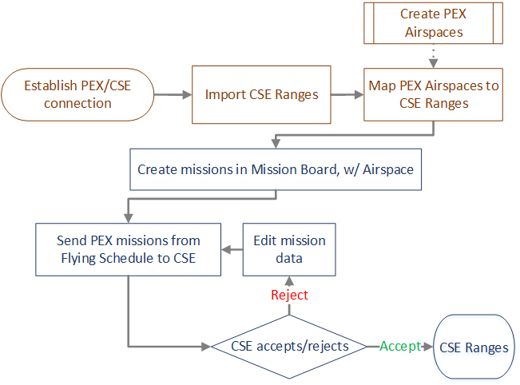
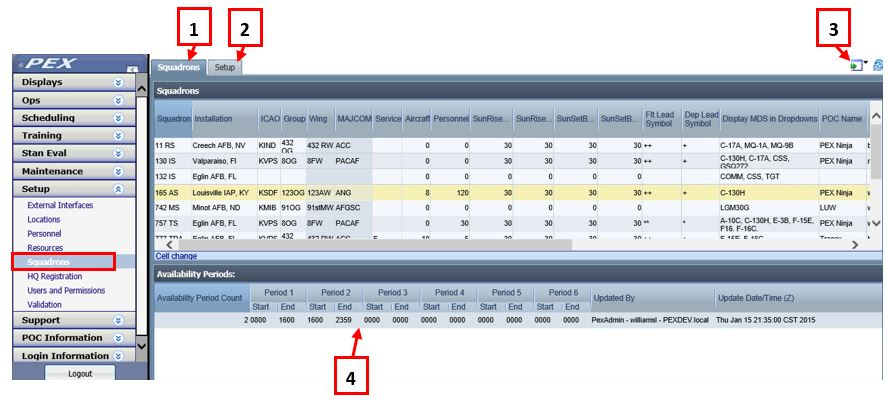
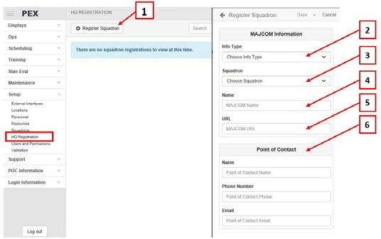
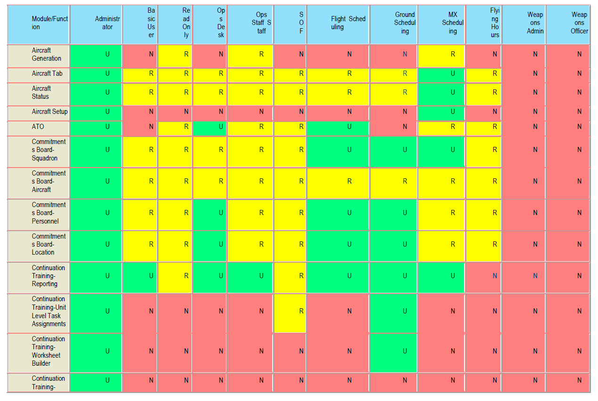
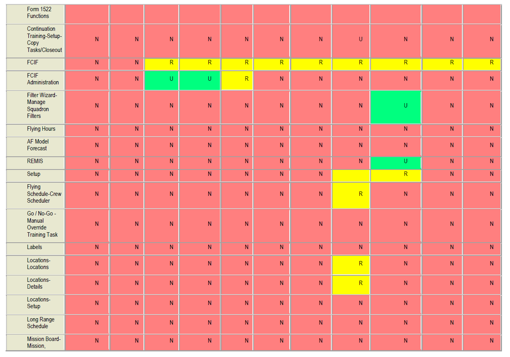
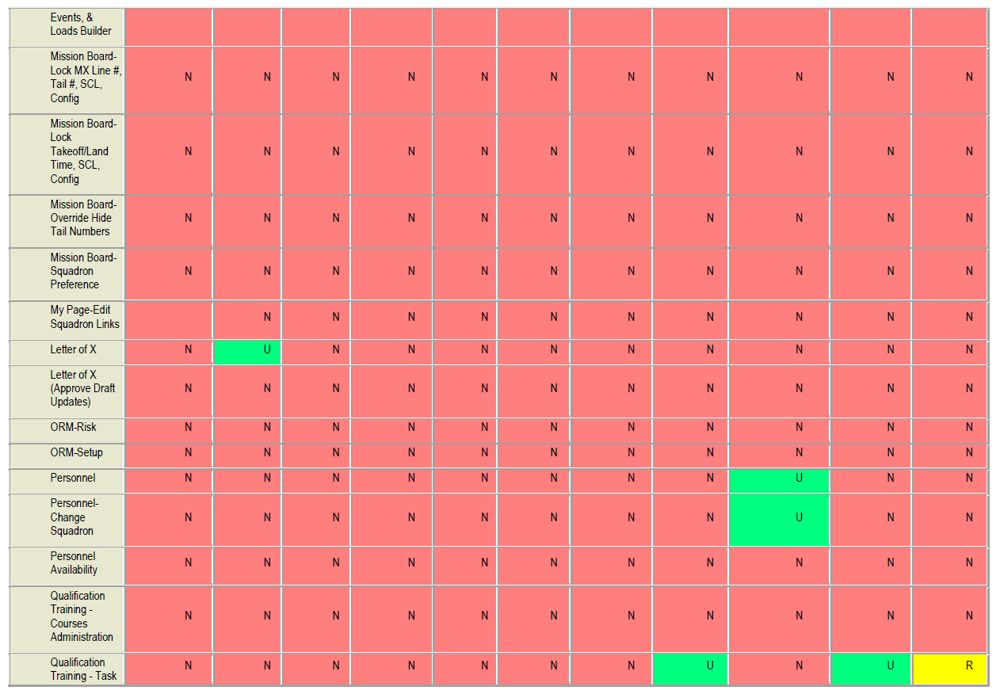
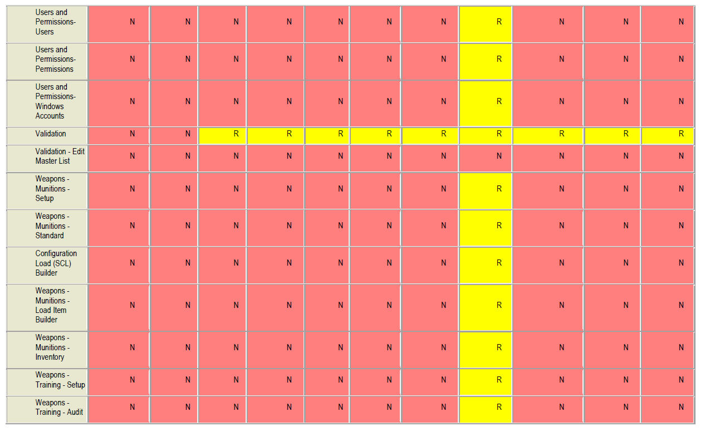
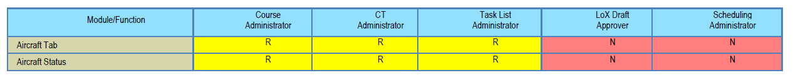
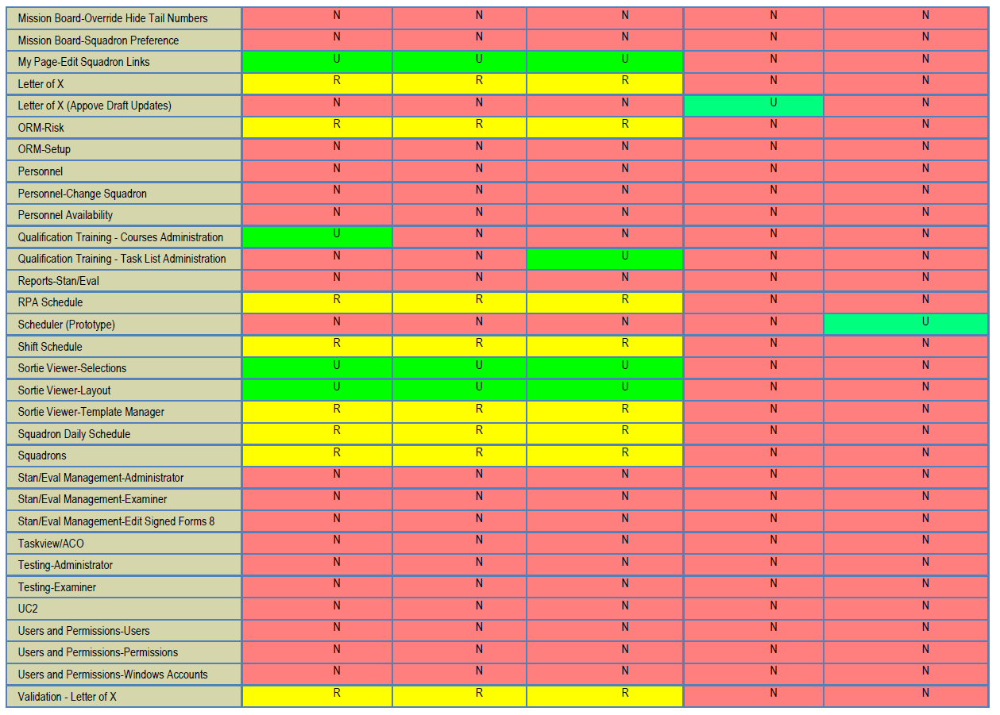

# Setup

## External Interfaces

Scheduling Interface Introduction

Overview

The Setup > External Interfaces module serves as a consolidated location to establish, manage and monitor data-exchange connections between PEX and other scheduling applications, including:
{: style="height:100%;width:100%"}

1. Unit Command and Control \(UC2\)
2. Enhanced Maintenance Operations Center \(EMOC\)
3. Theater Battle Management Core Systems-Force Level \(TBMCS-FL\)
4. Graduate Training Integration Management System \(GTIMS\)
5. Central Scheduling Enterprise \(CSE\)

UC2, EMOC and TBMCS-Force Level

Some locations conduct squadron operations using PEX while conducting various wing operations using UC2, EMOC, and TBMCS-FL. Data is shared between systems allowing PEX users access to relevant information. If properly configured and operated, the end result is a reduced reporting burden on the squadrons and enhanced communication to higher headquarters. UC2/EMOC maintains aircraft and aircraft status data. Updated data are exchanged between PEX and UC2, while EMOC can update both PEX and UC2. PEX does not directly update EMOC, although PEX can update UC2 which then flows EMOC.

NOTES:

* In PEX, connectivity is established between these four systems \(PEX, UC2, EMOC and TBMCS-FL\) in two tabs. Once established however, operations in PEX appear seamless to schedulers.
* Not all data flows to each program.
* Typically, an AOR/AOC will have a single TBMCS-FL database, while an individual location may have one UC2 database and multiple PEX databases.

GTIMS
PEX imports scheduling data from GTIMS and displays the information in the Ops > Waterfall module.

CSE
CSE is a computerized system for the scheduling of all missions requiring the use of specific ranges or support resources.

Scheduling data interfaces outside of the External Interfaces module

Two interfaces are not active connections but simple file imports. Users normally download these files from a hosting website. Although the interfaces are not part of this module, the imported data is used throughout PEX scheduling functions.

* Air Tasking Order \(ATO\) files \(\*.ato\) are imported into PEX in the Scheduling > ATO module, creating mission shells. These shells can then be edited with local data in the various PEX
scheduling modules \(Mission Board, Flying Schedule, etc.\)
* Airspace Control Order \(ACO\) files \(\*.aco\) are imported into PEX in the Setup > TaskView
module, creating and/or updating location data in the Setup > Locations module.
{: style="height:100%;width:100%"}

Status

Overview

The Status tab shows connection status for all External Interface functions, after they have been configured in their respective tabs.

Verify and monitor connections
{: style="height:100%;width:100%"}

Workflow

1. Navigate to Setup > External Interfaces > Status tab.
2. Click Verify Connection to update connectivity status.
3. The grid displays whether the service is connected \(green\) or not connected \(red\), the Service Name, Status details, service URI, Last Successful Connection and Last Attempted Date and Time.
4. Delete, export \(as a \*.txt file\), and refresh log files.
5. Select a log file by date and time, and view its contents.

UC2/EMOC

Establish and Verify UC2 and EMOC Connection
{: style="height:100%;width:100%"}

!!! note
    PEX and EMOC MDSs and Tail Numbers must first be mapped in the Maintenance module > Aircraft tab.

1. Navigate to Setup > External Interfaces > UC2/EMOC tab.
2. Enter the UC2 URL, address of the UC2 service, obtained from UC2 administrator.
Regardless of the location, the URL ends: ". .acftsvc/AircraftService."
3. Enter the UC2 UserName, obtained from UC2 administrator.
4. Enter the UC2 Password, obtained from UC2 administrator.
5. Click Save Setting\(s\), to save data entered in 2, 3 and 4.
6. Click Verify Connection to verify the data entered in 2, 3 and 4.
7. Click Sync Aircraft to UC2 to synchronize PEX MDS and Tail Numbers to UC2 MDS and Tail Numbers.
8. Click Save EMOC Configuration to retain the UC2 URL, UC2 UserName, and UC2 Password.
9. Click Clear UC2 Configuration to clear the UC2 URL, UC2 UserName, and UC2 Password.
10. Once the connection is established, go to the Status tab and verify the connection data.

Workflow

UC2 acquires MDS and tail number information from PEX. If the EMOC connection is maintained and routine operations are performed in EMOC, then PEX tail number information wil be updated in all three systems. All of this data exchange presumes the MDS and the particular tail number have been mapped in PEX. The PEX Maintenance > Aircraft Status display board sends updated information to UC2, ensuring UC2 stays current.

* New Tail Numbers!
* Updated Tail Number
* Last Flown Date
* Hours Since Manufacture
* Ful Stop Landing Quantity
* Total Landing Quantity
* Aircraft Status

    * Status and Status Date/Time
    * Parking Location
    * Fuel
    * Actual SCL \(Standard Configuration Load\)
    * Priority
    * Remarks

Force Level

Establish and Verify TBMCS-FL Connection
{: style="height:100%;width:100%"}

1. Navigate to Setup > External Interfaces > Force Level tab.
2. Enter the Force Level URL, obtained from the TBMCS-Force Level administrator.
3. Enter the Force Level Cert Thumbprint, obtained from the TBMCS-Force Level administrator.
4. Enter the Force Level UserName, obtained from the TBMCS-Force Level administrator.
5. Enter the Force Level Password, obtained from the TBMCS-Force Level administrator.
6. Click Save Setting\(s\), to save data entered in 2, 3, 4 and 5.
7. Click Verify Connection to verify the data entered in 2, 3, 4 and 5.
8. Click Clear TBMCS-FL Configuration to clear all Force Level fields.
9. Once the connection is established, go to the Status tab and verify the connection data.

Workflow

Once connected:

1. Import the ATO
2. If the unit can accomplish the mission, commit the mission. PEX will notify TBMCS-FL the mission is scheduled. If the unit cannot accomplish the mission, in the Mission Status grid on the mission line select “Unable to Accomplish” and PEX will notify TBMCS-FL the unit is unable to accomplish the mission
3. Once the mission has an actual takeoff time entered for any sortie of the mission, PEX will notify TBMCS-FL the mission is airborne
4. Once the last sortie of a mission has an actual land time entered, PEX will notify TBMCS-FL
the mission has landed
5. After de-briefing the mission, a Mission Status needs to be entered in the Mission Status column on the mission line. Either Successful or Unsuccessful can be selected. PEX will notify TBMCS-FL of either status or if it is changed.

PEX data passed to TBMCS-FL

|TBMCS Field|PEX Field|
|-|-|
|Mission Status|TSK - Initial, SCH - Committed, CHG - Change ATO, TO - One Mission Sortie has Actual Takeoff Time, LDG - All Mission Sorties have Actual Land Times\), CNX - Msn CNX|
|Mission Result Code|I - Initial, A – Airborne \(One Mission Sortie has Actual Takeoff Time\), P – Landed \(All Mission Sorties have Actual Land Times\)|
|Mission Start|Mission Start Date/Time \(Z\)|
|Mission Stop|Mission End Date/Time \(Z\)|
|Mission Start Actual|Mission - Sortie Earliest Actual Takeoff Date/Time \(Z\)|
|Mission Stop Actual|Mission - Sortie Latest Actual Land Date/Time \(Z\)|
|Scheduled Mission Start|Mission Start Date/Time \(Z\)|
|Scheduled Mission Stop|Mission End Date/Time \(Z\)|
|Takeoff Start|Mission - Earliest Sortie Takeoff Date/Time \(Z\)|
|Takeoff Stop|Mission - Latest Sortie Takeoff Date/Time \(Z\)|
|Takeoff Start Actual|Mission - Sortie Earliest Actual Takeoff Date/Time \(Z\)|
|Takeoff Stop Actual|Mission - Sortie Latest Actual Takeoff Date/Time \(Z\)|
|Scheduled Takeoff Start|Mission - Earliest Sortie Takeoff Date/Time \(Z\)|
|Scheduled Takeoff Stop|Mission - Latest Sortie Takeoff Date/Time \(Z\)|
|Landing Start|Mission - Earliest Sortie Land Date/Time \(Z\)|
|Landing Stop|Mission - Latest Sortie Land Date/Time \(Z\)|
|Landing Start Actual|Mission - Sortie Earliest Actual Land Date/Time \(Z\)|
|Landing Stop Actual|Mission - Sortie Latest Actual Land Date/Time \(Z\)|
|Scheduled Landing Start|Mission - Earliest Sortie Land Date/Time \(Z\)|
|Scheduled Landing Stop|Mission - Latest Sortie Land Date/Time \(Z\)|

Graduate Training Integration Management System \(GTIMS\)

Permissions

* PEX Admin: establish connection and update \(URL and Cert Thumbprint\).
* Squadron access: Administrator, Ops Staff and Flight Scheduling-read only. Establish and Verify GTIMS Connection

{: style="height:100%;width:100%"}

1. Navigate to Setup > External Interfaces > GTIMS tab.
2. Enter the GTIMS URL.
3. Enter the GTIMS Cert Thumbprint.
4. Select Save Settings.
5. Get Organizations retrieves a list of organizations the GTIMS report can generate data for.
6. GTIMS Organizations: With a connection made, the organization list populates.
7. Click Verify Connection to ensure connection is established. Select OK on the pop-up when successful.
8. Click Clear GTIMS Configuration to clear all GTIMS fields.
9. Once the connection is established, go to the Status tab and verify the connection data.

Central Scheduling Enterprise \(CSE\)

Overview

Central Scheduling Enterprise \(CSE\) is a computerized system for the scheduling of all missions requiring the use of specific ranges or support resources. PEX Airspaces equate to CSE Ranges. Airspace locations are manually created in PEX > Locations. Range locations are imported from CSE. These two are then mapped together in Setup > Resources. PEX schedulers create missions in the PEX Mission Board, including airspace, and send a request for that airspace to CSE, via an automated interface.

NOTES:

* Once a mission is sent to CSE and accepted, it cannot be re-sent.
* PEX 5.15 interfaces only with CSE-Nellis.
* Imported range locations are Read Only.
* A mission must have a valid Range Project Number to be accepted by CSE.

Permissions

Squadron Administrator or PEXAdmin.

Establish and Verify CSE Connection
{: style="height:100%;width:100%"}

1. Navigate to Setup > External Interfaces > CSE tab.
2. Verify Mission Connection verifies PEX can send missions to CSE.
3. Verify Ranges Connection verifies PEX can import ranges from CSE.
4. Import Ranges to PEX Imports ranges, which appear in Setup > Resources.
5. Connection Status.
6. The Service Name,  Service Description,  and URI are scripted into PEX.

    1. Service Name > CSE Nellis Mission Export
    2. Service Name > CSE Nellis Range Import
    {: style="height:100%;width:100%"}

7. CSE added to existing Status tab.
8. The Service Name, Description, and URI are scripted into PEX.
9. Log Files.

Setup

Establish and verify connection\(s\)

1. Go to Setup > External Interfaces > CSE tab.
2. Confirm both Mission Export and Range Import Service entries are present. If not contact your administrator or PEX Help as Service Name, Description, and URI must be scripted into PEX. Prior to establishing the connections, the Connection Status field is red, and the Status reflects "...not activated..."
3. Click Verify Mission Connection.

    1. The Connection Status field should turn green, and the Status should reflect "Connection successfully verified."

4. Click Verify Ranges Connection.

    1. The Connection Status field should turn green, and the Status should reflect
    "Connection successfully verified."
    2. Consult the CSE Test Logging log files as required.

5. Click Import Ranges To PEX.

    1. A pop up informs you CSE Range Import Successful.
    2. Consult the CSE Range Import log file as required. The file reflects ranges successfully imported. If this range import is an update, as opposed to the initial import, it may also reflect ranges removed from the PEX database.

Map PEX Airspace Locations to CSE Ranges

Corresponding airspaces must be added in Setup >  Locations before PEX and CSE locations can be mapped.

1. Go to Setup > Resources > Types > Airspace List and view the list of Airspace locations from Setup > Locations.
2. Select an Airspace, and the Airspace Details flyout on the right displays those CSE ranges, if any, currently mapped to the airspace. Each range is considered by PEX to be a "group" and will appear as such under the Airspace Details List.
3. In the Airspace Details, click on the pencil icon to edit the ranges mapped to the airspace. This will open the Edit Airspace flyout.

    1. To map ranges to the airspace:

        1. In the Resource Groups section, select Add to add ranges to the airspace.
        2. In the Add Resource Groups flyout, the ranges not yet mapped to the airspace wil be listed.
        3. Select the checkboxes for those ranges to be mapped to the airspace.
        4. Select Done when all ranges have been selected. This wil return you to the Edit Airspace flyout.
        5. Select Save.

        !!! note
            Use the type ahead Search box at the top of the Add Resource Groups fly out to filter the list of ranges.

    2. To unmap ranges from the airspace:

        1. In the Resource Groups section, click on the red box with an X for the airspace to be unmapped.
        2. In the Confirmation dialog, select Yes or No as appropriate.
        3. Continue clicking on the red boxes until all airspaces to be unmapped have been removed.
        4. In the Edit Airspace flyout, select Save.

4. To view all of the ranges mapped to each airspace at one time, in upper right corner of Resources page, select More Options \(...\). Select Show Groups. To hide the ranges, select More Options \(...\), then Hide Groups.

!!! note
    Range mapping can be edited. The actual imported ranges cannot be edited.

Workflow

1. Schedule missions as normal in the Mission Board. Missions that will be sent to CSE must have at least one Airspace mapped to CSE ranges and a valid Range Project Number \(Range Proj\#\). If these columns are not visible in the Sorties grid, unhide them using the View control.
2. When ready to send range requests to CSE, go to Scheduling > Flying Schedule > Sorties tab.
3. Click the CSE Export button, and the CSE Mission Export page is opened, with the Mission Filter flyout also open.
4. Set filter by Squadron\(s\), Zulu/Local, Start Date/Time and End Date/Time.
5. You can filter further by MDS and Airspace.
6. Click Load.
7. The CSE Mission Export page opens with all missions meeting your filter criteria.
8. Two slider control options allow you to:

    * Show Sent Missions.
        !!! note
            Once a mission is sent to, and accepted by CSE, it cannot be re-sent.
    * Include Sortie Remarks.
        * Sortie remarks \(manually entered in the Mission Board > Sortie grid\) are sent if this option is selected.
        NOTES:
        * Mission remarks \(manually entered in the Mission Board > Mission grid\) are always sent.
        * Range Report information is always sent, if those columns are checked in Mission Board. Available columns are GCI, GUN, JTIDS, LASER, LIVE, NACTS, RFMDS, THREATS and TOSS.
        * Other exported data includes Squadron, Msn \#, Cal Sign\(s\), IFF\(s\), Airspace and Entry/Exit \(L\) Times.

9. Check all missions to be sent to CSE.
10. When satisfied, click the Export to. . button, and Yes or No to the confirmation dialog.
11. An Export Result Log dialog opens listing each exported mission. For each, a REJECTED or ACCEPTED BY CSE status is displayed. If rejected, a CSE error code and reason describe the error. Rejected and accepted totals are displayed at bottom. If you need to refer to this log file in the future, go to Setup > External Interfaces > Status tab, and call applicable the log file.
12. In addition to Airspace and Range Project Number, PEX validated in CSE include: Squadron, MDS, Weapon Load Items and Codes, and Complete Round Codes \(CRC\).
13. For any rejected missions, edit the data as required in the Mission Board or Flying Schedule and re-send.
{: style="height:100%;width:100%"}

Scheduling Operations

Local procedures and command guidance determine when to pass ATO mission scheduling information from PEX to UC2. Communications traffic between the two systems will be minimized the more complete the schedule is before the subscription occurs.

!!! note
    Operational reporting requirements may dictate UC2 subscribing to an ATO before the schedule has been firmed. This is especially likely during periods of around the clock operations.

Missions in PEX which are not associated with an ATO are called “Local Missions” and those missions are passed to UC2 immediately upon creation, if a known MDS has been assigned.
The following data enables certain actions:

* Assigning a mapped MDS to a sortie allows the mission to flow from PEX to UC2.
* Assigning a Tail number to a PEX sortie allows UC2 RMA to display the ATO SCL. The PEX load sets, SCLs, and Auto generated SCLs are of no interest to UC2 and are not shared.
* The Mission Number in UC2 allows for only 8 characters; if it is longer than 8 UC2 will not display the mission.
* The mission type assigned in PEX must be less than seven characters long or UC2 cannot display the type in RMA.
* When a mission is “Committed” in PEX, UC2 will interpret that status as “Scheduled”. Prior to that action, the UC2 status is “Tasked”
* When the first sortie of a mission has an Actual Time of Departure entered in PEX, UC2 will interpret the mission status as “Take Off”; the earliest ATD will be forwarded to TBMCS-FL asb “Mission Actual Start Time”
* When the last sortie of a mission has an Actual Time of Arrival entered in PEX, UC2 will interpret the mission status as “Landed” and the data will be forwarded to TBMCS-FL as
“Mission End Time”
* Maintenance Line numbers are used by EMOC to identify sorties in both UC2 and PEX, and these line numbers must be unique to an ATO period, which usual y does not correlate to a calendar day \(Local or Zulu\). ATO days can be from, for example, 06:00Z to 05:59Z.

!!! note
    PEX has an “Auto Line Number” function which may result in violating this condition, dependent on the missions displayed, the ATO cycle and unit numbering conventions.

Operations and Maintenance personnel must coordinate this process.

The following information is displayed in UC2 RMA based on PEX scheduling information:

* Line number
* Mission Type \(if less than 7 characters\)
* Mission CNX \(Cancelled\)
* Assigned Squadron
* Call sign
* Flying period \(only numeric, not alpha\)
* MDS/Tail Number
* ATO SCL
* ATO Secondary SCL
* The first two crew members \(if known to UC2, else UNKNOWN\)
* Sortie Brief time
* Sortie scheduled and actual takeoff* Sortie takeoff and land location
* Sortie scheduled and actual landing
* Sortie CNX
* Sortie Remarks

TTPs

* PEX permits operations which may or may not be in accordance with AOR operational procedures. For example, cancelling a local \(non-ATO\) mission through the use of the Mission Board “CNX mission” function would probably be an accepted practice, while performing the same action on an ATO mission would be outside the authority of unit schedulers. ATO
missions are typically cancelled through an ATO change. Use of PEX and UC2 does not guarantee all operational directives will be complied with.
* PEX and UC2 displays wil not necessarily display the same missions, even though both systems contain the same missions. This is because of the use of Zulu versus Local times and various PEX filtering abilities such as “Show Sorties by TO Date”, “Filter By Sortie Type”, and “Filter by MDS”.
* EMOC can accept only unique line number/ATO date combinations. For example, two line numbers “300” during one ATO cycle wil be a problem even if they are on two different calendar dates. Use of PEX “Auto Line Number” function may result in duplicates which must be resolved manually. EMOC operators can perform a tail number swap between lines and they can enter/modify actual take off and land times on a sortie. If EMOC adds a tail number to a mapped unit and MDS, then UC2 will create the tail number and In PEX you will need to add the new tail number in the Aircraft Module. Then in the UC2 module you wil need to map it to the UC2 tail number. EMOC operators can modify aircraft status and that information will flow through UC2 to PEX. EMOC operators can perform a tail number swap between lines and they can enter/modify actual take off and land times on a sortie. If EMOC adds a tail number to a mapped unit and MDS, then UC2 wil create the tail number. In PEX you wil need to add the new tail number in the Aircraft Module and then in the U2 module you wil need to map it to the UC2 tail number. EMOC operators can modify aircraft status and that information will flow through UL to PEX.
* ATO mission information will be imported into PEX from a 2000/2004 or NATO ATO file. PEX then creates missions and sorties which appear on PEX mission/sortie displays. After scheduling manipulation in PEX, the UC2 operator will poll PEX for available ATOs and select the ATO of interest. They import the ATO and then the systems subscribe to changes. Al missions and sorties associated with the ATO of interest will flow to UC2, but only a subset of the data associated with those missions and sorties is exchanged. After that, any “Change ATO” or manual change to an ATO mission/sortie will automatically flow to UC2. At a certain point, UC2 passes ATO mission data to TBMCS-FL. There is no indication in PEX as to whether UC2 has subscribed to any particular ATO. See the ATO help topic for how to import an ATO.

## Labels

Many of the tab names and column headers in PEX can be re-named. This re-labeling is useful for re-purposing otherwise unused columns, for example. Re-labeling is accomplished differently depending on whether you are working on an older PEX module or a newer one. The newer ones have a Page Settings button near the top-right of the screen.

Re-label in newer modules. Click the Page Settings button and select Edit Labels.

Re-label in older modules. Go to Setup > Labels \(WinPEX only\). The Labels tab lists the older screens within PEX that contain modifiable labels. Selecting a PEX screen will display the labels within that screen.

The displayed Default Label Text can be changed to user-defined labels by entering Override Label Text. Once the override text is entered it wil replace the default text in the applicable screen. Changes made here are applied throughout the database by squadron. If the affected module is open, the change will not take effect until it is re-opened.

## Locations

Concept

The Locations module allows you to enter locations for scheduling purposes and provides a quick reference for location information. Locations can be entered from any of four sources: manually-input PEX locations \(the most common\), PFPS, ATO, and ACO locations. PFPS, ATO, and ACO locations are added automatically during interfaces with those respective programs.

Existing Locations

The Locations tab lists all the locations contained in your database. The locations grid allows filtering, adding, deleting, and editing of each location. Using the Selection Criteria area, you can filter locations by Source, Type, Location name, or Description. Enter your selections and click Display Data. The Locations tab shows you all the locations in a spreadsheet view. If you pick a location and go to the Details tab, you’ll see all the particulars about that location in a form view \(easier for editing\). before I use the module Go to the Setup tab to manage the lists of Countries, Country Codes, and Location Types used throughout the Locations module. \(Radio Frequency Types and Theaters are not used anywhere in PEX.\) Right-click and Add to add an entry. To delete an entry, right-click and Delete. To edit an entry, click on the field and enter the data. Click off the row to save.

Add a location

First, ensure that the location does not already exist in the database. Sometimes, a location is mistakenly entered twice, with a slight variation in the name or description, which causes problems when using two PEX locations that are essential y the same place. Place the cursor in the Locations grid, right-click and select Add. Enter the supporting data and save the location. Latitude and Longitude are not required fields; however, they are necessary if you plan to use the Distance-Time-Fuel feature of the Mission Board. Most entries are self-explanatory. Not self-explanatory are: Latitude and Longitude Longitude allows N or S, with any format with at least XX degrees. You can enter any degree, minute, or second combination out to the 6th decimal place. For example, you can enter:

XX.XXXXXX degreesXX degrees, and XX.XXXXXX minutes

XX degrees, XX minutes, and XX.XXXXXX seconds

XX degrees, XX minutes, and XX seconds

Latitude allows E or W, with any format with at least XXX degrees in the same formats as listed for longitudes.

Set Zulu Offset

In the Zulu Offset drop-down, select how many hours the location is normally offset from Greenwich Mean Time \(GMT\). Then, select a Daylight Saving Time \(DST\) rule from the DST Rule Dropdown.

Show in Dropdowns

Check this box to display the location throughout the rest of PEX. When the location is no longer used, un-check the box.

Frequencies

This is not used for anything in PEX. We recommend not entering data here. It allows you to enter several radio frequencies associated with the location. To add a new frequency, place the cursor in the Frequency grid, right-click and select Add. A new frequency line will be generated. Enter the control ing agency and the frequency. To delete a frequency, highlight it, right-click and select Delete. A warning will appear, click Yes, and the frequency wil be deleted. Frequencies entered here do not show up anywhere else in PEX.
Delete a location Many times, you cannot. Once a location has been used \(scheduled\), it cannot be deleted. To delete an unused location, highlight the location, right-click and select Delete. A warning appears. Click the Yes button and the location is deleted.

## Personnel

Personnel Basics

Introduction

The Personnel module is where you enter and manage the personnel data of individuals in the PEX
database. Personnel must be entered here before they can be used in the Scheduling, Training, or Stan/Eval modules. People, and their data, may be added manually, via an ARMS import, or by importing their personnel file from another PEX database. Existing data may be updated manually or via the ARMS import.

Permissions

* PEXAdmin user has full permission to all squadrons in a database.
* Users with Administrator or Training Auditor/ARMS permission can Add, Edit or Delete items in this module.
* A Basic User can view their personal information without having access to others' information. They can add, edit and delete their contact information.

Rules

Personnel are identified by their ID\#, normally the social security number. The ID\# is unique to the database, meaning two personnel records cannot have the same ID\#.

!!! Caution
    Each person should have a single personnel record in the database. If a person has duties in multiple squadrons, they can be assigned permissions in those squadrons. If a person does have two personnel records, one record would require a "dummy" ID\#. These records cannot be merged. An exception to this might be a person having two jobs in the same unit. For example, a person may be a contractor, while also holding a traditional ANG position.

Module Notes

Information contained in the Personnel module is referred to as a *personnel record*. A *user account* establishes a person's PEX login and permission roles. Most people have both a personnel record and a user account. Some people only have a personnel record, allowing them to be tracked and scheduled for events, e.g., guest help. Others only have a user account, allowing them to log in and view information, e.g., base operations. For more on user accounts see Setup > Users & Permissions.

The dropdown menus in Personnel are editable in the Personnel > Setup tab. Navigate to the Setup tab and look for the desired field, or, in the dropdown, simply click on Edit Values. For more see - Configure Personnel for your unit.

Controls

Access these procedures by navigating to Setup > Personnel.

Workspace
{: style="height:100%;width:100%"}

1. Personnel tab. Contains information on all people in the selected Fly Squadron. This information is broken down in specialized tabs 2 through 6. information in blue-shaded fields cannot be edited ion this tab.
2. Details tab. Contains general information on a selected individual person, including Special Experience Identifier \(SEI\) and Supervisor information.
3. Duties tab. Contains information on a selected individual's primary and additional duties, including DNIF status.
4. Contact tab. Contains information on a selected individual's street addresses, phone numbers and email address.
5. Quals tab. Contains information on a selected individual's primary and additional MDS/Crew Position qualifications.
6. Status tab. Contains information on a selected individual's status, such as DNIF, Title 10 or Title 32 status.
7. Supervision tab. Designates those people supervised by the selected individual.
8. Roster tab. Design and create a customized unit personnel roster.
9. Setup tab. Select and customize which information populate dropdowns for your unit.
10. Page Settings. Contains Label Manager and Legend. The former allows overwriting existing column header \(label\) names.
11. Filter wizard. Opens the standard PEX filter wizard.
12. Page refresh.

Personnel Details by tab

This topic describes in detail functionality in individual Personnel module tabs. If a specific function is "greyed-out" or un-editable on a particular page, go to the source page to make edits.

Personnel

This tab consolidates all personnel data for all persons in the database. In the Fly Sq dropdown, you can access any single squadron, or all squadrons, to which you have permission. Most columns are self-explanatory, some warrant further explanation. The process for importing, exporting and manually creating personnel records is described in Add, Move, Import and Export Personnel.

* The Φ symbol indicates fields that are overwritten with each ARMS import. Meaning, if you change the data in a field, importing an ARMS csv will set that field to whatever is in ARMS. This feature can be overridden in Continuation Training.
* ID\# is normal y a person's social security number but can be any nine-digit number. Each person's ID\# is unique to the database, meaning no two personnel records can have the same ID\#.
* Fly Sq is the squadron to which the person is assigned. If in ARMS, a person's Fly Sq should match that in ARMS. These squadrons come from the Setup > Squadrons module.
* Non-Fly Sq is for squadrons to which a person is attached for other duties. This dropdown list is populated from the Personnel > Setup page.
* Eval Form Org overwrites signature blocks on evaluation forms. See Stan Eval for more.
* DNIF sets a person as DNIF on the Go/NoGo board. Changing DNIF status here functions the same as that in Go/NoGo.
* Service Status sets a person to follow rules for people who are A-Active Duty, R-Air Force Reserve, or G-Air National Guard.
* Call Sign is a free text entry to associate a call sign to an individual. It cannot be assigned to a sortie.
* UD 1, 2, 3, 4, 5, 6, 7, 8 and 9 are User Defined. These columns can be used for any data with no existing field. UD 1, 2, 6 and 7 are dropdowns, configurable in the Setup tab. UD 3, 4, and 6 are free-text.
* Pri Exp Risk feeds the ORM module.
* Avail Enabled enables/disables availability for a specific person, for units with both active duty and reserve personnel.
* Teams enable individuals to be assigned to unit-defined teams. Unlike squadron, flight or office symbol, an individual an be assigned to multiple teams.
* Export AFTO 781 Data. Checking No blocks the export of 781 data for guest flyers, or people who fly with your unit but are not assigned to your unit.
* Exporting personnel data to the Defense Readiness Reporting System \(DRRS\) is accomplished by right-clicking on a row, selecting Export to DRRS, and saving the file to your local computer.

Details

This tab incorporates some of the functionality described in the Personnel module, plus is the primary tab for adding SEI and supervisor data.

* To add SEI identifiers, right-click in the SEI grid and select the appropriate identifier from the dropdown list.
* To select supervisors, right-click in the Supervisor grid, select the Fly Sq and Supervisor. This can also be accomplished in the Supervision tab.

Duties

This tab incorporates some of the functionality described in the Personnel module, plus adds Additional Duties. Right-click in the Additional Duties grid and select the desired duty.

Contact

This tab allows you to add multiple street addresses, phone numbers and email addresses. For each, right-click in the Addresses, Phone Numbers or Email Addresses grid. First select a Type, then fill in the appropriate information.

!!! note
    Within each grid, each entry must have a unique type, such as Home or Work. I.e., a person cannot have more than one "Home" phone number. You can however, create additional types of, e.g., Home 1, Home 2, etc. in Setup.

Quals

This tab is were you can add and delete MDS/Crew Positions and related data. To be able to effective utilize personnel data in the various PEX modules, it is essential for all personnel records to have at least one MDS and Crew Position selected. One MDS/CP must be selected as Primary. Others can be added as required.

* If in ARMS, a person's qualification code and crew position is included in the ARMS import.
MDS must be selected manually.
* If not in ARMS, or if the person holds multiple MDSs or crew positions, add an MDS/CP be selecting right-click, select Add, and fill in the required data.

Status

The Status tab is intended to identify people on Title 10 or Title 32 status, with inclusive dates, but can be used to identify people on any unit-status such as DNIF or Deployed. Right-click and select Add. When the dialog opens select the Status type, Effective Date and Expiration Date, and add any remarks.

Supervision

The Supervision tab allows you to designate supervisors. This is similar to the function in the Details tab. Here however, first select the Supervisor's Short Name in the dropdown. In the filterable Available Personnel grid, check the names of all people the person supervises, then click Assign.
Those names will move to the Assigned Personnel grid. As a supervisor, you can view information on your supervisee's in My Page > Folders > My Supervisee's.
This can also designate in-turn supervision. For example, Capt Martìnez supervises MSgt Smith, who in turn supervises SrA Goldstein. First set Martìnez as Smith's supervisor, then set Smith as Goldstein's supervisor.

Roster

The Roster tab is used to create, print and export-to-Excel rosters.

1. In the columns grid, select the fields desired.
2. Drag-and-drop the selected fields to the order desired.
3. In the Sections grid, select Sections and Types. This can be used to select specific types, e.g., work and cel phone numbers while ignoring home and fax numbers.

Setup

This topic describes functionality in the Personnel > Setup tab. For more on how to setup the overall personnel module see the topic \_\_\_\_\_ .

The Setup tab contains those data which populate the Personnel dropdowns. The Tables list equates to labels, or column headers. Selecting a table name displays the selections available for that label.

NOTE: The selections are stored in the database Master List, so there is a single instance of each.
When adding a selection to your squadron, you wil select it from the Master List. If it does not exist in your database, you will first create it in the Master List, then assign it to your squadron. To add a selection of, for example, 1A150 to DAFSC:

1. Select DAFSC in the Tables grid.
2. In the Listings grid, view a list of DAFSCs already assigned to your squadron.
3. Right-click and select Add.
4. The Master List opens, showing all DAFSCs in the database.
5. If the desired DAFSC appears, check it and click OK \(or Apply\).
6. If the desired DAFSC does not appear,

    1. Right-click in the Master List dialog and select Add.
    2. In the open Duty AF Specialty Code field, type in the required DAFSC, \(in this case 1A150\), check it and click OK.

7. 1A150 appears in the DAFSC Table list, and will now appear in the DAFSC dropdowns.

Setup - Configure Personnel for your unit

Configure the display

In the Personnel tab, right-click anywhere in the display area and select Grid Settings. Set number of people to display on a one-page view in Records per page field \(set 999 to see all\), then select Font size. Check the columns to display, then Save. The columns may be moved by left-mouse click/hold and drag on the column header. When the display is set, right-click and click Save Layout. The other tabs work the same way.

Page Settings

Click the Page Settings icon at upper-right and select Labels. Label Manager allows Grid Column Default Labels to be overridden with a custom label. For example, if there is a column you do not use, you could re-label it and use it to track something else. Close the module to save changes. Click “Legend”; the Φ symbol indicates fields that are overwritten with each ARMS import. This is important to consider for data entry; a manual entry in an ARMS field will be retained until the next ARMS import \(usually daily\) overwrites it.

Manage the Personnel list
Click the funnel icon next to Page Settings to open the filter tool. The list can be narrowed-down by Crew Position, Flight, etc. An applied filter must be de-selected \(click Clear Filter\) to restore the full squadron list.

Customize Dropdown Lists

In the Personnel > Setup tab, select the selections you need in your squadron's dropdown lists. This is described in Personnel > Personnel Details by tab > Setup. If you are setting up more than one squadron, you can create the list in one squadron, then send to others.

1. For each Table, right-click in the Listings grid and select View/Edit Master List. When it opens you can see which entries already exist in your database and which need to be added.
2. Edit lists as desired.
3. For each list, right-click in the Listings grid and select Send To.
4. When the dialog opens, select the squadrons to receive your list.
5. Click Send To.
6. Go to those squadrons and confirm your lists transferred correctly.

Populate with your squadron's personnel

1. See Add, Move, Import and Export Personnel for options.
2. Assign an MDS to each person.

    !!! note
        If this is a new squadron and your are adding an MDS for the first time, when you click off the row to save the first-added MDS, PEX will ask if you to assign that MDS to the remaining people in the squadron. This is the only point at which you have the option to mass-assign the MDS in that squadron.

3. Assign crew position\(s\) as required.

Add, Move, Import and Export Personnel

Transfer Personnel data

* Personnel data can be added to PEX by:
    * \(I\) Adding a person manually.
    * \(II\) Importing people or a person with an ARMS file.
    * \(III\) Importing individual personnel files from another PEX database.
* \(IV\) Exporting personnel information as a personnel file, and the file sent to another unit for import into their PEX database.
* \(V\) Moving personnel information from one squadron to another squadron within the same PEX database.

Personnel information import, export and move general information

The following rules govern personnel exports, imports and moves.

* Personnel data. Most personnel data moves: Names, Date of Birth,Gender, Rank, Civilian Grade, AFSC, Duty AFSC, Passport Number, Separation Date and Special Experience Identifiers.
* MDS/CP Qualifications. All Quals in Personnel are exported. If the gaining squadron has matching MDS and CP, Quals are imported.
* Certifications \(Letter of X.\) All certifications are exported as they are setup in the losing squadron’s LoX. If the gaining squadron has matching Cert Name, MDS, CrewPosition and Status, then the certs import and are applied to the person. Non-matching LoXs are stored in database and are included in any future exports.
* Continuation Training Events. Al Unit Level tasks are exported, but they must be approved and audited \(if auditing required\). If the gaining squadron has matching Training Events \(Task Code, Task Name, Program Codes\) person is assigned the event. Non-matching events are stored in the database and are included in any future exports. These non-matching tasks can be viewed in the CT module. ARMS tasks are not exported as they can be imported into the gaining database through the normal ARMS import process.
* Qualification Training Courses. All data is exported \(Historic Courses and Training Programs, Memos For Record, Person Training Documents, Scanned MFRs\) but Courses must first be marked complete. Courses that are marked complete and their associated MFRs become historic after import.
* Qualification Training Task Lists. Open Task Lists move with all signatures and dates from the previous database. Form 623a Entries, CFETP Task Lists, Historic Training Programs, Memos For Record, Person Training Documents, Scanned MFRs move.
* Stan Eval. All data is exported \(Certification Scans, Qualification Certificate Scans, Qualification Certificate Images, Record of Evaluation Scans, Memo for Record Images, Memo For Record Scans, Certifications, Person Crew Quals, Major Discrepancy Scans, Major Discrepancy Images, Minor Discrepancy Scans, Minor Discrepancies\), but all MFRs and Major Discrepancies must be signed. Export is allowed with an open evaluation but the open evaluation itself is not exported.
* FCIF. Al FCIFs/IRFs are exported, but are subject to “exact match” rules upon import. Type, Number, and Subject must match exactly. Non-matching FCIFs are stored in the database and are included in any future exports.
* SEI. Al SEIs are exported, but are subject to “exact match” rules upon import. Non-matching SEIs are stored in the database and are included in any future exports.
* Exams. Exam data does not move and PEX does not prevent an export if the person has open exams. Completed evaluation requisite exam data moves, as part of the evaluation.
* Permission Roles. Roles do not move.

\(I\) Add a person manually

1. In the Personnel tab:

    1. Right-click in the Personnel tab, select Add, and you are taken to the Details tab.
    2. Click on the Details tab.

2. Ensure you have the person's assigned squadron selected in the Fly Sq dropdown.
3. Required: In the Details grid, enter a Short Name for the person. Typically, this is Firstname.Lastname \(Ellen.Ripley\) or LastnameFirstnameinitial \(RipleyE\). Although not required, this Short Name often matches the person's User Name in Users and Permissions. We recommend using the same naming convention for all personnel.
4. Required: Enter the person's ID \#. Typically, this is the person's social security number but can be any nine-digit number. This number must be unique in the database. If the number is not unique PEX displays an alert informing you of which squadron contains a person with that ID number.
5. Save.

    1. Click Save & New to add another person.
    2. Click Save to save the entered required information and continue adding to the person's information.

6. Not required but: Entering the following information is not required to save the record but is needed to effectively track and manage the person's information in PEX.

    1. Enter the person's First, Middle and Last Names.
    2. Click on the Quals tab and assign an MDS, Qualification Code, and Crew Position.
    3. Click on the Contacts tab and add an email address Other information such as Rank, etc. can be added as required.

7. If the person needs a User Account \(to enable login to PEX\), you can now go to Users and Permissions and create the account.

\(I \) Import people or a person with an ARMS file

This is covered in detail in ARMS- Configure your PEX-ARMS Interface.

1. Configure the ARMS - PEX interface in Continuation Training > ARMS. This involves adding your unit's 17-character unit identifier so PEX can match that identifier to the PEX squadron.
2. Extract your unit's personnel data from ARMS and save as a .csv file. Save the file to an accessible location on your computer or network.
3. Import the file in Continuation Training > ARMS.
4. Check the log file for any errors.
5. Go to Setup > Personnel > Personnel tab and confirm any new people were successful y added.
6. For the newly added personnel, go to Setup > Personnel > Quals tab and assign an MDS.

\(I I\) Import individual personnel files from another PEX database

This assumes you have received the person's data file from the losing unit and saved it to an accessible location on your computer or network. The naming convention is LastnameFirstinitial.pexdata.

1. In the Personnel tab, right-click anywhere in the Personnel grid and select Import/Export > Import Personnel Data.
2. When the Import Personnel Data dialog opens, browse to the .pexdata file.
3. Click Begin Import.

    1. If the personnel record does not already exist, it wil be created.
    2. If the personnel record already exists, you will be given a warning that the all existing data will be overwritten and the opportunity to cancel the operation. The import brings in Unit Tasks, if there are matching Unit Tasks; FCIFs, if there are matching FCIFs; and SEIs, if there are matching SEIs.

4. View the import log file as desired; right-click anywhere in the Personnel grid and select View Logs > View Import Person Logs. Successful imports have a green check, unsuccessful imports have a red exclamation point. Click the person's name to open the actual log file for more information.

\(IV\) Export personnel data as a personnel file

1. In the Personnel tab, right-click on the person and select Import/Export > Export Personnel Data
2. When the Export Personnel Data dialog opens, click Begin Export.
    1. If there are any outstanding issues that need to be resolved, PEX will inform you \(open training, open evaluations, open PEX courses, or unsigned MFRs\).
    2. View the export log file as desired; right-click anywhere in the Personnel grid and select View Logs > View Export Logs Personnel Data. Successful exports have a green check, unsuccessful exports have a red exclamation point. Click the person's name to open the actual log file for more information.

3. Save the resulting file \(LastnameFirstinitial.pexdata\) and send it to the gaining unit.
4. After exporting a person’s data you should move them to your inactive \(PCS\) squadron. See the Change Squadron topic below.

We recommend you add a step in your out-processing checklists to accomplish this export.

\(V\) Move personnel data from one squadron to another squadron \(Change Squadron\)

People may be moved to another squadron in the same PEX database as long as they have no open training tasks \(approve/export them\), no open qualification courses \(close out or un-enroll\) or unsigned MFRs.

1. In the Personnel tab, right-click on the person you want to move and select Change Squadron.
2. In the dialog, note the correct person’s name is selected. You can check/add more people at this point.
3. Select the destination squadron from the list
4. Click Change Squadron for Personnel, and Yes at the confirmation dialog.
5. A progress indicator will launch.
6. View the change log file as desired; right-click anywhere in the Personnel grid and select View Logs > View Change Squadron Logs. Successful moves have a green check, unsuccessful moves have a red exclamation point. Click the person's name to open the actual log file for more information.

Personnel TTPs

MDS and Crew Position

MDSs are setup in the Maintenance > Aircraft module. For your MDS to appear in the Personnel module, it must be identified in Setup > Squadrons > Display MDS in Dropdowns column.

Crew Positions are setup in Setup > Personnel > Setup > Crew Position. The selected squadron’s list displays. Right-click to Add or Delete. Qual Codes are managed the same way through the Aircrew Qualification Code page.

Assign a Crew Position to a person. For ARMS units, this is done through the ARMS import. Qual Codes are assigned the same way. For non-ARMS units, on the Quals tab, select from the dropdown list in Crew Pos and Qual Code fields, click off the line to Save.

Assign an MDS by going to the Quals tab and selecting the person. Click in the MDS field and select the MDS. Click off the line to Save. People may be assigned multiple MDSs but only one can be marked as Primary.

The bare minimum. Assign a single MDS/CP to a person.

1. If the person accomplishes duties in other MDS/CP combinations, those should also be added. For example, the person may be qualified in different CPs in the same MDS. Each of 403
those should get a separate line item. The person may be qualified in the same CP in multiple MDSs. Each of those should get a separate line item.
2. For each MDS/CP line item, identify characteristics such as: Qual Code, Experience, Weather Category, etc. These characteristics go along with the person’s MDS/CP qualification, not just the person.

How users can view and update their own information

Anyone with a user account can view their personnel data and update their contact information. On My Page click the My Personal Data link. Users can view their data in the Details, Duties, Contact, Qual and Status tabs. They can add, edit and delete Addresses, Phone Numbers, and Email Addresses on the Contact tab. We suggest that personnel login to PEX at regular intervals and keep this information updated, especially the home email addresses, as this is where PEX sends notifications of scheduling changes, assigned exams, assigned evaluations, and late requisites.

Remove a person leaving your unit

When moving people to another database \(e.g., PCS\), as opposed to moving people from one squadron to another within the same database \(e.g., PCA\), that person's data file is exported and sent to the gaining unit. We recommend that the losing unit, instead of attempting to delete the person, move them to an inactive squadron in their unit's database. That squadron is created locally and is often called "PCS" or similar. This way their personnel record is still retrievable if necessary.
Simply follow the instructions for Move a person from one squadron to another \(Change Squadron\), selecting the inactive squadron.

Guest Flyers

For “Guest Flyers”, add them as normal, then check the block for Do Not Export 781 Data and enter their home base HARM 781 Flying Orgn. When exporting 781s, their data will not export, even though they are on the 781.

Build Unit Task Codes \(UTC\) in PEX

UTCs may be built in PEX and exported to Excel for further manipulation and data entry.

1. Go to Setup > Personnel > Setup, click Unit Task Code from the list 4. First, configure the grid: right-click, select Grid Settings, de-select all un-needed columns.
Then, left-click, hold/drag columns to desired placement. Right-click, Save Layout.
2. Right-click Add the UTC and ULNs
3. The ULN, if single-digit, must be preceded by “0”
4. Title \(or Role\) is free-text entry
5. Squadron auto-fills with Unassigned
6. Select Rank and PAFSC\(s\)

Create in Excel. Right-click, select Export to Excel. Delete the Unassigned values in the Squadron column. This Excel sheet can now be filled with the names and squadrons of the actual people assigned to the deployment.

More than one UTC. Add them all to PEX. Export the entire list to Excel and delete \(in Excel\) the undesired UTC records.

Handle Inbound Deployed Personnel in your PEX Database

Let’s say you have a PEX database already in use at your base. Now some deployed personnel join your unit temporarily, such as an exercise or to sit alert. You can add them to PEX so that they can be scheduled and tracked for No-Go.

1. Contact the person’s home unit and obtain:

    1. A list of the person’s Letter of X certifications.
    2. An extract, for just that person, of the unit’s Personnel, Training and Personnel Flying Hours .CSV files from the PEX browsers.

2. Append .CSV files. Open the Personnel .CSV extract file for the deployed person. Copy the data line\(s\) from the extract \(not the header line\). Open your unit's Personnel .CSV file and scroll to the bottom of the file. Paste the extract data beneath the last data line of the .CSV file and save. Repeat the steps for both the Training and Personnel Flying Hours .CSV files.
3. Import the .CSV extracts. Go to training > Continuation > ARMS > Settings and ensure your squadron is selected. In the Squadrons & ARMS Unit Identifiers field set, in the “Add ARMS unit to import into selected PEX squadron:” text box, type in the 9-character ARMS unit code from the person’s Personnel Flying Hours .CSV file and click Add. Then type in the 17-character ARMS unit code from the person’s Training.CSV file and click Add. In the .CSV File field set, browse to your unit's appended Personnel, Training and Personnel Flying Hours .CSV files and click Save. Go to the Import view, and import Personnel, Training and Personnel Flying Hours into your squadron.
    !!! Note
        In order to export this person’s AFTO 781 flying hours and training tasks back into ARMS, you wil need permissions to the person’s home station ARMS database. Usually, you will not have these permissions.
4. Add Personnel Details. Go to Setup > Personnel > Details, select the new person, and add the following data: Arrival \(date\) and Departure \(date\). Assign the person a supervisor, if appropriate.
5. Add Quals & Certs. Go to Setup > Personnel > Quals & Certs, and assign the person an MDS/Crew Position/WX Cat/Msn Ready Status \(5.7\+\)/Experience \(5.7\+\). Assign any Letter of X certifications that are applicable to your mission and organization.\(Assigning an MDS/Crew Position will automatically assign this person all the FCIFs for that MDS/Crew Position. It also makes them available for flight scheduling.\)
6. Add Personnel Duties. Go to Setup > Personnel > Duties, and assign Pri Exp Ind \(5.6-\) and Msn Rdy Status \(5.6-\). Check the box “Do Not Export 781 Data”, enter the person’s 781 Flying ORGN \(can be bogus\), and Save.
7. Verify Applicable FCIFs are assigned. Go to Ops > FCIF and filter for that person’s MDS/Crew Position to verify the person shows up in the list and is assigned all the appropriate FCIFs.
8. Assign Required Unit Level Tasks. Go to Training > Continuation > Unit Task Assignment and assign the person any Unit Tasks required by your unit.
9. Verify Personnel Flying Hours Status. Go to Scheduling > Reports > Personnel Flying Hours and run the report to make sure the new person shows up in the list. Note any potential problem with high flying time that might arise and develop a plan to manage it.
10. Verify Training Tasks Status. Go to Training > Continuation > Training Tasks, ensure your squadron is selected, and click the “Clear Filter” button in the top right of the screen if it is in view. Verify the person you just imported is listed. At the top left of the screen, change the date to the person’s scheduled Departure Date from step 3 above. Note all the training events that will go overdue while the person is deployed to your location and develop a plan to keep the person current on the ones that matter to you.

PEX User Login. If you want the person to be able to login to PEX for viewing the schedule, entering and acknowledging commitments, taking exams, etc.:

1. Ensure the person has a Windows account to log on to the computers.
2. Add a PEX User Account. Go to Setup > Users & Permissions > Users and add the person as a PEX User.
3. Associate the PEX Users Account to the Windows Account. Go to Setup > Users & Permissions > Windows Accounts and associate the PEX User you just added to the person’s Windows account. \(Assigning the person a PEX user account wil allow them to sign off PEX
FCIFs.\)
4. Associate Permissions to the PEX User Account. Go to Setup > Users & Permissions > Permissions and make sure the person has the permissions required for duty \(at least Basic User to the squadron\).
5. Assign Exams. Go to Stan Eval > Testing Admin > Exam > Assigned Exams and assign the person all the appropriate tests.

    * This checklist is based on the assumption that no formal upgrades or evaluations are conducted on the inbound deployed person. If that is not the case, the person would need to be assigned to a PEX Qualification Training course and/or assigned a PEX Stan Eval evaluation.
    * Aircraft. If the personnel bring their own airplanes, go to Maintenance > Aircraft > Aircraft and add the MDS, if not already listed. Fill in the ARMS MDS field. Select the squadron the airplane belongs to, add the tail number\(s\) \(fil in the ARMS ID\) and select any squadrons that may share the tail number.
    * Redeployment. When the person leaves, go to Setup > Personnel and change the person’s Fly Sq to the “PCS” squadron or equivalent. If you don’t have a PCS squadron in PEX, go to Setup > Squadrons and add it. When the aircraft leaves, go to Maintenance > Aircraft > Aircraft > Tail Number, uncheck any Shared Squadrons, uncheck the box for “Show in Dropdown” and change the Squadron to PCS.

## Reports

Reports Overview

Introduction

Currently, most functional areas \(Scheduling, Training, etc.\) include a Reports module, containing all forms and reports for that function. Starting in 5.16, these will be progressively replaced by Rapid Reports/Reporting functionality. The legacy Reports modules will remain in place until the transition is complete. Currently, these reports pull data only from legacy modules.

Rapid Reports are official USAF forms, standardized reports, and unit-customized reports. Units can request unit-customized reports from the PEX Program Office. All reports are in Dynamic Link Library \(DLL\) file format and can be downloaded from the PEX website or sent from the PEX help desk. Once imported, USAF forms can be opened in PDF format, while reports can be opened in PDF or Excel formats.

The Setup > Reports module functions as the reports manager. Downloaded reports are imported into PEX through this module. Once imported, reports appear in the appropriate modules. Reports can be deleted when no longer required.

Reports currently in development include:

* AF Form 4327
* AF Form 4327a
* AFTO Form 781
* Bomber Scheduling Report
* Fighter Scheduling Report
* Recon Scheduling Report
* RPA Schedule
* Missile Operations Personnel Schedule
* Missile Operations Location Schedule

Workspace
{: style="height:100%;width:100%"}

1. Add Report\(s\) imports report files.
2. Displays a list of imported files.
3. Refreshes the page.
4. Removes unnecessary files.

Manage and Use Reports

Import a Report

1. Request the desired file from the PEX website or have it sent from the PEX help desk.
2. Save the report file to an accessible location.
3. Go to Setup > Reports.
4. When the MANAGE REPORTS page opens, click Add Report\(s\).
5. When the browser opens, browse to the saved file and click Upload.
6. You should see a \(file name\) uploaded successfully message.
7. Click Cancel or X.
8. The imported file is listed here and will appear in the appropriate functional area Reporting module.

Delete a Report

1. Go to Setup > Reports.
2. When the MANAGE REPORTS page opens, click the More Options \(...\) button.
3. Click Remove.
4. Confirmation: Yes or No.

View Uploaded Forms and Reports

1. Go to the desired functional area Reporting module \(e.g., Scheduling > Reports\).
2. View the list of Installed Reports.
    1. For example, to view an AF4327A, go to Scheduling > Reporting > Installed Scheduler Reports > AF4327A.

Open and Populate Forms and Reports

1. Go to the desired functional area Reporting module.
2. Under Installed Reports, click the desired report.
3. When the report dialog opens, make your data field selections for that form or report.
4. At page bottom select PDF or Excel and click Generate Report.

    !!! note
        AF Forms open only in PDF format. Reports open in both PDF and Excel formats.

## Resources

Resources Basics

Introduction

Configuring the Resources module allows you tailor and streamline your scheduling processes by categorizing and grouping resources.

* Resources are people, places and things that can be scheduled in the Scheduler.
* Resource Types are categories of resources, such as people, airspace and aircraft.
* Resource Groups are collections of resources.

The actual resources are added to PEX in their respective modules; People in Personnel, Airspace in Locations, Aircraft in Maintenance, etc. In the Resources module, you first associate resources to a resource type, then associate resources to one or more groups. For example, you can create a hard crew group with four persons, then schedule them as a group instead of individual y, similar to Crew Sets in legacy scheduling modules.

Controls

Access these procedures by navigating to Setup > Resources.

Module Notes

* A resource group consists of a single type of resource. For example, a Group can contain Persons or Workstations, but not Persons and Workstations.
* Resources are used only in the Scheduler module. They do not apply to legacy scheduling modules.

Workspace
{: style="height:100%;width:100%"}

1. View Resource Types.
2. View Resource Groups.
3. Filter on Resource Types.
4. Create Resource Groups by Type.

Manage Your Resources

Associate Resources to Types

Some Resource Types are delivered with PEX. More Resource Types can be added locally by running a script file on your database server. Contact the PEX Program Office to have the script created.

1. Go to Setup > Resources > Types.
2. Click on the desired Type and view individual resources of that type. The list also displays any groups they are associated with.
3. Use the search field to locate specific resources by name or number.

Add a Group

1. Under the Groups header, click the Add button and the Add Group dialog opens.
2. In the Name field, enter a name for the group.
3. Under Resource Type, click Change and select the type.
4. Under the resource type Name, click the Add button.
5. From the list, select the resources to add to the group.
6. Click Done and the Add dialog closes.
7. Click Save and the Add dialog closes.
8. In Scheduler, the group can now be added to an event, as with an individual resource item.

Add Resources to a Group

1. Go to Setup > Resources > Groups.
2. Click on the desired Group and view individual resources in that group.
3. Use the search field to locate specific groups by name or number.
4. Use the filter \(funnel\) as required.
5. Under Resource Groups, click on the desired group and the edit dialog opens.
6. Click the edit \(pencil\) button and the Edit Group dialog opens.
7. Under the Resource Type heading, select the type of resource to be grouped, e.g., Person and click Add.
8. From the list, check the resources to add to the group.
9. Click Done and the dialog closes.
10. Click Save and return to Groups.

Delete Resources from a Group

1. Go to Setup > Resources > Groups.
2. Click on the desired Group and view individual resources in that group.
3. Use the search field to locate specific groups by name or number.
4. Use the filter \(funnel\) as required.
5. Under Resource Groups, click on the desired group and the edit dialog opens.
6. Click the edit \(pencil\) button and the Edit Group dialog opens.
7. From the list, check the resources to delete from the group.
8. Click Save and return to Groups.

Delete a Group

Quick method

1. Go to Setup > Resources > Groups.
2. To the right of the no longer desired group, click the red X and Yes to the confirmation message.

Recommended method

1. Go to Setup > Resources > Groups.
2. Click on the desired group and the Group Details dialog opens.
3. Verify this is the group you want to delete.
4. Click the delete \(trash can\) button and Yes to the confirmation message.

## Squadrons

Squadrons Basics

Introduction

The Squadrons module identifies units in the PEX database that wil be used throughout PEX, to define Availability Periods for these squadrons, and to register the squadrons with HQ for scheduling and training data rol ups. Access to data throughout PEX is control ed by squadron and user.

Permissions

The PEXAdmin and Administrator permission roles can access Squadrons.

Rules

* While Administrator can add a squadron, only PEXAdmin can delete a squadron.
* A squadron can have only a single set of \(up to\) six Availability Periods active at one time.

Module Notes

* A new squadron wil not display in other PEX modules until you log out and back in.
* When a squadron is added; initially, the only users with permissions to that squadron will be the user that added it and the master user account, PexAdmin.

Workspace
These features are accessed by navigating to Setup > Squadrons.
{: style="height:100%;width:100%"}

1. Squadrons. Work area.
2. Setup. Add lists of organizations.
3. Labels Manager. Overwrite label \(column header\) names.
4. Availability Periods. Define up to six periods for the squadron.

Setup - Associate organizations to your squadron

In Setup, you can add organizations, then link them when you add a squadron.

1. Add a MAJCOM

    1. Under the Tables list, highlight MAJCOM.
    2. In the Listings grid, right click and select ADD.
    3. Enter the MAJCOM and its description.
    4. Click off the row to save.

2. Add a Wing

    1. Under the Tables list, highlight Wing.
    2. In the Listing grid, right click and select ADD
    3. Enter the Wing, Description.
    4. Associate the new Wing to an existing MAJCOM and enter a Location name.
    5. Click off the row to save.

3. Add a Group

    1. Under the Tables list, highlight Group.
    2. In the Listings grid, right click and select ADD.
    3. Enter the Group and its description.
    4. Associate the Group to its Wing.
    5. Click off the row to save.

4. Add a Unit Type

    1. Under the Tables list, highlight Unit Type.
    2. In the Listings grid, right click and select ADD.
    3. Enter the unit type and its description. For example: Fighter, Bomber, MAF, CAF, Intel, etc.
    4. Click off the row to save.

Add a Squadron

A squadron in PEX is the foundational organization to which resources are assigned; people, aircraft, etc. Other functions such as displays and permission roles are also set by squadron. A PEX squadron can be a literal squadron or another organization type, such a group.

1. Right Click in the Squadrons grid and select Add.
2. Enter a unique Squadron name.
3. Enter an Installation name, e.g., “Eglin AFB, FL”. \(Optional but recommended\)
4. Enter the ICAO identifier, e.g., “KVPS”. \(Optional but recommended\)
5. Select a Group name from the drop down. \(Optional but recommended\)
6. Select a Service. \(Optional but recommended\)
7. Enter number of Aircraft the squadron possesses. \(Optional\)
8. Enter number of Personnel for the squadron. \(Optional\)
9. Enter SunRiseBASH and SunSetBASH times. This is the estimated duration in minutes that Bird Air Strike Hazard occurs. This data is calculated and then displayed in the scheduling areas of PEX. \(Optional\)
10. Enter Flt Lead Symbol and Deputy Lead Symbol. This data will display on flight authorization forms. \(Optional\)
11. Select MDSs in Display MDS in Dropdowns. These are the MDSs your squadron wil see throughout PEX.
12. Enter POC Name, POC Email and POC Phone fields. This data is used for the MAJCOM Registration and the POC Information on the PEX Navigation Menu. \(Optional\)
13. Unit type. Select from a list to further define the squadron. \(Optional\)
14. Unit Identification Code \(UIC\). Enter your UIC. \(Optional\)
15. Personnel Accounting Symbol \(PAS\) System. Enter your PAS. \(Optional\)
16. Include Readiness Data in Export. Check this box if you are establishing a NIPR to SIPR connection and wish to export readiness data. Otherwise leave it unchecked.

Squadrons Availability Periods

Availability periods, up to six, are used to describe blocks of time where personnel can identify when they are available to be scheduled. These periods are identified by the schedulers. Then, part-time personnel \(think ANG and AFRC\) can identify when they are available using those periods. The periods can overlap.
Example periods are:

* Period: 00:00 – 23:59
* Periods \(AM, PM, and Night\): 05:00-12:00, 11:00-18:00, 17:00-23:59

Enter your squadron’s Availability Periods

1. Highlight the Squadron in the Squadron’s grid
2. Place the cursor in the Availability Periods grid, right-click and select Add. An Add Availability Period dialog will appear.
3. Set the number of periods and set the start/end time for each period. Periods can \(and usually do\) overlap. For example, if you end one period at 09:00 and start the next at 09:01, it creates a gap of one minute and PEX will think personnel are unavailable for that one minute.
Using this example, you should end the first period at 09:00 and start the second at 09:00.
Periods can run from 00:00 to 23:59 \(they cannot cross midnight\).
4. Click OK when finished. There can be up to six periods identified for a squadron.

    !!! NOTE
        Once saved, the periods cannot be edited. Instead, new Availability Periods set must be created to replace the old. Personnel and schedulers can use only the latest set for data entry. Old sets are displayed for historical purposes.

## Squadrons – HQ Registration

Use HQ Registration to send your Scheduling and Training data to your MAJCOM. Your MAJCOM wil advise when to use this and supply the data required.
{: style="height:100%;width:100%"}

1. Select Register Squadron to open the dialog. All field entries in this dialog are required.
2. In the Info Type dropdown, select the data to register: Scheduling or Training.
    !!! note
        If you want to do both, two registrations must be added.
3. In the Squadron drop down, select the squadron to register.
4. Enter the MAJCOM.
5. Enter the MAJCOM URL \(provided by MAJCOM\).
6. Point of Contact. Enter the MAJCOM POC's Name, Phone Number, and Email. You can overwrite the default POC if you chose to.
7. With all fields complete, select Save. Once saved, a new row entry appears indicating Squadron selected, MAJCOM Approval Status - "Waiting".
8. Once saved, the MAJCOM must approve the registration. When the Registration is approved, MAJCOM Approval Status changes to - "Approved". Your squadron is now successfully registered and ready to start sending CT and/or Scheduling data.
9. Upon initial Approval, the "Last Sync Date" column will be blank until scheduled or manual Sync's are accomplished.

## TaskView - Import an Airspace Control Order \(ACO\)

Introduction

The TaskView Interface reads an Airspace Control Order \(\*.aco\) file and imports ACO locations into the PEX database. The ACO data retrieved includes the airspace type, name, latitude/longitude, and valid times. Once imported, the data retrieved from the ACO creates a new location in the Locations module.

Import an ACO

The following steps assume the ACO file has been downloaded and saved to an accessible location on your computer. Typically, the ACO, along with the ATO \(Air Tasking Order\), are downloaded from a website or another application.

Go to Setup > TaskView > TaskView Import tab > Import Section.

In the ACO Input File selection box, browse to the ACO file, and click Display Data. PEX displays the ACO Start Date/Time \(Z\) and End Date/Time \(Z\), and all ACM Types and Locations in the selected file.

Enter the path for where you want the Log File stored.

Select the ACM Types and/or Locations you want to import into PEX and click the Send button. With these ACO locations now in your database, you can use them to build missions and sortie events. Once in the PEX database, ACO locations can be used just like PEX, PFPS, and ATO locations.

Managing Imported Locations

The imported locations can be viewed and, if necessary, edited in the Locations module by selecting Source: ACO, and clicking Display Data.

ACO locations may import without latitude/longitude. If so, manually enter lat/long as required.

Zulu offsets and Daylight Saving Time \(DST\) offsets are not entered for ACO locations. For accurate local times at the ACO locations, manually enter the Zulu and DST offsets. If you are scheduling in Zulu only, there should be no need to enter Zulu and DST offsets for the ACO locations. For more, see Setup > Locations.

## Users and Permissions

Users and Permissions Basics

Introduction

Users and Permissions allows administrators to manage who can log in to PEX \(Users\), what those people can do in PEX \(Permissions\), and how they can log in \(CAC or Windows\). User accounts can one of two types.

1. An individual account, allowing a person log in and view their information in PEX.
2. A joint-use account, which can be used by multiple people. Because multiple people can use it, joint-use accounts cannot be associated to a Personnel record.

Permissions

Users with Administrator permission to any squadron can access this page. However, they can see only those squadrons to which they have permission.

Rules

* Users cannot change their own permissions. That must be done by PEXAdmin.
* Multiple people can be associated to the PEXAdmin user account.
* Users can be assigned the role of Administrator in individual squadrons.
* People assigned the Administrator role should be trained and experienced PEX users.
* Every squadron should have at least two people assigned the Administrator role.

Workspace

1. Users. Add User accounts for people who need to log in to PEX. Associate them to Personnel records so they can see their information.
2. Permissions. Grant users the level of access required to perform their duties in PEX.
3. CAC Accounts. Allow users to log in with a Common Access Card \(CAC\). This is useful when users cannot log in via an AFNet account.
4. Windows Accounts. Al ow users to log in with a Windows domain account. This is the most common method.
5. Joint-use accounts. These are not associated to an individual.
6. Individual accounts. These are associated to individual Personnel records.
    !!! note
        Although not normal y required, users can be associated to both CAC and Windows logins if desired.

Workflow

Manage User Accounts

Create Permission templates

Create Permission templates to apply to new users:

1. Go to Users and Permissions > Permissions tab.
2. Check the Basic User role for your squadron.
3. Click Save as New Template and call it “Basic User \(squadron name\)”.4. Repeat as required for various combinations of roles and squadrons.

Add a User account

1. Go to Users and Permissions > Users tab.
2. Right-click and select Add User.
3. In the Add User dialog, select the desired Default Template.
4. Enter your email extension, e.g., @us.af.mil.
5. Select your email convention, e.g., First.Last
6. Person Associated.

    1. For individual person accounts, associate the user account to a Personnel record. If the person will accomplish activities in PEX \(scheduled for commitments, training folder, Stan Eval folder, etc.\), ensure they have a Personnel record in the Personnel module. Skip this step if the person will not accomplish activities in PEX but only login to PEX to see information \(Air Traffic Control, Base Operations, Inflight Kitchen, etc.\) For Joint Use Accounts, skip to User Details.
    2. Select the squadron to which the person is assigned.
    3. Select their Short Name from the dropdown. This list includes all persons who have a Personnel record but do not have a user account.

7. User Details. PEX populates these fields. Make any desired changes to:

    1. User Name
    2. Email
    3. Full Name
    4. Loc. Use a Source of PEX and your Location, e.g., “KVPS”
    5. For Joint Use Accounts, check Joint Use Acct. If this account is associated to a person, the check box is disabled.

8. Click Save. PEX will send an email to the new user informing them of the account and how to login.
9. Adjust the person's permission roles if required. See Manage Permission Roles.
10. Associate the new user to their CAC or Windows account. See CAC and Windows Associations.

Find users not logging in

1. Go to Users tab, right-click and select Filter By Last Login.
2. In the dialog, select a time span and click OK.
3. The resulting list is those users that have not logged in for that amount of time. To return to the complete user list, right-click, and select Edit Applied Last Login Filter, select No Filter, and click OK.

Delete an account

1. Go to Users tab, highlight the name, right-click and select Delete.
2. Deleting a User account does not delete any data about the Person. All scheduling, training, Stan Eval, etc. data is retained.
3. Multiple accounts can be deleted simultaneously by using the Ctrl or Shift keys to select multiple users.

Lock out a user from PEX

This prevents users from logging in.

1. Go to Users tab.
2. On the User name, right-click and select Lock User.
3. To unlock, right-click and select Unlock User.

Manage Permission Roles

Squadron Administrators apply Permission Roles for individual PEX Users based on the duties performed in the unit. Grant only the minimum permissions required to perform the duties. Grant the top-level Administrator role only if required to access the Users and Permissions module. The Administrator role has permissions to all modules in PEX, not just the administrative ones. Each squadron should have at least two Administrators.

View all Users in a Role

1. On the Permissions tab, highlight the Role Name, e.g., Administrator.
2. Right-click and select See Users In Role.
3. The Users in \(selected\) Role dialog opens showing all users in that role.

Change a user’s permissions

Every User Account starts with a set of permissions. If you need to edit these permissions:

1. Go to the Permissions tab and highlight the User
2. The user's assigned permissions appear under the squadron column\(s\).
3. Check and un-check roles and squadrons as required.
4. Click Apply Permissions.

Save a User’s permissions as a template for others

1. Go to the Permissions tab and highlight the user who has the permissions from whom you want to create a template. That User's permissions will show up in the Users Permissions Grid.
2. Click Save as New Template.
3. Give the template a name \(e.g., Basic User, Stan Eval\) and select Save.
4. The Template will now be available to apply when adding a new user, or editing existing users.

Create a Template from Scratch

1. Go to the Permissions tab and ensure no user is selected on the left and no boxes are checked. You may need to leave the module and come back.
2. Select the desired Roles for the desired squadrons in the Users Permissions Grid by checking the appropriate boxes.
3. Select Save as New Template, give the template a name, and select Save.
4. The Template will now be available to apply when adding a new user, or editing existing users.

Apply a Template to existing User

1. Go to the Permissions tab.
2. In the Users grid, select the user to whom you want to apply the template.
3. Click Select Template.
4. When the dialog opens, select the template you want and click OK.
5. The new permissions will be displayed in the Users Permissions Grid, with the name of the template in the grid header.
6. Select Apply Template. A warning will come up saying the current permission roles will be overwritten. Click OK to apply the template.

CAC and Windows Associations

Use the CAC or the Windows Accounts tab to associate user accounts to their CAC or Windows account so they can login to PEX.

Associate a user to their CAC

1. Go to the CAC Accounts tab
2. In the CAC Accounts Available grid, right-click and select Add CAC Account to PEX
3. In the dialog, enter the person’s CAC Number and name from the CAC \(not PEX User Name\)
4. Click OK and select the CAC you just entered
5. In the Users grid, find the User Name and select it \(right-click Filter Grid will prove useful\)
6. With a User and CAC selected, click the Associate CAC Account\(s\) button. The user will now be able to login to PEX via their CAC.

Associate a user to their Windows account

If your unit does not use CACs, associate your Users to their Windows accounts. If you associated the user to a CAC you should skip these steps.

1. Go to the Windows Accounts tab
2. In the Windows Accounts Available grid, right-click and select Add CAC Account to PEX
3. Click the Find By Email button
4. Enter the person’s email address and click the Find button. This should auto-fill the Windows Account and Domain Names. Click OK and select the CAC you just entered.
5. In the Users grid, find the User Name and select it \(right-click Filter Grid will prove useful\)
6. With a User and Windows account selected, click the Associate Windows Account\(s\) button. The user will now be able to login to PEX via their Windows account.

Joint Use Accounts

A single Joint Use \(PEX User\) account can be associated to multiple CAC or Windows accounts. This way, multiple people could login to the “Base Ops” PEX user account, for example.

Permission Matrix

{: style="height:50%;width:50%"}
{: style="height:100%;width:100%"}
{: style="height:100%;width:100%"}
{: style="height:100%;width:100%"}
{: style="height:100%;width:100%"}
{: style="height:100%;width:100%"}
{: style="height:100%;width:100%"}
{: style="height:100%;width:100%"}
{: style="height:100%;width:100%"}
{: style="height:100%;width:100%"}
{: style="height:100%;width:100%"}
{: style="height:100%;width:100%"}
{: style="height:100%;width:100%"}
{: style="height:100%;width:100%"}
{: style="height:100%;width:100%"}
{: style="height:100%;width:100%"}
{: style="height:100%;width:100%"}

## Validation

The Validation module is used to standardize drop-down lists in three scheduling modules: Mission Board, Commitments Board, and Personnel Availability.

Configure Validation

The screen opens with two areas: "Tables", and "Listings", and a Squadron selector:

* Tables is subdivided into Mission Board, Commitments Board, and Personnel Availability. The entries within each sub-area correspond to drop-down lists in those modules.
* Listings displays the entries that appear in the drop-down lists. The Listings are modifiable by squadron and can be sent from one squadron to another.

Add, edit and delete Table entries

To edit the list of entries, select a squadron, expand the appropriate sub-area in the Tables list, and select the desired drop-down list \(table\). To add a new entry, right-click within the Listing grid and select Add. A Master Grid list of entries already in the database but not used by your squadron wil appear. If one of these is the desired entry, check the box to the left of the entry and click OK. If the desired entry is not in the list, right-click in the grid and select Add. To delete an entry, right-click on it and select Delete. This simply removes it from your squadron list but is retained on the Master List. To edit an entry, click directly on the field and edit.

When you first add a squadron to PEX

When a squadron is added to PEX, it copies the Unassigned squadron’s validation entries into the new squadron. This reduces the time required to build a squadron’s set of validation data. If you have a multi-squadron base and want quicker setup, edit all the validation tables for the Unassigned squadron first before adding your real squadrons.

Share Listings across squadrons

Right-click and select Send To. Select the check-box for the squadron\(s\) you wish to send the item\(s\) to and select Send Selected Items. Note: you must have permission \(Ops Desk, Flight Scheduling, Ground Scheduling, or Flying Hours\) to the other squadron\(s\) in order to Send To.

How the Sortie Type table differs

In addition to just the simple list of the sortie types used by your unit, use this table to identify:

1. Whether this sortie type is a “RAP” sortie, for counting scheduled RAP sorties
2. The Average Sortie Duration \(ASD\), for the Flying Hours module
3. The default Standard Configuration Load \(SCL\), for auto-scheduling the SCL
4. The Risk Value \(1 = Low to 10 = High\), for the ORM module

How the Personnel Commitment Types table differs

Personnel Commitment Types can be set to conflict \(or not\) with shifts. Normal y, when two commitments conflict, you would like PEX to warn you that someone is about to be double-scheduled. However, Shifts work a little differently. Many times, personnel are scheduled onto shifts in order for them to be scheduled for other activities during that shift. In those cases, the other commitments do not conflict with the shift, they are, instead, an integral part of the shift and you don’t want PEX bringing up nuisance warnings. Use this table to mark those Personnel Commitment Types that do indeed conflict with a Shift, such as another Shift, or a Sortie, or TDY.

## Getting Started for PEX Administrators

If you are setting up PEX for the first time, you will find the following general instructions useful. If PEX is already setup and you are a new PEX administrator, the following will give you a good idea of what has already been done. Detailed instructions on all the steps below can be found in the PEX
built-in help and/or user manual. The PEX Database Manager has its own built-in help and user manual.

1. The first step to using PEX is to install the PEX Database Manager and PEX Service Host applications on the SQL server that wil host your data. Use the Database Manager to instal a real-world Release database that will host your data. The PEX database is the center of all PEX
operations. It contains all the data. For details on installing the PEX Database Manager and PEX
Service Host, see the PEX Installation Guide.
2. After the database is installed, use the Database Manager to associate CACs/Windows Accounts to PexAdmin and to normal PEX users.
3. After the database is installed on a network server or a stand-alone desktop/laptop computer, install the:
    1. WinPEX software on all the machines that need access to the PEX Mission Board \(flight scheduling\). All other modules can be accessed via ePEX.
    2. ePEX on a web-server and add a hyperlink on your unit home page to ePEX.
4. Launch the Locations module. Add your location, e.g., KVPS. With the location selected, enter the appropriate offset from GMT and a corresponding DST Rule.
5. Launch the Users and Permissions module. NOTE that an initial User “PexAdmin” has been added. Highlight the PexAdmin line and select a Default Location Source of “PEX.” Then select the location entered in step 4 above as the Default Location.
6. Launch the Squadrons module and add the units/squadrons that wil be using PEX plus a
"PCS" squadron to which you wil eventual y move people that have left your unit.
7. Once the squadrons are entered, personnel data can be added through the ARMS Interface or manually through the Personnel module.
8. If your unit does not use ARMS, in the Personnel module, Setup tab, pick a unit and customize your lists. Once you are done with one squadron, you can use the right-click "Send To" command to copy the lists over to other units.
9. In the Personnel module, add your personnel manually.
10. Launch the Aircraft module and enter your aircraft MDSs and tail numbers.
11. In the Users & Permissions module, assign other PEX users and grant them levels of access to the various PEX applications.
12. Your unit is now ready to begin using PEX.
