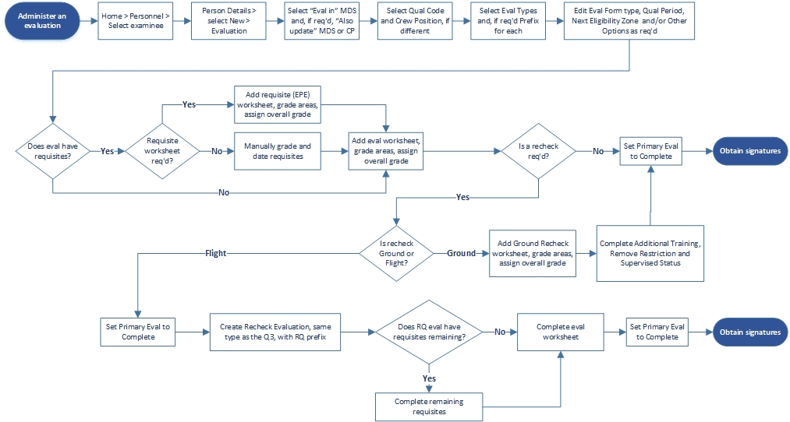
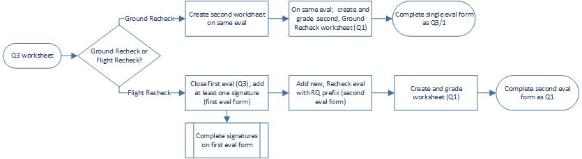

# Stan Eval

## FCIF Admin

### FCIF Admin Basics

**Introduction**  
The Flight Crew Information File \(FCIF\) module provides your unit with a means to disseminate information quickly, usually of a temporary nature. The PEX FCIF Admin module implements the FCIF requirements of AFI11-202V2, and is easily adapted to similar types such as the Intelligence Read File \(IRF\). FCIFs are created and assigned in FCIF Admin by MDS and Crew Position. Users can read, and sign for, FCIFs from FCIF Overview, Go/No-Go, and My Page. Users sign for FCIFs with their PEX Security Identifier. Obsolete FCIFs are rescinded but remain in PEX as such and can be reactivated. After a suitable period FCIFs can be permanently deleted.

* _No-Go FCIFs_ - Must be read and acknowledged prior to performing the mission. They appear red on Go/No-Go displays until signed.

* _Non No-Go FCIFs_ - Can be read and acknowledged at the user’s convenience. They appear yel ow on Go/No-Go displays until signed.

**Permissions**  
Three permission roles can access the FCIF Admin module, in addition to PEXAdmin and Administrator.

* _Stan Eval Administrator_ and _Stan Eval Evaluator_ can perform any function in FCIF Admin.

* _Stan Eval Read Only_ can view and print, but cannot add, rescind, delete or edit an FCIF. 

| Stan/Eval Role | View                | Print               | Add                | Rescind           | Delete            | Edit              |
| :------------- | :-----------------: | :-----------------: | :----------------: | :---------------: | :---------------: | :---------------: |
| Administrator  | :white_check_mark:  | :white_check_mark:  | :white_check_mark: |:white_check_mark: |:white_check_mark: |:white_check_mark: |
| Evaluator      | :white_check_mark:  | :white_check_mark:  | :white_check_mark: |:white_check_mark: |:white_check_mark: |:white_check_mark: |
| Read Only      | :white_check_mark:  | :white_check_mark:  | :x:                | :x:               | :x:               | :x:               |
|                |                     |                     |                    |                   |                   |                   |

**Rules**  
FCIFs are available to all squadrons in a database, meaning:

* An individual FCIF number can only be used once in that database.
* Changing an FCIF will change it for all squadrons, not just one you are working in.

**Controls**  
Access these procedures by navigating to Stan Eval > Testing Admin.

**Workspace**  
The View and Add filter panels are essentially the same.  
{: style="height:90%;width:90%"}

1. _Type_ - Select FCIF by Type; FCIF/IRF, Read File, etc.

2. _Filter_
     1.  Filter by the standard filter available in multiple modules throughout PEX or ...
     2.  Filter by Squadron, MDS and Crew Position.
3. _Add/Delete Type_ Click on `Add/Delete Type`.
     1. When the dialog opens, add the desired type name.
     2. Click `Add new type`. That type is now listed in the _Add_ page.
4. _Label_ - Click on `Edit Label`.
     1. When the _Edit_ dialog opens, add the desired label name.
     2. The default is FCIF; clearing the field returns the label to FCIF.
     3. Click `OK`, and your label replaces FCIF in all parts of PEX.
>!!! note "Note"
>     When in use, an FCIF type cannot be deleted. Once all FCIFs of that type have been rescinded and deleted, the type can be deleted.
5. A _Search_ tool, upper right, is used to search for FCIFs by number.
6. An _Overview_ link at page bottom takes you to the _FCIF Overview_ page in the Ops module.

### Manage Your FCIF Program- Add, Edit, Rescind

**Setup FCIF Admin**

1. Change FCIF Type if required.
    1. Click on `Add/Delete Type`.
    2. When the dialog opens, add the desired type name.
    3. Click `Add new type`. That type is now listed in the Add page. 
2. Change Label if required.
     1. Click on `Edit Label`.
     2. When the Edit dialog opens, add the desired label name.
     3. The default is FCIF; clearing the field returns the label to FCIF.
     4. Click `OK`, and your label replaces FCIF in all parts of PEX.

**Add an FCIF**

1. Click Add.
2. Select the FCIF will apply to.
3. When the dialog opens, select a filter method.
     1. The standard personnel filter.
     2. Squadron\(s\), FCIF Type, MDS\(s\) and Crew Position\(s\).
>!!! note "Note"
>     Asterisked fields are mandatory.
4. _Approved Date_ - In addition to being the date the FCIF was approved by higher authority, FCIFs are ordered by this date.
5. _Effective Date_ - The date users will be able to view and sign the FCIF. Until then, it is visible only in FCIF Admin. To use this option check the checkbox and enter a date.
6. _Expiration Date_ - The date the FCIF is to be rescinded. To use this option check the checkbox and enter a date. The date will appear in FCIF Admin but the FCIF must be rescinded manually.
7. _No-Go_ - Check the box for No-Go, uncheck for non No-Go
8. _Number_ - The item number for the FCIF, e.g., 16-01. FCIF numbers can only be used once.
>!!! note "Note"
>     You can't save a new FCIF if the same number exists, even as a rescinded FCIF. Use the Search tool, upper-right, to determine if the FCIF number is already in use. If you absolutely need to use the same FCIF number more than once, use a period or comma after the number, e.g., FCIF \# "16-011" and "16-011."
9. _Subject_ - A short title.
10. _Originator_ - The organization/person originating the FCIF \(e.g., AFLCMC/HBBD\)
11. _Originator Title_ - Title of the Originator
12. _Content_ - The complete FCIF text or instructions to view attached files.
13. File to Add, File Name, and Attachments.
     1. To include files with the FCIF, click the `Browse` button and navigate to the desired file. Modify the File Name if desired and click `Add File`. Repeat this step for as many files as required. Click `View` to open the attachment. Most common file types are supported \(doc, xls, ppt, zip, PDF, mpeg, mpg, avi, wmv, wpm3.\)
     2. To remove a file, in the Attachments list, check the box to the left of the file name and select Remove File\(s\).
14. _Save_ - Click `Save` and your FCIF appears in the FCIF list, is assigned to all squadrons and crew members of the MDS/CP you selected, and if No-Go, immediately marks all those crewmembers as No-Go for FCIF.

**Edit an FCIF**

1. On the FCIF Admin page, click on the `Edit` link on the row of the desired FCIF.
2. When the _Edit FCIF_ dialog opens, change the Squadron, Type, MDS or Crew Position as required.
3. Edit the FCIF as required.
4. Click `Save`.
5. A dialog will ask you if you want to unsign the FCIF for all users if an edited field could affect the meaning of the FCIF.
     * _Yes_ - Will unsign the FCIF and require all personnel to re-sign.
     * _No_ - Will retain all signatures.

**Rescind an FCIF**  

1. Rescinding an FCIF takes it off the list and unassigns it from all personnel.
2. On the FCIF Admin page, check the box on the row of the desired FCIF.
3. Click Rescind.
>!!! note "Note"
>     This will rescind the FCIF for everyone, not just the MDS and Crew Position selected.
4. Can I un-rescind an FCIF? If so, how?
5. Yes. Click `Show Rescinded`.
6. On the FCIF Admin page, check the box on the row of the desired FCIF\(s\).
7. Click `Rescind`.
8. A dialog will ask you if you want to unrescind your selection\(s\). Yes will unsign the FCIF and require all personnel to re-sign. No will retain all signatures.
9. Click `Show Active` to return to the main page.

**Delete an FCIF**

1. FCIFs must be rescinded before they can be deleted.
2. Click `Show Rescinded`.
3. In the rescinded list, check the box to the left of the FCIF Number and click `Delete`.
4. Click `Show Active` to return to the main page.

**Auto Unsign**

This will automatically un-sign FCIFs after a period of time, based on a person's last-flown date in ARMS.

1. Select the Squadron.
2. Click `Auto Unsign Settings`.
3. When the dialog opens, select the FCIF Type\(s\) to Enable.
4. Select the Number of Days.
5. Click `Save`.

**Print an FCIF**

1. Check the boxes of the FCIFs you want to print.
2. Click `Print Selected`.
3. When the dialog opens in PDF format, each FCIF appears in a page-by-page display.
4. Save as a single file, or print pages as required.

**Print an FCIF Index**

1. Click `Print Report`.
2. When the dialog opens, select Date Range, Statuses and Type\(s\).
3. Click `Print`.
4. When the dialog opens in PDF format, each FCIF is listed, along with any attachments.
5. Save as a single file, or print pages as required.

**Print an FCIF card \(AF Form 4121\)**

1. Click `Print Card`.
2. When the dialog opens, select Calendar Year and the name\(s\) of the persons desired.
3. Click `View`.
4. An AF PDF 4121, _Individual FCIF Currency Record_ opens for each person.
5. Click `Export` to save.
6. Click `Print` to print cards for each person selected.

**Workflow**
{: style="height:90%;width:90%"}

## Stan Eval Management

### SEM Basics

**Introduction**  
The Stan Eval Management \(SEM\) module enables you to administer a comprehensive Standardization and Evaluation program in accordance with Air Force Instructions. You can create, assign, grade, record and track evaluations. Configure PEX for your unit’s stan/eval program, tailored by Squadron, MDS and Crew Position. Exams are managed in Testing Admin and Testing. Evaluation reports are generated in Stan Eval Reports.

Further SEM guidance is in:

* _Stan Eval Setup_ - How to configure PEX for your unit.
* _Stan Eval Overview_ - How to manage your Stan Eval program.
* _Stan Eval Personnel_ - How to use controls to navigate evaluations and related functions.
* _Stan Eval Tactics, Techniques and Procedures_ - How to conduct various evaluations and related functions.

**Permissions**  
Three permission roles can access Management, in addition to PEXAdmin and Administrator:

* _Stan Eval Administrator_ - Can perform any function in SEM.
* _Stan Eval Examiner_ - Is similar but cannot edit settings in Setup. Stan Eval Examiner can however, view, print and change displays in Setup.
* _Stan Eval Read Only_ - Can print and change displays throughout SEM but cannot edit.

Permission roles are assigned in Users & Permissions. Examiners are selected in Preferences > Eval Forms.

We suggest only persons with training in this module be given Stan Eval Administrator as some actions are difficult if not impossible to reverse. Stan Eval Read Only is intended for staff or HHQ inspectors who need only view data. Users not assigned a Stan Eval role can still view their own evaluation folder.

**Rules**

* Users cannot grade their own evaluations.
* A grayed-out entry indicates it is in use and cannot be edited or deleted.
* Entries with gray backgrounds are required by AFI, shipped with the software, and cannot be edited. Unit-added entries can be edited.

**Module Notes**

* SEM pulls data from other PEX modules:
  * _Maintenance > Aircraft_ - Verify the list the MDSs needed for Stan Eval. Some communities \(e.g., aeromed\) do not use the Series letter. By listing the MD and S characters separately you can control individual preferences in SEM. [Hyperlink]()
  * _Setup > Squadrons_ - [Hyperlink]()
    * Installation column, ensure your location is correct for your evaluation forms.
    * Display MDS in Dropdowns column, ensure your MDS\(s\) are checked for display.
  * _Setup > Personnel > Personnel_ tab. [Hyperlink]() 
    * Service Status column, identify each person as A - Active Duty, R - Reserve, or G -Guard. “A” is the default.
    * MDS and CP columns, ensure each person has the correct MDS and CP. If you need to assign or change data, go to the Quals tab. Each person must have at least one MDS/CP set as Primary. Additional MDS/CP combinations can be as added as required.
 *_Setup > Users & Permissions_ [Hyperlink]() Set permissions as desired.
* Evaluation folder import from another PEX database is included as part of personnel data file import in _Setup > Personnel_.

!!! danger "Warning"
     PEX allows you to reopen closed evaluations. This deletes all signatures and revisions from the form. We recommend not reopening and closing evaluations completed in an earlier version of PEX as this can cause unanticipated results. For example, a person may appear to be qualified and current in all parts of SEM except for the Rainbow Unqualified panel list. Creating and deleting a SPOT eval on the person may resolve the issue.

**Workspace**

These features are accessed by navigating to Stan Eval > Management.  
{: style="height:90%;width:90%"}

1. _Home_ - Central display of all SEM pages.
2. _Overview_ - Stan Eval program management functions, overview of processes and timelines.
3. _Personnel_ - Administer evaluations.
4. _Setup_ - Configure how your squadron will execute Stan/Eval program.
5. _Search and Pushpin_ - Search for people by name. When “pinned” opens SEM to the pinned page.

Throughout SEM you have a choice of executing commands with either menu buttons or a right-click context menu. The fol owing instructions are written around “best practices.”

* _Save_ - Most modules save data when clicking off a line but a few have Save buttons.
* _Expand/Collapse All_ - Most SEM pages have a blue, expand-and-collapse-all-grids button at the center/top of the page grids.
* _User name_ - The user names display throughout SEM are links to the person’s Person Details page.
* SEM uses the “visibility” model to display options. Instead of adding multiple instances of the same item \(e.g., a new eval type\) to a database, a single instance of an item is added and made visible to the squadrons using it. This simplifies moving people between squadrons within a database. You must have SE permission to a squadron in order to view it in Setup.
* When a person is added to your database from another PEX database via a Personnel Data File import, any Stan/Eval data will be automatically added. Likewise, if a person leaves your database for another, their Personnel Data File will include Stan/Eval data. 

### Setup- Configuring SEM

#### Setup Tab

In Setup you can select from those entries delivered with PEX and add other entries required by your unit.

##### Setup

!!! note "Note"
     Within Setup use drag-and-drop to place entries in the order they need to appear on your evaluation forms.

**Eval Prefixes**

1. Click `Add Prefix`.
2. When the add dialog opens add the prefix.
3. Click `Save Prefix` or `Save and New` for multiple entries.
4. Check the squadrons the prefix applies to.
5. Once all your prefixes are in place,
6. Drag and drop as required.

**Eval Types**

1. Click `Add Eval Type`.
2. When the add dialog opens add the eval type.
3. Click `Save Eval Type` or `Save and New` for multiple entries.
4. Check Periodic if the eval type is recurring, i.e., it will expire on a date.
5. Check the squadrons the eval type applies to.
6. Drag and drop as required.

!!! caution "Caution"
     Do not enter combined Eval Types. PEX allows you to administer combined evaluations, such as INSTM/QUAL or EIT-TH/EIT-VR, but they are stil entered individual y here. When opening an evaluation, PEX al ows you to select, for example, both INSTM and QUAL, and PEX will combine them for you. PEX tracks them separately for eligibility zone due dates, worksheets, and trending purposes.

**Eval Requisites**

1. Click `Add Eval Requisite`.
2. When the add dialog opens add the eval requisite.
3. Click `Save Eval Requisite` or `Save and New`for multiple entries.
4. Select `Exam` or `Worksheet`. If _Exam_, select the type, e.g., Closed Book. These dropdown entries ome from _Testing Admin_.
5. Select the _Grade Type_.
6. Depending on which type you selected, enter the Passing Grades \(1, 2, Q\) or passing % \(85%.\) Any Grade not listed here, or any % below that listed here, is considered a failure in SEM.
>!!! note "Note"
>     CAPS/Boldface exam types are unique in that they receive a percentage grade in Testing but need to display as Q or U in SEM. For these types enter passing grades of “100” and “Q.” This way, any CAPS/Boldface exam receiving a grade of 99 or lower in Testing Admin will display as U in SEM.
7. Visibility selection is not used here as requisites follow the eval type they are associated with.
8. Drag and drop as required.

**Weapons Event**

1. Click `Add Weapon Event`.
2. When the add dialog opens add the event.
3. Select `Air to Air` or `Air to Ground`.
4. Click `Save Weapon Event` or `Save and New` for multiple entries.
5. Check the squadrons the event applies to.
6. Drag and drop as required.

##### Preferences

!!! note "Note"
     When changes are made to Preferences, the new preference will apply only to evaluations created from that time forward.

_Desired Months Settings_

* _Email Eval Notification_ - How many months before entering the zone you want the Email notification set out. “1” sends it out the month before, “0” sends it out the month of.
* _Flight/Task Completion_ - Enter the desired eligibility month for completion of the primary evluation. For example, enter “4” if you want the primary evaluation completed in the fourth month of eligibility.
* _Requisite Completion_ - Enter the desired eligibility month for completion of all requisites. For exmple, enter “3” if you want the requisites completed in the third month of eligibility.
> !!! note "Note"
>     Once the desired completion date is passed, the person wil show late but not overdue.

_Signature Due_  
Enter the number of days, after the evaluation is complete, when al signatures need to be in place on the evaluation form.

_Notification Mail_  

* When PEX sends out email notifications, about entering the eligibility zone or being late on reuisites, the email will show it originated from the email address entered here.
* Mail From must an individual’s email address and not a group email address.
* Send a copy of the email to the email address entered in the CC field. This one can be a group emil address. Use multiple email addresses, separated with a semi-colon.
* To test your mail server settings, click Test Mail Server. Use the default PEX Help Desk email or enter an address as desired and click Send Email. If it produces an error, take a screenshot of the message and send it to the PEX Help Desk for assistance.

_Stan Eval Rules_  
When checked:

* All requisites required to be complete before primary evaluation for INIT and RQ evaluations. PEX will pop a warning if setting the eval complete with incomplete requisites.
* Non-periodic eval reqs required to be complete NLT 2 months \(3 months ANG/AFRC\) after the eval flght is complete.
     * The Service Status is set in Setup > Personnel. With the rule not checked, non-periodic evaluation requisites are due not later than three months after the primary evaluation is completed \(date of the last worksheet\). With rule checked:
>| Person   | Serving Status    | Primary Eval Complete Date | Requisite Late Date |
>| :------- | :---------------- | :------------------------: | :-----------------: |
>| Alpha    | _null_            | 1-Jan-20                   | 1-May-20            | 
>| Bravo    | _A_ - Active Duty | 1-Jan-20                   | 1-Apr-20            |
>| Charlie  | _R_ - Reserve     | 1-Jan-20                   | 1-May-20            |
>| Delta    | _G_ - Guard       | 1-Jan-20                   | 1-May-20            |
* Use the 12-month cycle based on the birth date. Evaluations wil expire every twelve months, on the examinee's birth month.
* Failed Requisite = Overall Q3. When a requisite is failed, the overall evaluation grade will be set to “3”. When the requisite is subsequently passed, the overal grade wil reflect a “3/1”. This rule is usual y used by MAF, AMC, and AMC-gained ANG/AFRC units.
* Additional training required to be complete not later than 2 months \(3 months ANG/AFRC\) after the primary evaluation.
     * The Service Status is set in Setup > Personnel. With the rule not checked, additional training is due not later than three months after the discrepancy date. With rule checked: Person Service Status
>| Person   | Serving Status    | Discrepancy Date | Additional Training Due Date |
>| :------- | :---------------- | :--------------: | :--------------------------: |
>| Alpha    | _null_            | 1-Jan-20         | 30-Apr-20                    |
>| Bravo    | _A_ - Active Duty | 1-Jan-20         | 28-Feb-20                    |
>| Charlie  | _R_ - Reserve     | 1-Jan-20         | 30-Apr-20                    |
>| Delta    | _G_ - Guard       | 1-Jan-20         | 30-Apr-20                    |

* Overdue or Failed evaluations place personnel in NoGo state \(Red Ball\). In NoGo, persons with overdue or failed evaluations display NoGo/red instead of caution/yellow .
* Show personnel with missing qualifications as Caution \(Yellow Ball\). In NoGo, persons with MDS/CP qualifications in [Setup > Personnel > Quals]() and no corresponding qualification in SEM will display caution/yellow.
>!!! note "Note"
>     If “Overdue or Failed evaluations place personnel in NoGo state” is checked, “Show personnel with missing qualifications” switches from Caution \(Yellow Ball\) to NoGo state \(Red Ball\).
* Show qualifications within 30 days of expiration as Caution \(Yellow ball\). In NoGo, persons with qualifications that expire within thirty days will show yellow. If on a wavier, NoGo uses the wavier expiration date.
* Use the Failed Requisite Exam preference. Go/No-Go shows No-Go \(red\) or Caution \(yellow\), as selected with the radio buttons, for failed requisite exams. If unchecked, Go/No-Go shows green.
>!!! caution "Caution"
>     PEX already identifies personnel as NoGo \(red\) if they have a failed a requisite CAPS/Boldface/EPE. If unchecked, there is no indication of failed requisite exams in Go/No-Go. The failed requisite exam does not need to be part of an open evaluation to change the Go/No-Go indicator. For personnel with multiple crew positions, PEX takes into account the MDS and crew position associated with the requisite exam. A successful re-take of the same Type \(including MDS/CP\) requisite exam will restore the Go/No-Go status to green.
>!!! note "Note"
>     Entering a passing or failed grade manually on an individual’s Eval Details > Requisites will not affect the No-Go indicator. It the exam is taken on paper, enter it in PEX as an Offline Exam so it feeds No-Go.

_Periodic Evaluation Expiration_  
Enter the number of months for which an evaluation is valid. For a 17-month cycle, enter 18 \(not 17\). This determines the expiration date for this evaluation.

_Eligibility Zone_  
Enter the number of eligibility zone months for periodic evaluations. For aircrew and ISR units, enter 6.

_Default Eval Form_  
Select AF Form 8, 8a, 4350 or 4143. This will be the default for your squadron but can be changed on individual evaluations and on an individual’s Person Details. For aircrew, pick Form 8. For ISR units, pick Form 4350.

_Eval Form Signature Mode_  
Select whether you want to use digital \(CAC\) signatures or manual \(pen-and-ink\) signatures on the evaluation form. Digital is preferred.

!!! caution "Caution"
     When switching modes, any evaluation with some but not al signatures wil dump those signatures. In other words, an evaluation form must have all digital or all manual signatures. This does not affect evals with all signatures in place.

_Display MDS Series Letter_    
For example, C-130H. Selecting _No_ will display C-130, selecting Yes will display C-130H. For A2-directed ISR units, pick No unless you are in an F-15E unit.

_Email Zone Notification Template and Email Late Requisites Template_  
Edit the default emails sent when people enter their zone or are late on requisites. Use the buttons across the top to enter variables into the email. For ISR units, make the text edits which are directed in the PEX ISR SEM checklist Set up Preferences.

_Additional Eval Reviews_  
Setup a pre- and post- signature form review process. Whatever you enter here will be appended to the Additional Comments on the evaluation form. Pre-signature reviews, up to eight, must be completed before the examiner is allowed to digitally sign the form. The Posted review is activated after the examinee’s signature is on the form. In both cases a Review button activates when appropriate. Clicking Review registers the user account name of the person logged in. This cannot be a joint use account. For example, you are associated to multiple user accounts including yourself and PEXAdmin. If logged in as yourself you can sign off the review. If logged in as PEXAdmin you cannot.

* Click Add one and enter the reviewer’s office symbol. To add more, right-click and select `Add`. The order entered will be the order displayed. To edit a reviewer, highlight the record and make the necessary changes. To delete a reviewer, highlight the record, right-click, and select the delete action.
* Display Additional Reviewers on Form 8. If not checked, the reviewers display in the GUI but not the eval form.
* Require a “Posted” entry. When checked, activates the Post review process.
* Do not show evaluation form in Section II of the FEF until the post review action is complete.

This is not active unless _Require a “Posted”_ entry is checked. The link to the evaluation will still be visible in the Eval Forms/MFR grid on the person details page.

_Restriction Templates_  
Click Add one and add formatted restrictions for the reverse side of eval forms.

**Assoc Eval Types/Reqs**  
This page associates eval types and requisites with individual MDS/CP combinations.

The combinations are universal throughout the database; squadrons listed in the navigation panel serve only to display and filter MDS and CP. Once configured in one squadron, that MDS/CP combination will show the same configuration in all squadrons. For example, you associate CV-22B pilots in squadron X to a QUAL with Open Book and Closed Book requisites. CV-22B pilots in squadrons Y and Z wil have the same QUAL/Open Book/Closed Book combination.

!!! caution "Caution"
     The above paragraph means that if you change the associations in your squadron, they will change for all other squadrons in your database with that MDS/CP.

1. Click Add/Edit Eval Types.
2. When the Edit dialog opens check/uncheck the Eval Type and click Save.
3. Click Add/Edit Requisites if the Eval Type has a Ground or Knowledge Phase requisite.
4. When the Edit dialog opens check/uncheck the Requisite\(s\) and click Save.
5. If the Eval Type or Requisite is no longer required, click the red X box and confirm.
6. Exclude from Tracking Desired Month Completion. As set in Preferences, requisites show as late once past their desired tracking month. If you do not want a requisite tracked and displayed as late, check this box. For example, the EPE is done in conjunction with the flight evaluation, not with the other requisites. 

**Mission Description**

1. Select Squadron, MDS and CP.
2. Click Add, Edit or Delete Mission Description.
3. The Add dialog opens, already associated to the selected Squadron, MDS and CP.
4. Enter a Name. This is the name evaluators will use when selecting a mission description for a worksheet.
5. Enter the description. This is the description evaluators wil add to the worksheet. Once added, the description can be edited for individual evaluation worksheets without affecting the template description.

_Mission Description Tactics, Techniques and Procedures:_

* Use CTRL-v to paste data into the Mission Description field.
* A useful technique is to use an underscore or similar for variables. For example, “The evaluation was conducted in the \_\_\_\_\_\_ MOA.” 

**Eval Forms**

For each person:

* _Stan Eval Form_ - Select the appropriate evaluation form \(Forms 8, 8a, 4143, or 4350\) for an individual, if different from the squadron default.
* _Eval Form Org_ - Enter the person’s desired signature block, but only if the person requires one different than their squadron/office default.
* _Service_ - Change if not USAF \(e.g., USMC\). This entry appears on the eval form reverse when the evaluator is the first of two evaluators on one evaluation.

To populate the various dropdowns, check people who are designated as:

* Reviewing Officer.
* Final Approving Officer.
* _Default Reviewing Officer_ - This name will always appear the top of the dropdown list.
* _Default Approving Officer_ - This name will always appear the top of the dropdown list.
* Examiner.
* _Add Tng Officer / Cert Official_ - Additional Training Certifying Official.

Check the `Show Only Active Certs` box to display only those people with a checked entry.

##### Eval Criteria
This page associates MDS/CP evaluation criteria from the applicable AFI for inclusion on eval worksheets and draft eval forms. The criteria can be created here but most are on the PEX website. 

If your MDS/CP file is not on the web site, contact the PEX Help Desk to have it built. 

!!! note "Note"
     The older .xml files can still be imported but are being replaced by the current `.evalcrit` type.

Be aware that, if you import an older .xml format file with profiles, those profiles will import but cannot be edited or deleted. Applying new criteria from the Evaluation Criteria Tool tab will overwrite the old eval criteria, removing all existing profiles for that MDS/CP.

Each area, or subarea, has a name, sequence number and grading criteria. It may also have a Description and Notes. Areas/subareas marked as Critical can be graded “Q” or “U” but not “Q-.”Grading uses the standard AF Stan/Eval system. This is a guide; reference the applicable AFI for specifics.

* _Q_ - Indicates the examinee demonstrated satisfactory knowledge and performance.
* _Q_ - Indicates the examinee is qualified but requires debriefing or additional training.
* _U_ - Indicates that performance was outside allowable parameters. An examinee receiving a grade of U requires debriefing or additional training, as determined by the examiner.

**Evaluation Criteria Tool Tab**

* _New_ - Create a new eval criteria file.
* _Open_ - Open an eval criteria file stored locally.
* _Save_ - Save the eval criteria you are working on as an .evalcrit file. This saves as a file on your coputer but it is not saved in PEX.
* _Apply_ - Apply the eval criteria you are working to a squadron, MDS and crew position.
* _Add Section_ - A grouping of grading areas. It does not have criteria or receive a grade.
     * _Add Subsection_ - A sub-group of a section. It does not have criteria or receive a grade.
* _Add Area_ - A gradable criteria. However, if an area has subareas, the area is not gradable
     * _Add Subarea_ - A gradable criteria which is a sub-group of an area.

**Evaluation Criteria Tab**  
After eval criteria is created or imported in the Evaluation Criteria Tool, use the Evaluation Criteria tab to create profiles and apply the set to a squadron, MDS and crew position. A profile determines which areas/subareas appear on a worksheet. Required and Desired criteria appear on the worksheet, N/A criteria does not. For example, for an instructor upgrade eval, select only the instructor areas as Required. You must have at least one profile.

A. Click `Add Profile`.
B. When the dialog opens, name the profile.
C. Select each area/subarea as Required, Desired or N/A.
D. Import Eval Criteria. Imports only the older .xml file types.

#### Overview- Manage Your Stan Eval Program

#### Overview Tab

Overview provides a high-level view of your Stan/Eval program.

**Rainbow**

!!! note "Note"
     An individual can have multiple rainbow bars. Those with multiple MDS or crew position qualifications, or qualifications with different expiration dates. For example, a person with an INSTM/QUAL expiring in January and a MSN expiring in March.

* Select Squadron, MDS and Crew Position.
* Bar colors indicate the status of the flight evaluation phase:
      * Green: On Time
      * Orange: Late \(past desired month, not overdue\)
      * Red: Overdue
      * Blue: Waiver Extension
* Letters in the bars indicate in that month:
      * E: Primary evaluation desired
      * S: Primary evaluation scheduled
      * A: Primary evaluation successfully accomplished
      * U: Primary evaluation accomplished but unqualified
      * D: Requisites desired complete
      * R: Requisites completed
* The Monthly Totals table indicates the number of evaluations:
      * Desired Flight Month: In their desired primary evaluation completion month.
      * Expiration Month: In the last \(expiration\) month of the eligibility zone.
      * In-Zone: In their eligibility zone.
* Lists:
      * _Unqualified_ - People who have a failed or overdue evaluation.
      * _Late Evals_ - People whose primary evaluations are past the desired completion month \(orange\) and have overdue evaluations \(red\).
      * _Restrictions_ - People that have restrictions, Supervised Status is indicated with a red asterisk.
      * _Late Requisites_ - Displays people that are late \(Orange\) or overdue \(Red\) completing requisites.

**Requisites**

* Periodic Requisites. Lists people who are in-zone for an evaluation. It displays the evaluation type, remaining ground/knowledge phase requisites, and the eligibility period end date. The evaluation need not be open. Persons are grouped by Overdue, Expiration Month, and Initial \(INIT\) and Requalification \(RQ\). Requisites will drop from the list as they are successfully completed.
* Non Periodic Requisites. Lists people who have an open non-periodic evaluation. It displays the evaluation, remaining ground/knowledge phase requisites, and the evaluation completion date. Requisites will drop from the list as they are successfully completed.
  
**Awaiting Signatures**  
Lists people who have a completed evaluation and tracks evaluation review and signature progress.

It displays the signatures due date, pre-signature reviews, released for signatures status, signature progress, and post review status. Clicking on pre-signature reviews, post reviews, and eval signatures links displays status. Clicking the pencil icon opens the form for signature. Clicking the padlock icon \(when visible\) unlocks and imports the form. See mailing an eval form for more on emailing, importing and exporting eval forms. .

* _Due Date_ - Due date for the last signature \(examinee\). By default, 90 days from the date of the primary evaluation. This default can be changed in Setup > Preferences.
* _Pre-Signature Reviews_ - You can identify up to eight reviews before the form is released for signature \(Setup > Preferences\). Use Awaiting Signatures to notify the next person in the review process. Unlike the automatic PEX notifications for signatures, notifications for reviews are done manually. This page shows how many \(X\) of the required reviews \(Y\) are complete \(X of Y\). The number of days is how long the review been ready for the next reviewer. Click the link to launch the signature summary dialog to view the next reviewer. A notification button lets you notify the next reviewer. N/A indicates the pre-signature review feature is not enabled.
* _Released for Signatures_ -If pre-signature reviews are not enabled, this link will activate once the primary evaluation is complete and the Additional Reviewer and Final Approving Officer are identified. If the pre-signature review process is enabled, this link activates once the last review is completed and the Additional Reviewer and Final Approving Officer are identified. Clicking the Ready link releases the evaluation for signatures and starts the PEX notification process. Once released, a status of Completed will display.
* _Eval Signatures_ -This column becomes active once the evaluation form is released for signatures. The information is displayed in the following format:  
```
“(1 of 4) Flight Examiner – Stan Eval John C. Smith, Lt Col – for 2 days”
```
This means the first signature of four, from the flight examiner, is due and was notified two days ago. Clicking on this hyperlink brings up the signature manager dialog with additional details on the status, a means to digitally sign, and a link to preview the form.
* _Post Review_ -If your squadron requires a Posted entry \(Setup > Preferences\), this link activates once the last signature is done. Once the post review is complete, the name and date are displayed. N/A indicates the post-signature review feature is not enabled.
* _Historical Signatures_ -Displays the signature status of pending only evaluations, or look back 30, 60, 90, 180 days, or one year.

##### Trending  

PEX does not have a separate trend entry function. Any worksheet area or subarea graded `Q-` or `U` will feed Trending.

_Trend by Discrepancies_  

1. Trend by a combination of sample size and percent, or minimum number.
      1. _Sample Size & Percent_
           1. _Sample Size_ - The minimum number of times an area is graded before it is considered for trending. For example, if your minimum sample size is five \(5\) and the area was graded only four \(4\) times during the time period, it won't show up on your trending data, even if it was downgraded all four times.
           2. _Percent_ - The percentage of times the evaluation area was downgraded. For example, if set to 50%, and the area was evaluated four times, and downgraded only once \(25%\), it won't show up on your trending data.
      2. _Minimum Number_ - The minimum number of times an evaluation area is downgraded before it is considered for trending. For example, if your Minimum Number is ten \(10\), and the area was evaluated 100 times but downgraded only nine \(9\) times, it won't show up on your trending data. To get al downgraded areas to show up, simply select `Minimum Number = 1`.
2. Enter the desired Date range.
3. Select the desired Eval Types.
4. Click `Trend`.
5. The downgraded areas section displays the area title, area number, number of times graded, and the number of times graded `Q-` and `U`. If desired, right-click and Export to Excel.

!!! note "Note"
     Trending discrepancies will appear after the Primary Evaluation is marked as complete. They do not wait until the evaluation form is signed off.

**Status**

* _Evaluations_ - Lists people who have an open evaluation. It displays the evaluation type, all remaining requisites, and the due date. Persons are grouped by Expired, In-Zone, and NonPeriodic. Requisites will drop from the list as they are successfully completed.
* _Restrictions_ - Lists people who have a restriction and/or supervised status.
* _Additional Training_ - Lists people who have assigned additional training, with separate entries for ground and flight.

**Additional Training**  
Lists people who have assigned additional training, with the due date and completion date. 

**Notifications**  
Notify people of their impending periodic evaluation and any late ground/knowledge phase requisites.

* _Eligibility Zone tab_ - Lists people in their eligibility zone, or about to enter their eligibility zone, based on the settings in Setup > Preferences.
* _Late Requisites tab_ - Lists people with late requisites.
* _Email Selections_ - Automatically sends email based on the template in Preferences.
* _Manual Email Selected People_ - Opens your email application with a templated email based on the template in Preferences. You can edit the addressees and verbiage before sending.
* _Print Selected InZone_ - Opens your document application with templated document \(e.g., PDF\) based on the template in Preferences.

!!! note "Note"
     * Both tabs have the same notification button functionality.
     * Names populate these lists based on the settings in Setup > Preferences > Desired Month Settings and Email Templates.
     * Email addresses are set in Setup > Personnel > Contacts.

**Auto-Open Evaluations**  
Automatically open evaluations based on the previous evaluation.

* Open Auto Evaluation. Open an evaluation based on the last one of that type, for that person. Highlight the name\(s\) and click Open Auto Evaluation. The person will drop from this display and the eval is open.

* Edit Auto Evaluation. Open an evaluation after editing. Highlight the name and click Edit Auto Evaluation. A dialog opens allowing you to edit the eval prefix and/or person’s qualification code. For example, this evaluation requires a “N/N” prefix but the last one did not; add it here. If the last evaluation crew position was “MP” but the person has since upgraded to “IP”; change it here.

**Eval Criteria Details**  
View evaluation criteria with corresponding notes without having to open a worksheet.

### Personnel- SEM Workspace

This topic describes the SEM workspace where most evaluation activity is accomplished. For specific use cases see [TTPs- Administering Evals and Use Cases]().  

#### Personnel Tab  
The Personnel section contains individual Person Detail pages, Eval Details pages, and evaluation folders/FEFs. An individual’s Person Detail page is, in essence, a digitized evaluation folder.

Evaluations are administered in an individual’s Eval Details page.

The “Personnel Search” function in the top right corner of every SEM page performs the same function as the Name Search and Advanced Search controls described below.

The Most Recent People function is available only in Personnel menu button. This displays the last five people’s Person Details page accessed by you.

**Name Search** 
Access one person’s Person Details page. The smart type-ahead narrows the list of all people in your database, regardless of squadron, if you have permission to that squadron.

**Advanced Search**  
View all people filtered by squadron, MDS and crew position.

**Import Forms**  
Import Stan/Eval forms to a person or people.

##### Person Details

**Header**  
Display’s that person’s relevant Stan/Eval data. Edit data by clicking the head silhouette or the `Edit…` link. These data are the same entered in Setup > Preferences, Setup > Eval Forms and Personnel.

* Head silhouette. Display an image of that person. Alternatively, display an image of the person’s unit, rank, badge, etc. Image files can be JPG or PNG types, and are imported using the Upload New Image or Use Webcam To Capture Photo buttons. Once in place, the image can be downloaded as a JPG using the Export Image to File button.
* Default Eval Form Type. Select the appropriate evaluation form \(Forms 8, 8a, 4143, or 4350\) for the person, if different from the squadron default.
* Eval Form Organization. Enter the person’s desired signature block, but only if the person requires one different than their squadron/office default.
* Service. Change if not USAF. This entry appears on the eval form reverse when the evaluator is the first of two evaluators on one evaluation.
* Is a Reviewing Officer and Is a Final Approving Officer. Check if the person occupy fills either role.

**Menu**  
Use these menu buttons, or the right-click context menu functionality described in individual sections below.

* _\+New_ - Add new tasks to this page.

* _Forms_ - Access existing forms and import scanned forms to this page and Eval Folder.

* _Sign_ - Sign open eval forms and MFRs.

* _Eval Folder_ - Contains evaluation documentation. The sections described will not appear in the folder until an item is actually entered, e.g., a Major Discrepancy MFR.

* _Left side/Section I_ - Contains the summary forms \(AF942, AF1381, AF4348\) and Minor Discrepancy Log. Major discrepancy MFRs are listed separately under Major Discrepancies.

* _Right side_ - Contains the eval forms \(AF8, AF4350\) and Memos For Record \(MFR\).

* _Produce entire Eval Folder \(FEF\) as a PDF_ - The contents of an evaluation folder can be opened, saved and printed as a single PDF. Hovering on the Eval Folder button in Person Details opens a context menu with options to View and Print. Individual forms appear in the same order as displayed in the folder.

**Qualifications**  
Lists a person’s qualifications, current and past. If the qualification is periodic, PEX computes the Zone start date and expiration date based on settings in Preferences. If a person with existing qualifications is added to your database, manually or via ARMS import, those quals can be added manually.

* _Add/update qualifications automatically_  
Simply administer the evaluation in PEX. Clicking Primary Eval Complete adds the qualification if it does not exist or, if already listed here, updates the existing qualification. If a combined evaluation, all included qualification types are updated.

* _Add/update qualifications manually_  
      * Right-click in the Qualifications grid, select `Add`, and the dialog opens.
      * For the last evaluation of that type:
          * Select the MDS, Qual Code and Crew Position, populated from the lists in Setup > Personnel.
          * Select the Last Evaluation Date, Wavier Expiration Date \(if any\), Eval Prefix \(if any\), and Qualification.
          * The Remarks section is for in-house remarks visible only to users with SEM access. The remarks do not appear outside of SEM or on any form.
          * Select `Save` or, to add multiple qualifications, `Save and New`.
* _Edit a qualification: add a wavier or active/inactive status_
      * Right-click on the qualification, select Edit, and the dialog opens.
          * Set a waiver by checking Waiver Expiration Date and adding the date.
          * Set the qualification to inactive by checking Inactive. This is useful for expired qualifications that will not be renewed soon \(e.g., non-flying TDY\) and for obsolete qualifications that are archived in PEX. Inactive qualifications will not appear in other dismays as overdue. They can be made active by unchecking the box.

**Open Evaluations**  
Lists a person’s open evaluations, i.e., evals that have been added but do not yet have at least one signature. Once a signature is on the eval form, the evaluation no longer appears here and must be accessed from Eval Forms/MFR \(see below\).

**Add an Evaluation**

Right-click in the _Open Evaluations_ grid, select `Add`, and the dialog opens.

* _Eval in_ - select the MDS the evaluation was administered in.
* Select the MDS, Qual Code and Crew Position, populated from the lists in Setup > Personnel.
* Also Update: MDS or CP. For evals that cover multiple MDSs or crew positions. For MDS, use the Ctrl key to select multiple MDSs. For CP, click Add Qual/CP\(s\) and select required combinations of qual code and crew position. Use Save and New for multiple combinations.
* _Prefixes and Eval Types_ - Select an Eval Type, or multiple types for combined evaluations.
With Type selected the associated Edit Prefix\(es\) button becomes active. Select the prefix associated that type. For example, for a recurring QUAL/MSN with an initial INSTR check, select QUAL with no prefix, MSN with no prefix, and INSTR with the INIT prefix.
* _Eval Form Type_ - Defaults to the form selected in Preferences or for that person.
* _Qualification Period Generated By This Evaluation_ - select the number of months for which this evaluation is valid. For a 17-month cycle, enter 18 \(not 17\). This determines the expiration date for this evaluation.
* _Next Eligibility Zone_ - Select the number of months for the eligibility zone generated by this evaluation. _For example:_ Set Qualification Period to 18 and Next Eligibility Zone to 6. If this eval is completed in January 2017, the next eligibility period begins in January 2018 and expires on 30 June 2018.
* _Other options_
      * _Recheck Evaluation_ - Check if this is a recheck to correct a failed evaluation.
      * _Ground Only Evaluation_ - Check this only for evaluations that include a Ground or Knowledge phase requisite with no Flight or Task phase requisite. For example, an eval that consists of an Open Book exam with no flight eval.
      * _Commander-Directed Downgrade \(or SIO-Directed downgrade\)_ - Checking this customizes the eval and resulting eval form.
      * _Display MDS Series Letter_ - Checking this will display \(for example\) C-130H. Unchecking will display C-130.
* The Remarks section is for in-house remarks visible only to users with SEM access. The remarks do not appear outside of SEM or on any form.

**Edit an Evaluation**  
Certain parts of an open evaluation can be edited after creation: Qual Code, Eval Prefixes, Eval Form Type, Qualification Period, Next Eligibility Zone, Display MDS Series Letter and Remarks. The remainder form the basis of the evaluation and cannot be edited. If any are not as desired, the eval must be deleted and re-created.

* Right-click in the Open Evaluations grid, select Edit, and the dialog opens.
* Make edits and Save.

**Additional Training**  
View additional training, and assign an additional training certifying officer and accomplished date to training entered on a worksheet due to a discrepancy.

* To Sign Off, right-click on the entry and select `Sign`. When the dialog opens select the date accomplished and certifying officer.
* To Change Signer, right-click on the entry and select `Change Signer`. When the dialog opens edit the date accomplished and certifying officer as required.
* To Unsign, right-click on the entry and select `Unsign`.

**Current Restrictions and Complete Restrictions History**  
Displays restrictions entered on a worksheet due to a discrepancy, and adds restrictions related to an evaluation but not part of a discrepancy. The default view is Current Restrictions.

* To view all restrictions, right-click, select `View All`, and view Complete Restrictions History.
* To return to Current Restrictions, right-click and select `View Current`.
* To Add a non-worksheet restriction, right-click and select `Add`. When the dialog opens enter the restriction description \(from a template if set up in Preferences\), supervised status and date assigned.
* To Edit a restriction, right-click on the entry and select `Edit`. When the dialog opens edit the restriction description, supervised status, date assigned, or person who removed the restriction.
* To Delete a non-worksheet restriction, right-click on the entry and select `Delete`. Worksheet restrictions must be deleted from the worksheet on that eval.

**Eval Forms/MFR**  
View open and completed evaluation forms and MFRs, reviews and signature status. Eval forms are automatically added when an evaluation is opened, or imported from a scanned file. Each form in the Type column is a link to that form. The right-click menu includes:

* _Move Up_ - Allows forms to be re-ordered if they were added in the wrong sequence. 
* _Add MFR_ - Opens a dialog to add an MFR with fields for Date, From, To, Subject and Body. It presents a choice of signature method using either your CAC or your PEX SID. Last, select the Signer’s Name from your database using Search or List.
      * Create MFR as Informational or Endorsement types, add multiple signatures. Memos for Record \(MFR\) can be created as either an Informational or Endorsement type. Up to five signatures can be added to an MFR.
* _Edit_ - Edit scanned in forms.
* _Delete_ - Delete scanned forms and MFRs.
* _Reopen Evaluation_ - Opens a closed evaluation \(one with at least one signature\) for editing. Once reopened it appears in Open Evaluations.
>!!! caution "Caution"
>      PEX allows you to reopen closed evaluations. This deletes all signatures and revisions from the form. We recommend not reopening and closing evaluations completed in an earlier version of PEX as this can cause unanticipated results. For example, a person may appear to be qualified and current in all parts of SEM except for the Rainbow Unqualified panel list. Creating and deleting a SPOT eval on the person may resolve the issue. View. Opens the form as a PDF.
* Import Scanned Form. Import a PDF, JPG or PNG file. For more see Import scanned form files. 

**AF 942**   
View 942 entries. Entries are automatically added when an evaluation is completed, or added manually. The former \(grayed\) are not editable except by reopening the evaluation. The latter are editable here. You can also manually sort entries and import scanned AF 942s.

The right-click menu includes:

* _Add 942 Entry_ - Opens a dialog with free-text fields for Aircraft/Crew Position, Type of Evaluation \(required\), Date Completed \(optional with checkbox\), Qual Level and Unit.
* _Delete_ - Deletes manual entries.
* _Import Scanned AF94_ -  Import a PDF, JPG or PNG file. For more see Import scanned form files.
* _View Scanned AF942_ - Click on the imported AF942 and select `View Scanned AF942`. The form opens for viewing and printing.
* _Edit Scanned AF942_ - Click on the imported AF942 and select `Edit Scanned AF942`. A dialog opens to edit Description and Date. You can also replace the existing form with a different one.
* To move an entry, left-click on the entry and drag it up or down as required.

**AF 4349**  
View 4349 entries. Entries are automatically added when an evaluation is completed, or added manually. The former \(grayed\) are not editable except by reopening the evaluation. The latter are editable here. You can also manually sort entries and import scanned AF 4349s.

The right-click menu includes:

* _Add 4349 Entry_ - Opens a dialog with free-text fields for Aircraft/Crew Position, Type of Evaluation \(required\), Date Completed \(optional with checkbox\), Qual Level and Unit.
* _Delete_ - Deletes manual entries.
* _Import Scanned AF4349_ - Import a PDF, JPG or PNG file. For more see Import scanned form files.
* _View Scanned AF4349_ - Click on the imported AF4349 and select `View Scanned AF4349`. The form opens for viewing and printing.
* _Edit Scanned AF4349_ - Click on the imported AF4349 and select `Edit Scanned AF4349`. A dialog opens to edit Description and Date. You can also replace the existing form with a different one.
* To move an entry, left-click on the entry and drag it up or down as required.

**Certifications**  
View certifications. Certifications can be added manually or added from a Letter of X \(LoX\) certification. Once entered, they can be opened in an AF1381 or AF4348. 

The right-click menu includes:

* _Add Certification_ - Opens a dialog with free-text fields for Certified Event, Instructor, Date Certified, Certifying Official/Organization, and Remarks.
* _Match Letter of X Certification_ - Opens a dialog allowing you to select a certification from the LoX and add it to SEM Certifications. See more here Letter of X \(LoX\).
* _Edit_ - Opens a dialog to edit existing entries, and adds the ability to decertify the person from the event. Fields include Check To Decertify, Date Decertified, Decertified for Cause, Decertified For Discretionary, And Decertifying Official/Organization.
* _Delete_ - Delete a certification.
* _View 1381 PDF form_ - Opens an AF1381.
* _View 4348 PDF form_ - Opens an AF4348.
* _Convert AF4348 to Scanned Form_ - Converts your certification entries into a scanned AF4348. The resulting form is non-editable.
* _Import Scanned Form_ - Import a PDF, JPG or PNG file. For more, see Import scanned form files.
* _View Scanned Form_ - Opens the scanned AF4348.

**Major Discrepancies**  
Create, sign, import and view eval folder major discrepancy MFRs.

!!! note "Note"
     Major discrepancies are those affecting the person’s qualification.

* _Add Major Discrepancy_ - Opens a dialog to add an MFR with fields for Date, From, Subject and Body. It presents a choice of signature method using either your CAC or your PEX SID. Last, select the Signer’s Name from your database using Search or List.
* _Edit_ - Opens a dialog to edit Date, From, Subject, Body, Signature Method and Signer’s Name.
* _Delete_ - Delete the MFR.
* _Reopen_ - Opens a completed MFR.
>!!! caution "Caution"
>     Reopening an MFR deletes all signatures from the form.
* _View_ - Opens the form as a PDF.
* _Import Scanned Major Discrepancy_ - Import a PDF, JPG or PNG file. For more see Import scanned form files.

**Minor Discrepancies**  
Create, import, sign and view an eval folder minor discrepancy log. All discrepancies are entered on a single log.

!!! note "Note"
     Minor discrepancies are those **not** affecting the person’s qualification.

* _Add Minor Discrepancy_ - Opens a dialog to add a discrepancy with fields for Evaluation, Evaluation Date, Discrepancy, Review Date, and Reviewer’s Initials. There is no signature function. 
* _Edit_ - Opens a dialog to edit Evaluation, Evaluation Date, Discrepancy, Review Date, and Reviewer’s Initials.
* _Delete_ - Delete that discrepancy entry.
* _Import Scanned Minor Discrepancy_ - Import a PDF, JPG or PNG file. For more see Import scanned form files.
* _View Form_ - Opens the log as a PDF.

##### Eval Details

**Header**  
Display’s that evaluation’s relevant data. The eval types and prefixes are displayed as they will appear on the worksheet and eval form. The “i” info button displays them broken down as they were created. The Desired Flight Month is determined based on settings in Preferences, and can be edited here as desired.

**Edit**  
Certain parts of an open evaluation can be edited after creation: Qual Code, Eval Prefixes, Eval Form Type, Qualification Period, Next Eligibility Zone, Display MDS Series Letter and Remarks. The remainder form the basis of the evaluation and cannot be edited. If any are not as desired, the eval must be deleted and re-created.

**Set Eval EQ**  
Sets the evaluation to Exceptionally Qualified. When selected, a dialog opens to add comments.

Once added, Remove EQ and Comment becomes available. The EQ button remains inactive until the eval has:

* At least one worksheet.
* All eval types on all worksheets must have a grade of `1`.
* No area grades of `Q-` or `U`.
* All requisites passed the first time taken.

**View Form**  
Opens the eval form. The form includes requisite names, dates and grades as they are accomplished. 

**Primary Eval**  
Sets the primary evaluation \(Flight or Task phase\) to complete. This does not include Ground or Knowledge phase requisites, which may still be incomplete. The primary eval complete date is the date of the last worksheet. Once set, the primary eval must be set to Remove \(incomplete\) to add a worksheet. Opening and editing a worksheet wil reset the button to incomplete. This also generates the evaluation’s expiration date and feeds the scheduling module. 

**Evaluation Form Ready For Final Edits**  
Once the Primary Eval is set to complete but before the first signature is in place, you have the option to manually edit the form. In the top right corner of the Eval Details page, you will see Evaluation Is Complete and Evaluation Form Ready For Final Edits. Open the form using the View Form button and make any required edits. The actual signature fields are not editable, digital or manual. Al other fields can be edited but date fields must have dates and be in the correct date format. Click the Save Revisions button when finished editing.

!!! note "Note"
      Changes made using this edit feature will appear on the form itself but do not affect data presented in the displays. For example, if the expiration date of the evaluation is Jan 2020 and you manually set it to Aug 2021, all PEX calculations and displays will show Jan 2020 but the form itself will read Aug 2021.

**Sign**  
Initiates the eval form signing process and opens a dialog to:

* Set the Reviewing and Final Approving Officers, open their blocks for Concur or Not Concur and associated remarks.
* Manually notify the next signer.
* Sign the form with CAC digital signatures.
* View the form.
* Lock the form for Email.
* Reopen the evaluation.

The button remains inactive until the eval has:

* At least one evaluation worksheet.
* All required worksheets are complete and are graded.
* Requisites are complete
* Primary evaluation is complete.

**Release for Signatures**  
Initiates the eval form notification process. This function is not required to actually sign the form, only to notify the next signer.

**Complete Eval**  
Presented only on Ground Only Evals; it completes an evaluation without a Flight or Task phase worksheet.

**Worksheets**  
The right-click menu options are:

* Add Worksheet opens a dialog to select the:
      * Worksheet Type \(required\) as Evaluation or Requisite \(Ground Recheck is available only as a follow-on to a failed evaluation of the selected type\).
      * Profile \(required\).
      * Eval Type\(s\) \(required\).
      * Examiner. If the eval is a combined type, you can select all types or just the types graded on this worksheet. For example, if the eval is INSTM/QUAL/MSN, and the INSTM and QUAL portions wil be graded this worksheet and the MSN on another, select just INSTM and QUAL.
      * Worksheet Name. Default is the eval type\(s\). The worksheet name can be edited here, and the edited name will appear on the eval form.
      * Examiner. Select the examiner from those designated in Preferences. The name can be selected here or added later.
      * Mission Description. Select the description from those entered in Setup. The description can be selected here or added later.
* Edit Worksheet opens an existing worksheet.
* Delete Worksheet deletes an existing worksheet.
!!! note "Note"
     Each worksheet creates an entry on the eval form.

After adding a worksheet, click the resulting link and the Eval Worksheet window opens.

* Examiner. Select or edit the examiner from those designated in Preferences.
* Mission Description. Select a mission description from those entered in Setup, add one as free text or edit an existing description.
* Area Grades and check All Areas Q or Required Q as desired, or grade individual areas `Q`, `Q-` or `U`. this simply provides a quick way to check these areas Q. “Required” indicates areas required by the AFI, not PEX. Areas do not require a grade in order to grade and close the worksheet. 
* `Q` - No further action.
* `Q-` or `U`
      * Edit the grade if required.
      * Select Flight, Ground or No Recheck Required.
      * Select Trending Eval types.
      * Enter the discrepancy.
      * Can the discrepancy be handled with a debrief?
          * Check Debriefed
          * Other functions are disabled.
      * Does the discrepancy requires additional training?
          * Enter Additional Flight and/or Ground Training
          * Edit the Due date if required.
          * Add a Restriction, from a template if desired.
          * Check Supervised Status.
      * Click OK.
      * To edit, click the area Details button in the Grade column.
 * _Commendable_ - Add a commendable note by clicking the Add\+ button in the Commend column. This function is disabled for `Q-` and `U` grades.
* _Worksheet Grade_ - Select a grade for each eval type on the worksheet. Click the red X to remove an eval type or, if already removed, click the green \+ to add it back.
* Weapon Events
     * _Air to ground_ - Select the Weapon Type and enter Scores as free text or with the buttons.
     * _Air to Air_ - Select the Weapon Type, number of Attempts and Scores.
* _Print 3862_ - Opens an AF3862 for printing, formatted for your MDS/CP and Eval profile. It will include grades or comments on the worksheet. This can serve as a hard copy to take on the evaluation, or as a temporary eval form when filled in.

**Requisites**  
Displays Ground/Knowledge phase requisites for the selected eval type\(s\), as set in Preferences.

Right-click on the desired entry to add a grade and date manually, or to import a grade and date from an exam or requisite worksheet.

* _Exams_
      * _Import Graded Exam_ - Opens a list of exams completed by the examinee in the PEX Testing module within the last year, based on your computer’s date. To be visible here the exam type must be marked as “Requisite” and of the same type \(open book, closed book, CAPS, etc.\) Any exams meeting these criteria are displayed in the Completed Requisite Exams grid.
      * _Add Manual Grade_ - Opens a dialog to add a manual Exam Name, Completed Date and Grade.
* _Requisite Worksheets_
      * _Import Graded Requisite Worksheet_ - Opens a list of requisite worksheets completed as part of this evaluation. To be visible here the worksheet type must be of “Requisite” type. Al worksheets meeting these criteria are displayed in the Worksheets grid.
      * _Add Manual Grade_ - Opens a dialog to add a manual Exam Name, Completed Date and Grade.

**Eval Scheduled**  
Displays the date of a sortie on which the examinee is scheduled for an evaluation. To schedule a person for an evaluation see Flying Schedule > Crew.

**Completed Requisite Exams**  
Displays a list of exams completed by the examinee in the PEX Testing module within the last year, based on your computer’s date. To be visible here the exam type must be marked as “Requisite.”

These exams can be associated to a requisite \(e.g., Open Book\) in the Requisites grid.

**Completed Requisite Worksheets**  
Displays a list of requisite worksheets completed as part of this evaluation. To be visible here the worksheet type must be of “Requisite” type. These exams can be associated to a requisite \(e.g., EPE\) in the Requisites grid.

**Additional Training**  
Displays additional training assigned from a worksheet discrepancy.

* _Edit_ - Opens a dialog to edit the additional training text.
* _Sign Off_ - A dialog opens to select the date accomplished and certifying officer.

**Restrictions**

Displays restrictions entered on a worksheet due to a discrepancy, and adds restrictions related to an evaluation but not part of a discrepancy. Right-click and select:

* _Add a non-worksheet restriction_ - When the dialog opens enter the restriction description \(from a template if set up in Preferences\), supervised status and date assigned.
* _Edit a restriction_ - When the dialog opens edit the restriction description, supervised status, date assigned, or person who removed the restriction.
* Delete a restriction.

**Mission Descriptions**

Displays mission descriptions by worksheet and date.

**Discrepancies**  
Displays the worksheet name, area and discrepancy text. It displays whether a recheck is required and if so, Ground or Flight, if the discrepancy was debriefed.

* _Edit_ - Opens a dialog to edit the additional training text.

**Comments**

* Exceptionally Qualified Comments, Set Eval to EQ. Sets the evaluation to Exceptionally Qualified. When selected, a dialog opens to add comments. Once added, Edit EQ Comment and Remove EQ buttons become available. The eval must have:
      * At least one worksheet.
      * All eval types on all worksheets must have a grade of `1`.
      * No area grades of `Q-` or `U`.
      * All requisites passed the first time taken.
* Reviewing Officer Remarks, Select Officer. Select a Reviewing Officer from a dropdown list, set in Preferences. Once selected the Add Remark button becomes available.
* Final Approving Officer Remarks, Select Officer. Select a Final Approving Officer from a dropdown list, set in Preferences. Once selected the Add Remark button becomes available.
* Additional Comments, Add Comment and Insert MFR Text. The former opens a dialog add an Additional Comment. The latter inserts the text from an MFR. The MFR can be deleted manually.
* Eval Remarks, Edit Eval Remarks. Opens a dialog for in-house remarks visible only to users with SEM access. The remarks do not appear outside of SEM or on any form.

This flowchart illustrates the *basic* evaluation flow. For specific use cases see [Administering Evals]().  
{: style="height:100%;width:100%"}

### Administering Evals

These use cases provide steps to guide you through a series of use cases or scenarios in the Stan/Eval Management module. These are simplified, “best practice” cases. In many instances are multiple paths to accomplish a given tasks. It assumes the module is configured for your unit. For more detailed information about a specific control or function, see the related workspace descriptions.

For more on the SEM Workspace see [Personnel- SEM Workspace]()

#### Auto Open Evaluations

Open multiple periodic evaluations on multiple people in one action. The person must have a previous evaluation, of the desired type, in PEX.

* Navigate to Overview > Auto-Open Evaluations.
* In-Zone Evaluations yet to be opened displays a list of people in their first month of eligibility, who do not have an open evaluation.
* Show All displays a list of all people in their eligibility zone, or past their zone, who do not have an open evaluation.

_Open the evaluation without edits_

1. Select the person/evaluation to be opened.
2. Select multiple people using the Shift and Crtl keys.
3. Click Open Selected Evaluations.
4. Navigate to the Person Details page to view the evaluation.

_Open the evaluation with edits_

1. Select the person/evaluation to be opened.
2. Click Edit Auto Evaluation.
3. Edit the Crew Position Qual Code as required. For example, if the last eval crew position was IN and this is EN.
4. Add a Prefix/Prefixes as required.
5. Navigate to the Person Details page to view the evaluation.

#### Administer a Basic Evaluation

1. Navigate to the SEM Home page, select `Advanced Search` \(filter on Squadron, MDS and Crew Position as necessary\) and select the examinee’s name. The examinee’s _Person Details_ window opens
2. Go to _Open Evaluations_ and click `Add One`, or, if an entry exists, right-click and select `Add`. The _Eval Details_ window opens
3. Go to the _Requisites_ grid, right-click on each and import or manually add a date and grade.
4. Go to the _Worksheets_ grid and click `Add One`, or, if an entry exists, right-click and select `Add Worksheet`.
5. Select or edit the Examiner.
6. Add or edit the _Mission Description_.
7. Grades areas and subareas as required.
8. For `Q-` or `U` grades, enter _Discrepancy_, _Additional Training_ and _Restriction_ information.
9. Enter a worksheet grade.
10. Once all eval types/worksheets are graded, click the `Primary Eval Complete` button.
11. Sign off Additional Training.
12. Click `Sign` once all requisites and additional training and signed off.
13. Assign Reviewing and Final Approving Officers.
14. Conduct pre-reviews as required.
15. Make edits as required.
16. Click `Release for Signatures`.
17. Begin the signing process.
18. If the form is to be Emailed, Lock form for Email and send to the next signer.
19. With all signatures in place, complete the posted review if required.

**Qualification Level grade of 3/1**  
An overall grade of 3/1 will result from either of the following:

* A failed flight evaluation followed by a successful ground recheck. For more, see the next heading: [Administer a Recheck Evaluation after a Q3: Ground Recheck]()
* With the `Failed Requisite = Overal Q3` rule selected in [Setup > Preferences](), a failed ground phase requisite, followed by subsequent successful re-take.
>!!! note "Note"
>    With the `Failed Requisite = Overall Q3` rule _not_ selected in Setup > Preferences, a failed EPE requisite, followed by subsequent successful EPE recheck, will result in an EPE grade of 3/1 but the overall grade will be 1.

#### Administer a Recheck Evaluation after a Q3

To address a failed/Q3 evaluation, select a flight or ground recheck when completing the Worksheet Area Grade dialog under Recheck Required.

**Ground Recheck**  
Complete the ground recheck with a second worksheet on the same evaluation. The overall grade will be 3/1.

1. On the Eval Details page, click the Add button, select Add Worksheet.
2. When the Create New Worksheet dialog opens, select Ground Recheck. This option is only visible after a failed grade on the original worksheet.
3. Complete the remainder of the evaluation as normal. On signing, the first evaluator’s name appears on the eval form reverse, the second on the front.

**Flight Recheck**  
Complete the flight recheck with a new evaluation on a new eval form.

1. Complete the original, Q3 evaluation with at least one signature so that the Q3 eval no longer appears under Open Evaluations.
2. Add a new evaluation of the same type as the Q3, add the RQ Prefix and check Recheck Evaluation.
3. Any requisites completed prior to the Q3 will appear on the original, Q3 eval form. Any requisites completed after the Q3 will appear on the recheck eval form.
4. The remainder of the evaluation is normal.

{: style="height:100%;width:100%"}

#### Administer a Commander/SIO-Directed Downgrade

Similar to a basic evaluation with the following differences.

* When adding the evaluation, in the Add Evaluation dialog, check the `Commander-Directed Downgrade` check box.
* No evaluator is added to the worksheet.
* The eval form reverse is formatted for the downgrade.
* Normally, the only signers are the Additional Training Certifying Official, Final Approving Officer and Examinee. If a ground recheck is recorded on the same eval form, the recheck evaluator signs the form reverse.
* The normal signature order is altered for a Commander or SIO-Directed Downgrade: \(1\) Final Approving Officer, \(2\) Additional Training Certifying Official, \(3\) Ground Recheck Examiner if required, \(4\) Examinee.

!!! notes "Notes"
     * If a Q3 evaluation is corrected with a new RQ Recheck Flight or Task Phase evaluation, **the eval type must be the same as the Q3 in order to reset the examinee’s qualification status.** For example, if the Q3 type is SPOT, the recheck must be SPOT or the examinee wil continue to show as unqualified for SPOT.
     * If the Commander or SIO-Directed Downgrade has Ground or Knowledge Phase requisites, the RQ recheck will require completion of those requisites.
     * If the Commander or SIO-Directed Downgrade is of periodic type, the RQ recheck wil reset the examinee’s expiration date.

#### Evaluation Form Signature Process

Evaluation forms can be signed manually \(ink/wet\) or digitally \(CAC\). See Setup > Preferences to ensure your squadron is properly configured.

!!! caution "Caution"
     When switching modes, any evaluation with some but not all signatures will dump those signatures. In other words, an evaluation form must have all digital or all manual signatures. This does not affect evals with all signatures in place.

!!! note "Note"
     If an examinee's Personnel data has changed during the course of an evaluation, on clicking the Sign button, a messages pops asking if you would like to update these fields before signing. Affected fields include: First Name, Middle Name, Last Name, Squadron, Rank, and Location.

**Pre-Signature Reviews**  
For each reviewer, go to the examinee’s Person Details page, hover your cursor on the Sign button and select the evaluation that requires review. When the signatures dialog opens click Review. Your user name populates the Reviewer field.

**Set Signature Blocks for the Reviewing and Final Approving Officers**  
For each signer, go to the examinee’s Person Details page, hover your cursor on the Sign button and select the evaluation that requires signing. When the signatures dialog opens the default Reviewing and Final Approving Officers names populate their respective fields. To select another name use Search or List to find the required name. Click Save Sig Block when you have the correct name. Use the Edit link on each block to change the name. 

**Remarks, Concur and Not Concur for Reviewing and Final Approving Officers**  
The Reviewing and Final Approving Officers signature blocks default to Concur. Check Not Concur and a Remarks dialog opens. To simply enter a remark click remarks and the dialog opens. 

**Manual Signatures**

1. When the evaluation form is ready for signatures, print it, and obtain manual signatures.
2. For each signature, go to the examinee’s _Person Details_ page, hover your cursor on the Sign button, and select the evaluation that requires signature.
3. Select the date it was signed by the individual and click the `Sign` button. Click `Notify` to email the signer the form is ready.

**Digital Signatures**

1. When the evaluation form is ready for signatures, PEX sends an email to the first signer. People with forms to sign will also get a red Notification orb on My Page. The first signer is the Training Certification Officer, If additional training was assigned. If not, the Flight Examiner signs first.
2. If already in _Stan/Eval Management_, go to the examinee’s _Person Details_ page, hover your cursor on the _Sign_ button \(or Forms\) and select the evaluation that requires signature.
3. If not in _Stan/Eval Management_, the signer logs in to PEX and signs off the form from _My Page_.
4. When the form opens, click the `Click Here to Sign` button and enter your CAC PIN. When a person signs the form, the next person in line is notified by email and can also signoff the form from _My Page_.
5. To view the status of signatures, go to the examinee’s _Person Details_ or Overview > Awaiting Signatures.

**Digital Signatures Outside of PEX**  
If using the digital signature process, eval forms can be exported out of PEX onto your computer, attached to an email, sent for digital signatures, signed outside of PEX, emailed back, and imported back into PEX.

1. Complete all actions to the point where the _Sign_ button becomes active, select `Sign` and select the `Reviewing and Final Approving Officers`.
2. Click `Lock Form for Email`.
>!!! note "Note"
>     The button changes to Unlock/Import signed form and a Lock icon appears on Person Details and Awaiting Signatures pages.
3. Click `View Form` to open the locked form.
4. Click `Export` to save the form \(e.g., to Desktop\).
5. Attach the form to an email and send to the intended signer.
>!!! caution "Caution"
>     To ensure the form’s integrity while it is outside of PEX for digital signature, do not unlock it. It must remain locked while it is in export mode; if it is unlocked, the exported/emailed form cannot be imported, even if nothing was actual y changed on the eval form. 
6. For the signer receiving the emailed form outside PEX, you should send them the following instructions:
```
The attached form is ready for your digital signature. If you concur, digitally sign the form. Save the form (e.g., to Desktop). Attach the signed/saved form to an email and send it to …”
```
7. When the form is returned, save the form \(e.g., to Desktop\).
8. Go to the signature dialog, click Unlock/Import signed form.
9. PEX asks if you want to import the signed form merely unlock it for editing.
10. If the former, browse to the saved form and import it back into PEX. Once back in PEX, the form can be completed using PEX routing, or you can lock it again and send it out again.

!!! note "Note"
     The form cannot be sent to multiple signers outside of PEX in a single mailing. It must be imported back into PEX after each digital signature. 

**Post-Signature Reviewer**  
When all signatures are in place, go to the examinee’s Person Details page, hover your cursor on the Sign button and select the evaluation that requires review. When the signatures dialog opens click Review. Your user name populates the Reviewer field.

#### Ground Only Evaluation

Ground Only Evaluations consist of only Ground or Knowledge phase requisites with no Flight or Task phase requisite. Here, **Complete Eval** replaces **Primary Eval Complete**. 

**1. ** Begin as with a basic evaluation but in the Add Evaluation check Ground Only Evaluation. 

**2. ** The Eval Details page now includes the Complete Eval button. 

**3. ** Complete all requisites, including a Requisite/EPE worksheet if applicable. 

**4. ** Select an Examiner. 

**5. ** Click Complete Eval. 

**6. ** Continue as with a basic evaluation. 

**Certifications **

Stan Eval certifications are entered on the Person Details page. Once entered you can view them in an AF1381 and AF4348. All of the below tasks are done on the individual’s Person Details page, in the Certifications section. 

**Add a certification **

**1. ** In Certifications, right-click and select Add Certification. 

**2. ** When the dialog opens, enter the Certified Event, Instructor, Date, Certifying Official/Organization, and Remarks. 

**3. ** Once entered, right-click and select Edit or Delete as required. 

**Add a certification from the Letter of X **

**1. ** In Certifications, right-click and select Add Certification. 

**2. ** When the dialog opens, click Match Letter of X Certification… 

**3. ** When the dialog opens, view a list of LoX Certifications. 

**4. ** Select the desired certification. 

**5. ** Click OK. 

**Edit a certification **

**1. ** In Certifications, right-click and select Edit. 

**2. ** When the dialog opens, edit existing information as required. 

**3. ** Decertify the person by checking Check to Decertify. 

**4. ** Select the decertification date. 

**5. ** Select For Cause or Discretionary. 

**6. ** Enter signature block of the Decertifying Official/Organization. 

**Delete a certification **

**1. ** In Certifications, right-click and select Delete. 

337 

Stan Eval 

**View an AF Form 1381 or 4348 **

**1. ** In Certifications, right-click and select View 1381 form or View 4348 form. 

**2. ** The form opens. Save it by clicking Export. 

**Sign a certification **

**1. ** In Certifications, right-click and select View 4348 form. 

**2. ** On the applicable entry, select Click to sign. 

**3. ** Sign using and sign as with any digital form. 

**4. ** Click Save Signatures at the top of the form. 

**Convert certifications to a scanned AF4348 **

This task will un-sign any signed certifications on the interface. They will remain signed on the resulting scanned AF4348, and can be re-signed on the interface if required. 

■ In Certifications, right-click and select Convert AF4348 to Scanned Form. 

■ A scanned AF4348 is added to certifications. 

**Import a certification form **

■ In Certifications, right-click and select Import Scanned Form. 

■ Select AF 1381 or AF 4348 as appropriate. 

■ Click Save Form File. 

■ For more see import scanned form files. 

**Upgraded or Obsolete Qualifications **

When a person upgrades to a new Crew Position, for example from Copilot to Pilot, you may need to inactivate the old qualifications. By doing so, the previous qualification data is retained but the person will not show late, overdue, or unqualified for the inactive qualification. 

**NOTE:** The person must first have the MDS/CP qualification added in Setup > Personnel > Qualifications tab. 

■ Manually add the new qualification \(e.g., Pilot\) here or complete the upgrade evaluation process in PEX. 

■ In the individual’s Person Details > Qualifications grid, right-click on the old qualification \(e.g., Copilot\) and select Edit. When the dialog opens check Inactive, and Save. 

■ The last step can be also used for people on an extended absence from the unit, and reactivated upon their return. 

**Waivers **

Add a waiver to a person by adding it directly into PEX or by importing a scanned MFR. 

338 

■ Go to their Person Details page and right-click in the Eval Forms/MFR grid. 

• To create one, select Add MFR; when the dialog opens fill in the data fields and sign as required. 

• To import one, select Import Scanned Form; when the dialog opens select MFR, add a description and date, browse to the saved waiver form and Save Form File. For more on importing forms see Import Scanned Forms. 

■ If the waiver extends a qualification expiration date, still in the individual’s Person Details page, Qualifications grid, right-click on the applicable qualification and select Edit. When the dialog opens check Waiver Expiration Date, select the date and Save. Once a waiver date is set, the Rainbow page displays a blue bar appended to the normal eligibility zone bar. You cannot set a waiver date for non-periodic eval types. 

**Evaluation Folder Discrepancies **

Track eval folder major discrepancies on an MFR, log minor discrepancies in a log. Stan Eval discrepancies are entered on the Person Details page. 

**Major Discrepancies **

**Add a major discrepancy **

**1. ** In the Major Discrepancies section, right-click and select Add Major Discrepancy. 

**2. ** When the dialog opens, enter the Date, From, Subject, and Body. 

**3. ** Select the Signature Method: CAC or PEX Security Identifier. 

**4. ** Pick the Signer’s Name and edit the Signer’s Organization as required. 

**5. ** Click OK. 

**6. ** PEX will notify the Signer, via their My Page, that the MFR is ready for signature. 

**Edit a major discrepancy **

**1. ** In the Major Discrepancies section, right-click and select Edit. 

**2. ** When the dialog opens, edit existing information as required. 

**Delete a major discrepancy **

In the Major Discrepancies section, right-click and select Delete. 

**Reopen a major discrepancy and delete signature **

**1. ** In the Major Discrepancies section, right-click and select Reopen. 

**2. ** At the warning, click OK and the MFR status wil revert to unsigned. 

**View a major discrepancy **

In the Major Discrepancies section, right-click and select View. 

**Import a major discrepancy MFR **

**1. ** In the Major Discrepancies section, right-click and select Import scanned Major Discrepancy. 

**2. ** Select Major Discrepancy. 

**3. ** Click Save Form File. 

339 

Stan Eval 

**4. ** For more see import scanned form files. 

**Minor Discrepancies **

**Add a minor discrepancy **

**1. ** In the Minor Discrepancies section, right-click and select Add Minor Discrepancy. 

**2. ** When the dialog opens, enter the Evaluation, Evaluation Date, Discrepancy, Review Date and Reviewer’s Initials. 

**3. ** Click OK. 

**Edit a minor discrepancy **

**1. ** In the Minor Discrepancies section, right-click and select Edit. 

**2. ** When the dialog opens, edit existing information as required. 

**Delete a minor discrepancy **

In the Minor Discrepancies section, right-click and select Delete. 

**Import a minor discrepancy **

**1. ** In the Minor Discrepancies section, right-click and select Import Scanned Minor Discrepancy. 

**2. ** Select Minor Discrepancy 

**3. ** Click Save Form File. 

**4. ** For more see import scanned form files. 

**View the minor discrepancy log **

In the Minor Discrepancies section, right-click and select View Form. 

**Evaluation Criteria **

**Create Evaluation Criteria **

The Evaluation Criteria Tool is used to copy, create and edit AFI evaluation criteria into PEX. The PEX 

Help Desk can do this for you. To create or edit yourself: 

**1. ** Go to Setup > Eval Criteria > Evaluation Criteria Tool. 

**2. ** Click New to create a new set of criteria. 

**3. ** Click Add Section and Add Subsection to add those items, giving each a name. 

340 

**4. ** Click Add Area and Add Subarea to add those items, giving each a name and sequence number. Add descriptions and notes as required. Critical areas/subareas do not have Q- criteria. 

**Create Evaluation Criteria TTPs: **

• Add a number of blank sections, subsections, areas, and subareas prior to actually entering names and criteria. Subsections can be moved within sections, but cannot be moved from one section to another. The same holds for subareas and areas. 

• Use two monitors with the AFI on one and PEX on the other. Simply copy, using Ctrl C, and paste, using Crtl V, verbiage from the AFI into PEX. 

**Import Evaluation Criteria **

**1. ** Go to Setup > Eval Criteria > Evaluation Criteria Tool. 

**2. ** Click Open to import an existing .evalcrit file from your computer or a network drive. 

**3. ** Browse to the file and click Open. NOTE the dropdown for file type. The default is Eval Criteria Files \(.evalcrit\). You can also select Old Criteria Files \(.xml\). 

**4. ** Once imported, you can accept the file as is, or edit it for local guidance and directives. 

**Save Evaluation Criteria **

Regardless of whether you created or imported and edited your criteria, you need to save it to your computer or network drive as it is not saved in Setup > Eval Criteria > Evaluation Criteria Tool. In other words, without saving the file, your work will be lost. It is saved in PEX against a squadron, MDS and crew position in the next step. 

■ Click Save, browse to the desired file location and click Save. 

**Apply Evaluation Criteria **

**1. ** When satisfied with your criteria, click Apply. You will receive two messages, one suggesting you save your work \(see above\) and a second that you are about to overwrite any existing criteria and profiles for that squadron, MDS and crew position. 

**2. ** Proceed to the Evaluation Criteria tab. 

**Adding Profiles **

In Setup > Eval Criteria > Evaluation Criteria tab, you are viewing the criteria you just applied. 

Click Add Profile and a dialog opens. 

**1. ** Add a Profile Name. 

**2. ** For each area/subarea, select Required, Desired, or N/A. Required and Desired areas/subareas are gradable on a worksheet with that profile selected. N/A areas/subareas do not. 

**3. ** Click Save. 

341 

Stan Eval 

**Import Forms **

Scanned forms can be imported as PDF, JPG, and PNG file types. They can be imported for a single person or multiple people. 

**Multiple people **

**1. ** Go to SEM Home > Personnel > Import Forms > Select Person > select from the resulting dropdown list. 

**2. ** When the dialog opens, under Form Type, select the form by number, e.g., AF 8. 

**3. ** Enter a Description and Date. These can be whatever you require; we suggest establishing a name/date convention for your unit. 

**4. ** To import a PDF, click Import file. 

**5. ** To import a JPG or PNG image, click Import image. Depending on the type you are importing to, you have can select an image for a single page \(e.g., MFR\) or two images, one for the front page and one for the back page of your original document. 

**6. ** Click Save. 

**7. ** Click Select Person and repeat steps. 

**One person **

**1. ** Go to SEM > Personnel > Person Details > Forms > Import Scanned Forms. 

**2. ** When the dialog opens, under Form Type, select the form by number, e.g., AF 8. 

**3. ** Enter a Description and Date. These can be whatever you require; we suggest establishing a name/date convention for your unit. 

**4. ** To import a PDF, click Import file. 

**5. ** To import a JPG or PNG image, click Import image. Depending on the type you are importing to, you have can select an image for a single page \(e.g., MFR\) or two images, one for the front page and one for the back page of your original document. 

**6. ** Click Save. 

**Export/Import an Eval Folder/FEF **

A person’s data file can be exported, from Personnel, when that person has an open evaluation. 

While the open evaluation remains in the losing database, it is not included in the exported or imported data. As such, it wil not appear on the person’s Person Details page in the gaining database. The losing unit can complete the evaluation in the losing database and export it as a PDF 

file, so the gaining unit can scan it into the gaining database. 


**Testing **

**Testing Basics **

342 

!(images/000116.jpg)

**Introduction **

In the Testing module, users take exams assigned to them from the Testing Admin module. Exams may or may not require a proctor, depending on how they were created. Users can also create their own practice exams. Additionally, administrators can perform admin functions similar to those in the Testing Admin module. 

**Permissions **

■ Basic user and higher: take assigned exams and create practice exams. 

■ Testing Examiner and Testing Administrator: view all exams assigned to all users, review and adjust completed exams, and enter offline exams. Only these roles al ow users to view the Al Exams link. 

**Rules **

■ Proctors cannot proctor their own exams, nor can individuals grade their own exams. 

**Module Notes **

■ A test administrator can review and accept answers as correct, including fill in the blank types. 

■ Practice Exam dates and grades, once closed by the examinee, are not recorded in PEX. 

■ Only “Public” QDBs can be accessed in Practice Exam\(s.\) 

**Controls **

Access these procedures by navigating to Stan Eval > Testing or from the Testing NoGo tab on the user’s My Page. 

**Workspace **


**1. **Access** Testing **via the nav panel or the My Page Go/NoGo** Test **tab. ** **

**2. ** **All Exams** allows users with Testing Examiner and Testing Administrator roles to view all exams assigned to all users. 

343 

!(images/000101.jpg)

Stan Eval 

**3. ** **Assigned Exam\(s\)** allows users to view, take and review exams assigned to them. If the exam is proctored, a proctor must allow access. 

**4. ** **Practice Exam\(s\)** allows users to create, take and review their own practice exams. Practice exams and their results are not saved. 

**5. ** **Review Exam**, **Adjust Exam**, and **Enter Offline Exam** functions are identical to those in Testing Admin. 

**Workflow **


**Testing- Taking and Reviewing Exams as an Examinee **

**Testing tab **

**Take an exam **

**1. ** The examinee must log in to PEX and navigate to Assigned Exam\(s.\) **2. ** Select the desired exam name 

**3. ** Click Take Exam 

**A. ** If proctored, a proctor dialog opens. The proctor selects their name, enters their PEX 

Security Identifier, and clicks Go to open the exam. 

**B. ** If not proctored, the exam opens. 

**4. ** When the exam opens, click the Instructions link at top right. 

**5. ** Begin answering questions. 

• Questions are multiple choice, true/false, or fill in the blank. Select the correct answer or fill in the answer as appropriate. 

• Question numbers appear at the top. Question numbers in red have not been answered. 

Lined-through question numbers have been answered. Navigate through questions by clicking the question number or the Prev and Next buttons. 

• The View All Questions button opens a list of all questions and their possible answers. You cannot answer questions from this page. 

• The Finish Exam Later button returns you to the Assigned Exam\(s\) page, and the exam is marked In Progress. When ready to resume, repeat the previous steps to complete the exam. 

**6. ** The Complete Exam button returns you to the Assigned Exam\(s\) page, and the exam is marked with the completed date and grade. 

344 

**Take a practice exam **

**1. ** The examinee must log in to PEX and navigate to Practice Exam\(s.\) **2. ** Select the source squadron. 

**3. ** Select the MDS\(s\) and Crew Position\(s\) to filter the list of applicable Question Data Banks. 

**4. ** Select the QDBs to draw questions from. 

**5. ** Click Next. 

**6. ** Enter the number of questions to be drawn from each QDB. 

**7. ** Click Generate Now. 

• Questions are multiple choice, true/false, or fill in the blank. Select the correct answer or fill in the answer as appropriate. 

• Question numbers appear at the top. Question numbers in red have not been answered. 

Lined-through question numbers have been answered. Navigate through questions by clicking the question number or the Prev and Next buttons. 

• The View All Questions button opens a list of all questions and their possible answers. You cannot answer questions from this page. 

• The Complete Exam button opens a dialog opens listing al questions, the source QDB, subject and reference 

• Question numbers in red were incorrect or unanswered 

• On each question, correct answers are in green while any incorrect answers are in red. 

Unanswered questions are annotated with Answer Not Given. 

• The exam can be printed using the printer icon. 

**Review an exam **

**1. ** On the Assigned Exams page, select the desired exam and click Review Exam **2. ** Stil on the Assigned Exams page, select the desired exam and click Review Exam **A. ** If proctored, a proctor dialog opens. The proctor selects their name, enters their PEX 

Security Identifier, and clicks Go to open the exam 

**B. ** If not proctored, the exam opens. 

**3. ** The dialog opens with the examinee's name, the date taken and grade. 

**A. ** The dialog includes al questions, the source QDB, QDB question number, and the question Subject and Reference. 

**B. ** On each question, correct answers are in green while any incorrect answers are in red. 

Unanswered questions are annotated with Answer Not Given. 

**TTPs **

345 

!(images/000081.jpg)

!(images/000084.jpg)

!(images/000018.jpg)

!(images/000104.png)

Stan Eval 


. 


**Testing- Reviewing, Adjusting and Entering Exams as an Examiner **

■ Only a user with Administration, Testing Administrator, or Testing Examiner can access the **Al** **Exams** link and perform these functions. The user need not be a proctor. 

■ For all three functions, select the All Exams link, the Short Name of the examinee, and the applicable Exam Name. 

■ The exam can be printed using the printer icon. 

■ These functions are also available in Testing Admin > Overview.  

**Testing tab **

**Review an exam **


**1. ** Click Review Exam. 

**2. ** The dialog opens with the examinee's name, the date taken and grade. 

346 

!(images/000076.png)

!(images/000041.png)

**3. ** The dialog includes al questions, the source QDB, QDB question number, and the question Subject and Reference. 

**4. ** On each question, correct answers are in green while any incorrect answers are in red. 

Unanswered questions are annotated with Answer Not Given. 

**5. ** When finished click the X. 

**Adjust an exam **


**1. ** Click Adjust Exam. 

**2. ** The dialog opens with correct answer numbers in green and incorrect answer numbers in red. 

**3. ** If an answer marked as incorrect is acceptable, check the Accept as Correct checkbox. 

**4. ** When finished click Complete Exam. 

**Enter an Off-Line exam \(an exam taken outside of PEX\) **

This assumes the exam was first created and assigned to the examinee in PEX and administered/graded on paper or by some other means. The results can now be entered into PEX 

for tracking and trending. 


**1. ** Click Enter Off-Line Exam. 

**2. ** The dialog opens with the correct answer selected. 

**3. ** If a given answer was incorrect, select the answer given by the examinee. 

**4. ** If an answer was not given, check Answer not given. 

**5. ** When finished click Complete Exam. 

347 

Stan Eval 


**Testing Admin **

**Testing Admin Basics **

**Introduction **

The Testing Admin module allows you to create, assign, grade, record and track exams. Exams are created as proctored, non- proctored or practice. Proctored exams are assigned to examinees and require a proctor-designated user to permit the examinee access to the exam. Non-proctored exams are assigned to examinees and do not require a proctor. Practice exams are created and taken by any user without leaving a record. Trends can be assessed from proctored and non-proctored exams. Exams can be designated as requisites for Stan/Eval evaluations, or No-Go for periodic testing. Exams are taken in the Testing module. Testing reports are generated in Stan/Eval Reports. 

**Permissions **

Two permission roles can access Testing Admin, in addition to PEXAdmin and Administrator: 

■ Testing Administrator can perform any function in Testing Admin and Testing. 

■ Testing Evaluator is similar but cannot edit settings in Setup. Testing Evaluators can however, view, print and change displays in Setup. 

Permission roles are assigned in Users & Permissions. Proctors are selected in Setup. They need not have Testing permissions but must have Basic User or higher in the examinee’s squadron. 

**Rules **

■ Users cannot proctor their own exams. 

■ A grayed-out entry indicates it is in use and cannot be edited or deleted. 

**Module Notes **

■ QDBs are Question Data Banks \(a PEX term\) that serve as containers for your exam questions. 

■ It is not necessary to create identical exams in multiple squadrons. For example, create “CV-22A FE Open Book A” in squadron X. Assign the exam to people in squadron Z using the filters in Assign Exams. Neither the examinee nor proctor in squadron Z need have permissions to squadron X. 

**Workspace **

These procedures are accessed by navigating to Stan/Eval > Testing Admin. 

348 

!(images/000004.png)

!(images/000094.jpg)


**1. ** **Overview** tab. Assigned Exams lists persons with assigned but uncompleted exams. Enter off-line exam results. Completed Exams lists persons who have completed exams within a selected date span. 

**2. ** **QDB** tab. lists QDBs within a selected squadron. Create, edit and delete QDBs. Import QDBs from an outside source into your PEX database. Filter QDBs by subject, reference, MDS and crew position. Customize which columns are displayed. 

**3. ** **Questions** tab. Lists questions by QDB. Create, edit and delete questions. Copy questions from one QDB to another. Export QDB questions to a Word document. Filter questions by subject, reference, and criteria. Customize which columns are displayed. 

**4. ** **Exam** tab. Lists exams. View questions on an exam. Create, edit and delete exams. Assign a person to multiple exams and unassign exams from a person. Assign an exam to multiple people. Unassign an exam from multiple people. 

**5. ** **Trending** tab. select QDB or Exam questions to trend by criteria. 

**6. ** **Setup** tab. Configure Testing Admin for your unit. Select proctors. Create, edit, and delete QDB sources, exam types, subjects, references and media \(images.\) Set trending preferences. 

■ **Customize**. The Customize buttons \(in the QDB, Questions and Exam tabs\) al ow you to select the columns displayed. 

■ **Filter** link. The Filter link resides in the QDB, Questions and Exams tabs and allows you to filter those items by applicable such as Subject, Reference, MDS and Crew Position. When highlighted, indicates that the full list is not displayed. To display the full list, click on the Clear Filter link. 

■ **Filters**. The standard Personnel Filter is available in several pages. 

**Workflow **

**1. ** In the Setup tab, configure for your squadron’s preferences. 

**2. ** In the QDB tab, create containers for your questions. 

**3. ** In the Questions tab, create questions within the QDBs. 

**4. ** In the Exam tab, create exams from your questions and assign those exams to persons. 


349 

!(images/000059.jpg)

Stan Eval 

**Overview- Manage Your Testing Program **

**Overview tab **

**NOTES:** 

■ The Overview tab al ows you to **Review**, **Adjust**, and **Enter Offline Exams**. These functions are also available in the Testing module and are described in detail here. 

■ To setup a proctor, see Setup- Configuring Testing Admin > Proctors.  

**Assigned Exams **

To view individuals with exams assigned but not yet completed: 

**1. ** Select **Assigned Exams**. 

**A. ** Select the desired squadron\(s\). 

**B. ** Click Go. 

**2. ** On this page, **Proctored** indicates the exam requires a proctor to al ow the examinee access to the exam. 

**3. ** **Enter Off-Line Exam** allows you to enter the results from an exam taken on paper. 


**Completed Exams **

To view individuals with completed exams and their results: 

**4. ** Select **Completed Exams**. 

**A. ** Select the exam window Start and End Dates. 

**B. ** Select the squadron\(s\). 

**C. ** Click Go. 

**5. Proctored **

**A. ** If an exam was completed in PEX version 5.13 or earlier, the column displays a check indicating it was proctored. 

**B. ** If an exam was completed in PEX version 5.14 or later, the column displays the proctor's name. 

**6. ** **Adjust** allows you to accept a given answer as correct. 

**7. ** **Review** allows you to view the completed exam with the selected answers. 

350 

!(images/000026.jpg)


**QDB, Questions and Exams- Creating and Assigning **

**QDB tab **

**List QDBs **

Lists, by squadron, all QDBs in the database, and allows for creating QDBs, and viewing or editing existing QDBs. For each QDB: 

■ Details. Opens a QDB to view questions, edit the QDB’s preferences and export the QDB. 

■ View Questions. Takes you to the Questions tab, defaulted to that QDB. 

**Create QDB **

**1. ** Click Create QDB. 

**2. ** Enter the QDB name \(required.\) 

**3. ** Check the Public indicator to al ow users to generate and take a practice test. 

**4. ** Select the QDB Source. 

**5. ** Check the applicable MDS and Crew Position boxes to which the QDB will apply. This allows you to tailor the exams but does not preclude using the QDB to create exams for other MDSs and crew positions. 

**6. ** Check the applicable References and Subjects boxes used in the QDB. 

**7. ** Click Save QDB or Cancel. 

**Export QDB **

**1. ** Click Details to the right of the QDB in the QDB list **2. ** Click Export QDB. The File Download dialog is displayed. 

**3. ** Click Save. When the Save As dialog opens, navigate to where you want the QDB file saved. 

**Delete a QDB **

**1. ** Check the QDB checkbox 

**2. ** Click Delete Selected QDB 

**Import QDB **

**1. ** Select the squadron that will contain the QDB. 

351 

Stan Eval 

**2. ** Click Browse and browse to the desired .qdbx QDB file. 

**3. ** Select the file, Open, Import and Save. 

**NOTES:** 

■ PEX 5.7 and newer cannot import the older .qdb file types. 

■ **Avoid Duplicates. ** Any subjects, references, and media in the imported QDB are displayed in the Subjects, References and Media columns. Compare the Imported Subjects to your Existing Subjects. If the imported Subject is the same as an existing Subject, with only a formatting difference, don’t add it as a new Subject. Instead, match it to an existing subject by selecting the existing subject in the field next to that imported subject. Do the same for the References and Media columns. For example, you have an existing reference of “AFI11-202V1” and the imported QDB contains “AFI 11-202 Vol 1 Training.” Both refer to the same document. If the two are not matched you wil have two instances of the same reference. 

■ **Assign MDS and CP. ** Once the QDB is imported, go to List QDBs, select the QDB you just imported and click Details. When the dialog opens, note that the MDS field is empty and Crew Position fields are unchecked. Click the Edit button and the fields wil be populated with the MDSs and crew positions assigned to the squadron. Check those appropriate to the QDB. This does not preclude using the QDB to create exams for other MDSs and crew positions. 

**Questions tab **

**List Questions **

Lists, by squadron and QDB, all the questions in the QDB, and allows for creating, editing and deleting questions. Exports QDB questions to a Word document. 

**Create a question **

**1. ** Select the Squadron and QDB that wil contain the question. 

**2. ** Click Create Question and a dialog opens. 

**3. ** Select the question type: Multi \(multiple choice\), True/False, or Fill In \(Fill in the Blank\) 

• Never Include means the question wil not be included on exams. 

• Question Bad means the question wil appear on exams but no longer be trended or marked wrong. 

• Always Include means the question wil be always included on generated exams. 

**4. ** Fill in the Subject and Reference fields as desired. 

**5. ** Add the question text and answer text. For Multi and True/False questions, select the correct answer. 

**6. ** Add an image by clicking on the floppy icon. The media manager dialog with all images assigned to the squadron opens. Select the image you want displayed with the question and OK. You can add up to four images to a question. 

**7. ** Finish 

• Save saves your question and returns you to the List Questions page. 

• Save & New saves your question and opens a dialog for a subsequent question. 

352 

• Cancel exits without saving. 

• Prev and Next move back and forth between questions. 

**CAUTION:** When creating an exam with Never Include questions, there is no indication the QDB 

contains Never Include questions until the exam is created. For example, you create a 100 question exam and the source QDB contains two Never Include questions. When finished, the exam wil only contain 98 questions. 

**Edit a question **

**1. ** Select the Squadron and QDB that contain the question. 

**2. ** Click the Details link to the right of the question and the Question Details page opens. 

**3. ** Click Edit. 

**4. ** Edit the fields as desired. 

**5. ** Click Save or Cancel to exit without saving. 

**NOTE:** The edit wil propagate to existing exams that have not been completed. PEX wil ask if it was a major change to the question. Select No if your change was minor and did not change the meaning of the question. Select Yes if your change was major and did change the meaning of the question. 

Remember to reprint any paper exams, answer sheets, bubble sheets, and answer keys. 

**Delete a question **

**1. ** Select the Squadron and QDB that contain the question. 

**2. ** Check the checkbox next to the question\(s.\) 

**3. ** Check the box to the left of the question you wish to delete. 

**4. ** Click Delete Selected Questions. 

**NOTE:** If the checkbox is grayed out, the question is in use and cannot be deleted. 

**Copy Questions **

**1. ** Copy a question from one QDB to another QDB. 

**2. ** In the Source QDB grid, select the Squadron and QBD from which you want to copy questions. 

**3. ** In the Target QDB grid, select the Squadron and QBD to which you want to copy questions. 

**4. ** Check the boxes to the left of the question\(s\) you want to copy. 

**5. ** Click Copy Questions. 

**Exam tab **

**List Exams **

**Create an exam **

**1. ** Click Create Exam. The exam create/edit page is displayed. 

353 

Stan Eval 

**2. ** Enter an Exam Name \(required.\) 

**3. ** Enter the desired Number of Questions \(required.\) 

**4. ** Enter the minimum percentage grade required to pass the exam \(required.\) **5. ** Decide if you want to select specific questions or have PEX pick them for you. You have three options: 

• **\(1\) **To select specific questions, leave the Auto-Generate Questions box unchecked. 

To have PEX to generate random questions, check the Auto-Generate Questions box. 

• **\(2\) **To have questions generate from only selected QDBs, select From QDBs. 

• **\(3\) **To have questions generate from selected QDBs, Subjects, and/or References, select From QDBs and Criteria. 

**6. ** Enter the Exam Type. You must enter an Exam Type for Stan/Eval requisite exams. Requisite Exam Types are identified as such in the dropdown. 

**NOTE:** An exam cannot be of both Requisite Type and NoGo. 

• **Requisite Exams** are exams designed to satisfy Ground or Knowledge Phase requisites to a Stan/Eval evaluation. Their status is displayed in the various Go/NoGo displays under the Stan/Eval banner. 

• **NoGo Exams** are not designed to satisfy Stan/Eval evaluation requirements. Their status is displayed in the various Go/NoGo displays under the TEST banner. PEX NoGo exams are designed to satisfy MAJCOM or unit requirements for recurring or one-time testing of such topics as emergency procedures, CAPS/Boldface or systems knowledge. 

• If, for example, your unit's monthly NoGo exam is CAPS, create a new exam type that is not checked as Requisite. For more see Setup- Configuring Testing Admin.  

**7. ** Check Proctored if the exam will require a proctor to monitor the examinee. 

**8. ** Check the No-Go box if the exam wil input to the No-Go process. 

For NoGo exams only, the selected MDS/CP determines NoGo status. For example, you create a NoGo exam selecting the MDS/CP of F-15E/Pilot, but assign it to all MDS/CP. Only F-15E 

pilots will see this exam displayed on the NoGo display. Once a No-Go exam is assigned, the examinee must take and pass the exam by the No-Go date you enter. If the person takes the exam and fails it, PEX automatically re-assigns the exam. PEX does not send an email notification of a failed or missed exam. 

**9. ** Check Repeat if you want the exam auto-assigned at specific intervals. When the dialog opens select the Start Date, Repeats \(repetition sequence\), End point and when it is first due. 

When you “assign” a repeating exam, the exam is actual y just scheduled. The exam is not actually assigned until the scheduled date arrives. 

**10. ** Set an Active Date if you want to delay when the exam is available for assignment. When set, the exam will not appear in the Assign Exams, Available Exams list until that date. If the exam is assigned to people and the Active Date is then set to an earlier date, it will remain assigned to those people. 

**11. ** Enter Date, Instructions and POC information as desired. 

**12. ** Select the MDS\(s\) Crew Position\(s\) to which this exam applies. This will filter the list of QDBs. 

354 

**13. ** From Question Data Banks, pick the ones to generate the exam \(required.\) Selecting the QDBs narrows the list of QDBs meeting your criteria. The resulting exam can still be assigned to any MDS or CP. The Exam Question Counter displays the number of questions left to select and will warn you if the number is exceeded. 

**14. ** Click Next. Depending on your question selection choice above: **A. ** **\(1\) **If you are selecting specific questions: 

**1\)** On this page select specific questions from the first QDB and click Add Questions. 

**2\)** Select Next QDB and repeat as required. 

**3\)** The last page has an Order Questions link. Clicking that link opens a dialog allowing you to order questions by Subject and Reference. This does not al ow ordering of individual questions. 

**4\)** At this point you can Add QDB Questions and Delete Selected Questions. 

**5\)** When finished click Finish Creating Exam. You are returned to the List Exams page containing your new exam. 

**B. ** **\(2\) **To have PEX generate questions from selected QDBs: **1\)** On this page select the number of questions from the each QDB. 

**2\)** You have two save options. 

**a\)** Save Exam wil generate the exam with specific questions. Everyone who takes the exam wil get the same questions. 

**b\)** Save Exam Template saves the selected number of questions from each QDB. Each person taking the exam wil get the same number of questions, but the questions wil be randomly different. The questions are not generated until the exam is actual y assigned to a person. There is no way to print a template exam until it is taken. 

**3\)** You are returned to the List Exams page containing your new exam. 

**C. ** **\(3\) **To have PEX generate questions from selected QDBs, Subjects, and/or References: **1\)** On this page select the number of questions from the Subjects and References within each QDB. 

**2\)** You have two save options. 

**a\)** Save Exam wil generate the exam with specific questions. Everyone who takes the exam wil get the same questions. 

**b\)** Save Exam Template saves the selected number of questions from each QDB, Subject and Reference. Each person taking the exam wil get the same number of questions, but the questions wil be randomly different. The questions are not generated until the exam is actually assigned to a person. There is no way to print a template exam until it is taken. 

**3\)** You are returned to the List Exams page containing your new exam. 

**View exam questions **

**1. ** Select the desired exam from the exam list sand click Details. 

**2. ** Click View Questions 

355 

Stan Eval 

**Edit Exam **

**1. ** Select the desired exam from the exam list sand click Details. 

**2. ** Click Edit. 

**3. ** Make desired edits and click Save Exam or Cancel. 

**Copy exam **

**1. ** Select the desired exam from the exam list sand click Details. 

**2. ** A new exam opens in edit mode with a “\(1\)” after the original title. 

**3. ** Edit this copy as desired and re-name it as desired. 

**Print products **

**1. ** Select the desired exam from the exam list sand click Details. 

**2. ** When the exam opens: 

**3. ** Print Exam opens a Word document containing the complete exam. 

**4. ** Print Answer Sheet opens a Word document with the questions, references and correct answer. 

**5. ** Print Bubble Sheets opens a Word document in “bubble” answer sheet format. The first sheet has the correct answers blackened. The remaining sheets do not and are filled by the examinee. 

**Assign Exams **

On this page you several options for associating exams and people: 

**Person to Exam\(s\) **

**1. ** Under Personnel, select Squadron and filter people. 

**2. ** Select the individual. 

**3. ** Under Available Exam\(s\), select squadron, MDS and Crew Position. 

**4. ** Select the desired exam\(s.\) 

**5. ** Click Assign. 

**6. ** The Assign Due Date\(s\) dialog opens set to today’s date. 

**7. ** If desired, click Edit and set the due date. If multiple exams were selected, PEX asks if you would like the same date assigned to al exams. If yes, click OK. If not, continue editing exam dates. 

**8. ** PEX will send an email notification to the examinee. If auto-send fails, you will be given the option of manually sending the notification. 

356 

**9. ** The exam will move to the middle Assigned Exams grid. If a repeat exam, it will move to the lower Repeat Exam\(s\) grid. At this point the exam is not assigned but scheduled to be assigned. 

It will become assigned on the next scheduled date. 

**NOTE:** If the expected exam does not appear in Available Exam\(s\), verify, in the exam itself, the Active Date is not set to a future date. 

**Exam to People **

**1. ** Under Exams, select Squadron, MDS and Crew Position. 

**2. ** Select the desired exams. 

**3. ** Under Nonassigned Personnel, select Squadron and filter people. 

**4. ** Select the people. 

**5. ** Click Assign. 

**6. ** The Assign Due Date\(s\) dialog opens set to today’s date. 

**7. ** If desired, click Edit and set the due date. If multiple people were selected, PEX asks if you would like the same date assigned to everyone. If yes, click OK. If not, continue editing people’s dates. 

**8. ** PEX will send an email notification to all assigned the exam. If auto-send fails, you will be given the option of manual y sending the notification. 

**Unassign an exam or multiple exams from an individual **

**1. ** Select Person to Exam\(s\) 

**2. ** Under Personnel, select squadron and filter people. 

**3. ** Select the individual. 

**4. ** Under Assigned Exams or Repeat Exam\(s\), select the desired exam\(s\). 

**5. ** Click Unassign. 

**6. ** The exam will move to the upper Available Exam\(s\), grid. 

**Unassign Exams **

To unassign one exam from multiple people: 

**1. ** Under Exams, select Squadron, MDS and Crew Position. 

**2. ** Select the desired exam. 

**3. ** Under Assigned Personnel, select Squadron and filter people. 

**4. ** Select the people. 

**5. ** Click Unassign. 

**TTPs **

**Module Flow **

357 

!(images/000045.jpg)

!(images/000022.jpg)

Stan Eval 

****

**Exam Creation Decision Tree **

Read left > right to see exams resulting from optional paths. Read right > left to determine path required when exam type is known. 


**Trending Exams **

**Trending tab **

**Select Trending Criteria by QDB/Exam **

The process is the same for both by QDB and by Exam. 

**1. ** Select Trending Criteria by QDB or by Exam, as desired **2. ** Select Squadron, MDS, and Crew Position 

**3. ** Select the QDBs or Exams to trend 

**4. ** Select the Personnel to trend. 

**5. ** Select the Start and End dates 

**6. ** Edit the default Trend and Alert thresholds 

**7. ** Click View Results 

358 

**8. ** Missed questions meeting the Trend or Alert criteria are displayed. The missed questions wil show the QDB Name, QDB question number, Version, Question Text, number of times asked, number of times missed and the percentage of times missed. A checkbox wil show if it’s listed due to meeting the Alert or Trend threshold. 

**9. ** Click Details to see more specific results for a single question. The Details provides information on the question itself: the correct answer and the number of times each incorrect answer was selected. 

**Setup- Configuring Testing Admin **

**Setup tab **

**Subjects, References, & Media **

Manage Lists of Subjects and References, and assign media \(images\) to specific squadrons. 

■ Add a Subject. Enter the desired subject name into the Subject field and click Add Subject. 

■ Edit a Subject. Select the Edit link, make changes and click Save. 

■ Delete a Subject. Check the box and click Delete Subjects. If the box is grayed out, the subject is in use and cannot be deleted. 

■ Add a Reference. Enter the reference into Reference and click Add Reference. 

■ Edit a Reference. Select the Edit link, make changes as desired and click Save. 

■ Delete a Reference. Check the appropriate box and click Delete References. If the box is grayed out, the subject is in use and cannot be deleted. 

■ Assign Media. This step assigns images in the database to squadrons. Click Assign Media. A dialog box opens with al media not assigned to your squadron. Check the boxes of the desired images and click Assign Selected Media. 

■ Show Media. Select Yes to view a thumbnail of the image. 

■ Unassign Media. Click Unassign Selected Media. A dialog box will open with all media assigned to your squadron. Click the Edit link next to the media you want to unassign from your squadron and select Unassign Selected Media at the bottom of the dialog box. 

■ Show Media. Select Yes to view a thumbnail of the image. 

**Trending Preferences **

Set your squadron’s default Trending Preferences. Alerts notify you that a question is approaching, but has not yet met, the trend threshold. 

For example, select a Minimum Sample Size of 15 and Threshold of 10%. A question is not reported as a trend until it has been assessed at least 15 times and of those, at least 10% of the responses are incorrect or unanswered. Alert Minimum Sample Size and Alert Threshold are typically set lower, in this example you might set 10 and 5%. 

■ Minimum Sample Size. Set the minimum number of times you want a question asked before it is considered for trending. 

■ Threshold. Set the percentage of times a question is missed to report a trend. 

359 

Stan Eval 

■ Alert Minimum Sample Size. Set the minimum number of times you want a question asked before it is considered for alerting. 

■ Alert Threshold. Set the percentage of time a question is missed to report an alert. 

■ Click Save Preferences. 

**Upload/Delete Media **

“Media” describes image files. To include images on exams, images are first imported into the PEX 

database, assigned to the applicable squadron, and added to the exam. 

**NOTE:** Image files must be in .jpg or .gif formats, and smaller than 30 MB. 

■ Upload Media. Select Browse and navigate to the image file to upload. Enter description of the image in Media Description. Click Upload and the Media name and File name appear in the Media list. 

■ Delete Media. Select the box next to the media name and click Delete. The image wil delete if not in use. 

■ Show Media. Select Yes to view a thumbnail of the image. 

**QDB Source & Exam Types **

Add, edit or delete your list of QDB Sources and Exam Types. 

■ Add a QDB Source. Enter the source name into the QDB Source field and click Add QDB Source. 

■ Edit a QDB Source. Select the Edit link to the right of the name, make changes and click Save. 

■ Delete a QDB Source. Check the box next to the name and click Delete Selected QDB Sources. 

If the check box is grayed out, the QDB Source is in use and cannot be deleted. 

■ Add an Exam Type. Enter the name in the Exam Type field. Check the Requisite box if the type will be a Stan/Eval evaluation requisite. Select the appropriate Phase: Ground or Fly. Click Add Exam Type. 

**NOTES:** 

• Exams marked as Requisite are available in the Stan/Eval Management module and, once associated to an evaluation type, the completed date and grade can be assigned to an individual's evaluation. 

• The Ground and Fly Phase selection allows filtering of exams in the exams tab but has no effect on how they are presented in Stan/Eval Management . 

■ Edit an Exam Type. Select the Edit link to the right of the name. Edit as desired and click Save. 

Pre-delivered Exam Types are those specified in AFIs and are non-editable. 

■ Delete an Exam Type. Check the box next to name and click Delete Exam Types. If the box is grayed out, the Exam Type is in use and cannot be deleted. 

**Proctors **

Designate users who can proctor an exam. 

**1. ** Squadron. Selecting a squadron populates a list of all persons with a user account in that squadron, regardless of permission level. 

360 

**2. ** Check those people who will act as proctors. 

**3. ** Click Save. 

**NOTES**: 

• To proctor an exam, the proctor must have some level of permissions *to the examinee's* *squadron. * For example, if the proctor is assigned to squadron X and the examinee is assigned to squadron Z, the proctor must have permission to squadron Z. Permissions need not be administrator or examiner; Basic User will suffice. This allows an individual to perform proctor duties without Testing Admin or Examiner permission. 

• Likewise, a designated proctor can proctor any exam in any squadron to which they have any permission. They are not limited to the squadron they are listed under \(step 1 above\). 

**Stan Eval Reports **

**Open Evals Report **

**Overview **

The Open Evals report displays the status of open evaluations by person. 

**Access **

**1. ** Navigate to Stan Eval > Reports > Open Evals. 

**2. ** Criteria Selection options: 

**A. ** Select personnel by Squadron, MDS, Qual Code, and CP. 

**B. ** Select evals by Eval Type and Eval Prefix. 

**C. ** Select how you want the evals ordered; by End Zone, Name \(person\), Squadron, MDS or Eval Type. 

**3. ** View the report by selecting PDF or Excel. 

**Data **

The report lists people with: 

■ Open Evaluations and within those evaluations; 

• Emergency Procedures Evaluations \(EPE\) 

• Requisites 

• Restrictions \(added as a worksheet discrepancy\). 

• General Restrictions \(added manually to an eval, or independently of an eval\). 

• Additional Training 

• Unqualified. Names populate this report when an evaluation worksheet is graded 3. 

361 

Stan Eval 

**Completed Evals Report **

**Overview **

The Completed Evals report compiles detailed, categorized information from evaluations completed within a selected date span. 

**Access **

**1. ** Navigate to Stan Eval > Reports > Completed Evals. 

**2. ** Criteria Selection options: 

**A. ** Select a date span. 

**B. ** Select personnel by Squadron, MDS, Qual Code, and CP. 

**C. ** Select evals by Eval Type and Eval Prefix. 

**3. ** View the report by selecting PDF or Excel. 

**Data **

Data is displayed from all evaluations completed within the date span. 

■ Evaluations 

■ Discrepancies 

■ EPE Discrepancies 

■ Commendable Areas 

■ Evaluation Summaries by category 

• Grade 

• Squadron 

• MDS 

• Eval Type 

• Crew Position 

• Eval Prefix 

• Evaluator 

■ Requisites 

■ Additional Training 

■ FCIF \(Part B\) 

**Categories displayed **

Each individual summary is based on one category and compiles data from the remaining categories. 

Each summary s category displays data, in columns, by criteria appropriate to that category. 

362 

For example, using the categories listed above, a summary by the Grade category lists data from the remaining categories of Squadron, MDS, Eval Type, Crew Position, Eval Prefix, and Evaluator. Grades columns are Total, 1, 2 , and 3. 

The sample report below shows an evaluation summary, by grade, for ten evaluations from two squadrons, each with one MDS and one crew position. I can see that, of those ten evals, two were initial \(INIT\) and five were no-notice \(N/N\), leaving three with no prefix. Further, of the five no-notice evaluations, which was 50% of the total, two, or 40%, were graded Q1 and three, or 60% 

were graded Q3. 

**Evaluation Summary by Grade** 


**Category **

**Total **

**1 **

**2 **

**3 **

F-15C 

5 

50% 

3 

60% 

1 20% 1 20% 

MDS 

KC-135R 

5 

50% 

3 

60% 


2 40% 

INIT 

2 

20% 

2 100% 


Eval Prefix 

N/N 

5 

50% 

2 

40% 


3 60% 

MSN 

5 

50% 

4 

80% 

1 20% 


Eval Type 

SPOT 

5 

50% 

2 

40% 


3 60% 

ClantonI 

5 

50% 

3 

60% 

1 20% 1 20% 

Evaluator 

TorqueM 

5 

50% 

3 

60% 


2 40% 

67 FS 

5 

50% 

3 

60% 

1 20% 1 20% 

Squadron 

909 ARS 

5 

50% 

3 

60% 


2 40% 

B 

5 

50% 

3 

60% 


2 40% 

Crew Position P 

5 

50% 

3 

60% 

1 20% 1 20% 

**** 

**No-Notice Report **

**Overview **

The No Notice Report displays no-notice evaluations completed within a selected date span and meeting a specified goal. Any evaluation with a “N/N” prefix is considered no-notice. The report is useful for determining who is outside the normal evaluation eligibility zone for prioritizing no-notices. 

**Access **

**1. ** Navigate to Stan Eval > Reports > No Notice Report **2. ** Criteria Selection options: 

**A. ** Select a date span 

**B. ** Select a goal. This is a percentage of people who are qualified, not a percentage of evaluations. 

**C. ** Select personnel using the Squadron, MDS, Qual Code and CP checkboxes 363 

Stan Eval 

**D. ** Select evals using the Eval Type checkboxes 

**E. ** Select a sort order. “N/N Zone” is the period a person is not in their normal evaluation eligibility zone. It does not apply to non-periodic evaluations. 

**3. ** View the report by selecting PDF or Excel 

**Data **

■ The number of persons administered a no-notice evaluation, in green. 

■ To Goal: The number of persons left to evaluate to meet your goal, based on the criteria set, in red. 

■ Goal: The total number of persons to evaluate, based on the criteria set, in blue. 

■ The number of eligible persons. 

■ Total number of all evaluations. 

■ All no-notice evaluations completed within the date span. 

■ No-notice eligibility, based on the criteria. 

**Testing Report **

**Overview **

The Testing report is used to view completed exams, by person, within a selected date span. 

**Access **

**1. ** Navigate to Stan Eval> Reports> Testing Report 

**2. ** Criteria Selection options: 

**A. ** Select a date span 

**B. ** Select the personnel you want using the Squadron, MDS, Qual Code and CP checkboxes **C. ** Select the exams you want using the Exam checkboxes 

**3. ** View the report by selecting PDF or Excel 

**Data **

Exam information includes the exam name, whether it was a recurring exam, and whether a proctor was required. 

Examinee information includes the examinee’s name, squadron, MDS\(s\), crew position\(s\), completed date, and grade received. 

**Eval Issues Report **

**Overview **

The Eval Issues Report lists persons with issues that may require attention. 

364 

**Access **

**1. ** Navigate to Stan Eval > Reports > Eval Issues Report **2. ** Select personnel using the Squadron, MDS, and CP checkboxes. 

**3. ** View the report by selecting PDF. 

**Data **

■ Failed Evaluations 

■ Failed Requisites 

■ Overdue Evaluations 

■ Late Evaluations 

■ In the Zone Without An Open Evaluation 

■ Late Additional Reviews \(21 days or more since the evaluation was ready for review\) 

■ Late Requisites 

■ Late Additional Training 

■ Late Signatures \(15 days or less left until due date\) 