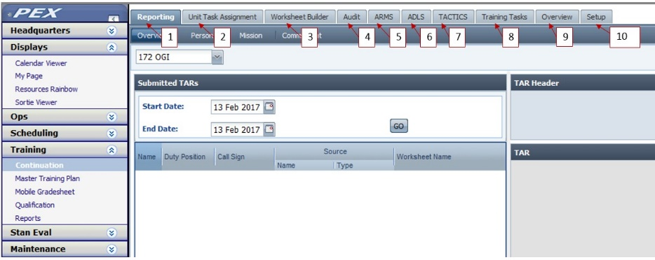

# Training

## Continuation Training

### Introduction

The Continuation Training module allows Training Managers to track personnel’s assigned continuation training requirements for an established training cycle. It is set up so that training assignments can be done via an Aviation Resource Management System \(ARMS\) training import, HQ CT file import, and/or by manually assigning PEX generated Unit-Level Training tasks to personnel.

### Permissions

New in 5.16.1 A new role of ARMS Import/Export is added, and Training Auditor/ARMS is renamed to Training Auditor.

Several permission roles can access the Continuation Training module and perform administrative functions, in addition to PEX Admin and Administrator. The pseudo-role Supervisor also has limited functions in the CT module, and any Basic User can access the module for the purpose of submitting Training Accomplishment Reports \(TARs\) via the Reporting tab:

* ARMS Import/Export is required to access the ARMS tab. This role cannot be assigned to a Joint Use account, i.e., the user must be associated to a Personnel record.

* Training Administrator can perform any function in the CT module except audit TARs and access the ARMS tab.

* Training CT Administrator can perform any function in the CT module except audit TARs, setup and use the TACTICS tab, and access the ARMS tab.

* Training Auditor \(previously Training Auditor/ARMS\) can audit TARs for both unit-level and ARMS tasks, import and export ARMS data, as well as view Training Tasks and Overview tabs. It cannot access the ARMS tab.

* Basic User can access and use the Training Tasks tab within the module, as well as submit TARs for squadron personnel via the Reporting tab.

* Supervisor is a pseudo-role which is assigned in the Personnel module. In addition to the functions of Basic Users, individuals assigned as a supervisor can also the access the CT tab of their supervisees’ training folders from which they can view subordinate’s CT status, generate daily and monthly TAR reports and view the status of tasks reported but not yet updated in PEX displays. If the unit has set up the CT module to allow it, supervisors may also audit TARs of their supervisees from within the training folder.

## Module Notes

The CT module interfaces with and uses data from the Personnel module. For ARMS tasks, the ARMS Personnel imports add/overwrite the necessary Personnel data. For unit-level tasks, both local and HQ, units must ensure the fol owing is completed:

* Quals tab – Personnel’s qualifications are set.

* Details or Personnel tab – Personnel’s Service status is set.

* Setup tab – The appropriate Qualification Status codes in the Aircrew Qualification Code table are identified as “Is Qualified.” This is necessary to support setup of “Check Assigned” function within the CT module.

## Controls

* CT setup and management procedures can be accessed by navigating from the PEX main menu to Training > Continuation.

* Supervisor procedures can be accessed by navigation from My Page – My Data – Folders – My Supervisee’s

* Basic user procedures can be accessed by navigation from My Page Workspace

{: style="height:100%;width:100%"}

1.  Reporting tab: View/Edit from an Overview of TARs and report TARs by Person, Mission and Commitment.

2.  Unit Task Assignment tab: Assign and unassign PEX Unit Tasks to Personnel.

3.  Worksheet Builder tab: Create, edit, and delete Worksheets \(TARs\).

4.  Audit tab: The Audit tab is used to approve reported training tasks. The process includes reviewing, editing, approving, printing, and/or deleting training accomplishment records

5.  ARMS tab: Set ARMS import settings, import ARMS files and export data to ARMS.

6.  ADLS tab: The ADLS tab allows you to import ADLS training data with a .CSV file downloaded from ADLS. Personnel can log ADLS training accomplished in PEX \(if desired\) and/or continue to import updated ADLS files to update ADLS task completion in PEX.

7.  TACTICS tab: TACTICS is used by the Joint Terminal Air Controller \(JTAC\) community to track training. PEX can import TACTICS training and physical data.

8.  Training Tasks tab: The Training Tasks tab provides you with a micro view of your unit’s training progression. It lists all your personnel and all their training tasks. You can use personnel and task filters to look at just the data in which you are interested. Right-clicking on any of these grids allows you to select which columns to display, print, or export to Excel.

9.  Overview tab: The overview tab provides you with a macro view of your unit’s training progression for the current cycle. The page is broken down into three sections: Proficiency, Currency, and One-Time tasks. Buttons, at top-right of each section allow you to expand any of these sections. Right-clicking on any of these grids allows you to select which columns to display, print, or export to Excel.

10.  Setup tab: The Setup Tab is used to set unit training cycle, unit preferences, modify lists, view imported ARMS tasks, import HQ unit level tasks, create local tasks, set RAP requirements, SIM/RAP rules and setup for the display of effective mission ready status.

## PEX - ARMS Interface

### Overview

New in PEX 5.16.1. PEX now includes connectivity to ARMS via Web Services. This allows users to easily exchange data between ARMS and PEX without using the process of importing data using ARMS-generated CSV files and exporting data using ODAC. This CSV/Virtual Account process remains in place, but has been updated. 

The ARMS tab is used to setup the PEX interface with ARMS to send data from ARMS to PEX, and PEX to ARMS. 

There are two interface functions. 

1.  Send validated personnel, personnel flying hours, and training data from ARMS to PEX. 

2.  Send audited training accomplishments and AFTO 781 data from PEX to ARMS. 

There are two interface methods. 

1.  CSV/Virtual Account. This is the legacy method used in previous versions of PEX. 

    1.  CSV. Export data from ARMS into a CSV file, then manually import the file into PEX. 

    2.  Virtual Account. Export the data from PEX to ARMS using a virtual account. Due to the USAF requirement for two-factor authentication, this option may sunset, or become unavailable, in the near future. If Virtual Accounts are unavailable export data using Web Services described next. 

2.  Web Services. Establish a direct connection/interface between PEX and ARMS. Once configured, the import and export are respectively accomplished by simply clicking the Begin Import and Begin Export buttons. 

Although the CSV/Virtual Account process remains essentially the same, both the interface and permission roles have been revised. Persons using the CSV/Virtual Account method should thoroughly review this topic before attempting import or export. 

The PEX CSV/Virtual Account and Web Services imports for Personnel and Training behave differently. With the CSV/Virtual Account method, Personnel and Training CSV imports are a complete download from ARMS every time. PEX “wipes” and replaces person training assignments data on every import. ARMS Web Services, on the other hand, only import Personnel and Training records which have been updated in ARMS since the Zulu date specified in the Web Service Imports dialog. For example; Personnel - Import records updated in ARMS since \(date\) Z. 

!!! note NOTE 
    ARMS Web Services returns all squadron personnel in each Training import, as ARMS refreshes daily to Military Personnel Data System \(MILPDS\) data. As a result, each Web Services Training import into PEX updates all persons' Aviation Service data in Personnel and Z-004 ASC Term Date. 

Users using the Web Services method must configure the CSV/Virtual Account method as well. The CSV/Virtual Account method is used: 

* When a squadron is starting to use PEX for the first time. 

* For the first training import at the start of each training cycle. 

* For the first training import after migration to 5.16.1. 

### Permissions 

* ARMS Import/Export is a new permission role. This role allows access to the Continuation Training > ARMS tab and the Import, Export, and Setup buttons. Therefore, this applies to both CSV/Virtual Account method and new Web Services method 

* Training Auditor is the renamed Auditor/ARMS role. Functionality remains unchanged. 
    
!!! NOTE
    Both ARMS Import/Export and Training Auditor roles are required in order to export or import ARMS data. For security reasons, the Administrator role alone does not give the ability to import or export ARMS data. 

{: style="height:100%;width:100%"}

### Rules 

* Users using only the CSV/Virtual Account method can disregard the Web Services specific information. 

* Users can choose an override method when actually importing and exporting \(from the Begin Import and Begin Export buttons\). It is recommended users choose the default method they will routinely use, then override as required. 

* Users using either the CSV/Virtual Account or Web Services method must have both ARMS Import/Export and Training Auditor permissions as described above. 

* In 5.16.1 migration, PEX automatically sets squadron methods to CSV Imports and ODAC Exports. 

* Persons' Personnel > Qual data is not inserted or updated via Web Services. 

### Controls 

Access these procedures by navigating to Training > Continuation > ARMS tab. 

### Workspace  

{: style="height:100%;width:100%"}

1.  Set Squadron and enter ARMS 17-character unit identifier for Training imports/exports and the ARMS 9-character unit identifier for 781 Exports/Personnel Flying Hours imports. 

2.  Select the Default Interface Method for the selected squadron; Web Services or CSV/Virtual Accounts. If using Web Services, if the PEX Service Host server certificate Thumbprint is not already entered, contact your PEX Server Administrator to obtain it and enter it here. 

3.  Enter the selected squadron's 781 data. 

4.  Select Z events you do not want to include in the import. 

5.  Select fields you do not want to overwrite on the import. 

    {: style="height:100%;width:100%"}

6.  Select which Squadrons' data to import. The squadron's default method is shown to the right, \[CSV\] or \[Web\] 

7.  Select the Data Types to import. 

8.  Select the import method for the squadrons selected in item 6. 

    * Each Squadron's default settings as selected in Settings, item 2. 

    * Override the default settings and use Web Services for all  selected squadrons. 

    * Override the default settings and use CSV files for all  selected squadrons. 

9.  View log files created after each import. 

    {: style="height:100%;width:100%"}

10.  Select which Squadrons' data to export. The selected method is shown to the right, \[Virt\] or \[Web\] 

11.  Select the Data Types to export. 

12.  Select the export method for the squadrons selected in item 10. 

    *  Each Squadron's default settings as selected in Settings, item 2. 

    *  Override the default settings and use Web Services for all  selected squadrons. 

    *  Override the default settings and use Virtual Accounts for all  selected squadrons. 

13.  View log files created after each import. 

### Setup

Web Services Network Setup Interface 

Web services utilizes Machine-to-Machine \(M2M\) Authentication, which requires certificate information in the form of a Thumbprint for the PEX Service Host \(PSH\) server. The ARMS Program Management Office requires certificate information in the form of a Thumbprint for each PSH server. Here, the term "PSH Admin" refers to the local person or persons who administer the PEX Service Host. Typically, this is the local PEX Administrator in conjunction with the local communications squadron. 

1.  The PSH Admin: 

    1.  Coordinates with the PEX Help Desk to send them: 

        1. Required server certificate information. 

        2. HARM codes associated with that certificate. 

    2.  Works with one HARM office from each PEX database and provides the HARM office with a certificate Thumbprint specific to their PSH. 

2.  The designated HARM office for the PEX database: 

    1.  Enters the certificate Thumbprint in the Continuation Training > ARMS tab > Settings page. The Thumbprint has to be entered only once for the database. The Thumbprint is then visible to, and used by, every squadron in the database. 

!!! CAUTION
     This value is used by all squadrons in the database. Changes should be made with care as they affect all units in the database. 

### Import from ARMS to PEX 

!!! NOTE
    A CSV Training import is required for initial use, even if you plan to use Web Services on a daily basis. 

Adhoc View/Reports will be in Jaspersoft and accessible to all ARMS users worldwide. Users will access these reports to generate the three.csv files: Personnel, Training, and 7-30-60-90 Personnel Flight Hours. Users must schedule the reports in ARMS. 

Go to Training > Continuation > ARMS tab > Settings button. Select a squadron from the Squadron 

& ARMS Unit Identifiers dropdown. 

#### Associate PEX Squadrons to ARMS Unit Identifiers 

1.  Add \(type or paste\) the 17-character ARMS Unit Identifier \(e.g., 0203ARSSQ00000000\) and click Add. This identifier can be found on the Personnel.CSV file in cell A2. 

2.  Add \(type or paste\) the 9-character ARMS Unit Identifier \(e.g., 0203ARSSQ\) and click Add. This identifier can be found on the 7/30/60/90.CSV file. 

3.  To disassociate an ARMS unit, select the unit identifier and click Remove. 

#### Enter ARMS Data 

!!! Note
    These can be found on existing AFTO 781s. 

1.  Add your HARM Code. 

2.  Add your 4-Char Flying Org Unit ID. 

3.  Add your Issuing Unit. 

4.  Click Save. 

!!! Note
    Do not include on Training Import 

PEX generates training tasks for four ARMS requirements which are not tracked by ARMS as training events: Z-001 Physical Exam, Z-002 Altitude Chamber, Z-003 Records Review, and Z-004 ASC Termination Date. If your unit does not use one or more of these \(for example, an ICBM unit that does not require periodic Altitude Chamber training\), check the item’s box to exclude PEX from generating it during the ARMS import and click Save. 

!!! Note
    Do Not Overwrite on Personnel Import 

If your unit does not want certain Personnel fields overwritten on the Personnel import \(for example, a unit uses slightly different rank entries in the PEX Personnel module than are used in ARMS, such as LtCol vs LTC\), check the item’s box to prevent overwriting during imports and click Save. 

When selecting Web Services \(the next step\), the AircrewQualCode, CP, and MAJCOM Qual 3, 4 and 5 items are disabled as these data are not provided via ARMS Web Services. 

#### Select your default Interface Method 

1.  CSV/Virtual Account. 

    1.  Select the Import using CSV and Export using Virtual Accounts radio button. 

2.  Web Services. 

    1.  Select the Web Services radio button. 

    2.  If a Thumbprint is not present, click the Edit Thumbprint button and enter one. 

    3.  If a Thumbprint is present but incorrect, click Edit Thumbprint and enter a new one. If you do not have a Thumbprint, see the Web Services Network Setup Interface paragraph at the beginning of this topic. 

#### Setup the Virtual Account export from PEX to ARMS 

To transfer data from PEX to ARMS, users must have the following setup. 

* A virtual account for ARMS. 

* ODAC downloaded and installed on the machine. 

* Firewall Exemption Letter. Allow network traffic from the machine \(origination\) being used for ARMS export and the destination IP address of the ARMS database. The exchange occurs via bi-directional mode through Port 1521. The instructions for this is not included in this document. You wil need to contact your network administrator to make this happen. 

* PEX Installed. 

* User must know how to report and audit training and 781 hours in PEX, then export the data to ARMS. 

Virtual Account for ARMS 

1.  In order to export data from PEX to ARMS, the ARMS User must have an ARMS Virtual Account User Name and Password. This is not the same as the ARMS account used to connect to ARMS. An ARMS Administrator can create these accounts in ARMS at System > Security > ARMS External Accounts. 

2.  The virtual account is set to “T” for True. A User ID is created along with a Password. The IRA Number used is 11. 

3.  In PEX, the same account user name and password from Step 2 above is what you wil enter in: Training > Continuation > ARMS tab > Export > Virtual Account User Name and Password. 

Download ODAC 

1.  ODAC needs to be installed at the following locations:

    1.  SQL Server \(Required\) hosting PEX. 

    2.  Webserver \(Required\) hosting ePEX. 

    2.  WinPEX \(Optional\). If you install WinPEX on a client machine, and you plan on exporting ARMS data, then ODAC must also be installed on the client machine. 

2.  Download the ODAC software. 

    1.  Go to http://www.oracle.com 

    2.  Create a username & password at the site. all ow about 5 minutes to receive an account. Once you have the account, download the file at this location:  http://www.oracle.com/technetwork/topics/dotnet/utilsoft-086879.html 

    3.  Accept the Oracle Developer Tools for Visual Studio .NET Development License Agreement. 

    4.  Under ODAC 12c Release 4 and Oracle Developer Tools for Visual Studio \(12.1.0.2.4\), Download the ODTwithODAC121024.zip file 

Install ODAC 

!!! tip
    Install ation is the same on the SQL Server hosting PEX Service Host, WebServer, and WinPEX. 

1.  Go to the computer's C:\\ drive. 

2.  Create an Oracle folder, then create an ODAC\_PEX folder. 

3.  Unzip the ODAC file on the computer Desktop. 

4.  Open folder and double click setup.exe. 

5.  The Oracle Universal Installer will run in a MS DOS window. 

6.  Wait a few seconds. 

!!! NOTE
     Some installations are blocked based on user permissions to a given machine. The only indication is that nothing happens after clicking setup.exe. If so, Search for Advanced System settings > Advanced Tab > Environment Variables > Click on TEMP variable to highlight -> Edit 

    1. Capture the existing Variable value for TEMP. You will need this later. 
    2. EDIT and change just the TEMP Value to C:\\TEMP1. 

    After installation is complete, reset to the original TEMP value, or as appropriate. 

7.  In Product Languages, select English, then click Next. 

8.  In Oracle Home User Selection, select Use Windows Built-In Account, then click Next. 

9.  In Specify Instal ation Location, browse to Location: ODAC\_PEX, select File Name C:\\Oracle\\ODAC\_PEX, then click Select. 

10.  Leave the Software Location as is. Ensure you see: 

    1.  Oracle base: C:\\Oracle\\ODAC\_PEX 

    2.  Software location: C:\\Oracle\\ODAC\_PEX\\product\\12.1.0\\client\_1. 

    3.  Then select Next. 

11.  In Available Product Components, uncheck everything except for Oracle Data Provider for .NET, then select Next. 

12.  In ODP.NET \(Oracle Data Provider for .NET\), check/verify the Configure ODP.NET box is checked, then select Next. 

13.  In DB Connection Configuration: 

    1.  Enter the Connection Alias: *ARMS DB Alias Name*. 

    2.  Leave Port Number as *1521* 

    3.  Enter the Database Host Name: *ARMS DB IP Address*. 

    4.  Enter the Database Service Name: *ARMS Service Name*. 

    5.  Then select Next. 

14.  In Perform Prerequisite Checks, wait for the checks to run. When complete, you wil see Summary. 

15.  In Summary, select Install. 

16.  In Instal Product, wait for the installation to run. When complete, you will see Finish. 

17.  In Finish, the window displays where the tnsnames.ora file was placed. Click Close. 

18.  On the computer, navigate to C:\\Oracle\\ODAC\_PEX folder and verify these two folders exist; checkpoints and product. 

19.  Open the product folder. 

20.  Within the product folder, open the 12.1.0 folder. 

21.  Within the 12.1.0 folder, open the client\_1 folder. 

22.  Within the client\_1 folder, open the Network folder. 

23.  Within the Network folder, open the Admin folder. 

24.  Verify there is a tnsnames.ora file. 

25.  Close out of the folder. 

26.  Verify rights on the machine. 

    1.  Right-click on C:\\Oracle\\ODAC\_PEX\\product\\12.10\\client\_\# folder and select Properties. 

    2.  From the Properties menu select the Security tab. 

    3.  Click Continue from the Security tab. 

    4.  Click yes on user account control. 

    5.  From the permission tab for client\_\# window click the Add button. 

    6.  Type Authenticated Users in the Object Names box, and click Ok G.  From the permissions for client\_\# folder ensure that Authenticated Users has the following permissions: Read & execute, List folder contents, and Read in the allow column and nothing else. 

    7.  Click Ok on the client\_\# permissions window. 

    8.  Click Ok on the client\_\# properties window. 

27.  Restart the machine. If on the: 

    1.  SQL Server Hosting PEX and ODAC is installed, restart PEX Service Host 
    2.  Webserver hosting ePEX and ODAC is installed, reset IIS. 
    3.  WinPEX client machine and ODAC is installed, restart the computer. 

28.  ODAC Installation successful. 

29.  User can proceed to export ARMS data from PEX to ARMS via ePEX and/or WinPEX, provided a firewall exemption is provided allowing network traffic from machine to destination ARMS database. 

!!! NOTE
    Remember to return to Search for Advanced System settings > Advanced Tab > Environment Variables > Click on TEMP variable to highlight -> Edit -> restore the variable value to its ORIGINAL state. 

Uninstall ODAC 

1.  Select All Apps, find Oracle – OraClient12Home, then select Universal Installer, or do a search and enter Universal Installer. Double-click the application. 

2.  In the Welcome screen, select Deinstal Products. 

3.  Check all Oracle products, and then select Remove. 

4.  At the Confirmation dialogue, select Yes. 

5.  At the Warning dialogue, select Yes. 

6.  A Remove dialogue displays, showing users the deinstallation progress. 

7.  Once done, you should get an Inventory screen. Select Close. 

8.  At the Welcome window, select the X to close the window. 

9.  At the Exit dialogue, select Yes. 

10.  Navigate to C:\\Oracle\\ODAC\_PEX. 

11.  Delete the checkpoints and product folders. 

12.  ODAC is uninstalled. 

#### Import ARMS data to PEX 

If using the CSV/Virtual Account method, first export the data from ARMS as an Excel worksheet \(XLS\), and then save it as a CSV file to an accessible location on a computer or network. 

1.  Go to Training > Continuation > ARMS tab > Import button. 

2.  Under Squadrons \[Default Setting\], select the squadron\(s\) whose data is to be imported. Each squadron displays, in brackets, the default method selected in the ARMS tab > Settings. You can override these below. 

3.  Under Data Types, select the type of data \(All, Personnel, Training, and/or Personnel Flying Hours\) to import. 

4.  Under Import Selected Squadrons Using, select: 

    1.  Each Squadron's default settings. This will import via CSV file or Web Services as selected above. 

    2.  Web services for all . This will import via Web Services regardless of the Default Setting above. 

    3.  CSV files for all. This will import via CSV files regardless of the Default Setting above. 

5.  Click Begin Import. 

    1.  For squadrons importing via Web Services, the Web Service Imports window will open. 

        1. Web Service imports require the Zulu Dates of the last successful imports of Personnel and Training records. 

            * ARMS Web Services only import Personnel and Training records which have been changed in ARMS since the Zulu date specified in the Web Service Imports dialog. 

            * Blank dates indicate the squadron has not yet completed a Web Services import for that data type \(Personnel or Training\). To ensure a squadron's first web service import includes all records changed in ARMS since the squadron's last CSV import, refer to the log file for the squadron's last successful CSV import for each data type. At the top of each log file locate the "Data Downloaded from ARMS" date. This is the date/time of the last ARMS import. 

            * If the last import was completed in PEX v5.16.1 or later, the date/time is in Zulu. You can enter that date as it is. 

            * If the last import was completed in PEX v5.16.0 or earlier, the date/time is in Local time. You must first convert that Local date/time to Zulu date/time, then enter the converted Zulu Date. 

            * Once Personnel or Training updates have been imported via ARMS Web Services, these fields default to the Zulu date of the squadron's last successful Web Services import for that data type. You may change it to a date before the default but NOT after. 

            * Because ARMS gets a MILPDS update daily, Personnel records are updated in ARMS daily. Therefore all Personnel records will import with every Web Services Personnel and Training import. 

    2.  For squadrons importing via CSV files, the CSV Imports window will open. 

        1. For each squadron, browse to the CSV file location and select the file. 

        2. Click Import. 

6.  View the import Log Files: 

    1.  Select a Start Date and End Date. 

    2.  Click Go. 

    3.  Click on the file name and a window will open with the log file details. 

    4.  To view a list of old log files, select a Start Date and End Date and click Go. 

    5.  The log lists: 

        1. The Zulu date/time of the last ARMS data update, of the data imported into PEX 
        
        2. The Zulu date/time the import was initiated, and by whom. 

        3. A list of all persons whose data was imported. Each person listed will show the number of training events inserted/updated, the number of training events not inserted/updated and the training events not inserted/updated. If nothing is listed under a person, all training for that person imported successfully. 

        4. A list of any errors. 

NOTES: 

* ARMS Web Services does not provide the data necessary to determine the training event type \(OTO, etc\). For that reason PEX cannot guarantee the accuracy of the training events created during the import. For each inserted training event, the training event type can be verified in Continuation Training. 

* You can import data from multiple ARMS units \(for example from a student squadron\) into a single PEX squadron. 

* The import phase of the scheduled activity does not initiate until after the entire export has been received and acknowledged by ARMS, as the unit SARMs need to know that everything they sent from PEX was received and processed by ARMS before PEX begins taking an export from ARMS. This ensures that PEX and ARMS data for each person is always in synch/agreement. It's okay if the export is rejected or failed for a particular person, as the SARM gets a report in the PEX log listing which persons' exports failed. This allows the SARM to know why PEX shows one thing but ARMS shows another for an individual person. 

### Workflow 

{: style="height:100%;width:100%"}

### ARMS Personnel data sent to PEX 

The following table lists the data sent from ARMS to PEX by both CSV/Virtual Account and Web Services methods. 

\*Not used in PEX 

| CSV File Column | Field | CSV/Virtual Account | Web Services |
|-|-|-|-|
| B | Name, Last | X | X |
| C | Name, First | X | X |
| D | Name, M.I. | X | X |
| E | Flight | X | X |
| F | DoB | X | X |
| H | Pri Qual, CP | X | X |
| I | Pri Qual, MAJCOM 3 | X |  |
| J | Pri Qual, MAJCOM 4 | X |  |
| K | Pri Qual, MAJCOM 5 | X |  |
| L | Dt Arrived | X | X |
| M | Rank | X | X |
| N | SSN | X | X |
| O | Office Symbol | X | X |
| P | AFSC | X | X |
| Q | AFSC Suffix | X | X |
| R | PAFSC* | X | X |
| S | Gender | X | X |
| T | Proj'd Depart Dt | X | X |
| U | Date of Separation | X | X |
| V | Term Date* | X |  |
| W | PAS Code* | X |  |
| X | FSC* | X |  |
| Y | PAC* | X |  |
| Z | WX Category | X |  |
| AA | Last Browser Update | X |  |

### Export PEX data to ARMS 

With ODAC setup on your PEX servers and training/AFTO 781 data ready to export, you are ready to send the data to ARMS. For more, see: ODAC Setup.  

!!! NOTE
    * If you do not already have an ARMS virtual account, navigate to ARMS > Modules > System > Security > ARMS External Accounts, and create your ARMS Virtual Account \(Do not use the % sign in your password\). 

    * PEX uses IRA 11. 

1.  Go to Training > Continuation > ARMS tab > Export button. 

2.  Under Squadrons \[Default Setting\], select the squadron\(s\) whose data is to be exported. Each squadron displays, in brackets, the default method selected in the ARMS tab > Settings. You can override these below. 

3.  Under Data Types, select the type of data \(All, Training, and/or 781\) to export. 

4.  Under Information 

    1.  Read the Message box. It wil tell you whether there is any data ready to export. If there is data ready, then proceed. 

    2.  Select the ARMS Database. 

    3.  Enter the Virtual Account User Name and Password. 

    4.  View the Last Training Export Date and Last 781 Export Date. 

5.  Under Export Using, select: 

    1.  Each Squadron's default. This will export via ODAC or Web Services as selected above. 

    2.  Web services for all. This will export via Web Services regardless of the Default Setting above. 

    3.  Virtual Account for all. This will export via ODAC regardless of the Default Setting above. 

6.  Click Begin Export. 

7.  all approved records since the last export are then sent electronically to the ARMS database. 

8.  Once the export is complete, a log file is generated and listed in the Log File grid. 

9.  View the export Log Files: 

    1.  Select a Start Date and End Date. 

    2.  Click Go. 

    3.  Click on the file name and a window will open with the log file details. 

    4.  To view a list of old log files, select a Start Date and End Date and click Go. 

Workflow 

{: style="height:100%;width:100%"}

PEX Training data sent to ARMS 

|Field|CSV/Virtual Account|Web Services|
|-|-|-|
|Person ID (SSN)|x|x|
|ARMS Program Code|x|x|
|Task Code|x|x|
|Accomp Date|x|x|
|Scheduled Volume|x|x|
|Approved Volume|x|x|
|Accomp Method|x|x|
|Loss Reason|x|x|
|Grade Score|x|x|
|No. Weapon Attempts|x|x|
|No. Weapon Hits|x|x| 

## Setup CT 

### Configure RAP  

Your personnel have an Assigned Mission Ready Status, for example CMR \(Combat Mission Ready\) or BMC \(Basic Mission Capable\). Based on their flight, simulator, and training task accomplishments, PEX will calculate an Effective Mission Ready Status. For example, a person’s assigned status may be CMR but due to a low sortie count, the effective status could be BMC. Once setup, the Effective Mission Ready Status is viewable on the Letter of X and the Go/No-Go pages in PEX. 

For each person using Ready Aircrew Program \(RAP\), first go to the Personnel module and set their mission ready status to CMR or BMC, and their experience indicator to E or I. 

#### RAP Requirements 

1.  Navigate to Training > Continuation > Setup tab > RAP Requirements. 

2.  Select a squadron. 

3.  Select: 

    1.  ARMS to base your RAP calculation on ARMS RAP task identifiers. 

    2.  Unit Level to base your RAP calculation on Unit Level RAP task identifiers. Using Unit Level RAP will have no effect on RAP probation or Mission Readiness Status if your squadron has enabled Sortie RAP for MRS calculations. 

    3.  Neither to not preform RAP calculations. 

4.  Select a data line by CP/MDS/Service Status. 

5.  Enter your Task code \(e.g., TOT RAP SRTY, SR001\). 

    1.  ARMS: In the Task ID field, enter the Task ID as free-text. 

    2.  Unit Level: In the Unit Tasks field, click Choose, and select the appropriate task from the dropdown, and OK. 

6.  From your RAP Tasking Message \(RTM\), enter your look back numbers for Total RAP, 3-Month, and 1-Month Look Back for that specific CP/MDS/Service Status combination for each of the BMC/CMR Experienced/Inexperienced categories. 

7.  If the same RAP numbers apply to another CP/MDS/Service combination, copy it over: 
    1.  Select the data line with CP/MDS/Service Status you want to copy. 

    2.  Right-click and select Copy RAP Requirements or Unit Level Requirements. 

    3.  When the dialog opens, select the CP/MDS/Service you want to copy to by checking the left-hand box. 

    4.  Click OK. 

#### SIM RAP/MSN Rdy 

Setup Simulator \(SIM\) RAP 

1.  Select a squadron, MDS, crew position, service, and mission ready status. 

2.  Click Load. 

3.  Under the SIM Rules header, click the Select Task button to open the Select Task dialog. 

4.  Type in or scrol to the task you use for SIM RAP and select it. 

5.  Click OK. This will close the dialog and display the selected task to the left of the select task button. You’l also receive a message stating the same task wil be used for the other mission ready statuses for this squadron, MDS, crew position, service status combination. 

6.  SIM Required wil be selected by default. If SIMs are optional and could be used to count toward your Flight RAP, select SIM Optional, skip step 8, and continue at step 9. If SIMs are required, enter the total SIMs per training cycle, 3-Month Look back \(SIMs\) and 1-Month Look back \(SIMs\) per your RTM. 

Required SIMs 

Under the required SIM RAP requirement numbers, there are five possible rules that may apply to your unit. If a rule applies, check the box to the left of the rule and enter the value for that rule. If you select the TDY Proration rule, you wil enter the personnel TDY days on the RAP O&M TDY page \(described below\). An explanation of each rule fol ows: 

* Max number of excess RAP flights counted as SIMs for 1-month requirement. Enter the maximum number of excess RAP flights that can substitute for a RAP SIM, for the 1-month requirement. 
    For example, a person has a one-month flight RAP requirement of 9 and a one-month SIM RAP requirement of 3. The rule is checked and a value of 1 flight has been entered. The person has accomplished 12 RAP flights and 1 RAP SIM. This person would not have met their one month SIM RAP requirements since only 1 actual RAP SIM was accomplished and only 1 of the excess 3 RAP flights could be counted as a SIM. 

* Max number of excess RAP flights counted as SIMs for 3-month look back. Enter the maximum number of excess RAP flights that can substitute for a RAP SIM, for 3-month look back. 
    For example, a person has the following flight/SIM RAP requirements: one-month flight 9, three-month flight 27, one-month SIM 3, and three-month SIM 9. The rule is checked and a value of 4 is entered. The person has 12 flights one month and 30 for 3 months. The person has 2 SIMs for one month and 7 SIMs for three months. In this case, the person did not meet one-month SIM RAP requirements, but did make the three-month requirement because two excess RAP counting flights could be substituted for the 2 RAP SIMs the person was short for three month SIM look back. 

* Max number of excess RAP SIMs that can be counted as flights for 1 month look back. Enter the maximum number of excess RAP SIMs that can substitute for a RAP flight, for the 1-month requirement. 

* Max number of excess RAP SIMs that can be counted as flights for 3 month look back. Enter the maximum number of excess RAP SIMs that can substitute for a RAP flight, for 3-month look back. 

* Minimum actual SIMs required per month. The entered value indicates the number of actual RAP SIMs that must be accomplished in a month to retain status. If this rule is used in conjunction with either of the rules above or the TDY Proration rule below, it takes precedence. 
    For example, the one-month rule and this rule have been selected with values of 3 and 1 respectively. The SIM RAP 1 month requirement is 3. The person has 3 excess RAP flights, but no RAP SIMs. This person would not make RAP requirements because they didn’t get at least 1 actual RAP SIM, even though they had enough excess RAP flights to otherwise meet the requirements for 1 month. 

* TDY Proration. For each month: \#X O&M days TDY reduces the SIM requirement by \#X for that month. This rule allows you to prorate RAP SIMs for O&M days spent TDY. Proration can be down to 0, but the previous rule stil takes precedence, so even if you prorate to 0, if you have a requirement to have at least 1 in a month and the person does not get it, they don’t meet the RAP requirement. The O&M TDY days are entered for each individual on the RAP O&M TDY page and are entered by month. For example, the rule is selected and the values indicate 3 O&M TDY days reduce the SIM requirement by 1 for the month. SIM RAP requirement for the month is 3. The person had 5 days of O&M TDY. The person also accomplished 1 RAP SIM. This person would not make their one-month requirement since the rule would credit them only 1 SIM. If the person had 6 O&M TDY days, they would have made their one-month requirement since the rule would credit 2 RAP SIMs. 

* Min number of SIMs required in one month to regain Msn Rdy Status. This rule is based on the person being in a non-mission ready status and needs to accomplish a set number of actual RAP SIMs to regain status, in addition to the look back numbers. This rule takes precedence over the one and three-month rules. 
    For example, the rule is selected with a value of 2 entered. The one-month requirement is 3 RAP SIMs and 9 RAP flights. The person was non-mission ready. The one month rule is selected with a value of 2 entered. The person has accomplished 12 RAP flights and 1 RAP SIM. The person is still non-mission ready. Even though they met their flight RAP numbers and the first rule all ows them to meet their SIM RAP numbers, the person didn’t get the two actual RAP SIMs that were required to regain status. 

!!! Note
    Whenever you change these optional check boxes, click save to ensure your PEX is updated.

Optional SIMs 

Under the optional SIM RAP requirement numbers, there are two possible rules that may apply to your unit. If a rule applies, check the box to the left of the rule and enter the value for that rule. An explanation of each rule follows: 

1.  Max number of SIMs per training cycle that can be counted as RAP Flight look back. This could be read as “How many of the first RAP SIMs in the training cycle can count towards using the rule below - counting RAP SIMs for flights by month.” In other words, once the person accomplishes this many RAP SIMs, no matter when in the training cycle, subsequent RAP SIMs can no longer count towards flights. 

    For example, this training cycle rule is checked with a value of 8. The monthly rule below is also checked with a value of RAP flight requirements are 9 flights per month and 27 flights for three-month look back. 

    First Month – The person gets 9 RAP flights and 2 RAP SIMs. The person makes RAP with their flights alone. However, two RAP SIMs are added to his count of 8 maximum, even though they weren’t required to make RAP. 

    Second Month - The person gets 7 RAP flights and 2 RAP SIMs. The person made RAP based on the combination of RAP flights and RAP SIMs. Whether they were used to make RAP or not, two more RAP SIMs are added to his count of 8 maximum. He is up to 4 of the 8. 

    Third Month - The person gets 6 RAP flights and 3 RAP SIMs. The person did not make RAP. 

    Even though they had a combination that equaled 9, because only 2 of the 3 RAP SIMs count using the rule below. Whether they were used to make RAP or not, three more RAP SIMs are added to his count of 8 maximum. He is up to 7 of the 8. 

    Fourth Month - The person gets 7 RAP flights and 2 RAP SIMs. As soon as he did the first RAP 

    SIM this month, that hits the 8 maximum. The person did not make RAP. Even though the rule below says two SIMs could be used monthly, the training cycle rule takes precedence and only 1 SIM could count. 

    Subsequent Months – No more RAP SIMs could count towards the monthly requirement because the person already hit the 8 maximum. 

    The worst case scenario is the person accomplishing all 8 RAP SIMs the first month of the training cycle and not using any towards RAP flights. Since the maximum of 8 were accomplished, no subsequent RAP SIMs in the entire training cycle could be used to count towards meeting future monthly RAP flight requirements. 

2.  Max number of SIMs per month that can be counted as RAP Flight look back. Enter the maximum number of RAP SIMs per month that can be counted toward flight RAP. 

    For example, the rule is selected with a value of 2 entered. Person is required 9 flights for one-month RAP requirement. The person accomplished 7 RAP flights and 3 RAP SIMs. The person would make their one-month flight RAP requirement because 2 of the SIMs would count toward the 2 flights the person was short. 

!!! Note
    Whenever you change these optional check boxes, click save to ensure your PEX is updated.

Setup Display Effective MSN Ready Status 

Once setup, the effective MSN ready status is calculated in the background. It can then be viewed in the LoX module, on the Go No-Go board, and in the DRRS report. 

1.  Select a squadron, MDS, crew position, service status, and mission ready status. 

2.  Click Load. 

3.  In the Effective Mission Ready Status Tasks section, click the Select button to open the Add Effective Msn Rdy Task\(s\) dialog. 

4.  Type in or scrol to the task you want to affect your Effective Mission Ready Status and check the box to the left of the task\(s\). 

5.  Click OK. 

6.  Click Save at the top of the page. 

Copy Display Effective MSN Ready Status Rules to other MDS/CP Combinations Once setup, the effective MSN ready status is calculated in the background. It can then be viewed in the LoX module, on the Go No-Go board, and in the DRRS report. 

1.  Select the squadron, MDS, crew position, service status, and mission ready status that contains the rules and tasks you want to copy. 

2.  Click Load. 

3.  Click the Copy to button above the SIM Rules header. This launches the Copy SIM RAP/Msn Rdy dialog. 

4.  Use the checkbox selections under Filter Combinations to generate the list of potential targets in the Advanced-Copy To section. 

5.  All filter selections will be checked by default as a target. If you don’t want one to be a target, uncheck the box. 

6.  Click OK to copy the data to the target combinations. 

7.  Click OK to close the informational message. 

#### RAP O&M TDY 

1.  Select the squadron from the squadron drop down menu. 

2.  Click Load. 

3.  Click in the applicable month field for the person for whom you want to enter TDY days. 

4.  Enter the number of TDY days. 

5.  Click Save. 

#### MRS Calc Options 

Identify what type of tasks are included in your squadron\(s\) Mission Ready Status \(MRS\) calculations \(Sortie RAP, SIM RAP, and/or Currency Tasks\). 

1.  Check the box\(s\) for the type of tasks to be included in your squadron\(s\) MRS calculations. 

2.  Click off the row to save. 

3.  With changes made here, Effective Msn Rdy Status in LoX and Go/NoGo wil show Calculating. 

#### Guest Personnel in your Database 

Follow these steps when a guest shows up to work with your unit and you want their ARMS data to show up in your PEX database and/or you want to export their training data to ARMS. These steps do not apply for transferring AFTO 781 data. 

!!! NOTE Obtain an ARMS External Account in order to access each ARMS database that stores data for a guest flier. 

1.  Log into PEX as an administrator. 

2.  Go to Setup > Squadrons and add a “Guest Flier” squadron. Log out of PEX and log back in for changes to take effect. 

3.  Go to CT > Setup > Unit Cycle. In the Guest Flier squadron, create a Current training cycle to match your ARMS cycle. 

4.  Go to CT > ARMS > Settings. In the Guest Flier squadron, associate the ARMS 9- and 17-character unit IDs with the Guest Flier squadron. The 9-character unit ID can be found in the flying hours .CSV file. The 17-character ID in the personnel .CSV file. Repeat this step for each different unit. 

5.  Go to CT > ARMS > Import, select the Guest Flier squadron. Select to import Personnel, Training, and Flying Hours. Click the Import button. 

6.  Go to Setup > Users & Permissions, and create a permissions template with just the Basic User role to the Guest Flier squadron. Create PEX user accounts for your guest fliers, associating them to their Shortnames in the Guest Flier squadron, and assigning them the Basic User template. Associate their account to their CAC so they can login to PEX. 

7.  Go to CT > Worksheet Builder and create TAR worksheets for the guest fliers. 

## ARMS- Configure your PEX-ARMS Interface 

The ARMS tab is used to setup the PEX interface with ARMS, import ARMS tasks and export ARMS tasks. 

ARMS 6.2 delivered a Jaspersoft reports interface. There are two interface functions that PEX - ARMs customers perform in PEX. Specifically: 

1. Import data from ARMS to PEX 

    PEX no longer provides the Oracle Discover \(.dis\) files required to create the three .csv files. Instead, we wil generate Jaspersoft Ad Hoc Views/Reports. These Ad Hoc Views/Reports take the place of the .dis files. These Adhoc View/Reports will be in Jaspersoft and accessible to all ARMS users worldwide. Users will access these reports to generate the three.csv files: Personnel, Training, and 7-30-60-90 Personnel Flight Hours. Users must schedule the reports in ARMS. 

2. Export data from PEX to ARMS 

    There is no change. Users still need to install the ODAC \(Oracle Data Access Components\) in order to push data out of PEX to ARMS. 

Settings 

1.  Associate PEX Squadrons to ARMS Unit Identifiers 

    1.  Select a squadron. 

    2.  In the Add ARMS unit to import into selected PEX squadron text box: 

        1.  Type in \(or paste\) the 17-character ARMS Unit Identifier \(looks like: 0203ARSSQ00000000\) and click Add. This identifier can be found on the Personnel.CSV file in cell A2. 

        2.  Type in \(or paste\) the 9-character ARMS Unit Identifier \(looks like: 0203ARSSQ\) and click Add. This identifier can be found on the 7/30/60/90.CSV file. 

    !!! NOTE 
        * You can import data from multiple ARMS units \(for example from a student squadron\) into a single PEX squadron. 

        * To disassociate an ARMS unit, select the unit and click Remove. 

2.  Enter AFTO 781 Data 

    1.  Select a squadron 

    2.  In the 781 Data > HARM Code text box, type in your HARM Code \(can be found on existing AFTO 781s\). 

    3.  Fill out the remaining three text boxes with 781 Data \(these can also be found on existing 781s\). 

    4.  Click Save. 

3.  Exclude PEX-generated training tasks during ARMS Imports

    PEX generates training tasks for four ARMS training requirements that aren’t tracked by ARMS as training events: Physical Exam, Altitude Chamber, Records Review, and ASC Termination Date. If your unit does not use one or more of these \(for example, an ICBM unit that does not require periodic Altitude Chamber training\), check the box by that item\(s\) to exclude PEX from generating it during the ARMS import and click Save. 

4. .CSV File Locations \(WinPEX only\) 

    Browse to the path where the .CSV file and click save. 

Import 

1.  Select the squadron\(s\). 

2.  Select the type of data \(Personnel, Training, and/or 7/30/60/90 Flying Hours\) to import. 

3.  Click Import. 

4.  To view the import log files: 

    1.  Select a Start Date and End Date. 

    2.  Click Go. 

    3.  Click on the file name and a window will open with the log file details. 

#### ARMS Export – ODAC Setup 

Before you can export data in PEX to ARMS \(an Oracle database\), you must install Oracle Data Access Components \(ODAC\) on the SQL Server computer \(where the PEX Service Host \(PSH\) resides\) and on the web server hosting the ePEX application. 

1.  Download ODAC at: http://www.oracle.com/technetwork/database/windows/downloads/utilsoft-087491.html. 

    1.  You will be asked for a username and password at the site. Please create them and allow about five minutes to receive an account. 

    2.  Download the “UNIVERSAL” ODAC112012.zip 270 MB and not the “XCopy”. 

2.  Download tnsnames file: https://support.pexmain.com/, go to the Downloads page, and download the tnsnames.ora file. 

3.  Install ODAC & tnsnames file on SQL Server \(PSH\). 

    !!! NOTE
        Requires local administrator to install. 

    1.  Create a folder on the C:\\ directory called “Oracle” if one doesn’t exist.

        1. Open the folder and create a folder called “ODAC\_PEX”. 

        2. Place the zipped ODAC download in this directory. 

    2.  Unzip the files and double click “setup.exe” application. 

    3.  The Oracle Universal Installer will now begin to run. It will start in a command window pictured below, and then bring up a Windows installation dialog. It can take as long as five minutes before the Windows dialog will appear, so be patient and wait for it to open. 

    4.  The initial Oracle Universal Installer Welcome dialog. Click ‘Next’ button. 

    5.  When presented with the Select Product to Instal dialog, select ‘Oracle Data Access Components for Oracle Client 11.2.0.1.2’, then select Next button. 

    6.  In Oracle Base, browse to and select C:\\Oracle\\ODAC\_PEX, leave the Software Location Name and Path as is, then select Next. 

    7.  Select the fol owing two checkboxes ‘Oracle Data Provider for .NET 11.2.0.1’ and ‘Oracle Instant Client 11.2.0.1’. Make sure all other boxes are NOT checked. Then select Next. 

    8.  Review the Summary dialog. Click the ‘Install’ button. 

    9.  The client components will now be installed. 

    10.  At the end of instal ation screen, select the “Exit” button. 

    11.  Confirm Exit, select “Yes” button. 

    12.  Navigate to the folder where you just installed the ODAC Components. The default is C:\\Oracle\\ODAC\_PEX\\product\\11.2.0\\client\_\#\\Network\\Admin folder. Look for a “tnsnames.ora” file. If the file exists, rename the file to “tnsnames\_old.ora”. 

        !!! NOTE
            The \# represents an assigned number during installation which may vary. 

    13.  Paste the downloaded tnsnames.ora file in this Admin folder. It has to be in the root of the Admin folder. Do not paste it in the Sample folder. 

    14.  Right click on C:\\Oracle\\ODAC\_PEX\\product\\11.2.0\\client\_\# folder and select Properties. 

    15.  From the Properties menu select the Security tab. 

    16.  Click Continue from the Security tab. 

    17.  Click yes on user account control. 

    18.  From the permission tab for client\_\# window click the add button. 

    19.  Type “Authenticated Users” \(without quotations\) in the Object Names box, and click Ok. 

    20.  From the permissions for client\_\# folder ensure that Authenticated Users has the following permissions: 

    21.  Read & execute, List folder contents, and Read in the all ow column and nothing else. 

    22.  Click Ok on the client\_\# permissions window. 

    23.  Click Ok on the client\_\# properties window. 

    24.  Install ODAC and add the tnsnames.ora file on the ePEX web server: 
    
        1. At the ePEX webserver, fol ow steps 1-14 above \(same steps you did at the SQL server\). 

        2. Restart PSH. 

        3. At the PEX database \(SQL\) server, select Start, All Programs, Find and select PEX Service Host, and select “Run As Administrator.” 

        4. When PEX Service Host opens, at the General tab, stop services, then restart services. 

        5. If your base does not have ePEX and you use only WinPEX, at the ARMS client machines where WinPEX is installed, follow steps 1-14 above and restart the WinPEX client machine. 

#### Export 

Once you have ODAC setup on your PEX servers and training/AFTO 781 data ready to export, the last step in the PEX-ARMS interface process is for an ARMS administrator to send the data to ARMS. 

!!! NOTE 
    * If you do not already have an ARMS virtual account, navigate to Modules > System > Security > ARMS External Accounts, and create your ARMS Virtual Account \(Do not use the % sign in your password\). 

    * PEX uses IRA 11. 

1.  Select the Squadron\(s\) from which data is to be exported. 

2.  Pick what you want to export: Training and/or AFTO 781 data. 

3.  Read the Message box. It will tell you whether there is any data ready to export. If there is data ready, then proceed. 

4.  Type in the ARMS Virtual Account User Name and Password. 

5.  Click Export. all approved records since the last export are then sent electronically to the ARMS database. 

6.  Once the export is complete, a log file is generated and listed in the Log File grid. To view a log file, double-click on the file name. To view a list of old log files, select a Start Date and End Date and click Go. 

## Setup Workspace 

{: style="height:80%;width:80%"}

1.  Lists sub-tab: View, add, or delete accomplished methods, categories, settings, and program names. 

2.  Unit Tasks sub-tab: View unit tasks to include import HQ unit tasks, add local unit tasks, edit unit tasks and delete unit tasks. 

3.  Unit Settings sub-tab: Set and close unit training cycle and unit continuation training preferences. 

4.  ARMS Tasks sub-tab: View imported ARMS tasks, delete unassigned ARMS tasks, and edit ARMS tasks. 

5.  RAP Requirements sub-tab: View, enter, and update flight RAP requirements. 

6.  SIM RAP/MSN Rdy sub-tab: Enter SIM RAP requirements and unit level tasks display effective mission ready status settings. 

7.  RAP O&M TDY sub-tab: Enter TDY proration for RAP requirements. 

8.  MSR Calc Options sub-tab: Identify what type of tasks \(sortie RAP, SIM RAP, or Currency Tasks\) are being used to calculate the display of effective mission ready status. 

### Lists 

Select the LISTS subtab to update or add to the lists \(if applicable\). Accomplish methods are added locally \(not imported with HQ CT task files\). Categories, Settings, and Program Names can be added for when adding local tasks. HQ CT files imported with categories, settings, and/or program names identified in the HQ tasks will populate here. 

* Accomplishment Method: Accomplishment method can identified on the worksheet when reporting training accomplished and then display on the TAR. Do not delete or change the “NORMAL” method. This method is required in the master list. 

* Categories: Examples of categories include Grounding, Instructor Required, Non Grounding, etc. You will use categories to filter training tasks. 

* Settings: Examples of settings include Fly, Ground, Simulator, etc. You will use settings to filter training tasks. 

* Program Name: Examples are PF, PT, etc. You can use unit program names, similar to ARMS program codes, to filter unit tasks alongside your ARMS tasks. A program code of ADLS is required for the ADLS import function. 

    * Select Accomplishment Method, Categories, Settings, or Program Name from the “Lists” pane on the left side of the screen. 

Add a list

1.  On the right side of the screen, right click and select Add. 

2.  In the Master Grid Dialog pop-up window, right click and select ADD \(note that Program Name does not have a Master List and simply adds “in-line”\). Type in the name and then its description. 

3.  Click Apply. 

4.  Click OK. 

Delete a list

1.  On the right side of the screen, right click and select Delete. 

2.  In the Confirm pop-up window, click Yes. 

Send a list

1.  List items can be sent to other squadrons in the database. You must have permission to the other squadron to send them the list item\(s\). 

2.  Select the List items to send \(use Shift-click and Ctrl-click to multi-select\). 

3.  On the right side of the screen, right click and select Send To. 

4.  Check the appropriate squadrons. 

5.  Click Send Selected Items. 

## Unit Tasks 

Select the UNIT TASKS subtab to import HQ CT Task files and/or add local unit tasks \(if applicable\). 

Import HQ CT Task files: HQ CT files are download from the PEX website. 

1.  Right click in grid and select Import HQ Tasks. 

2.  In the Imported Task Changes pop-up window, select Browse and browse to the saved HQ CT file. 

3.  Click Select File. The tasks being imported from the select HQ CT file will display. Yellow highlighted areas indicate a change from a previous version of the HQ CT file previously imported. 

4.  Click Import and Recalculate. Repeat steps to import additional CT HQ files. 

5.  Click Cancel to close the popup window. 

6.  To view the import log, right click in the task grid and select Display Last Import Log File. 

### Add local unit tasks 

1.  Right click in the grid and select Add. In the pop-up window, complete the fields and then click save or save and new to add another local task. Task Name and Task ID are mandatory fields: 

2.  Category: Use Categories to group training tasks. 

3.  Setting: Use Settings to group training tasks. 

4.  Priority: Priority is either zero or one. Marking a task as Priority 1 will turn a person's Training No-Go indicator yellow when the task is overdue. Priority 1 tasks are usually reserved for tasks that require supervision if overdue. Priority 1 tasks should not be dual categorized as No-Go. 

5.  Task Group: Use Task Group to group training tasks. 

6.  MDS: Select the MDS to associate the task to. If it applies to multiple MDS’s in your squadron, select all . 

7.  CP: Select the CP to associate the task to. If it applies to multiple CP’s in your squadron, select All. 

    !!! NOTE
         Associating tasks to a MDS/CP impact the following areas/functions: Include in Check Assigned and the Training Go No-Go ball for No-Go tasks. 

8.  Type: The four types are Currency, Proficiency, Currency/Proficiency, or One-Time. 

    * Currency tasks must be done at regular intervals defined by the task, e.g., once every 30 days. 

    * Proficiency tasks must be done a certain number of times within a training cycle, e.g., 10 times between 1 January 16 and 31 December 16. The No-Go checkbox is disabled for proficiency tasks because they do not have due dates. 

    * Currency/Proficiency tasks have a number that must be done by the end of the training cycle and also must be completed within periodic intervals. 

    * One-Time tasks must be done once, ever. 

9.  Currency and Currency/Proficiency Tasks require a Frequency and Number, how often the task must be done: 

    * Days: The task is due in a specified number of days. 

    * Weekly. The task is due in a specified number of weeks, at the end of the week. 

    * Months: The task is due in a specified number of months, on the same numbered day it was accomplished. 

    * Monthly: The task is due in a specified number of months, at the end of the month. 

    * Quarterly: The task is due in a specified number of quarters, at the end of the quarter. Quarters are Jan-Mar, Apr-Jun, Jul-Sep, and Oct- Dec. 

    * Semi-Annually: The task is due in a specified number of halves, at the end of the half. Halves are Jan-Jun and Jul-Dec. 

    * Years: The task is due in a specified number of years, on the same date it was accomplished. 

    * Annually \(CY\): The task is due in a specified number of years, at the end of the calendar year, 31 December. 

    * Annually \(FY\): The task is due in a specified number of years, at the end of the fiscal year, 30 September. 

    * Birth Month: The task is due annually on the last day of the birth month. 

    * Training Cycle: The task is due by the end of the training cycle. 

    * Freq \#. Some frequency types \(Days, Months, Monthly, Years, Annually \(CY\) and Annually \(FY\)\) require you enter a number too. In other words, how many days, months, or years. E.g., a Years task with a Freq \# of 5, means it must be done every five years. A task accomplished on 3 Jan 2016 would be due on 3 Jan 2021. A Weekly frequency requires a day of the week be specified and Birth Month all ows you to specify additional months beyond the Birth Month. 

    * Prof \#: The number of times the task must be accomplished during the training cycle. It is required only for Proficiency and Currency/Proficiency tasks. 

10.  Currency Warning Days. Specifying warning days allows you to identify, by task, when you want tasks to be highlighted when they are approaching overdue status. Long warning wil highlight a task in Yellow. Short warning will highlight a task in Pink. E.g., you enter 30 days for Long warning and 5 days for short warning; when the task is within 30 days of going overdue, it will go yellow; when within 5 days, Pink. Tasks will always go red when actually overdue. Defaults to 60 days and 30 days respectively. 

11.  Program Code: Examples are PF, PT, etc. You can use unit program codes, similar to ARMS program codes, to filter unit tasks. You can assign multiple program codes to the same task. If the task is to be mapped to an ADLS task, it must have a program code of ADLS. 

12.  Active: Used to turn on the task. Inactive tasks wil be hidden throughout the rest of PEX. 

13.  No-Go: No-Go is locally-determined. Marking a task as No-Go will turn a person's Training No-Go indicator red when the task is overdue. No-Go tasks are usually reserved for tasks that prevent a person from accomplishing duty, even with supervision, tasks such as Flight Physical or Altitude Chamber. No-Go tasks should not be dual categorized as Priority 1. 

14.  Auditing Required: When selected, the task will not update the person's training records until approved by the auditor. If not selected, as soon as the person reports accomplishment of the task, the task is considered done, without any supervisory auditing, and the person's training records are updated. 

15.  Enable Manual Override: When checked, these tasks can be reported \(logged\) from the Go/No-Go page by someone with appropriate supervisor permissions but will show as overwritten \(“doughnut” indicator\) until properly reported. 

16.  Affects BMC: This checkbox does nothing. It is planned for future use. 

17.  Affects CMR: This task, if overdue, will affect the person's Combat Mission Ready status and is used on the Check Schedule Report. 

18.  Include in Check Assigned: when checked, PEX will check to see if all personnel with the same MDS and CP as the tasks and a “qualified” qualification code are assigned this task. 

19.  Remarks: Free text up to 255 characters that will show up in the Remarks column of My Page and as a link on the TAR to help personnel fil out the worksheet correctly. An example remark would be, “Log no more than two per sortie.” Right-click on the task, select Edit and, when the dialog opens, enter a remark in the Remarks field and click Save. 

    * Remarks also appear on the Audit > TAR > TARs page. 

Edit HQ CT Task and Local Tasks

Units can only edit the following settings for HQ CT tasks: Task group, MDS/CP, Currency warning days, active status, Include in Check Assigned, and Remarks. 

Associating tasks to a MDS/CP impact the fol owing areas/functions: Include in Check Assigned and the Training Go No-Go ball for No-Go tasks. 

1.  Right click in the grid and select Edit. 

2.  Make edits to tasks. See description for each field in “Add local unit tasks” above. 

3.  Click Save. 

Associate MDS and CP to Task\(s\)

MDS and CP task association defaults to All. This feature allows you to set the MDS and CP task association for all tasks at once instead of editing each task one at a time. 

1.  Right click in the grid and select Associate MDS/CP to Task\(s\). 

2.  Select the MDS from the MDS drop down. 

3.  Select the CP from the CP drop down. 

4.  Select the tasks to be associated to the selected MDS and CP. 

5.  Click Associate. 

Unassign Task from All Personnel

Last accomplished date number accomplished wil be deleted and cannot be recovered. 

1.  Right click in the grid and select Un-Assign form All. 

2.  Click Yes in the Notice pop-up window. 

Reassign Task to All Personnel: This will overwrite current task requirements for personnel already assigned the task. 

1.  Right click in the grid and select Re-Assign to All. 

2.  Click Yes in the Notice pop-up window. 

Delete Unit Tasks: A task cannot be deleted if it is assigned to personnel. This will also remove the task from any TARs. 

1.  Right click in the grid and select Delete. 

2.  Click Yes in the Confirm pop-up window. 

Merge Local Tasks to HQ CT Tasks: This is non-reversible. Recommend making a backup copy of your database before proceeding with any task merger. This allows you to transfer task assignments and accomplishments for personnel assigned the unit task to the headquarters task ensuring an accurate rollup. Once all personnel assigned the local task have been merged with the HQ CT task\(s\), the local task wil be deleted from TARs and the squadron tasks. The HQ CT task wil need to be added to a TAR if not already on one. 

1.  Right click in the grid and select Map Unit Task to HQ Task\(s\). 

2.  Select the squadron from the squadron drop down menu. 

3.  Select the local task to be merged from the Unit Training Tasks drop down. 

4.  Select the personnel assigned the local task. 

5.  Select the HQ CT task\(s\) to merge. 

6.  Click Apply Personnel to HQ Tasks\(s\). 

7.  Click Close when complete with merging tasks. 

## Unit Settings 

Select the Unit Settings sub-tab. 

Set Unit Training Cycle 

A training cycle is the period of time during which all proficiency \(volume, not currency\) events must be completed. When the training cycle is complete, it must be closed to begin tracking tasks in the next cycle. If you use ARMS, you must set the PEX training cycle to match ARMS. If you don’t use ARMS, it’s up to you or your MAJCOM to determine the training cycle. 

1.  Select the appropriate squadron from the drop down menu. 

2.  Under Current Cycle, enter the start date and duration in months. 

3.  Click Save. 

Close Training Cycle 

1.  Any tasks requiring auditing must be audited prior to closing a training cycle. 

2.  Select the appropriate squadron from the drop down menu. 

3.  Under Next Cycle, enter the start date and duration in months. 

4.  Click Save. 

5.  Click Copy Tasks to Next Cycle and then click Continue in the pop-up window. 

6.  Click OK, in the Success pop-up window. 

7.  Click Close Cycle, and then click Continue in the pop-up window. 

Squadron Preferences 

1.  Actual Sortie Type Required: Used by some MAJCOMs to compare Actual Sortie Type to Planned Sortie Type. 

2.  Allow Supervisor Approval of Unit Task Completion: Check this box to allow PEX assigned supervisors to approve \(audit\) continuation training tasks from subordinate’s training folder. Then click save. 

3.  One time Task Default \(Days\): Enter the number of days until due one time tasks will default to when assigned to personnel. Then click save. When assigning one time tasks to personnel, entering in a due date will override the default days entered here. 

4.  Flying Hours Preferences: Set Warnings \(red\) and Cautions \(yellow\) for minimum and maximum flying hours. 

    1.  Use on MyPage/MyPEX: Check this box for the data to appear on individuals' My Page and My PEX displays. 

    2.  For 7-Day Hours, 30-Day Hours, 60-Day Hours, and 90-Day Hours, enter the hours required to trigger NoGo functions for personnel who have: 

        1. Exceeded their maximum number of flying hours to red. 

        2. Not met their minimum number of flying hours to yel ow. 

        !!! NOTE
            The 60-Day setting appears in reports and displays but not on the NoGo board; there is no limitation based on 60-day hours. It is however tracked in ARMS and so displays as information only. 

## ARMS Tasks 

ARMS tasks brought into PEX during ARMS import are displayed and edited here. 

Edit ARMS Tasks 

1.  Click directly in the grid to make changes. Click off the row changes were made in to save the changes. 

    * Remarks also appear on the Audit > TAR > TARs page. 

Associate or Disassociate MDS to ARMS Training Task\(s\) 

1.  Right click in the grid and select Associate MDS\(s\) To Task\(s\). 

2.  Select the MDS\(s\) to be associated or disassociated. 

3.  Select the task\(s\). 

4.  Click Associate or Disassociate. 

5.  Click Close to close the pop-up window. 

Delete All Unassigned ARMS Tasks 

This action wil also remove deleted tasks from TARs that have not been exported. 

1.  Right click in the grid and select Delete All Unassigned ARMS Tasks. 

2.  Click Yes in the Notice pop-up window. 

Temporary PEX/ARMS currency override.  

Overview.  The ARMS Bypass feature allows PEX users to ignore or bypass ARMS Training Task dates, on the occasion ARMS is down. With the bypass on, PEX will temporarily calculate training due dates within PEX. 

* Setting the Bypass to "On" will allow the unit to bypass ARMS currency and/or currency/proficiency type training events. It has no effect on proficiency and one-time tasks. Bypass means the unit will use PEX to manually calculate due dates for specific training events based off of a person's last recorded accomplished date. 

* Setting the Bypass to "Off" with no ARMS training file import, means accomplished and due dates in PEX will not be updated until the next ARMS file import, even when logged and audited. 

Roles: 

* Training/Auditor ARMS and Squadron Administrator can turn this feature on or off. 

* All other roles will be able to see banners throughout PEX in those areas where ARMS Training Events are displayed. 

!!! CAUTION
    The Bypass feature is a back-up for the selected squadron when ARMS is down. It all ows users to overwrite Currency training event dates until ARMS is back online. Users must have source documents for overwriting dates. Bypass is turned off when an ARMS import is done and/or a user turns it off. ARMS is the true source for all training information; PEX is not a replacement system. 

* Set the ARMS Bypass to On. 

    1.  Go to Training > Continuation > Setup > ARMS Tasks > Squadron. 

    2.  The ARMS Bypass control and status indicator is located at top right. 

    3.  Click On, and the ARMS Bypass dialog opens. 

* Set bypass frequency days for individual training tasks. 

    1.  Select the Bypass ARMS radio button. 

    2.  Click Save, the dialog closes, and you are returned to the ARMS Tasks page. 

    3.  Go to the new Bypass Frequency Number in Days column. 

    4.  For each task, set the number of days desired. 

* Set bypass frequency days for all training tasks.  

    1.  Select the Bypass and set Frequency Number in Days for all assigned Currency Tasks radio button. 

    2.  Set Frequency Number in Days as desired. 

    3.  Click Save, the dialog closes, and you are returned to the ARMS Tasks page. 

    4.  Go to the new Bypass Frequency Number in Days column. 

    5.  For all tasks, note the number of days set as entered in the previous step. 

* Set the ARMS Bypass to Off. 

    1.  Go to Training > Continuation > Setup > ARMS Tasks > Squadron. 

    2.  The ARMS Bypass control and status indicator is located at top right. 

    3.  Click Off. 

    4.  Stil on the ARMS Tasks page, go to the new Bypass Frequency Number in Days column. 

    5.  Note that the number of days previously set remains. On the next ARMS import, these wil reset to the data in ARMS. 

Bypass indicators.  With the Bypass set to On: 

* In Ops > Go/NoGo > TNG, an “A” is superimposed on the training bal s. 

* A yellow ARMS is Bypassed for the Selected Squadron banner appears in: 

    * Displays > My Page 

    * Ops > Squadron Daily Schedule 

    * Training > Continuation 

    * Flying Schedule > Crew Tab 

    * Training > Qualification > Folder, Cont Training tab > Continuation Training Tasks 
    
Notes: 

* Once the Bypass is turned on and the frequency days are set for the Training Tasks, an immediate calculation takes place. 

* Training Tasks that are marked Priority 1 or No-Go are also included if selected for bypass. 

* Any training events marked as "Manual Override" will not be considered for Bypass. 

* Reported Training Tasks must belong to the Current Training Cycle, audited and approved in PEX, in order for the Bypass to calculate the due date. 

* The Bypass will use the latest approved last accomplished date to calculate a new last accomplished date and due date. 

* The Bypass feature is turned "Off", when any ARMS .csv import is done in PEX \(Personnel, Training, and or 7/30/60/90 day\). 

* The Bypass feature can also be turned off, by simply setting the squadron's ARMS Bypass "Off". 

* The frequency number of days to calculate Bypass due dates can be set from 0 to 2000 days. Training events set with a frequency of "0" are not calculated. 

* The ARMS Bypass feature effects multiple locations in PEX. Users are presented with banners in areas that display ARMS Training Events for a Person. 

## Reporting Completed Training Tasks \(TAR\) 

Reporting tab 

There are several ways to report training accomplished in PEX. Below is a description of the different ways and recommendation on when to use each for reporting training accomplished. 

* Flight Training from Squadron Daily Schedule: The best way for a person to report flight training is from the Squadron Daily Schedule page. The best practice is to setup this page in auto-refresh mode at Maintenance Debrief and/or the Ops Desk. In the Sortie grid, ensure the TAR column is selected for display. This will show a list of all the people on the sortie. When they get back from a flight, they click on their name, select a TAR, and enter their accomplished tasks. 

* Flight Training from My Page – TAR link: From My Page, in the top commitments section, the sortie will be listed, along with a TAR hyperlink. They can click on the TAR link, select a TAR, and enter their accomplished tasks. 

* Ground Training \(Scheduled\) from My Page – TAR link: From My Page, in the top commitments section, the ground training will be listed, along with a TAR hyperlink. They can click on the TAR link, select a TAR, and enter their accomplished tasks. 

* Ground Training \(Unscheduled\) from My Page – TAR \(Non MSN\) link: From My Page, in the top-right area, just below the TEST tab, click on the TAR \(Non MSN\) link, select a TAR, and enter their accomplished tasks. 

* Report Training for other people or multiple personnel at one time from CT Module – Reporting tab: Report training for multiple personnel where many of them logged the same tasks. You can report on one person, then use the Apply to all Remaining to copy the same accomplishments to the remaining crewmembers. 

NOTES: 

* If a training task does not require auditing, when the Save/Next feature is used, the next record will appear not editable \(it is automatically "approved" since no audit is required\). If the next person needs to make a change from what was saved, a user with administrator permissions can right-click, and in the context menu select Unapprove & Clear Accomplishment, and enter the required data. 

* If a group is reporting training using the Save/Next feature, and an individual needs to add a training task to their TAR right-click, and in the context menu select Additional Instance to add the required data. 

### Report by Person 

1.  Click the Person link at the top of the page. 

2.  Select a reporting worksheet from the Worksheets grid on the top left of the page. 

3.  Check the box next to at least one name from the Personnel grid. 

4.  Click Generate TAR. This will open a working copy of a report. 

5.  Enter the number of times you completed each task in the Accomplished Volume field and when the task was accomplished in the Date Accomplished fields. The accomplished date wil default to the current date when reporting by person but can be changed by clicking in the Date Accomplished field. 

6.  Depending on the worksheet, there may be additional activated columns for Time, Method, Scheduled Volume, Loss Reason, Score, Weapons Attempts and Weapons Hits. If these columns apply, enter the pertinent data. 

7.  Select to either Save/Next, Apply to all Remaining, Delete all , or Delete. 

8.  To report the same task completed on more than one date: Enter the Accomplished Volume for the task, enter the date accomplished, right-click on the task and select Additional Instance. Enter the information for the task and click save. This feature adds another instance of the same task to the TAR with a different date. 

9.  The Save/Next button saves the current log entry. If you selected multiple people from the Personnel list, the Save/Next button takes you to the TAR for the next person in line. 

10.  To report training tasks quickly when the number accomplished and date accomplished is the same for all personnel: select multiple people from the Personnel grid, update the accomplished volume and date for each task on the first TAR, and click Apply to All Remaining. This updates each TAR with the same accomplished volume and date for each task. 

11.  When you select Save/Next, if you input an event date outside of your training cycle or if the person was not assigned that task, PEX will generate a descriptive error. 

12.  If a task is assigned to a person that line of the report will be white \(editable\) for the Accomplished Volume and Accomplished Date blocks. If the task is not assigned to the individual, that line of the report will be a light gray \(read only\). 

13.  The Delete and Delete all buttons delete the person’s training report worksheet\(s\) that you are working on at that time. 

### Report by Mission 

1.  Select the Start and End dates to get a list of missions between those dates and click GO. 

2.  Select the mission to generate a list of personnel on that sortie and a list of available reporting worksheets. 

3.  Select from each list and click Generate TAR. 

4.  Select the Actual Sortie Type in the TAR header if required. The rest of this tab functions the same as the Person tab. 

5.  Select the Fuel Consumption button to open the Fuel Data section: 

    1.  Enter the fuel information for the sortie and PEX will calculate the Total Fuel Used, Total Fuel Burned, and Burn Rate. 

    2.  Enter any comments about the fuel usage on the sortie and whether the sortie was effective or not. 

    3.  Capture any pertinent information about your receivers or tankers in the Your Receiver Data and Your Tanker Data sections. 

    4.  Once entered, the data can be viewed at Scheduling > Reports > Fuel Report. 

### Report by Commitment 

1.  Select the Start and End dates to get a list of commitments between those dates. 

2.  Select the commitment to generate a list of personnel on that commitment and a list of available reporting worksheets. 

3.  Select from each list and click Generate TAR. The rest of this tab functions the same as the Person tab. 

### Generate AF 1522 \(Group Report\) 

Use this function if multiple people are reporting the same task. A dialog box will open that allows you to insert \(optional\) the Instructor’s name onto the AF Form 1522 \(access from the Menu under Training, Reports\). Log the task number and dates and select the Apply to all Remaining button. 

Overview 

The Overview subtab shows all completed reports in the queue for auditing. 

TTP: Right Click in the Submitted TARs grid to find TARs with No Accomplishments Logged, or Crewmembers without TARs. Use these two functions to keep your TARs up to date and find out who has not reported. 

{: style="height:100%;width:100%"}

## Unit Task Assignment 

Unit Task Assignment tab 

If your personnel have multiple MDS/CP qualifications, you will be able to view each of them by clicking on the \+ sign to the left of their name. If your tasks have been associated with a specific MDS and/or CP, the association will be displayed in the Unit Tasks grid to help you determine which tasks to assign to which personnel. Tasks that have not been associated with a specific MDS and/or CP will display All/All. 

For Proficiency tasks, the personnel wil be assigned the number required based on their Mission Ready Status and Experience Level. 

### Assign Unit Tasks to Individuals 

1.  Select the desired squadron. 

2.  Select the desired training cycle, normally "Current." 

3.  Optional: click the Filter icon \(looks like a funnel\) to pick the Personnel and Tasks you are interested in. 

4.  Select the personnel and the tasks you want to assign to them. For Currency or One-Time Tasks, enter the desired Due Dates. If not due date is entered, PEX wil assume it is due now and the task wil be color-coded red. 

5.  Click Assign Task\(s\) to Personnel. 

### Manage Unit Tasks to Individuals 

1.  Right click on the individual’s name and select Manage Tasks. 

2.  Check the task\(s\) being managed and select the action at the bottom of the page: 

    * Prorate: To prorate tasks, select the task\(s\) \(Proficiency and/or Currency/Proficiency\) and click the Prorate button. Enter the desired percentage and click OK. Click Save. This will reduce the number required to the amount of the proration. E.g., if the number required is 100 and it is prorated to 70%, the new number required wil be 70. 

    * Edit all : To edit multiple fields for multiple tasks, select the task\(s\) by checking the box next to the task name and click the Edit all button. Edit the number required \(only active for currency/proficiency tasks\), Due Date, and/or Waiver Date for those tasks and click Save. 

    * Edit Due Dates: Select the tasks and click the Edit Due Dates button. Pick the desired date and click Save. 

    * Edit Waiver Dates: Select the tasks and click the Edit Waiver Dates button. Pick the desired date and click Save. 

    * Unassign Task: Select the task\(s\), click the Unassign button and click Save. Be careful when using this as it deletes the person’s accomplishment history. Use this unassign function when the person no longer needs to do the task at all . If the person wil continue to perform this task, but has simply changed Mission Ready Status or Experience Level, just re-assign the task and they wil get the new requirements without losing other related data, \(e.g., Date Last Accomplished\). 

Check Assigned 

The status of task assignments for assigned tasks are identified by the Check Assigned Tasks status icons at the top right of any CT module page. The green circle indicates all personnel are assigned the “check assigned” tasks properly. The red octagon indicates personnel are missing task assignment. The yellow triangle indicates either there are personnel assigned tasks that are not required or personnel not assigned required tasks, but it has been set to ignore. 

The check assigned status displays for all squadrons you have permissions to. 

1.  Click the Check Assigned Tasks icon. {: style="height:25%;width:25%"}

2.  Select to use a Personnel Filter \(or create a personnel filter\) or to check task assignment by person. 

3.  Select to view either Personnel Not Assigned to Required Tasks or Personnel Assigned to Tasks Not Required. 

    1. Personnel Not Assigned to Required Tasks. 

        1. Select to Show Tasks for Review: 

        2. The Personnel Not Assign to Required Tasks will display tasks that are required, but not assigned. 

        3. To assign the task, check the radio box next to the tasks and click “Assign Selected Tasks.” 

        4. To ignore the task assignment warning, check the radio box next to the task and click “Ignore Selected Tasks.” 

        5. Select “Show Ignored Tasks” to see tasks that have been set to ignore. 

        6. To assign the task, check the radio box next to the tasks and click “Assign Selected Tasks”. 

        7. To undo the ignore, check the radio box next to the task and click “Unignore Selected Tasks.” 

    2. Personnel Assigned to Tasks Not Required. 

        1. Select to Show Tasks for Review: 

        2. The Personnel Assigned to Tasks Not Required will display tasks that are not required, but assigned. 

        3. To unassign the task, check the radio box next to the tasks and click “Unassign Selected Tasks.” 

        4. To ignore the task assignment warning, check the radio box next to the task and click “Ignore Selected Tasks.” 

        5. Select “Show Ignored Tasks” to see tasks that have been set to ignore. 

        6. To unassign the task, check the radio box next to the tasks and click “Unassign Selected Tasks”. 

        7. To undo the ignore, check the radio box next to the task and click “Unignore Selected Tasks.” 

### View Historical Training 

When an individual is moved from one PEX squadron to another, tasks that do not match in the new squadron will be retained and displayed as historical tasks. From within the Unit Task Assignment page you can view training by either: 

* Click on the Historical Tasks tab in the Personnel grid. 

* Right click on the individual’s name and select Historical Tasks. 

## Worksheet Builder- Create TARs and MARs 

Worksheet Builder tab 

When creating or editing a worksheet \(TAR\), select the ARMS tab or the Unit tab at the bottom right of the screen to select which type of tasks to add to the worksheet \(TAR\). 

Create a New Worksheet 

1.  Right click in the Worksheet grid \(top of page\) and select Add. 

2.  Optional: Click the Filter icon \(looks like a funnel, at top right of the page\) to narrow down the list of Tasks to just those you are interested in. 

3.  Optional: In the Headings and Tasks area, under the Heading section, type in a heading, e.g., “Log One Every Sortie, RIP tasks, etc.” Then use drag-and-drop to move that heading to the center Worksheet area. 

4.  Drag-and-drop your desired tasks to the center Worksheet area. Repeat this process of moving headers and tasks until you have all the desired entries in the center Worksheet area. 

5.  In the Worksheet area, drag-and-drop the headings and tasks up-and-down to get them in the desired order. To remove a heading or task, simply drag it back to the Headings and Tasks area. 

6.  In the Worksheet Properties area, Columns Included section, select the columns you want to activate on the worksheet. The Accomplished column is always activated. In the Worksheet Status section. 

7.  When the worksheet is ready for use, change the Worksheet Status to Active \(while the worksheet is in Inactive status, the worksheet is not visible for reporting\). 

8.  In the Worksheet Name section, provide a name that will be used in the Reporting application to bring up the worksheet. The name should be descriptive for the target audience, e.g., “C-17 Pilot MAR, Intel Currency Tasks, etc.” 

9.  Optional: If using accomplished methods, you can select for which accomplished method will be the default method.” 

10.  Optional: In the Form Number section, provide one if desired. 

11.  In the Options section, select "Save As New." This wil save your work and add the worksheet to your squadron’s list. 

12.  Choose \(Associate\) Methods to Tasks: 

    * Once the worksheet is saved, and “Accomplished Method” is checked in the Columns Included, you can associate specific accomplished methods to specific tasks. 

    * In the Worksheet section, click “Choose Methods”. 

    * Check the accomplished methods you want associated with a task\(s\) and click “apply”. Repeat as necessary. Click “close” when complete. This will allow personnel to select from the list of associated accomplished methods when reporting an accomplished report. 

### Edit a Worksheet 

Training tasks deleted from the Settings Tab – Unit Tasks Tab or ARMS tab are automatically deleted from worksheets. 

1.  In the Worksheet grid, select the worksheet you want to edit. The list of worksheets wil collapse. The center Worksheet area lists the headings and tasks which currently comprise the worksheet. 

2.  From the Headings and Tasks area, using click-and-drag, move new headings and tasks to the center Worksheet area. 

3.  From the center Worksheet area, using click-and-drag, move unwanted headings and tasks back to the Headings and Tasks area. 

4.  In the center Worksheet area, using click-and-drag, order the headings and tasks. 

5.  In the Worksheet Properties area, edit the columns to activate, worksheet name, and form number. 

6.  When complete, click Save. If you select Save As New at this point, it will create a new worksheet. 

### Delete a Worksheet 

1.  In the Worksheets grid, select the worksheet you want to delete. 

2.  In the Worksheet Properties area, Options section, select Delete. 

3.  Answer Yes to the confirmation dialog. 

## Auditing Reported Training Tasks and AFTO 781 Data 

Audit tab 

The Audit tab is used to approve reported training accomplished reports \(TAR\). The process includes reviewing, editing, approving, printing, and/or deleting training accomplishment records. 

The Audit tab is also used to approve reported AFTO 781 flying time. The process includes reviewing, editing, approving, printing, and/or deleting 781 flying time. 

TAR 

1.  Select the desired squadron. 

2.  Select a the time span \(Start/End Dates\) that captures the reported training. 

3.  Select TARS by criteria. 

    * All – Returns all reports. 

    * Person – Groups all reports by Person. 

    * Mission – Groups all reports by Mission. 

    * 1522 – Groups all reports by Commitment. 

4.  Select TARS with criteria. 

    * Tasks pending audit: returns all reported tasks that still need auditing. 

    * Tasks pending export: returns all reported tasks that have been approved but not exported. 

    * All TARs: returns all reported tasks. 

5.  Click Get TARs. This brings back the reported training in the TARs grid. 

    *OR:*

6.  Click Crew Members Without TARs: This will open a dialog where you select the squadron, a date span, and either Actual or Scheduled sorties. If you select Actual, you will get missing reports for sorties that actually flew, based on an Actual Takeoff Time being entered. If you select Scheduled, you will get missing reports for scheduled sorties, regardless of whether an Actual Takeoff Time was entered. 

7.  Select the TAR\(s\) you want to audit. The TAR Name column displays the worksheet name or, if the person reporting selected No worksheet selected, Manual Update. 

8.  Click Open Selected TARs. When the report\(s\) opens, the editable fields are orange. 

9.  Select to Approve, Unapprove, or Delete the training reported: 

    1.  Approve: Check the Approved checkbox for the task. Once you approve, the \# Approved defaults to the \# Reported. 

        1. To change the number approved, check the Approved checkbox for the task. Once approved, the \# Approved defaults to the \# Reported. You can reduce \(not increase\) the \# Approved as required. 

    2.  Unapprove: To cancel a previous approval \(you made a mistake\), check the Unapprove checkbox. This put the task back as simply reported. 

    3.  Delete: Check the Delete checkbox. 

10.  Click Save at the bottom of the page. 

11.  Right click on the TAR page to view the legend and see what the different color cells mean. 

12.  Right click in the grid to print. 

### AFTO 781 

1.  Select 781 subtab. 

2.  In the 781 Criteria panel, select a squadron. 

    1.  Select a range of dates to return a list of reported 781s. 

    2.  Click the Get 781s buttons. 

3.  Approve, edit or delete each mission: 

    1.  Click the row of the Mission number to begin the audit. 

    2.  Ensure all the data on this dialog is correct. Click on a line to edit the information in a pop-up dialog. 

    3.  Review and correct the data, if required. Initial off the SARM Review. This readies the 781 for export to ARMS. 

    !!! NOTE
        You can select one of three different mission numbers in PEX to be displayed and exported to ARMS. To pick one, click Select next to Mission Number Display at the top of the 781 dialog. Choose either \(PEX\) Mission Number, AMC Mission Number, or Maintenance Line Number. This is a squadron-wide setting and wil be retained for future 781s until changed. 

## Import ADLS Data 

ADLS tab 

The ADLS tab allows you to import ADLS training data with a .CSV file downloaded from ADLS. Personnel can log ADLS training accomplished in PEX \(if desired\) and/or continue to import updated ADLS files to update ADLS task completion in PEX. 

!!! NOTE
    Personnel’s email must match in PEX and ADLS. The SSN match between PEX and ADLS no longer exists. 

Setup 

1.  Add unit level tasks with the program code of "ADLS" to associate to the ADLS import files. 

    !!! NOTE
        If you are currently tracking ADLS tasks in PEX you do not need to add the tasks again. Locate those unit level tasks and associate them to the ADLS Program Code. See Setup- Configure Continuation Training to add unit level tasks.

2.  Download the .CSV file from ADLS. 

3.  Open the .CSV file and copy the unit name from the Unit column. 

4.  In PEX, navigate to Training > Continuation > ADLS tab > Settings sub tab. 

    1.  Select your unit from the drop down menu. 

    2.  Click Add under the ADLS Units banner. 

    3.  Paste the unit name from the ADLS .CSV file and then click below the line to save. 

5.  Click the Import subtab to import and associate ADLS files. 

    1.  In the Unit Training Tasks drop down menu, select the ADLS unit level task to associate the import file to. 

    2.  In the files section, click the Browse button and browse to the ADLS .CSV file. 

    3.  Click Add to associate more unit task with ADLS .CSV files. 

    4.  Click Import at bottom of page. 

    5.  Click Ok on Message pop-up window. 

    6.  View the import log file by click on the file name in the log files pane. 

PEX uses the Last Completion date from the file to calculate the Task’s Due Date based upon the currency settings for the Task. For example, if the Task has a currency of 60 days and the file has a Last Completion date of 15 July 2017 then PEX wil calculate the person’s Due Date as 13 Sep 2017. 

If using PEX to report and audit tasks, and the Accomplished Date reported/audited in PEX differs from that in the ADLS file, the Last Accomplished Date and Due Date in PEX will be overwritten during the import. That is because ADLS is considered the truth source for these tasks. 

View ADLS training task accomplishment and status in the Training Tasks tab. 

## TACTICS- JTAC Training 

TACTICS tab 

TACTICS is used by the Joint Terminal Air Control \(JTAC\) community to track training. PEX can import TACTICS training and physical data. For instructions on building TACTICS training tasks in the Headquarters module, see HQ - CT Build Unit Tasks.  

Setup 

1.  Navigate to Training> Continuation> Setup> Lists> Settings> right-click and add “Academic” and “Task Eval” as Settings. 

2.  Navigate to Training> Continuation> TACTICS> Settings page. Type in your squadron’s TACTICS Unit ID. Click Save Squadron Mapping. 

3.  On the same page, enter the TACTICS ID for each of your people and click Save Personnel Mapping. 

!!! NOTE
    When mapping the TACTICS squadron and personnel IDs, they must match what is in TACTICS. We suggest you open the TACTICS import file \(from Step 3 below\) and copy/paste directly from the file into PEX. 

Use 

1.  Obtain a Unit Task import file from your HQ. 

2.  Navigate to Training> Continuation> Unit Tasks> right-click and select Import HQ Tasks. Browse to your HQ import file, click the Select File button to populate the Task information, and click Import. This will populate PEX with your required tasks. 

3.  Use TACTICS to export a PEX import file. 

4.  Navigate to Training> Continuation> TACTICS> Import tab> click the Browse button \(yellow folder\) at bottom-left, browse to the file, and click Import TACTICS. This will import the TACTICS training and physical data. 

5.  View the log file for import information by clicking on it. The most recent log file is at top. 

### Training Tasks- Track all Personnel and all Tasks 

Training Tasks tab 

The Training Tasks tab provides you with a micro view of your unit’s training progression. It lists all your personnel and all their training tasks. You can use personnel and task filters to look at just the data in which you are interested. 

Use this tab to determine training priorities. You can view the lists for the previous, current, and next training cycles. You can pick columns by right-click Grid Settings. Once picked, re-order them by drag-and-drop. When the layout is as desired, right-click Save Settings. 

1.  Click on the calendar and choose a date in the future to see the statuses of tasks on that future date. For example, say a part of your squadron will deploy for 60 days. Run the calendar control out to 60 days in the future. PEX will color code all the tasks that will be overdue. Use this list to get those people they training they need before the deployment so they do not go overdue while deployed. 

    * Green: Current 

    * Yellow: Long Warning, default 60 days. 

    * Pink: Short Warning, default 30 days. 

    * Red: Overdue. One-Time Tasks with no Last Accomplished Date are considered overdue. 

    * Purple: Undefined. Go to the CT Setup tab, ARMS page and set the Type. 

2.  Use the filter icon at the top right of the page to create and apply personnel and task filters. 

3.  Generate a PDF file by right clicking in the grid and selecting print. 

4.  Generate an Excel file by right clicking in the grid and selecting export to Excel. 

### Overview- Track Unit Training Progression 

Overview tab 

The overview tab provides you with a macro view of your unit’s training progression for the current cycle. The page is broken down into three sections: Proficiency, Currency, and One-Time tasks. Buttons, at top-right of each section alLow you to expand any of these sections. Right-clicking on any of these grids allows you to select which columns to display, print, export to Excel, or drill down to individuals' training data. 

* The top of the page displays Training Cycle Start Date, End Date and Days Remaining. 

* Filter on an entire squadron \(page left\) or on Personnel and Tasks \(page right\). 

View training progress 

* The Proficiency Tasks grid shows you how your squadron is progressing on proficiency \(volume\) tasks. The ^ indicator shows you where you should be by this point in time. 

* Right-click on a task and select Show Progress Drilldown. This opens a dialog with the people assigned that task and for each, the number required, number accomplished, number remaining, and their progress.  

* The Currency Tasks grid shows you the percentage of people that are current and overdue in currency tasks. 

* Right-click on a task and select Show Progress Drilldown. This opens a dialog with the people assigned that task and for each, the number current, number within the long warning, number within the short warning, number overdue, and their progress. A legend is also available \(see below\).  

* The One-Time Tasks grid shows you the percentage of people that have completed one-time tasks. 

* Right-click on a task and select Show Progress Drilldown. This opens a dialog with the people assigned that task and for each, the number required, number accomplished, number remaining, and their progress.  

Legend 

* Green: Current 

* Yellow: Long Warning, default 60 days. 

* Pink: Short Warning, default 30 days. 

* Red: Overdue. One-Time Tasks with no Last Accomplished Date are considered overdue. 

## Master Training Plan 

MTP - Basics 

Overview 

The Master Training Plan \(MTP\) is designed to help training managers and supervisors plan and manage training activities to ensure completion of all work center duty position requirements. Training Administrators can create and manage MTPs for personnel. MTPs are specific to DAFSC and can be customized for each individual. Milestones are set and tracked for qualification training \(QT\) courses and task lists \(CFETP STS, JQS 797, and local 797s\). 

Permissions 

* PEX Administrator and Training Administrator can build, assign, and edit MTPs. 

Module Notes 

* MTP module is only assessable in ePEX. 

* When selecting duration or offset start dates, the default is days. Week is 7 days, months is 30 days, and year is 365 days. 

Controls 

* These procedures are accessed by navigating from the PEX main menu to Training > Master Training Plan. 

Workspace 
{: style="height:100%;width:100%"}

1.  Personnel Tracking: View personnel assigned to plans and track plan progress. Update plan assignment start date and trainee’s training status code. 

2.  Assign & Unassign: Assign and unassign plans to trainees. 

3.  Plan Management: Create, edit, and delete plans. 

4.  View Progress Report: Print the Progress Report as a PDF or an Excel spreadsheet. 

Workflow 
{: style="height:100%;width:100%"}

### Managing Your MTP 

Plan Management tab 

Create a MTP and add Milestones 

1.  Navigate to Training > Master Training Plan. 

2.  Select Plan Management. 

3.  Select the squadron. 

4.  In Show By Duty AFSC, select the Duty AFSC to view plans. 

5.  To create a plan, click Add. 

6.  In the Add Plan fly-out, Select the Duty AFSC. 

7.  Give your MTP a name. 

8.  Enter a duration length for your training plan by days, weeks, months, or years 9.  Click Save. 

10.  Add Task List \(e.g.: STS, JQS-797, or Local-797\) or Add Course to the plan. 

    1.  Add Task List: 

        1. Select the Squadron. 

        2. Select the Task List from the dropdown menu, 

        3. Select the Offset from Start in days, weeks, months or years. 

        4. Select the Duration by day, weeks, months, or years. 

        5. Add Groups of tasks. 

            1. Enter the Task Group Name 

            2. Select the Offset from Start in days, weeks, months or years. 

            3. Select the Duration by day, weeks, months, or years. 

            4. Add Tasks 

                1. Add tasks this group. 

        6. Select Save. 

    2.  Add Course: 

        1. Select the Squadron. 

        2. Select the Course from the dropdown menu, 

        3. Select the Offset from Start in days, weeks, months or years. 

        4. Select the Duration by day, weeks, months, or years. 

        5. Select Save. 

11.  The added items are displayed in the plan, with a bar graph displaying the offset from start and training duration. 

12.  Click the More Options \(...\) button and select Expand All to view all items in the plan, and Collapse All to return to the basic plan bar graph. 

### Edit a MTP 

1.  Select the squadron. 

2.  Select the plan 

3.  Select Edit. 

    1.  Edit plan Name and/or Duration. 

    2.  Select Save. 

### Delete a MTP 

1.  In Plan Management, click Select. 

2.  Select All or the individual plans to delete. 

3.  Click Delete. 

4.  Select Yes in the confirmation popup window 

### Assign & Unassign tab 

Assign a MTP 

1.  Select the Assign & Unassign tab. 

2.  Select the MTP from the Plan drop down menu. 

3.  Select People Not Assigned To Plan under Show. 

4.  Check the check box next to the trainee\(s\) name\(s\) to be assigned the MTP. 

    !!! NOTE
        When selecting multiple trainees at the same time, they need to have the same start date and training status code. 

5.  Select Assign at the top of the page. 

6.  On the right side of the page, select a start date and the trainee\(s\) training status code. 

7.  Select Save. 

Unassign a MTP 

1.  Select the Assign & Unassign tab at the top 

2.  Select the squadron from the dropdown menu. 

3.  Select the MTP from the Plan drop down menu. 

4.  Select People Assigned To Plan under Show. 

5.  Check the check box next to the trainee\(s\) name\(s\) to be unassigned the MTP. 

6.  Select Unassign at the top of the page. 

7.  Select Yes in the confirmation pop-up window. 

### Personnel Tracking tab 

View Trainee’s progress in a MTP 

1.  Select the Personnel Tracking tab. 

2.  Select the squadron from the dropdown menu. 

3.  Select to show people and assignments by All Plans, Plan Name or Plan Duty AFSC, or search by Person. 

4.  Under People In Plan select the plan name under the trainee’s name to view progress. 

5.  Select Show Legend under the trainee’s name at the top, left of page to view the display legend. 

6.  Select Edit Details to update a trainee’s MTP start date and / or training status code. 

View and Print a Progress Report 

1.  Select the Personnel Tracking tab. 

2.  Select the squadron from the dropdown menu. 

3.  Select to show people and assignments by All Plans, Plan Name or Plan Duty AFSC, or search by Person. This optional step narrows the returned list. You will be able to narrow the list further in the next step. 

4.  Click View Progress Report. 

5.  In the Progress Report flyout, 

    1.  Select a format, Excel or PDF and, if the latter, an orientation; Portrait or Landscape. 

    2.  Under Options, slide to green for options to: 

        1. Expand Task List for grouped 623a/CFETP Tasks. 

        2. Include Progress Chart to add a page with a graphic progress bar. 

        3. Hide N/A Tasks to not display tasks marked as N/A. 

6.  Selected Plans 

    1.  Click Add 

    2.  In the Add Person Plan flyout list, select one or more persons to view. 

    3.  Click Done and return to the Progress Report flyout. 

    4.  Click View. 

7.  View MTP progress, paginated for each person. Colors indicate: 

    1.  Green: Complete. 

    2.  Blue: Incomplete. 

    3.  Red: Overdue. 

    4.  White: Not Started. 

    5.  Gray: Not Applicable. 

## Qualification Training 

Qualification Training Overview 

Qualification training topics are functionally divided between two modules. The topics covered under "Qualification Training" are common between Mission and OJT. Help topics for both Mission and OJT follow this overview. 

* The Mission module covers initial and upgrade qualification training in the form of courses. 

* The OJT module covers On-the-Job Training \(OJT\) in the form of Career Field Education and Training Plan \(CFETP\) tasks lists, commonly referred to as AF Form 623a and 797 tasks. 

Each module has a unique home page with their respective functions. Functions common to both Mission and OJT, such as Popular Topics and Overview Rainbow, appear on both home pages. Those links take the user to the same page, regardless of which home page was used. Links on each home page are arranged in a logical workflow order. 

!!! NOTE
    The separate Mission and OJT modules are only in ePEX. WinPEX retains the legacy Qualification module. 

Mission and OJT homepages are presented below. 

* Functions common to both Mission and OJT are boxed in green. 

* New functions are boxed in orange. 

Mission Homepage 
{: style="height:100%;width:100%"}

OJT Homepage 
{: style="height:100%;width:100%"}

### Popular Topics 

Popular Topics are frequently asked questions about your students. Instead of figuring it out by yourself, PEX has automated many of your routine queries into this Popular Topics page. The questions are grouped by Courses, Task lists, and 623a entries. Once you have made your selections, the query will return any courses or task lists that have personnel assigned, if applicable. 

For all categories: 

* Hovering over the question will provide a brief description of the type of results each query will yield. Select the question you want answered and enter a value if required. 

* The data can be further refined by applying a personnel filter under Optional Filters. 

* Select Load at the bottom of the Popular Topics dialog. 

* Results for applicable personnel will display on the right side of the screen. The data returned will differ by the question selected, but will always include the person’s name and squadron. Selecting a person’s name will open their Training Folder to the applicable tab with the correct Course or Task List selected. 

By Courses 

Select all applicable Courses. 

Topics 

The Topics section is divided by different categories of questions and can be expanded to display all queries. Some questions need a simple selection. Others require a variable entry. 

* Enrollment 

    * Who is enrolled in the selected Course\(s\)? 

* Progress 

    * Who has any open failed BOIs? 

    * What is the Status of all BOIs within \_\_\_\_ calendar days of the current date? 

    * Who is within \_\_\_\_ calendar days of the required completion date of the selected course\(s\)? 

    * Who is within \_\_\_\_ calendar days of the projected completion date of the selected courses\(s\)? 

    * Who has Tasks that are marked as NA? 

    * Who has any ungraded Tasks in any completed BOIs? 

    * Who has any open entries on their Unaccomplished Task Log? 

    * Who has completed a course but the course has not been marked complete? 

    * Who has completed the selected courses? 

* Recency 

    * Who has gone more than \_\_\_\_ calendar days without any activity? 

    * Who has completed a BOI within \_\_\_\_ calendar days? 

    * Who has gone more than \_\_\_\_calendar days without any progression? 

* Schedule 

    * Who is planned for a BOI in the next \_\_\_\_ calendar days? 

    * Who is schedules for a BOI in the next \_\_\_\_ calendar days? 

* Signatures 

    * Who needs student signatures in their folder? 

By Task Lists 

Select all applicable Task Lists. 

Topics 

The Topics section is divided by different categories of questions and can be expanded to display all queries. Some questions need a simple selection. Others require a variable entry. 

* Enrollment 

    * Who is assigned the selected Task List\(s\)? 

* Recency 

    * Who has gone more than \_\_\_\_ calendar days without any activity? 

* Progress 

    * Who has tasks with a start date but no completion date? 

    * Who has passed BOI\(s\) but the associated Task List Task\(s\) have not been signed off? 

* Signatures 

    * What Tasks are in need of signatures? 

* Transcription 

    * Who has Task Lists that have not been transcribed to a newer version? 

By Signatures 

Select all applicable Courses and Task Lists. 

Topics 

* Signatures 

    * Who needs Signatures? 

    * Who needs to Sign anything? 

## Overview Rainbow 

The Overview Rainbow displays a big picture view of your qualification training program, displaying students enrolled in one or more activated courses. 

From either the Mission or OJT modules, select Overview Rainbow. 

Select a Course 

1.  Select a Squadron in the Squadron dropdown menu. 

2.  Select one or more courses in the Course Name dropdown. All activated courses are listed. 

3.  Click Load and students enrolled in each check-boxed course will appear in the Overview canvas. 

Enrolled Students 

The students enrolled into the Course selected wil be listed on the left side of the Overview Canvas. Students enrolled in more than one course will appear more than once in the list. 

1.  The assigned Squadron is listed next to each student’s name. 

2.  The assigned course’s link is listed under each student’s name. By clicking on the link, you will be directed to view Details of the course where grading can take place. 

3.  Under each student’s name two dates appear: 1\) The start date is when student’s begin the training program. 2\) The projected completion date. 

4.  A Required Completion Date \(RCD\) wil appear if you choose to specify one. If the projected Completion Date exceeds the Required Completion Date, the Required Completion Date wil turn red as a warning. 

View Preferences 

At the top right of the page there are several view selections for you to choose: Remove Empty Days, Date View, BOI View, Icons, Text, and Text with Phase. 

Icons: Displays the type of BOI \(Ground, Flight, etc.\) in the boxes below. 

Text: Displays each BOI as a text field that shows the first several letters of the BOI’s name. 

Text with Phase: Displays as does Text but includes the appropriate phase. 

!!! NOTE
    The page icon with the green arrow to view the legend in order to understand more about BOI Types, BOI States, or BOI Date Explanations. 

BOI View 

The number of Days for the selected Course are displayed horizontally across the screen. The numbers will expand to the last day with a BOI of each course. Each BOI is listed in a box under the day it was assigned. 

Date View 

The dates assigned to the Course are displayed horizontally across the screen. The overview displays one week prior to and several weeks after the date selected. The vertical yellow line shows the current date. Dates you wil be utilizing the course wil have BOIs. BOIs wil not show up on boxes that are shaded. 

The calendar control controls the date where the view is anchored. 

* Navigate to a particular day by clicking on the calendar. 

* Toggle through single days using the single arrows. 

* Toggle through five days using double-arrows. 

Sort the student list using the Sort By dropdown: 

* Start Date: Students are listed by the earliest start date. 

* Short Name: Students are listed alphabetically by Shortname. 

* Course Name: Students are listed alphabetically by Course. 

BOIs 

Each BOI is listed under its assigned day. Multiple BOIs on the same day will be in the same box. By double-clicking or right-clicking on a BOI icon/text, the BOI Grade Sheet will appear. 

BOI types are indicated by the icon: Admin, Briefing, CBT, Lab, Academic, Ground, SIM, Flight, or Misc. 

BOI states are indicated by a colored border: 

* Light Blue: Undefined 

* Dark Blue: In Progress 

* Red: Failed 

* Green: Passed 

* Gray: Not Applicable 

* Yellow: Scheduled 

* Light Blue with padlock: Locked 

BOI Dates 

* Start Date: The first available training date after the start date selected when enrolling the student. 

* Projected Completion Date: The date of the of the last day of the last BOI for the student's training program. 

* Required Completion Date: An optional date that displays a mandatory completion date. 

* RCD: Proj Compl Date > Req Compl Date. 

Regression Explanations 

Rgs - BOI Name: One \(or more\) task\(s\) on this BOI meet the selected rule for regression. 

Rgs - BOI Name: One \(or more\) task\(s\) on this BOI has a lower grade than any previous grade \(AFSOC only.\) 

Rgs - Task Name: This task met the selected rule for regression. 

Rgs - Task Name: This task has a lower grade than any previous grade \(AFSOC only.\) 

Unaccomplished Tasks & Explanations 

Accomplished Task Log: Indicates Unaccomplished Tasks do not exist for the selected Course. 

Unaccomplished Tasks: Indicates Unaccomplished Tasks exist for the selected Course. 

Repeated BOIs will be listed under Failed BOIs only after you choose to utilize this feature after a student fails. 

!!! NOTE
    Click on the page icon with the green arrow to view the legend for information on BOI Types, BOI States, or BOI Date Explanations. 

Students/Trainees 

The Students/Trainees page displays a big picture view of your qualification training program, displaying students and their associated courses and task lists. 

From either the Mission or OJT modules, select Students/Trainees. 

View Students/Trainees 

1.  Select a Squadron from the dropdown. 

2.  Check the Include Completed Courses box if desired. 

3.  The Student/Trainee column lists students and trainees. Clicking on a name opens that person's training folder. 

4.  The Name column lists all training programs assigned to the person. Clicking on a course link opens the Student Details canvas. Clicking on a task list link opens the person's training folder to that task list. 

5.  The Type column identifies the individual training program's type. Courses are listed Qual Training. Task Lists are listed as STS \(Student Training Summary\) or Local/797. 

6.  The Documentation column provides a View link to documents appropriate to the type program. Courses open a Student Progress Report. Task lists open the STS or 797, as appropriate. 

7.  The 623 Training dropdown opens a 623 Overview Report in either PDF or Excel formats. 

Student Details 

Student Details provides a detailed view of an individual student's course progress. BOIs are displayed on a canvas, and an instructor can open a BOI's gradesheet to grade tasks and the BOIs. This page also provides the ability to make changes to an individual student without affecting other students or the course itself. For more on this topic see Manage Courses.  

From either the Mission module, select Student Details. This feature is not available in the OJT module. 

View a student's course canvas 

1.  Select the Student name from the dropdown. Once selected, a link to the training folder is available below the name. 

2.  Check whether to Include Completed Courses. 

3.  Select the Course Name from the dropdown. 

4.  Set the Required Completion Date. Click the Save RCD button. 

5.  Check whether to Show Prerequisite Lines. When checked, arrow lines indicate the flow of BOIs/tasks that are prerequisites for others. 

    1.  Red lines indicate requisite BOIs. 

    2.  Yellow lines indicate requisite tasks. 

    3.  Green lines indicate completed requisites. 

6.  From the canvas, BOIs can be rearranged using drag-and-drop. For more on this topic see Manage Courses.  

Phase Overview 

Clicking this link opens a window showing phases and BOI placement within each phase. 

Unaccomplished Tasks 

Clicking this link opens the log showing unaccomplished tasks. 

1.  Click on a task to drag-and-drop it to a different position within the list. 

2.  Highlight a task and click: 

* View to see details added from the gradesheet. 

* Edit to change details from the gradesheet. 

* Delete to delete the task. 

MFR 

Clicking this link opens the MFR dialog 

1.  The dialog is divided into Training Folder MFRs and Training Program MFRs. 

2.  For each, right click to Add, Edit or Delete an MFR. 

Closeout 

Clicking this link opens the Closeout dialog. Enter: 

1.  Closeout Date 

2.  Performance comments 

3.  Flight Commander 

4.  Squadron Commander 

The Print button opens the AF Form 4025. 

Summary 

Clicking this link opens the AF Form 4022 for print. 

## Mission Training \(Courses\) Overview 

Introduction 

The Mission training module is used to manage upgrade training. This upgrade training can take the form of short in-unit upgrades and formal schoolhouse upgrades. Before you can utilize Mission training, you must configure several Setup features to your unit’s specifications. This includes adding Grade Sets, creating Training Tasks that wil be used for your courses, and setting the number of monthly and quarterly reviews for student’s Grade Folders. 

Controls 

Access this module by navigating to Main Menu > Training > Mission. 

Workspace 

{: style="height:100%;width:100%"}

Setup Mission Training 

Select the Setup Tab in the QT module. 

Add a Grade Set 

A grade set is all the different grades you will use when evaluating student tasks and Blocks of Instruction \(BOI\). Each MAJCOM uses different grades. A Grade Set is where you tell PEX which grades you are going to use. 

1.  Training > Mission > Setup > Course Grade Sets. 

2.  Select the squadron from the dropdown menu. 

3.  Right-Click in the Course Grade Sets Canvas and select Add. 

4.  Create a Grade Set Name and click on the Canvas to save. 

5.  Decide whether your MAJCOM/Unit utilizes: 1\) Task Grades and BOI Grades or 2\) Task Proficiency Levels, Task Knowledge Levels, and BOI Grades. 

    !!! NOTE
        All Grade Sets require BOI grades. You wil need to know this information in order to decide which Gradesheet form you should select when you are ready to create your course. Selecting the correct Gradesheet form that corresponds to your Grade Set will allow your grades to automatically populate to your chosen form once grading is complete. See Help Topic,  QT - Create Courses for selecting the appropriate Gradesheet forms. 

6.  Add grades to the appropriate panel by right-clicking in the specific grid you would like to use. Assign grades/levels with the appropriate ranking \(1 is the highest\). It is imperative you assign the appropriate ranking to all grades/levels in order for the grading feature to work properly in PEX. 

    * Task Grade. These are the grades students can achieve on a specific task. This field is not required for all courses. 

    * Task Proficiency Level. Displays the grades student can achieve when they demonstrate/perform a specific task. This field is not required for all courses. 

    * Task Knowledge Level. Displays the grades student can achieve when they describe/explain a specific task. This field is not required for all courses. 

    * BOI Grade. The grades students can achieve after completing a Block of Instruction. This field is required for all courses. 

7.  Select the checkbox for the default grade/level for each panel, if desired. The default grade/level will automatically populate minimum grades for all BOIs and tasks built in the course. PEX will classify any grades above the minimum as satisfying requirements and any grade below the minimum as failing. If you would like to change the default minimum grade for specific BOIs or tasks, you can make this adjustment in the Course Build on the desired BOI\(s\) and task\(s\). See Help Topic, QT - Building Courses.  

8.  Other options from this screen include the ability to send a Grade Set to another squadron \(Send To\), delete, print, and export Grades, Proficiency Levels, Knowledge Levels and/or BOI Grades to Excel by right-clicking a specific Grade Set. 

!!! NOTE
    Once a Grade Set is assigned to a course, you cannot make any revisions to that specific Grade Set. If you need to make revisions to a Grade Set that is being used, create a new Grade Set with a different name. Apply the new Grade Set to your desired course while you are on the Courses page. Delete the older/inaccurate Grade Set. Applying a new Grade Set for a course that has already been built will delete all minimum required Task Grades, Proficiency Levels, Knowledge Levels, and BOI Grades. You will need to input this information manually into the course BOIs. See Help Topics, QT - Create Courses.  

### Add a Task List 

Tasks are the graded items in a BOI. For example, a simulator training event would have numerous tasks, such as “Pre-mission Briefing.” This is where you enter all your tasks for all your courses. 

Adding a master task list before beginning your course build will keep you from duplicating data. A master task list will also help you maintain standardization between courses. 

1.  Training > Mission > Setup > Course Tasks. 

2.  Select the squadron from the dropdown menu. 

3.  Select Course Tasks. 

4.  Right-Click in the Course Tasks Canvas and select Add. 

5.  Give the task a unique identifier for the Task Code. Using the same identifier with a different number for all the tasks listed in that course will allow you to easily search for Task Codes during course builds. Be sure to maintain consistency with your naming scheme. For example, “B-52 EW UPG-01” and “B-52 EW UPG-02”. 

6.  Other options available from this screen include the ability to send tasks to another squadron \(Send To\), delete a task, export tasks to Excel, and printing tasks by right-clicking on selected tasks. 

!!! NOTE
    You can add additional tasks to your master task list. However, if a task has been applied to a course via a BOI, you cannot edit or delete this task from the master Task List until it has been removed from all BOIs. 

### Set Review Options 

Configuring Review Options allows you to select who can review/certify student folders and how often the reviews are required. 

1.  Training > Mission > Setup > Options. 

2.  Select the squadron from the dropdown menu. 

3.  You may enter a name for the unit defined tab of the training folder. The default name is 623. 

4.  Select the desired number of monthly folder reviews \(0-2\). 

5.  Select the desired number of quarterly folder reviews \(0-2\). 

6.  Select whether or not you will allow a supervisor to complete a folder review. 

    !!! NOTE
        If you cannot "see" the Supervisor Review option, Click on the Number of Reviewers and hit the TAB key until the option is displayed. 

7.  Select the method to populate BOI Reviewer/Certifying information: 

    * Logged in User. Automatically populates the unit/name information in the BOI grade sheet with that of the logged-in user. Reviewers cannot be logged into a group account or as PEXAdmin. Reviewers must be logged in as a user. Also select whether or not a Supervisor can Review/Certify. 

    * Selectable List. Allows you to specify unit, then name, of any member in the database. 

8.  If a student does not meet the minimum requirements for a BOI, select which tasks the student should repeat. 

    * All Tasks. All tasks from the original BOI will be included in the repeat BOI. 

    * Failed/Incomplete Tasks. Only the failed/Incomplete tasks from the original BOI will be included in the repeat BOI. 

!!! NOTE
    The Review Options will be applied to all courses in your selected squadron. Review Options are not course specific. 

### Add Gradesheet Reminders 

Gradesheet reminders trigger warnings when Task or BOI grades are graded below minimum. 

1.  Training > Mission > Setup > Options 

2.  Select the squadron 

3.  Under Gradesheet Reminders, pick which grades you want warnings for: Task Grade, Task Proficiency Level, Task Minimum Knowledge Level, and/or Overall BOI Grade. 

### Create links between BOIs and STS Task lists 

Creating links between BOIs and STS task list provides valuable information to trainers and supervisors. Once the link is established, training on a particular BOI will now have a corresponding STS tied to it and show which STS items are ready to be signed by the trainee. 

!!! NOTE
    This feature DOES NOT automatically sign off items. Use the Popular Topics FAQ's to retrieve items that need to be signed off. 

1.  Training > Mission > Setup > Link QT BOIs to STS Tasks. 

2.  Select the Squadron, the Task List and Skil Level. 

3.  Select Add, and the Task List builds on the left. 

4.  Under BOIs, select the Course you are going to associate the Task list items to. 

5.  Check the Line Item number\(s\) from the left and then the BOI name\(s\) from the right and click Save. 

### Edit existing links between BOIs and STS Task lists 

1.  If you need to modify a link, select one group of Task List Tasks and click Edit. 

2.  In the resulting Task List Details and BOIs lists, make the appropriate changes and click Save. 

### Add Phases 

Phases can be created to organize your course into distinct sections which define various portions of your course. End of Phase can also be defined in the course to determine if specific event\(s\) requirements have been met 

1.  Go to Mission Training Homepage > Setup > Phase Builder > select Squadron > Course name 
    * Course must be a New Course 

2.  Click add Phase or right click in white space 

3.  Name Phase and select symbol, edit or remove by selecting Phase and right clicking or select Phase and delete 

4.  Under Setup > Course Builder > select Course > open each BOI Details and assign the correct Phase, if the BOI is the last in that Phase designate it as End of Phase in the BOI

5.  Create Phase Requirements under Overview: 

    1. Quantity: Calculated vs. Required fields 

        * Calculated field is the total number of times that a particular task is expected to be completed according to the Number Required for that one task across all BOIs in the course. Example: If there are 3 BOIs in the phase, and all 3 include the Task “Night Landing” with a Required number of 1 each time, then the Quantity > Calculated field will show 3. 

        * Required field is the total number of times a student is required to complete that task during that entire phase. 

    2.  Grade: Calculated vs. Required Fields \(Parallel requirements and definitions as for the Quantity fields\) 

        * Calculated field is the highest required Min Grade that a particular task is set for across all BOIs in the phase. 

        * Required field is the Min Grade that a student is required to achieve by the End of Phase \(the last BOI in that phase\). 

6.  Activate Course 

## Create a Course 

A Course is a sequence of individual training events. These training events are grouped into Blocks of Instruction \(BOIs\). The BOIs contain individual training tasks. This topic explains how to create the course properties, after which you build the course itself, with BOIs and tasks. 

!!! NOTE
    Before building a course, contact the PEX Help Desk. Often, we can build the course for you. 

If you want to build the course on your own, first review the help topic, Build a Course.  

### Add a new course 

1.  Training > Mission > Overview > Courses 

2.  Right-Click the Courses grid and select add. 

3.  Required Fields. 

    1. Course Name. The name must be unique compared to the other courses listed. 

    2. Grade Sets. You cannot create a Course without first creating a Grade Set in the Squadron. See Help Topic, Setup Mission Training.  

    3. Training Days. The number of days a course will last. 

4.  Optional Fields. 

    1. Course Number. Usually listed in the SOI if applicable. 

    2. Description. Provides detailed information regarding the course. 

    3. MDS. The particular Mission Design Series. When importing a course, a pop-up will appear asking you to select the appropriate MDS for the course. This is the only time you will be able to choose an MDS for an imported course. NOTE: You can select an MDS for a new course only if the MDS is already in the PEX Database. See Help Topic, Aircraft listed under Maintenance. 

    4. Course Type. Determines in what tab of the Training Folder this course will be displayed. The default is Qual Training Tab. Unit Defined can be relabeled via Qual Training Setup. 

    5. Regression. Used to apply HQ AMC or HQ AFSOC regression rule logic if applicable. Regression rules apply to Task grades, not BOI grades. 

    6. Forms: Summary, Gradesheet, Comments, Closeout. Forms are not mandatory but they should be. If you do not select specific forms you will lose functionality you may want to utilize while grading. The AF Form 4419 is available as a Closeout form. 

!!!NOTE 
    If your MAJCOM/Unit utilizes Task Grades and BOI Grades, you wil need to select the ACC 206 form on the Courses page. When you select the ACC 206 form, data from the Task Grades and BOI Grades will automatically import into this form once grading is complete. 

!!! NOTE 
    If your MAJCOM/Unit utilizes Proficiency Levels, Knowledge Levels, and BOI Grades, you wil need to select the AF 4024 form on the Courses page. When you select the AF 4024 form, data from the Proficiency Level, Knowledge Level, and BOI Grades will automatically import into this form once grading is complete. 

!!! NOTE 
    Intel Units wil select the AF 4381 Form. 

5.  Limit Instructors.  Check this box if you want to limit student instructors to only those selected as primary, secondary, and continuity instructors \(not all course instructors\). 

6.  Click off the highlighted course to Save. 

7.  Setup Most Common Grades. You can select up to five of the most commonly used grades for an individual course. This allows quick grading on the gradesheet, while retaining the ability to use all grades in the course gradeset. For example, your course Grade Set uses Task Proficiency Levels 1 through 4, and Task Knowledge Levels A through D. The most common grades are 1A, 1B, 2A, 2B, and 3A. 

    1.  Right-click on the Course row and select Setup Most Common Grades. 

    2.  When the dialog opens, select and add the most common Task Grades, Task Proficiency Levels, and/or Task Knowledge Levels. 

    3.  The selected grades appear in the Common Grades Order grid. 

    4.  Drag and drop those grades into your desired display order. 

    5.  Grades will appear on the Gradesheet as displayed here. Uncommon grades can still be selected by expanding the Gradesheet. 

    6.  Click Save or Save & Close. 

    7.   New in 5.16.1. Courses with customized grades show a checkmark in the Grade Set Is Customized column. 

    8.   New in 5.16.1. Once saved, you can copy these common grades to other courses, if those courses use the same gradeset. In the same dialog, click Copy To. 

    9.  When the Copy Common Grades to Courses dialog opens, select the desired courses and click Copy Grades To Course. 

    10.  Click Save or Save & Close. 

    11.  When the dialog closes note the Grade Set Is Customized column shows a check for each course utilizing this option. 

### Activate a course 

Courses need to be activated in order to export the QT File and enrol students. Click Activate when building the course is finished. A course cannot be edited when it is listed as Activated. If you are importing a course sent to you, it will be listed as Activated. If an Imported Course needs to be edited, you can Copy as a Local Course. See later section for more information. 

Close enrollment 

To avoid enrolling anymore students into a course, you can close enrollment. Click Close Enrollment under the Active column. Students will not be affected if they are already enrolled in a course that has a Closed Enrollment. If a course with a Closed Enrollment needs to be used again, you can Copy as a Local Course. See later section for more information. 

Import/export courses 

If someone outside your database builds a PEX QT course, they can export it and send it to you for importing. This saves you the time of building it from scratch. 

Import 

Importing a course into PEX will also add the Grade Set and Tasks within the course. Once a course is imported, it will be listed as an Activated course. 

1.  Right-Click on the Courses Canvas. 

2.  Select import course. 

3.  Click browse. 

4.  Find desired course to import. The File Type must be “QTCOURSE File.” 

5.  Click Import. 

6.  Select MDS to be associated with course. The MDS cannot be edited once imported. 

7.  Click Save. 

8.  In order to edit an imported Course. You must Copy as a Local. See below. 

!!! NOTE
    When you import a course into your Database, it will be listed as a Global course. A Global Course was created in another PEX Database. In order to make edits to a Global Course, you will need to Copy as a Local Course. 

Export 

A course that needs to be exported must first be Activated. 

1.  Make sure the selected course is listed as Activated under the Active column. 

2.  Right-Click the course. The course should be highlighted in yel ow when selected. 

3.  Select Export Course. 

4.  Save QT File to Computer or Hard Drive. 

### Edit an activated course 

When a course is listed as Activated, it will say Close Enrollment under the Active column. If you need to make edits to an Activated course, do the fol owing: 

Copy as a Local Course 

Editing a Global Course will require you to Copy as a Local. 

1.  Right-Click the Activated course. The Course wil be highlighted as yellow when selected. 

2.  Select Copy as Local Course. 

3.  A copy of the Activated course wil appear next to the selected course. 

4.  You can now edit this course in Course Builder. 

5.  An Active Course can only be Copied as a Local Course once. 

Create a New Version 

Editing a Local Course will require you to Create a New Version. You can only Create a New Version using the latest Course. 

1.  Right-Click selected course. The Course wil be highlighted as yellow when selected. 

2.  Make sure the course is not activated. 

3.  Selected Create New Version. 

4.  A New Version of the Course wil appear with a new Version number listed. 

5.  A Course can only Create a New Version once. 

!!! NOTE 
    If you would like to edit the Grade Set once a course is built, all of the grades for BOIs and Tasks will disappear. You must manually change every graded Task and BOI within the course to its assigned grade. It is a huge deal to change the Grade Set once the course is built. 

Delete a course 

1.  Right-Click the course that is no longer needed. 

2.  Select Delete. 

3.  You must keep in mind even though the course is deleted, the Tasks and Grade Set remain. Other courses using the same Tasks and Grade Set will not lose any material. 

!!! NOTE
    You cannot delete a course once a student has been enrolled. See Help Topic, Managing Courses four further instruction. 

Build a Course 

!!! NOTE 
    Before building a course, contact the PEX Help Desk. Often, we can build the course for you. If you want to build the course on your own, start with the help topic,  Create a Course.  

After you have input your basic course information from the Help Topic, QT – Start Building a Course,  

you may now finish building the details of your course. 

1.  Training > Mission > Setup > Course Builder. 

2.  Select the squadron from the dropdown menu. 

3.  Select the Course Name from the dropdown menu. 
    
    !!! NOTE
        The course that you created will initially have the name of the course followed by \(NEW\). Once the BOI’s have been added and saved, that will change to \(ACTIVE\). 

4.  Add Blocks of Instruction \(BOI\) to the correct training day by clicking the BOI icons and moving them to the appropriate spot on the course build canvas. Every distinct lesson is a BOI. 

For example, ACAG 01 and ACAG 02 would be two different BOIs in PEX, even if the provided documentation has them blocked together on the same day. Do not identify pre-requisites yet. 

You will identify pre-requisites at the very end of building the entire course. The order of multiple BOIs on the same training day is important, for readability. We recommend: A.  Flight \(at the top\) 

B.  SIM 

C.  All others with a pre-req in or out 

D.  All stand-alone BOIs \(no pre-req in or out\) 

5.  Open the BOI Details by double-clicking on the icon or by right-clicking and selecting Edit Details. BOI Name is a mandatory field. Give the BOI a name. Name each BOI using capital letters, for readability. 

6.  If the BOI takes longer than one day to complete, change the \# Days to the correct number. 

7.  Tasks are sub-components of the BOIs. While stil in the BOI Details, add tasks by selecting the Tasks tab. Search from your master task file using either the Task Code or the Task Name and select GO. Select the tasks you would like to use by moving them into the Tasks Canvas. If you do not have tasks in your master list, you can also add tasks by selecting Create New Task 249 

Training 

in the BOI Details. Right-Click on the Create New Task Canvas and left click on the Create New Task. Be sure to give your tasks a unique identifier for the task code, but maintain consistency with the naming scheme for all tasks in the course. 

!!! NOTE Information on building a mater task list is provided in the Help Topic, Mission Training 

> Setup. If the BOI is only one thing, e.g., “BEEG 02 – Egress Lab”, it has no Task. Only the BOI is graded overall. If there is only a single graded item in the BOI, the BOI should not have any tasks at all. If a BOI has multiple things that need to be graded, then add a course task for each graded item. 

8.  Select the Type of task. This will help in creating a sound structure for your BOI. 

Header. The header can be used as a divider between groupings of tasks within a single BOI. If this type of item is selected, the rest of the fields become “locked”. 

Task. The actual task that you need to record. 

Sub Task. Is any task that will be needed to complete an overall task. 

9.  Select the Minimum BOI grade, Number Required, Minimum Grade, Minimum Proficiency Level, and Minimum Knowledge Level, if applicable. To make building courses more efficient, the minimums are defaulted to the grade/level you selected in the Grade Set build, see Help Topic, Setup under Mission Training. If you would like to change only a select few minimum grades to a higher or lower level, you may do so in the Edit Details canvas. 

Minimum BOI Grade.  The grade students must achieve on a Block of Instruction. 

Number Required.  Indicates how many times a student must accomplish a specific task in that specific BOI. 

Minimum Grade.  Demonstrates the grade students must achieve on a specific task. This field is not required for all courses. 

Minimum Proficiency Level.  Displays the grade students must achieve when they demonstrate/perform a specific task. This field is not required for all courses. 

Minimum Knowledge Level.  Displays the grade students must achieve when they describe/explain a specific task. This field is not required for all courses. 

10.  Add any remarks, if necessary. Select Save. 

11.  Repeat this process until all of your BOIs are incorporated into your course. 

!!! NOTE If BOIs have the same tasks, you can copy a BOI to another day by right-clicking on the desired BOI and selecting copy. On another day within the Canvas, right-click and paste. Do not forget to change your BOI name. 

12.  Add prerequisites for BOIs and Tasks by double-clicking the BOI icon to open the BOI Details. 

Select the BOIs tab. Open the folders to view tasks, if necessary. Move the selected BOIs and/or tasks to the Prerequisites Canvas. Select Save when you are finished adding all BOI and/or Task prerequisites. 

13.  On the Canvas, select Show Prerequisite Lines to ensure prerequisites are input correctly. 

14.  Review your course for any errors you may have overlooked during the build. An easy way to review your course material in an accessible format is by generating a Course Details Report. 

See Help Topic, Course Details. 

15.  Activate your course after you make any necessary revisions. Training > Mission > Overview 

> Courses. Select Activate. 

250 

!!! NOTE Once you activate a course, you cannot make revisions to that course. To revise, you would need to create a new version of the course and edit the new version. Therefore, you should always review and validate the course before activation. 

The next step 

Once you have activated your course, you may begin enrol ing students. See Help Topic,  Managing 

Courses.  

!!! NOTE Testing your course may also help you check the functionality of your course build. Try enrolling a “fake” student to the activated course and follow the normal procedures for grading material and completing the course. Evaluate whether or not your build yields the results you would like to see. 

Manage Courses 

Managing courses in PEX includes enrolling students, grading, reviewing grade folders, closing enrollment, closing grade folders, and adding MFRs.  

Enrol and withdraw students 

1.  Training > Mission > Personnel > Assign Courses. 

2.  Select your squadron and the Course Name from the dropdown menu. NOTE: PEX wil display a calculated number of training days for the course so you will know how many training days the course wil take to complete. 

3.  You can enrol students only in Active courses. 

4.  Select the Course Start Date. 

5.  Select the Required Completion Date. This date block is not required. 

6.  In the Available Students grid, check the select boxes of the students you wish to enrol in the course. 

7.  Students can be enrolled with or without a Training Dates Template. If you select No Template Applied in the dropdown menu of the Course Assignment page, then training wil be planned for Monday through Friday, no Federal holidays, starting on the Course Start Date. 

8.  If you choose to use a Training Dates Template, then training will be planned on the training dates listed in the template, starting with the first training date after the Course Start Date. 

Existing templates can be selected from the Template dropdown menu at the bottom of the page. If there are not enough training dates left in the template to accomplish all the training in the course, you wil need to either edit the template, use a different template, or not use a template at all . 

9.  To manage templates \(add, edit, delete\), click on the Manage Template button at the bottom of the Course Assignment page to open the Manage Training Dates Templates dialog. 

A.  A template must have a name, but the description is optional. 

B.  You can change the Start Date and End Dates to adjust the number of months displayed. 

C.  If more than 12 months are selected, you can use the navigation arrows \(Prev Year, Prev Month, Next Month, and Next Year\) to view additional months. 

D.  Ctrl Click on the individual dates you want to include as training dates for this template. 

251 

Training 

E.  You can use the day controls \(Sunday through Saturday\) at the top of the dialog to select particular days throughout the time span selected, except for Federal holidays – indicated in yellow \(e.g. selecting Monday will select all Mondays in the time span with the exception of any that are Federal holidays\). 

F.  You can manually select Federal holidays by Ctrl Clicking on them. 

G.  You can Save or Save As New as necessary. 

H.  Clicking the Clear Selections button will clear all selections and reset the Start and End Dates as if you opened the dialog with no template selected. 

I.  You can delete templates as necessary by clicking the red X to the right of the name of the template. 

J.  Templates can be deleted at any time, even after they have been used to enrol a student in a course. 

K.  Once you have selected \(or created\) the appropriate template, click the Close button to close the dialog and return to the Course Assignment page with that template selected in the Template dropdown menu. 

10.  Select Enrol Student\(s\). 

11.  If you wish to Withdraw Enrol ment for a student, check the appropriate box of the student in the Enrolled Students grid on the Course Assignment page and select Withdraw Enrol ment. 

12.  On the Course Assignment page, you can print Available Students and Enrolled Students as well as export this information to Excel. 

Modify a student’s training plan 

If the training plan for a student’s course changes, you can make the necessary adjustments in PEX. 

!!! NOTE You cannot move or change a BOI that has been graded. 

1.  You have two ways to display a student’s course in order to change ungraded BOI requirements: 

Option 1 

1.  Training > Mission > Overview > Students/Trainees. 

2.  Select the Name of the course. 

Option 2 

1.  Training > Mission > Overview > Student Details. 

2.  Select the name of the Student and Course from the dropdown menus. 

3.  Right-click on the BOI and select Edit Details. 

4.  From the Edit Details dialog you can add or remove tasks, add or remove prerequisites, and adjust the remaining BOI properties as necessary. 

5.  If the scheduling requirements change, right click on the BOI and select Edit BOI Dates. From the Edit BOI Dates you can choose to: 

A.  Change the date of the selected BOI and all other BOIs following this BOI will also shift according to the selected date. 

252 

B.  Change the date of the selected BOI and will affect no other BOIs. 

C.  Move all BOIs from this point onward by the number of training days you specify \(negative training days will move the BOIs backwards\) assuming there are no completed BOIs in the way. 

D.  Apply a new template you select to ALL BOIs from the selected BOIs forward providing there are no completed BOIs that wil be affected by the change. 

!!! NOTE Moving a BOI may break prerequisite links – PEX will warn you before it does this. 

Review a Training Folder 

You can access a Trainees Folder Reviews by going to Folder Reviews under the Overview Tab. 

1.  Training > Mission > Overview > Folder Reviews 2.  Click on the Trainee’s name you would like to review. 

3.  Highlight the appropriate course by clicking on the Course. 

4.  On the right side of the folder, click the edit icon to the right of a Grade Sheet. A dialog box of the BOI Grade Sheet will appear. 

5.  Check for any errors. 

6.  The Reviewer can be entered by selecting the Squadron and shortname of the reviewer. 

Comments can also be added. When you are finished, select Save Review. 

!!! NOTE You configured Reviewer information during the Setup process. See Help Topic, QT - Setup under Mission Training. 

7.  The Instructor’s name will now appear next to the graded BOI on the Training Course Forms. 

8.  Repeat process for each BOI gradesheet. 

Add an MFR 

A Folder MFR is used to document training information. 

1.  Training > Mission >Overview> Folder Reviews. 

2.  Select a Trainee. 

3.  Click the Add MFR button. 

4.  Choose whether the MFR is Informational or Endorsement 5.  Select the appropriate course in the Training Selector dropdown. 

!!! NOTE If The MFR is not course specific, leave the Training Selector as Qual Training Tab. 

6.  Fill out From, Subject, and Body. Use details and be specific. 

7.  Select the calendar and choose the appropriate date. 

8.  Select how signatures are going to be provided by CAC or by PEX SID 

9.  Add up to 5 Signatures. You can look up the name of the signer by searching for the name or picking from a list. 

10.  Select OK 

253 

Training 

Sign an MFR 

The MFR is editable until it is signed. 

Option 1 

1.  Training > Mission > Overview > Folder Reviews > Select Trainee's Name. 

2.  In Training Folder, select the sign icon to the right of the MFR sign method. 

3.  An MFR can be signed with a CAC or PEX SID numbers. 

4.  If the MFR remains partially signed, it will remain saved. 

5.  Unsign the MFR by selecting the unsign icon, making the MFR editable again. 

6.  Signed MFR\(s\) can be exported through the Export Folder option. 

!!! NOTE A Training Folder cannot be exported with unsigned MFR\(s\). 

7.  MFRs from an imported Training Folder are read only. 

Option 2 

1.  Training > Mission > Overview > Student Details. 

2.  Select Student Name and the Course Name. 

3.  Click MFR link. 

4.  The MFR Management dialog will appear. 

5.  Click View/Sign. 

6.  Select the sign icon to the right of the MFR sign method. An MFR can be signed with a CAC 

or PEX SID numbers. 

Apply Multiple MFRs 

When you have an MFR that applies to multiple personnel you can import the file and apply to multiple training folders. 

1.  Training > Mission > Import MFR’s 

2.  Select section, give description and date. 

3.  Browse and Import file. 

4.  Choose People and Import. 

Close enrollment 

If you no longer want to enrol students into a course, you may close the enrol ment. 

1.  Training > Mission > Overview > Courses 

2.  In the active column of a course, click on the close enrollment link. 

Complete/closeout a student’s training program 

254 

When the student has completed the training program, you can closeout his Training Folder. A person cannot be transferred to another PEX database until the student’s course is set to completed. 

The Mark Completed button sets the course as complete. The Closeout Edit button populates the closeout summary form, if one is used. 

Option 1 

1.  Training > Mission > Overview > Folder Reviews. 

2.  Select the Trainee's assigned Squadron and the Trainee. 

3.  When the training folder opens, in Training Course History, select the appropriate Course. 

4.  In Training Course Forms, enter the Completed Date and click Mark Completed. 

5.  If a summary form is used, scroll to the bottom of the gradesheet list and click the Closeout 

> Edit button. 

6.  When the closeout dialog opens, enter the Closeout Date, Performance comments, Flight Commander and Squadron Commander. 

7.  When complete, click Save. 

Option 2 

1.  Training > Mission > Overview Rainbow > Student Details. 

2.  In the Course Name dropdown, select the trainee’s course that needs to be closed out and click Load. 

3.  When the trainee list populates, click the course name below the trainee's name. 

4.  When the details page opens, select Closeout, top right. 

5.  When the closeout dialog opens, enter the Closeout Date, Performance comments, Flight Commander and Squadron Commander. 

6.  When complete, click Save. 

Option 3 

For Air Force Space Command \(AFSPC\), the training folder incorporates functionality for the AF Form 4419, Record of Training. 

1.  Training > Mission > Overview > Folder Reviews. 

2.  Select the Trainee's assigned Squadron and the Trainee. 

3.  When the training folder opens, in Training Course History, select the appropriate Course. 

4.  In Training Course Forms, enter the Completed Date and click Mark Completed. 

5.  If a summary form is used, scroll to the bottom of the gradesheet list and click the Closeout 

> Edit button. 

6.  When the Closeout dialog opens, complete the areas as required. 

A.  Select the Date, Training Type, System, and Overall rating. 

B.  Import a Training Script/Test. The test must already be associated to the course. 

C.  Select Proficiency Ratings. 

D.  Select BOIs, or add a task template as required. 

E.  Select an Instructor from those assigned to the course, and a Commander. 

255 

Training 

F.  Select the Recommended Corrective Actions, if any. 

G.  Enter Comments directly, or select/create a template. 

H.  Enter Deviations. 

I.  Reset AF 4419 clears all entries. 

J.  After clicking Save, click View/Sign to sign the actual AF 4419. 

7.  To complete the AF 4420, see Training Folder.  

Apply attachments to a BOI 

1.  Training> Mission > Setup > Course Builder 

2.  Select the Squadron and the Course Name 

3.  Open the desired BOI 

4.  Select Manage/View Attachments 

5.  Select Add to upload BOI specific attachments 

6.  Name the Attachment and Browse to the File location. Select Save. 

7.  Repeat to add additional files. 

8.  Close when complete. 

Apply a Filter 

1.  Filters can be added and applied when trying to narrow down data in the QT module. Once added the filter can be applied in the Overview Rainbow, Students and Trainees, Student Details and Folder Review. It can also be used when enrol ing personnel into Courses under Personnel, By Course. 

2.  Filters can be by personnel or Squadron. 

3.  The Filter is a small funnel icon in the upper right of the page. 

4.  A red X appear when a filter is applied, select the red X to deselect the filter. 

Manage Instructors 

You can assign instructors to a course. In addition, from course instructors, you can assign primary, secondary, and continuity instructors to a student. Finally, you can assign a planned and actual instructor to a student within a BOI Grade Sheet. 

Assign instructors to a course 

1.  Training > Mission > Setup > Manage Instructors for Course. 

2.  Select your squadron and the Course Name. 

3.  In the Personnel grid, check the instructors you want assigned to the course. 

4.  Select Assign Instructors. 

Assign primary, secondary, and continuity instructors to a student 

256 

!!! NOTE The instructor must have been previously added to the course. 

5.  Training > Mission > Setup > Manage Instructors for Students. 

6.  Select your squadron and the Course Name. 

7.  Click Assign Instructors to Students. 

8.  When the dialog opens, check the desired Enrolled Students. 

9.  Select the Primary Instructor, Secondary Instructor, and Continuity Instructors. 

10.  Click OK. 

11.  To view and edit the assigned instructors, click the View/Edit link to the right of each Enrolled Student’s name. 

Assign a planned instructor to a BOI 

12.  Training > Mission > Overview > Student Details. 

13.  Select the Student and the Course Name. 

14.  Open the desired BOI. 

15.  Select the Planned Instructor. 

Assign an actual instructor to a BOI 

16.  Training > Mission > Overview > Student Details. 

17.  Select the Student and the Course Name. 

18.  Open the desired BOI. 

19.  Select the Actual Instructor. 

Rapidly Replace Trainers and Certifying Officials 

Assign to Multiple Trainees 

1.  Training > Mission > Setup > Assign to Multiple Trainees. 

2.  In the Roles dropdown, select Trainer or Certifying Official as required. 

3.  Select the applicable Trainers or Certifying Officials. 

4.  Select the applicable Trainees. 

5.  Click Assign. 

Unassign from Multiple Trainees 

1.  Training > Mission > Setup > Unassign from Multiple Trainees. 

2.  In the Trainers/Certifying Officials column, select the applicable Trainer or Certifying Official. 

3.  Select the applicable Trainees. 

4.  Click Unassign. 

257 

!(images/000096.jpg)

Training 

Gradesheet- Grade BOIs and Tasks 

Open the Gradesheet 

To grade a BOI and its included tasks, the instructor must have permissions to the squadron that owns the course. There are several ways to open a gradesheet to grade student BOIs and tasks. 

Option 1 

Open the student's training folder in a new window. The folder opens from any student name link throughout Mission Training. Here's the easiest way. 

1.  Enter/select the student's name in the Enter Student/Trainee Name dropdown located on the menu bar at the top of every Mission Training page. 

2.  The training folder opens 

3.  Select the desired courses under Training Course History > Courses. 

4.  The course's BOIs appear on the training folder's right side. 

5.  Click the Edit \(pencil\) icon for the desired BOI. 

6.  The Gradesheet opens, defaulted to Grade Tasks. 

Option 2 

1.  Training > Mission > Overview > Overview Rainbow. 

2.  Select the course from the Course Name dropdown, and click Load. 

3.  Next to the student's name, click the applicable BOI or right-click and select Grade BOI. 

4.  The Gradesheet opens, defaulted to Grade Tasks. 

Option 3 

1.  Training > Mission > Overview > Students/Trainees. 

2.  In Students/Trainees, next to the student's name, select the Course Name link. 

3.  In the student's Details, click the applicable BOI or right-click and select Grade BOI. 

4.  The Gradesheet opens, defaulted to Grade Tasks. 

Option 4 

1.  Training > Mission > Overview > Student Details. 

2.  Select the Student Name and Course Name from the dropdown menus. 

3.  In the student's Details, click the applicable BOI or right-click and select Grade BOI. 

258 

4.  The Gradesheet opens, defaulted to Grade Tasks. 

Gradesheet Workspace 

Once open, view the fol owing controls and fields: 

* More Options \(...\) button 

* Quick Complete 

* Create Repeat 

* Add Additional Tasks 

* Apply Grade to Multiple Tasks 

* Apply Grades to Remaining Students 

* View Audit Log 

* View Unaccomplished Tasks Log 

* Settings \(Check the setting items desired.\) 

o Gradesheet Table Settings 

* Show Selected Item Highlight \(The selected Task row is highlighted in light blue.\) o Show Crosshair Highlight \(The selected column is highlighted in light blue.\) 

* Show Task Code 

* Show Task Name 

* Show Historical Grades 

o Number of Grades Displayed: 1 through 5 

* Show RQD \(required\) 

* Show ACC \(accomplished\) 

* Show Comments 

o BOI Details Settings 

* Show Ground Training Time 

* Show Training Device Time 

* Show Flight Time 

* Show Seat Time 

* Show Position Number 

o Task Settings 

* Show Task Name 

* Show Task Code 

* Show Task Type 

259 

Training 

* Show ACC206 \# 

* Show Not Applicable 

* Show Is Covered 

* Show \# ACC \(\#REQ1\) 

* Show Completed Date 

* Show Task Instructor 

* Show Phase Task Progression 

* Header 

* BOI Name 

* Student Name 

* Phase Name, if applicable 

* Date the BOI is planned for or executed 

* Overall Grade 

* Choose Instructor or, if one is already selected, Change Instructor 

* Grade Tasks button 

* Task Codes 

* Task Names 

* Historical Grades displays any previous grades for the same task, by BOI. 

* Current Grade displays the assigned grade or is blank if not yet graded. 

*  New in 5.16.1. Gradeset; if the Setup Most Common Grades option is used, the Gradeset column displays only those grades set as common. 

* \#RQD 

* \#ACC 

* Comments 

* BOI Details button 

* Date 

* Status 

* Overall Grade 

* Min Grade, if applicable 

* Ground Training Time 

* Training Device Time 

* Flight Time 

* Seat Time 

* Position Number 

260 

* General Comments 

o Apply Default Template button 

o Select Template button 

o Clear Comments button 

o General Comments field 

Grade Tasks 

1.  Open the Gradesheet using one of the options above. 

2.  Instructor \(BOI\); Chose Instructor or Change Instructor as required. 

3.  View any Historical Grades. 

4.  Grade Task\(s\) using the following options. 

Quick Complete all Tasks within the BOI 

A.  Click the More Options icon. 

B.  Select Quick Complete if all tasks were accomplished and the BOI is complete. The Quick Complete button will grade any task or BOI to the minimum level required. If there is no minimum required, no grade is given. Once selected, you can manually adjust any of the grade fields if the individual’s performance differs from the minimum. 

Grade an individual Task 

A.  In the Gradeset column, click the desired grade and it appears in the Current Grade column. 

Grade an individual Task with Details and Comments 

A.  Click on a Task Code, Task Name or the Current Grade, and the Grade Task page opens. 

B.  Choose Grade and, in the flyout, select the Grade, Pro Level and/or Know Level. 

C.  Click Show More Task Details and Comments, if desired. 

D.  Select the \#Req \(number required\). 

E.  Select the \#ACC \(number accomplished\). 

F.  Select Is Covered \(Yes/No\). This only populates the \(Intel\) AF Form 4381. This checkbox indicates that an instructor observed the completion of a task and provided instruction during the completion of the task. 

G.  Select Not Applicable \(Yes/No\). 

H.  Select the Date. 

I.  Select the Task Instructor. 

J.  Add Comments as required. 

K.  Click Show Less Task Details and Comments, if desired. 

L.  Select Done to save and return to the Gradesheet BOI, or Cancel. 

Set Tasks as Unaccomplished 

A.  Click on a Task Code, Task Name or the Current Grade, and the Grade Task page opens. 

261 

Training 

B.  Click the More Options \(. .\) button. 

C.  Select Add Unaccomplished Task and the flyout opens. 

D.  Select Date of Notice. 

E.  Choose Instructor. 

F.  Add Reviewer Comments. 

G.  Acknowledge Completion; Confirm. 

H.  Select Done to save and return to the Gradesheet BOI, or Cancel. 

5.  On the BOI Gradesheet click Save. 

6.  View notification "Changes have successfully saved.” 

Grade BOI 

1.  Open the Gradesheet and select BOI Details. 

2.  Choose Instructor or Change Instructor, as required. 

3.  Grade the BOI using the fol owing options. 

A.  Date. The Date field displays the planned date. If the date differs from the planned date determined when the student was enrolled \(with or without using a template\) PEX wil change this BOI to the selected day and leave all other BOI’s as is. If you need to edit the date: 

1\) Go to Overview > Student Details. 

2\) Select the Student Name and Course Name from the dropdowns. 

3\) Right-click on the desired BOI and select Edit BOI Dates. 

4\) Select the desired option. 

o Change only this BOI to the selected date and all other BOI’s following. 

o Change this BOI to the selected day and leave all other BOI’s as is. \(This is the gradesheet default.\) 

o Reflow all BOI’s from the planned date of XXXX, including this BOI, forward by this many training days: Input the amount of days in a \+/- format. 

o Apply a new template from this BOI on. 

B.  Status 

o Completed 

o Pro-Adv: Proficiency Advancement 

o INC\_WX: Incomplete due to WX 

o INC\_MX: Incomplete due to maintenance issues 

o INC\_OPS: Incomplete due to Ops cancel ation/issues 

o INC\_Stud\_Non\_Pro: Incomplete due to Student‘s Proficiency o INC\_Other: Incomplete for other reasons 

C.  Overall Grade 

262 

D.  Ground Training Time 

E.  Training Device Time 

F.  Flight Time 

G.  Seat Time 

H.  Position Number 

I.  Add Comments as required. 

J.  Click Save. 

K.  Click Close to close the Gradesheet and return to the previous page or training folder. 

Quick Complete 

A.  Open the Gradesheet. 

B.  Click More Options \(. .\). 

C.  Select Quick Complete. 

D.  View BOI Status and Task Grades. 

E.  View notification "Changes have successfully saved." 

Create Repeat 

A.  Open the Gradesheet. 

B.  Click More Options \(. .\). 

C.  Select Create Repeat. 

D.  View notification "Changes have successfully saved and a repeat BOI was created." 

Add Additional Tasks 

This option all ows the instructor to add tasks not normally covered in the open BOI. 

A.  Open the Gradesheet. 

B.  Click More Options \(. .\). 

C.  Select Add Additional Tasks. 

D.  When the task list opens, select the desired Tasks. 

E.  Click Save. 

Apply Grade to Multiple Tasks 

This option allows the instructor to apply a common grade to some or all tasks in the BOI. 

A.  Open the Gradesheet. 

B.  Click More Options \(. .\). 

C.  Select Apply Grade to Multiple Tasks. 

D.  When the task list opens, click Choose Grade. 

E.  Select the Grade, Proficiency Level and/or Knowledge Level. 

F.  Click Done. 

G.  Select the desired Tasks. 

H.  Click Done and return to the gradesheet. 

263 

Training 

I.  Click Save and view notification "Changes have successfully saved." 

Apply Grades to Remaining Students 

This option all ows the instructor to grade one student, then apply those grades to students with eligible BOIs. 

A.  Open the Gradesheet. 

B.  Click More Options \(. .\). 

C.  Select Apply Grades to Remaining Students. 

D.  Select the desired students. 

E.  Click Save and view notification "Changes have successfully saved." 

View Audit Log 

This option all ows the user to view changes for the selected student and BOI; Student Name, BOI Name, Date/Time \(Z\), User Name, Updated Field, Original Value, New Value, and Change Type. 

A.  Open the Gradesheet. 

B.  Click More Options \(. .\). 

C.  Select View Audit Log. 

D.  View updates. 

View Unaccomplished Tasks Log 

A.  Open the Gradesheet. 

B.  Click More Options \(. .\). 

C.  Select View Unaccomplished Tasks Log. 

D.  When the log opens, view Date of Notice, BOI, Task\(s\), Instructor, Reviewer Comments, Instructor \(Completion\). 

E.  Unconfirm, Edit or Delete as required. 

F.  Click Close. 

Mobile Gradesheet Basics 

Overview 

Mobile Gradesheet functionality enables training to be conducted and documented via a mobile device \(disconnected mode\), where a desktop computer is not available. It may also be used as an alternative interface on a desktop computer. 

Permissions 

* The same permissions apply to Mobile Gradesheet Module as for Qual Training BOIs. 

* Training Admin or Course Admin permissions are required to unlock a BOI or to set a Planned Instructor. 

Module Notes 

264 

!(images/000027.jpg)

!(images/000090.jpg)

* Downloading the Gradesheet in disconnected mode requires a wireless internet connection. 

* A maximum of thirty BOIs can be downloaded to a single device. 

Controls 

These procedures can be accessed on a properly configured mobile device, or by selecting Training 

> Mission > Gradesheet from the PEX main menu on a desktop computer. 

Workflow 

While downloaded to your device, BOIs remain in the Mission module but are locked from editing. 

Administrators can unlock BOIs if required. 

1.  Login to ePEX from your mobile device. 

2.  Download individual BOIs to your mobile device. 

3.  Grade BOIs as required. 

4.  Upload BOIs to ePEX. 

Transfer BOIs to/from Your Mobile Device 

Download BOIs from your PEX database to your mobile device 

!!! NOTE Currently, it is assumed your mobile device is an iPad or similar. 

1.  Login to ePEX from your mobile device. 

2.  Navigate to Training > Mission home page. 

3.  Go to Personnel > and click Gradesheet or the Notebook icon. 

4.  When the gradesheet opens, click Get Downloadable BOIs. 

5.  In the Person and Course Filter, select the desired course and person, and click Get BOIs. 

6.  View the BOIs available for download. 

7.  Download individual or multiple BOI\(s\). 

A.  Click the down arrow on individual BOIs. 

B.  Click the More Options \(. .\) button, check multiple BOIs, and click Download. 

8.  In both of the above options, select the instructor. 

9.  The selected BOI\(s\) have downloaded to your device. 

Once downloaded, you can leave the Gradesheet open for grading. We suggest saving it to your Home Screen using the Share 

icon and reopening when ready to grade. 

265 

Training 

Upload BOIs from your mobile device to your PEX database 

1.  Login to ePEX from your mobile device. 

2.  Open the downloaded and graded Gradesheets on you device. 

3.  Upload individual or multiple BOI\(s\). 

A.  Click the up arrow on individual BOIs. 

B.  Click the More Options \(. .\) button, check multiple BOIs, and click Upload. 

4.  Click the More Options \(. .\) button and select Remove from Device. 

5.  Navigate to Training > Mission > Overview Rainbow, and select the squadron and course. 

6.  Check all uploaded BOIs and confirm they are updated and unlocked. 

Mobile Gradesheet- Grade BOIs and Tasks 

See the topic Transfer BOIs to/from Your Mobile Device for instructions on downloading the mobile gradesheet. 

Open the Mobile Gradesheet 

Once downloaded, BOIs and Tasks can be graded, and BOI Details edited. 

1.  If not already open, open the page earlier saved to the Home screen. 

2.  Select My Downloaded BOIs. 

3.  View the list of BOIs downloaded to your device. 

A.  Clicking the More Options \(. .\) button displays Expand All and Collapse All options. 

4.  Navigate to the desired student Name and BOI. 

5.  Click the edit \(pencil\) icon to open the Gradesheet. 

Gradesheet Workspace 

Once open, view the fol owing controls and fields: 

* More Options \(...\) button 

* Quick Complete 

* Create Repeat 

* Add Additional Tasks 

* Apply Grade to Multiple Tasks 

* Apply Grades to Remaining Students 

* View Audit Log 

* View Unaccomplished Tasks Log 

* Settings \(Check the setting items desired.\) 

266 

o Gradesheet Table Settings 

* Show Selected Item Highlight \(The selected Task row is highlighted in light blue.\) o Show Crosshair Highlight \(The selected column is highlighted in light blue.\) 

* Show Task Code 

* Show Task Name 

* Show Historical Grades 

o Number of Grades Displayed: 1 through 5 

* Show RQD \(required\) 

* Show ACC \(accomplished\) 

* Show Comments 

o BOI Details Settings 

* Show Ground Training Time 

* Show Training Device Time 

* Show Flight Time 

* Show Seat Time 

* Show Position Number 

o Task Settings 

* Show Task Name 

* Show Task Code 

* Show Task Type 

* Show ACC206 \# 

* Show Not Applicable 

* Show Is Covered 

* Show \# ACC \(\#REQ1\) 

* Show Completed Date 

* Show Task Instructor 

* Show Phase Task Progression 

* Header 

* BOI Name 

* Student Name 

* Phase Name, if applicable 

* Date the BOI is planned for or executed 

* Overall Grade 

* Choose Instructor or, if one is already selected, Change Instructor 

* Grade Tasks button 

267 

Training 

* Task Codes 

* Task Names 

* Historical Grades displays any previous grades for the same task, by BOI. 

* Current Grade displays the assigned grade or is blank if not yet graded. 

*  New in 5.16.1. Gradeset; if the Setup Most Common Grades option is used, the Gradeset column displays only those grades set as common. 

* \#RQD 

* \#ACC 

* Comments 

* BOI Details button 

* Date 

* Status 

* Overall Grade 

* Min Grade, if applicable 

* Ground Training Time 

* Training Device Time 

* Flight Time 

* Seat Time 

* Position Number 

* General Comments 

o Apply Default Template button 

o Select Template button 

o Clear Comments button 

o General Comments field 

Grade Tasks 

1.  Open the Gradesheet using one of the options above. 

2.  Instructor \(BOI\); Chose Instructor or Change Instructor as required. 

3.  View any Historical Grades. 

4.  Grade Task\(s\) using the following options. 

Quick Complete all Tasks within the BOI 

A.  Click the More Options icon. 

B.  Select Quick Complete if all tasks were accomplished and the BOI is complete. The Quick Complete button will grade any task or BOI to the minimum level required. If there is no 268 

minimum required, no grade is given. Once selected, you can manually adjust any of the grade fields if the individual’s performance differs from the minimum. 

Grade an individual Task 

A.  In the Gradeset column, click the desired grade and it appears in the Current Grade column. 

Grade an individual Task with Details and Comments 

A.  Click on a Task Code, Task Name or the Current Grade, and the Grade Task page opens. 

B.  Choose Grade and, in the flyout, select the Grade, Pro Level and/or Know Level. 

C.  Click Show More Task Details and Comments, if desired. 

D.  Select the \#Req \(number required\). 

E.  Select the \#ACC \(number accomplished\). 

F.  Select Is Covered \(yes/no\). 

G.  Select Not Applicable \(yes/no\). 

H.  Select the Date. 

I.  Select the Task Instructor. 

J.  Add Comments as required. 

K.  Click Show Less Task Details and Comments, if desired. 

L.  Select Done to save and return to the Gradesheet BOI, or Cancel. 

Set Tasks as Unaccomplished 

A.  Click on a Task Code, Task Name or the Current Grade, and the Grade Task page opens. 

B.  Click the More Options \(. .\) button. 

C.  Select Add Unaccomplished Task and the flyout opens. 

D.  Select Date of Notice. 

E.  Choose Instructor. 

F.  Add Reviewer Comments. 

G.  Acknowledge Completion; Confirm. 

H.  Select Done to save and return to the Gradesheet BOI, or Cancel. 

5.  On the BOI Gradesheet click Save. 

6.  View notification "Changes have successfully saved.” 

Grade BOI 

1.  Open the Gradesheet and select BOI Details. 

2.  Choose Instructor or Change Instructor, as required. 

3.  Grade the BOI using the fol owing options. 

Grade with details 

269 

Training 

A.  Date. Before you can grade a BOI you must enter a date. If the date differs from the planned date determined when the student was enrolled \(with or without using a template\) PEX wil ask you to Edit the BOI Dates, however, once the BOI is graded, the date is harder to revise. The BOI Date can be easily changed before or during the grading process, but once the BOI is graded, the date is harder to revise. Edit the BOI Date, if necessary. There are four options in editing the BOI Dates from the pop up window: 

o Change only this BOI to the selected date and all other BOI’s following. 

o Change this BOI to the selected day and leave all other BOI’s as is. 

o Reflow all BOI’s from the planned date of XXXX, including this BOI, forward by this many training days: Input the amount of days in a \+/- format. 

o Apply a new template from this BOI on. 

!!! NOTE If a BOI is listed as Failed \(red\), Passed \(green\), or Not Applicable \(grey\), you will not be able to edit the BOI date. If you need to change the date of a BOI after it has been graded and saved, you wil need to open the BOI Grade Sheet. Then, on the BOI Overal Grade, select the blank entry \(null\) and click Save. This minor change will convert this BOI to an In Progress \(blue\) state. Once In Progress again, you can reopen the BOI Grade Sheet and now edit the date as appropriate. You will also need to reinsert the BOI Overall Grade and select Save. 

B.  Status 

o Completed 

o Pro-Adv: Proficiency Advancement 

o INC\_WX: Incomplete due to WX 

o INC\_MX: Incomplete due to maintenance issues 

o INC\_OPS: Incomplete due to Ops cancel ation/issues 

o INC\_Stud\_Non\_Pro: Incomplete due to Student‘s Proficiency o INC\_Other: Incomplete for other reasons 

C.  Overall Grade 

D.  Ground Training Time 

E.  Training Device Time 

F.  Flight Time 

G.  Seat Time 

H.  Position Number 

I.  Add Comments as required. 

J.  Click Save. 

K.  Click Close to close the Gradesheet and return to the previous page or training folder. 

Quick Complete 

A.  Open the Gradesheet. 

B.  Click More Options \(. .\). 

C.  Select Quick Complete. 

D.  View BOI Status and Task Grades. 

270 

!(images/000005.jpg)

E.  View notification "Changes have successfully saved." 

Create Repeat 

A.  Open the Gradesheet. 

B.  Click More Options \(...\). 

C.  Select Create Repeat. 

D.  View notification "Changes have successfully saved and a repeat BOI was created." 

OJT 

On-the-Job Training \(OJT\) Overview 

The OJT module is used to help manage 623a Task List qualification training to most Air Force enlisted personnel. The Task List Builder allows you to create, copy and revise Task Lists that can be exported and distributed to units to import into their own PEX databases. 

Controls 

Access this module by navigating to Main Menu > Training > OJT. 

Workspace 

Setup OJT 

Setup PEX 623s. 

First, go to the PEX website to see if your task list file is already built. If so, download it and import. 

If not, you’ll need to create it from scratch. 

Import a task list 

1.  Menu > Training > Qualification > Setup > Task List Builder 2.  PEX all ows you to import Task Lists that were created at the Headquarters or other units into your own PEX Database. Click Additional Task List Actions and select Import Task List from the menu. Only Files Types with .QTTASKLIST can be imported. 

271 

Training 

3.  The Import Task List dialog wil open. 

4.  Click browse to find the respective Task List to import into the PEX Database. 

5.  You must click Preview Task List before clicking OK to import. 

6.  The Imported Task List will be set to certified, in a read only state and ready to be assigned to Squadrons. 

Create a task list from scratch 

Adding a task list header 

1.  Menu > Training > Qualification > Setup > Task List Builder 2.  Click the Add Task Header button or right-click in the Task List Details canvas and select Add Task Header. 

3.  Enter the Line Item and Task and Knowledge blocks. These are required fields to save the Task Header. 

4.  If you click on a task in the grid, the new task will appear directly beneath the item. 

5.  The position of headers in the Task List can be changed by dragging and dropping the header to its desired location. 

Adding a Task List Item 

1.  Menu > Training > Qualification > Setup > Task List Builder 2.  Select the Task List in the Task List Directory of the Task List builder. 

3.  Click the Add Task Item button or right-click in the Task List Details canvas and select Add New Task Item. There must be a Task Header before there can be a Task Item. 

4.  Enter the Task Header, Line Item, and Tasks & Knowledge. These are required fields for the data to save. 

5.  You can check box 3, 5, and 7, skill levels, Core and Wartime, and fill in the fields for CRS, CDC, and QTP Proficiency. Nothing in the skill level sections are required for saving or certifying. 

A.  In addition to 3, 5, and 7 skill levels, you can add No Skill Level. 

Certifying a Task List 

1.  Menu > Training > Qualification > Setup > Task List Builder 2.  By Certifying a Task List, you are saying the Task List is complete and eligible for exporting. 

Click the Additional Task List Actions dropdown menu and select Certify Task List from the menu. 

At least one Task Header must be in the Task List in order to Certify. 

3.  You will receive a warning dialog when certifying a Task List if you have tasks where the proficiency codes are not set for all skill levels. 

4.  The Certify Task List dialog will appear consisting of a text field to enter who certified the Task List labeled “By” and a date field to enter the certified date labeled “As of.” Both fields are mandatory to save. 

5.  No changes can be made once a Task List is certified. 

Create a copy or new version of a task list 

272 

Copying a Task List 

1.  Menu > Training > Qualification > Setup > Task List Builder You will be allowed to rapidly create different Task Lists that only require minimal changes. 

Task Lists can be copied if they are certified or uncertified. 

2.  Select the Task List in the Task List Directory and click the Copy Task List button. 

3.  This will add a Task List to the Task List Directory named “Task List Name\_Copy.” All the other fields in the Task List Details will be the same as the original. 

4.  The new copy of the Task List will be fully editable and uncertified. The Supersedes field will be blank if there was anything entered to in the first place. 

5.  Only Local/797 Task Lists can be copied. 

Creating a New Version of a Task List 

1.  Menu > Training > Qualification > Setup > Task List Builder You have the ability to Create New Versions of Task Lists allowing you to change existing Task Lists in case you have different requirements. Creating a New Version of a Task List will allow you to transcribe tasks that personnel have completed from a previous Task List. 

2.  To create a new version of a Task List, select the Task List from the Task List Directory and click the Create New Version button. A Task List must be certified before a New Version is Created. 

3.  You cannot create a new version of an imported Task List. Creating a new version will make the electronic transcription capability unusable. 

4.  Only one new version can be created for a Task List, however each new version can itself have a new version created. 

5.  A new Task List will appear in the Task List Directory named “Task List Name\_Copy \(Rev 

‘Current Date’\).” The Supersedes field wil be populated with “Old Task List Name ‘Certified Date’\).” 

6.  All other data in the Task List Details will remain the same. 

7.  The new version is editable and uncertified. 

8.  The Sections & Layout will now have a column labeled “Transcribes?” for each skill level with checkbox for each task. These boxes wil default to a checked box. 

9.  If the task does not transcribe, uncheck the box. Any tasks added to the new version wil default to unchecked for all skill levels. 

10.  The View/Print Task List product will contain the 3 “Transcribes?” columns on any new version of a Task List. 

Edit, delete, or export a task list 

Editing a Task List 

1.  Menu > Training > Qualification > Setup > Task List Builder The Task List Builder has three sections: the Task List Directory for Task List Selection, Task List Details, and Sections & Task Layout for task headers and tasks. You will need PEX Administrator or Training Administrator permissions to your squadron. 

273 

Training 

2.  Click the Add Task List button. This wil activate the Task List Details section. 

3.  Name and Type must be entered to save the Task List Details. 

4.  Click Save Task List Details. The Task List Details will become read only after selecting save. 

5.  Edits can be made to the Task List Details by clicking the Edit List Details button. Click Save Task List Details once finished editing. 

6.  Click the Cancel Add/Edit List Details button while the details are stillleditable. This will return the Task List Details to the data entered before the changes were made in a read only state. 

Deleting a Task List 

1.  Menu > Training > Qualification > Setup > Task List Builder 2.  You will need Administrator or Training Administrator permissions to your Squadron. Select the Task List in the Task List Directory of the Task List Builder. 

3.  Click the Additional Task List Actions dropdown menu and select Delete Task List from the menu. If the selected Task List is a revision and has not been validated, those revised Trainee Task Lists will also be deleted. 

4.  You cannot delete a Task List that is in use. 

Exporting a Task List 

1.  Menu > Training > Qualification > Setup > Task List Builder 2.  PEX all ows you to export Task Lists for distribution to other PEX Databases. Select the Task List to Export from the Task List Directory. 

3.  Right-click the selected Task List or click Additional Task List Actions button and select Export Task List from the menu. 

4.  A dialog box wil open with the options Open, Save, and Cancel. When you select Save a second dialog will appear where you can change the file name and save location. 

5.  The file can be distributed to other units to be imported into other PEX Databases. The File Type wil be .QTTASKLIST. 

Assign a task list to a squadron? 

1.  Menu > Training > Qualification > Setup > Assign Task List to Sqd 2.  Created or imported Task Lists need to be assigned to Squadrons in order to create Workcenters and assign the Task Lists to personnel. 

3.  You will see a list of Task Lists in the database and columns for any Squadrons to which you have permissions. 

4.  To assign Task Lists to Squadrons, you wil check the box in the Squadron column to which you want the Task List assigned. Only a Certified Task List can be assigned to a Squadron. 

5.  Click the Save button in the upper left corner once all the Assigned Squadrons are checked. 

6.  The Task List is now available to have Workcenters created in the assigned Squadron\(s\). 

Create a workcenter 

1.  Menu > Training > Qualification > Setup > Workcenter Configuration 274 

Workcenter Configuration allows you to create different Workcenters for applying to Trainees who may have different training requirements such as different Skill Levels, Squadrons, and flights. This is accomplished by setting some tasks to N/A \(Not Applicable\). Unlike Task Lists, Workcenters are Squadron specific instead of database wide. 

2.  Select a Squadron from the dropdown menu that has Task Lists assigned to it. 

3.  Click Copy As to copy the Default Workcenter. 

4.  Name the new Workcenter as the Title and the Skil Level you are creating. 

5.  Save the Workcenter name. 

6.  By selecting the Workcenter dropdown, the new Workcenter will now appear along with the Default Workcenter. 

7.  Mark N/A for all items that are not applicable for the selected Trainee or Skill Level in the Workcenter. To mark an entire section N/A, select the Header. 

8.  Activate the Default Task List without marking any tasks as N/A; making the original Task List a Workcenter. 

9.  Activate the Copy of the Workcenter. A Workcenter must be Activated in order to assign Trainees to it. 

Edit, delete, reapply, or deactivate a workcenter 

Editing a Workcenter 

1.  Menu > Training > Qualification > Setup > Workcenter Configuration 2.  To edit a Workcenter select a Squadron and Task List in the Task List Directory. 

3.  Select the Workcenter you want to edit in the dropdown and check or uncheck N/A for the appropriate tasks. 

4.  Click off the data line to save. 

5.  Editing a Workcenter will not change applicability of tasks already assigned to Trainees, even if the Trainee was assigned to this Workcenter. Those adjustments can be made in the Trainee’s Training Folders. 

Deleting a Workcenter 

1.  Menu > Training > Qualification > Setup > Workcenter Configuration 2.  Workcenters can be deleted by selecting the Squadron and Task List in the Task List Directory. 

3.  Select the Workcenter from the dropdown and click the Delete button. 

4.  Workcenters can be deleted without restriction except for the last Workcenter assigned to a Task List. Each Task List must have at least one Workcenter, so the last one wil not be deleted. 

5.  Deleting a Workcenter wil have no bearing on a Trainee’s Task List that has already been assigned even if the Trainee was originally assigned to the deleted Workcenter. 

Reapplying a Workcenter 

1.  Menu > Training > Qualification > Setup > Reapply Workcenter 275 

Training 

Reapplying a Workcenter is used when a unit gains a new individual and the PEX personnel file has already been imported into the PEX Database. Reapplying a Workcenter also works when moving an individual from one Workcenter in a Squadron to a different Workcenter \(For example: Moving a Trainee with a Skill Level 5 Workcenter to a Skill Level 7\). 

2.  Select Squadron from the dropdown. 

3.  Select a Task List from the Task List dropdown. 

4.  Select a Skill Level from the Skill Level dropdown. 

5.  Once all selections are made from the dropdowns, the names of the trainees assigned to all three will appears in the Available Trainees section. 

6.  Select the names of those you are applying to a different Workcenter in the Workcenter dropdown. 

7.  Click Reapply Workcenter. A dialog will appear indicating the Workcenter has been reapplied. 

Deactivating a Workcenter 

1.  Menu > Training > Qualification > Setup > Workcenter Configuration 2.  Workcenters are set to Deactivated by Default. Once they are Activated, the Activate button changes to Deactivate. 

3.  To Deactivate a Workcenter, select the Squadron and Workcenter in the Task List Directory. 

4.  Select the Workcenter from the dropdown and click the Deactivate button. Deactivating a Workcenter will have no effect on Trainees that have already been assigned to that Workcenter. 

623a Usage 

The AF Form 623a is used to view the progress of Trainees within the Training Folder itself. Within the 623a Folder you can manage trainees, sign off on tasks, and create 623a Entries. 

Assign trainees 

1.  Menu > Training > Qualification > Personnel > Assign Task List. 

2.  Select the Squadron from the dropdown menu. This wil also populate the list of Available Trainees from the same Squadron. 

3.  Select a Task List from the dropdown menu. 

4.  This wil populate the Workcenter dropdown, bottom left, with any activated Workcenters from the selected Task List to which you will select the appropriate copy. 

5.  Select the Skil Level for the Trainees from the dropdown menu. 

6.  Enter a Start Date at the bottom for the Trainees to begin the Task List. 

7.  Select the Personnel you want to assign as Trainees to the selected Task List by checking the boxes to the left of their names in the Available Trainees grid. 

8.  Click the Assign Trainees button. The selected Trainees wil now be moved to the right side of the screen. 

9.  This will bring up a dialog split into two sections, one to assign Trainers and the other to assign Certifying Officials. Each side can be filtered separately. 

276 

10.  Select Trainers and Certifying Officials by checking the boxes to the left of their names in the applicable section\(s\). Trainers and Certifying Officials can also be changed in the Training Folder for each Trainee. 

11.  Click the Complete Assignment button. 

Manage trainees 

Setting Start and Complete Dates for Tasks 

1.  Menu > Training > Qualification > Overview > Folder Reviews Training Administrators, Supervisors, Trainers and Certifying Officials can all add start and Completed Dates to tasks. 

2.  Select the student name. 

3.  Upon opening the Trainee’s Training Folder, click on the 623 tab. 

4.  In the Training section in the top left of the 623 tab ensure 623 Task List is selected. 

5.  Select the Task List you want to add dates to and it will populate with all headers and tasks on the right side of the folder. 

6.  Scroll to the right and you will see a column of View/Edit buttons for each task. 

7.  Click on the View/Edit button for the task to which you want to add dates. This opens the Edit Dates/Signatures dialog. 

8.  Select the calendar button to the right of the Start Date Field and enter the appropriate date. 

9.  Select Save and then Close. You wil see that the Start Date you entered now appears in the Start Date column for the task. The Complete Date field for that task also will highlight with a yel ow background to indicate a task has been started, but not completed. 

10.  To add a Completed Date, select the View/Edit button for the task to which you want to add dates. This opens the Edit Dates/Signatures dialog. 

11.  Select the Calendar button to the right of the Complete Date and enter the appropriate date. 

12.  1Select Save and then Close. You wil see that the Complete Date you entered now appears in the Complete Date column for the task. 

Non-Core Tasks 

When these Tasks have both start and Completed Dates entered they wil need Te \(Trainee\) and Tr \(Trainer\) signatures. Te and Tr will be highlighted red until signed. 

Core tasks 

When these Tasks have both start and Completed Dates entered they wil need Te \(Trainee\), Tr \(Trainer\), and CO \(Certifying Official\) signatures. Te, Tr, and CO will be highlighted red until signed. 

13.  Tasks that are applicable with only a Completed Date entered will have the field for Tr initials \(Trainer\) colored red. Once the trainer sign off the task, the Te \(trainee\) initials field will be colored red. 

14.  As tasked are signed by the Trainer, Trainee and Certifying Official, the red backgrounds are removed and the Te, Tr and CO are replaced with the initials of the signer. 

277 

Training 

Any tasks marked N/A, regardless of dates entered, will not need signatures Sign off tasks 

Trainers, Trainees and Certifying Officials can sign off tasks. 

1.  Trainers and Certifying Officials navigate from My Page > Folder > select “My Trainees in 623” from the drop down menu. 

2.  Trainees navigate from My Page > Qualification Training > View My Training Folder. 

3.  To sign a task you open the Trainee’s Training Folder and click on the 623 tab. 

4.  In the Training section in the top left of the 623 tab ensure 623 Task List is selected. 

5.  Select the Task List you want to add signatures \(initials\) to and it will populate with all headers and tasks on the right side of the folder. 

6.  Scroll to the right and you will see a column of View/Edit buttons for each task. 

7.  Click on the button for the task to which you want to add signatures \(initials\). This opens the Edit Dates/Signatures dialog. 

* Trainers can sign off multiple tasks, select the Multi Sign Tasks button at the top. In the pop up window, select all tasks by clicking the top task, then scrol to the bottom task, hold Shift and then click the bottom task to select all. You can also select multiple tasks by holding the Ctrl key while selecting all of the tasks you want to sign off. Enter Start Date and Completed Date, click Sign, and then Close. This will enter the initials of the logged in user into the Tr column. The CO is still individual task sign-offs. 

* Trainees can sign off on multiple tasks by clicking on the View/Edit icon for a task. Then in the Edit Dates/Signatures pop-up window, click “sign” next to trainee’s name. A list of tasks that require the trainee’s signature will be displayed. Use the Ctrl key to select multiple tasks, then enter trainee’s PEX security identifier and click “sign”. 

8.  The Trainee’s name populates by default, but the Trainer and/or Certifying Official need to be selected in the respective dropdowns. 

9.  The dropdowns are populated by the selections that were made when the Trainee was enrolled or by the names entered using the View/Edit Trainers and Certifying Officials buttons below the Task List in the Training Folder. 

10.  Only Administrators and Training Administrators can change names that populate in the dropdowns, but Trainers and Certifying Officials can select names within the dropdowns to assign to each task. 

11.  Press Save once the Trainer, Certifying Official, Start and Completion Dates are selected. If a task only has a Completed Date \(no Start Date\), the Certifying Official is the only person who can sign the task. The tasks can now be signed. 

12.  Either the Trainer or the Certifying Official can be the first to sign, but not the Trainee. The Trainer cannot sign after the Certifying Official signs. 

13.  Signing is accomplished by clicking the Sign button to the right of the person signing. This brings up the sign dialog where the person’s name, rank and branch of service display with a text field to enter the PEX Security Identifier \(PEX SID\) for that person. 

278 

14.  Enter the correct PEX SID and click the Sign button. This closes the sign dialog and returns you to the Edit Dates/ Signatures dialog where the dropdown for the Trainer or Certifying Official \(whichever signed\) is in a read only state and the Sign button is changed to Unsign. 

15.  Close the dialog and you will see that the Te \(Trainee\), Tr \(Trainer\), and CO \(Certifying Official\) has been replaced with the person’s initials and the red background for that field \(if applicable\) has been removed. 

Manage 623a entries 

Creating a 623a entry 

1.  Menu > Training > Qualification > Overview > Folder Reviews 2.  Open the Training Folder and click the 623 tab. 

3.  Select the Task List where you would like to add a 623a Entry. 

4.  Go to the Additional Documentation section. 

5.  Click the Add 623a Entry button. 

6.  This brings up the Add 623a dialog. There are fields for Title, Date, Entry, Signature 1 with Job Title and Signature 2 with Job Title. The Trainee’s name populates by default. 

7.  Enter the Title of the 623a entry. Printing the title is optional. 

8.  The date wil default to the current date, but can be changed using the text field or calendar control. Enter the date for the 623a entry. 

9.  Use the dropdowns to select who should sign the 623a entry. Signature 1 normally defaults to the name of the user making the entry, but if the Trainee is making the entry Signature 1 is blank. 

10.  While a 623a entry can be saved without a signature, it will not appear on the printed 623a until at least one signature has been applied and signed. 

11.  The dropdowns for Signatures 1 and 2 are populated by any Training Administrator and Trainers, Certifying Officials, and Supervisors assigned to the Trainee regardless of Task List. You can enter the job titles for the persons selected for signatures 1 and These are not required, but wil populate on the printed product if entered. 

12.  Click Save and the dialog closes and the 623a entry will appear in the AF Form 623a Entries section under Additional Documentation. 

13.  The entries wil appear in chronological order with the most recent entry at the top. 

14.  623a entries are automatically created by PEX when Task Lists are assigned to a Trainee, transcriptions are validated and tasks are decertified. 

Editing a 623a entry 

1.  Menu > Training > Qualification > Overview > Folder Reviews. 

2.  To edit a 623a entry you wil open the Training Folder and click on the 623 tab. 

3.  Select the Task List where you would like to edit a 623a Entry. 

4.  At the bottom left there is a section for Additional Documentation. 

5.  Click the Edit button to the right of the 623a entry. This brings up the Edit 623a dialog. 

279 

Training 

6.  All fields can be changed at this time as long as only one person has signed the entry. If an entry has been signed by one person, that person can unsign and the entry wil again be editable. Once a second person has signed, the entry is locked and can only be deleted to remove signatures. 

7.  Edit the applicable fields and click Apply or OK to save the changes. 

Signing a 623a entry 

1.  Menu > Training > Qualification > Overview > Folder Reviews 2.  To sign a 623a entry you will open the Training Folder and click on the 623 tab. 

3.  Select the Task List where you would like to sign a 623a Entry. 

4.  At the bottom left there is a section for Additional Documentation. 

5.  Click the Edit button to the right of the 623a entry or click the Sign icon \(pencil with green \+ 

symbol.\) This brings up the Edit 623a dialog. 

6.  Select the Signatures in each dropdown menu. 

7.  By clicking the Apply button once all of the names are entered in the Signature dropdown, each Signature that has a name selected can now be signed. By clicking the OK button once all of the names are entered in the Signature dropdown, the dialog box wil close. 

8.  Click Sign. The Sign dialog opens where the user sees their name, rank, branch of service and Squadron. There is a text box where the user enters their PEX SID. 

9.  Click Sign. The Sign dialog closes and the signature and job title for that person is set to read only. The Sign button is also changed to Unsign. 

10.  Press Cancel when finished. The dialog will close. Everything in the Dialog will be Saved. The entry can still be edited. 

Editing a 623a entry Signature 

1.  Menu > Training > Qualification > Overview > Folder Reviews 2.  To sign a 623a entry you will open the Training Folder and click on the 623 tab. 

3.  Select the Task List where you would like to sign a 623a Entry. 

4.  At the bottom left there is a section for Additional Documentation. 

5.  Click the Edit button to the right of the 623a entry or click the Sign icon \(pencil with green \+ 

symbol.\) This brings up the Edit 623a dialog. 

6.  Select Signature 1 or Signature 2 dropdown to select a different user. 

7.  Select Sign 

8.  Enter 6-digit Pin. Select Sign. 

Printing a 623a 

1.  To print a 623a, open the Training Folder and click on the 623 tab. 

2.  At the bottom left there is a section for Additional Documentation. 

3.  Click the Print 623a button. 

4.  A dialog opens asking "Do you want to print the title on the 623a?" 

5.  Clicking Yes puts the entry title, or subject, on the AF623a. 

280 

6.  Clicking No leaves the entry title, or subject, off the AF623a. 

Assigning 623a\(s\) to Multiple People 

1.  Menu > Training > Qualification > Personnel > Assign 623\(a\)s 2.  Insert Title 

3.  Insert Date. Today’s date automatically populates. 

4.  Insert Entry. 

5.  Insert Job Title. 

6.  Select Choose Trainees. Checkbox all applicable Trainees to assign 623a\(s\). 

7.  Select OK. The amount of assigned Trainees will now appear beside the Choose Trainees icon. 

8.  Insert PEX SID \(6-digit Pin\). 

9.  Select Sign. A dialog box will appear indicating if the user’s entry was successful. 

10.  Select OK. The 623a entries wil now appear in each of the select Trainees’ training folders. 

623a Transcription 

Due to changing requirements, Task Lists are periodically revised. It then becomes necessary to transcribe the accomplished tasks from the Old Version Task List to the New Version for the Trainees. This transcription can now be done in PEX. The transcription is a two-step process. 

1.  The first step is to transcribe the Trainees in Qualification Training. This step can only be accomplished by Administrators and Training Administrators. 

2.  The second step is to validate the transcription. 

Transcribe a task list 

As an Administrator or Training Administrator, go to Qualification Training. Supervisor and Training Administrators must Validate the Transcription before the Trainee’s Training Folder before it will transcribe fully. 

1.  Menu > Training > Qualification > Person Assignments > By Trainee Transcription 2.  Select the appropriate Squadron in the Squadron dropdown. 

3.  Select the appropriate Task List in the Task List dropdown. 

4.  Select the appropriate Skill Level in the Skill Level dropdown. 

5.  A list of all the assigned Trainees to the Squadron, Task List, and Skill Level will appear in the Available Trainee box. 

6.  Select the names you would like to Transcribe. 

7.  Select the New Version of the Task List and Workcenter at the bottom of the page. 

8.  Select the Transcribe Trainees button. 

9.  A dialog will appear telling you the Transcription is complete, but it still needs to be validated in the Training Folder. 

Validate a Transcription 

281 

Training 

Validating the transcription finalizes the process. This allows you to verify that all items selected for transcription are applied correctly and if not, to make the necessary changes or cancel the transcription by deleting the new Task List from the Training Folder. 

1.  Menu > Training > Qualification > Overview > Folder Reviews 2.  As an Administrator, Training Administrator or Supervisor of the Trainee open the Training Folder and click on the 623 tab. 

3.  Both the old and new versions of the Task List will appear in the training grid on the top left side of the folder. 

4.  Select each version of the Task List and verify the correct data has been transcribed. 

5.  Both Task Lists are read only until the transcription is validated or the new Task List is deleted. 

6.  When you have verified that all data is correct, select the new version of the Task List and click the Validate Transcription button. 

7.  This completes the process by leaving the Old Version of the Task List in a read only state \(exception: you can stil add a Completed Date to the Task List\) and making the New Version active for use. 

8.  The Old Version of the Task List can be deleted from the Training Folder once the validation is completed. We strongly recommend printing a hard copy of the Old Version of Task List before deletion. 

9.  Once validated, the transcription can only be reversed by deleting the new Task List in the Training Folder. If the new Task List is deleted, the previous one is reactivated. 

10.  The Transcription to the New Version of the Task List wil be documented in Additional documentation. 

623a Miscellaneous 

Print a 623a 

1.  Training > Qualification > Setup > Task List Builder 2.  Task Lists can be printed in .PDF format by clicking the Additional Task List Actions button and selecting View/Print Task List from the menu. 

3.  This will open the Task List in .PDF format where it can be printed. 

View the Proficiency Code Key 

First, upload it so others can view it. 

Uploading a Proficiency Code Key 

1.  Training > Qualification > Setup > Task List Builder 2.  Select the Task List in the Task List Directory of the Task List builder. 

3.  Upload a Proficiency Code Key by clicking the Proficiency Code Key button and selecting Upload Proficiency Code Key from the dropdown. 

282 

4.  This will bring up a dialog where you can select to upload a .PDF or .JPG/.PNG file. If you select a .JPG/.PNG file, the image will appear on the student’s STS Task List when printed. If you select a .PDF file, the image will not appear when printing. 

Viewing a Proficiency Code 

Any user with access to the Training Folder can view the Proficiency Code Key. 

1.  Training > Qualification > Overview > Folder Reviews 2.  To view the Proficiency Code Key, open the Trainee’s Training Folder and click on the 623 

tab. 

3.  In the Training section in the top left of the 623 tab ensure 623 Task List is selected. 

4.  Select the Task List you want to view the Proficiency Code Key. 

5.  Click the View Proficiency Code Key button on the right side of the folder. 

6.  A separate window will open displaying the key in .PDF, .JPG or .PNG format depending on what file type was uploaded when the Task List was created. 

Comparing the differences between Versions 

You can \(1\) compare the current task list to the planned, or imported, task list or \(2\) compare versions of any two task lists. 

Color legend 

* Red Deleted Tasks. These tasks have been deleted. 

* Green New Tasks. These tasks have been added. 

* Yellow Tasks. These tasks have been edited. 

1. Current to Planned Task List 

* Training > Qualification > Setup > Task List Builder 

* Select the applicable Task List from the Task List Directory. 

* Click Show Revisions. 

* The current Task List appears on the left side while the Planned Task List appears on the right. 

o Deleted tasks only appear on the current version/left side. 

o New tasks only appear on the planned version/right side. 

o Edited tasks appear on both sides, but are highlighted in yel ow on only the right side. 

If you select an edited task on the right side, the same task wil be selected on the left side. 

* Click Hide Revisions. 

* Click Compare Changes Only. 

o When the Task List Changes dialog opens, view each current list task with the associated planned list task beneath, color coded appropriately. 

* This function can also be viewed in Setup > Work Center Configuration > View Differences. 

2. Any Two Tasks Lists 

283 

Training 

* Training > Qualification > Setup > Task List Builder 

* Select the applicable Task List from the Task List Directory. 

* Go to Additional Task List Actions > View Task List Revisions. 

* The Revision History dialog opens with the selected task list checked and earlier versions beneath. 

* Select the earlier list you wish to compare the checked list to. You must have exactly two lists checked. 

* Click Compare Revisions. 

o The Earliest Version appears on the left side while the Latest Version appears on the right. 

o Deleted tasks only appear on the current version/left side. 

o New tasks only appear on the planned version/right side. 

o Edited tasks appear on both sides, but are highlighted in yel ow on only the right side. 

If you select an edited task on the right side, the same task wil be selected on the left side. 

* Click Compare Changes Only. 

o When the Task List Changes dialog opens, view each current list task with the associated planned list task beneath, color coded appropriately. 

* This function can also be viewed in Personnel > By Trainee Transcription > Task List > Skill Level > View Task List Revisions. 

Sending a Workcenter to another Squadron 

1.  Training > Qualification > Setup > Workcenter Send-To 2.  Before you can send a Workcenter, it must be activated in Workcenter Configuration. To Activate a Workcenter see above. 

3.  Select a Squadron from the dropdown menu. 

4.  Select the appropriate Task List from the Squadron to send to another Squadron. 

5.  Select the Workcenter\(s\) to send on the left side of the Screen. 

6.  Select the squadron\(s\) the Workcenter is being sent to on the right side of the screen. 

7.  Click Send Workcenter\(s\) to Squadron\(s\) at the bottom of the page. 

Printing a Workcenter 

1.  Training > Qualification > Setup > Workcenter Configuration 2.  The user can view or print the Workcenter in .PDF format by selecting the Squadron and Task List from the Task List Directory. 

3.  Select the appropriate Workcenter from the dropdown. 

284 

4.  Click the View/Print PDF button. The Workcenter will open in a separate dialog. The report will look the same as in the Task List Builder except the N/A column will be included. 

Editing Trainers and Certifying Officials. 

Administrators and Training Administrators can edit the Trainers and Certifying Officials on a Task List. 

1.  Training > Qualification > Overview > Folder Reviews 2.  To edit the Trainers or Certifying Officials open the Trainee’s Training Folder and click on the 623 tab. 

3.  In the Training section in the top left of the 623 tab ensure 623 Task List is selected. 

4.  Select the Task List you want to edit the Trainers or Certifying Officials for and it will populate with all headers and tasks on the right side of the folder. 

5.  There will be separate buttons at the bottom of the Task List labeled View/Edit Trainers and View/Edit Certifying Officials. 

6.  Click on the button for the one you want to edit and a dialog will open with a list of available personnel on the left side and assigned Trainers on the right side. The list is populated by the names in the Squadron selected in the dropdown. You can filter the list with the standard PEX 

personnel filter. 

7.  To assign a person as a Trainer or Certifying Official, select the name\(s\) in the Available grid and click the Assign button. To Unassign a Trainer or Certifying Official, select the name\(s\) in the Assigned grid and click the Unassign button. 

Training Folder 

PEX maintains a Training Folder that contains a person’s Continuation and Qualification training records. The folder has four sections: Courses \(Mission Training\), Continuation Training, 623 \(OJT or CFETP\), and AFSPC 4420. 

Your Folder - You can access your own training folder at My Page > My Data > Qualification Tng > View My Training Folder. From here, you can view the folder. You can add 623a entries, sign off 623 

tasks and MFRs. Other data in the folder is read only unless you have the correct permissions role. 

You can’t grade your own courses regardless of permissions. 

Your Subordinates’ Folders - From MyPage > My Data > Supervision > select the training folder button next to person’s. From here, as a supervisor, you can review the person’s folder. You can approve reported tasks by selecting Reported Not Audited in the drop-down under Logged Tasks. 

Then, right-click on the task and select Approve Task. For more on setting supervisors, see Personnel 

Details by tab.  

Everyone’s Folders - A Training Instructor, Training Administrator, Training-Course Administrator and Training-Task List Administrator can access all the squadron training folders from Training > Qualification and clicking on the person’s name anywhere in the module. 

Folder Tasks 

CT. The Continuation Training Continuation Training Tab of the folder gives you a quick way to view a person’s overall CT status by consolidating data from other PEX modules. 

285 

Training 

* CT Task Status. On the left side of the CT tab, you can view a filterable, sortable, printable, and exportable list of a person’s training tasks. Columns can be hidden/unhidden via right-click > Grid Settings. Data can be sorted by clicking on the column header. Columns can be moved by drag-and-drop. Task filters can be created, saved, edited, and applied. Right-click in the grid to Export to Excel or Print to create an Adobe PDF product. 

* Reported Tasks. In the upper-right area of the CT Tab, you can generate a report listing reported training numbers, but not approved and/or exported numbers. 

* Pending Audit. In the right section of the CT Tab, you can generate a list of tasks by Reported Not Audited, Audited Not Exported, and Exported. This all ows you to quickly track the status of your reported tasks. 

!!! NOTE Only ARMS tasks \(not Unit Tasks\) are exported, so only ARMS tasks wil display under Exported. 

Courses. From this section you can: 

* Grade and View Forms. For QT Courses, in the Course grid \(west pane\), select the course. 

When the training program details \(east pane\) open, click the View/Edit button for the appropriate BOI. This will bring up the same BOI grading dialog you receive in Student Details and functions the same way. To view forms, click the View/Print button to the right of the BOI Edit button. You can also use the Quick Complete button to grade a BOI to required levels without opening the grading dialog. For completed grade sheets, the overall grade is displayed \(red if failed\) along with the instructor’s name and completion date. 

* Enroll student in a course. Enrol a student directly into a course. 

* Click the Enroll in Course\(s\) button to open the enroll dialog. 

* Select the Squadron. 

* A list of the squadron's courses is returned. Courses the student was previously enrolled in will not appear. Click Include Closed Courses, as required. 

* The Start Date defaults to the next logical training date. 

* Enter the Required Completion Date, as required. 

* Select the appropriate course and click Enroll. 

* Mark Courses Complete. QT Courses are marked complete by selecting the course in the Courses grid in the east pane; clicking on the Completed Date calendar control in the west pane; selecting a date and clicking the Mark Completed button. This will put the training program in a read only state in the training folder and student details. It will also remove the program from the QT Overview. 

* Reopen Courses. QT Courses that have been marked complete can be reopened for editing by selecting the course in the Courses grid in the east pane and clicking the Reopen button in the west pane. This will allow the user to make edits to the training program in the folder and student details. It wil also return the program to the QT Overview. 

* Unaccomplished Task Log. The tracking of unaccomplished BOI tasks is not automatic. 

Instructors should log unaccomplished tasks from the BOI grade sheet by highlighting the task and selecting the Log Unaccomplished Task button. In the training folder, there is a Unaccomplished Task Log hyperlink. This hyperlink is red if an unaccomplished task exists. 

286 

* Historic Courses. All old \(non-PEX\) courses imported into the training folder are designated historic courses. You can list a course, completed outside of PEX, by clicking the Add Historic Course button. Selecting this opens a dialog where you will enter course information. Course Name and Completion Date are the only required fields. Once created, you can associate forms with the course by clicking the Import Form button. In the resulting dialog, select the form type and enter the description and date. Click on the blank page to open a dialog allowing you to browse to the desired .jpeg or.png file. \(In the 623 tab, you also select .PDF files by clicking the Import File button.\) A Historic Course can be deleted by right-click context menu selecting Delete Historic Course. 

* Memorandums for Record \(MFRs\). You can add MFRs to the folder in general or to a specific course. Click the Add Folder MFR or Add Course MFR button in the Courses tab. Selecting either of these buttons opens the add MFR dialog. Two MFR Types are available: Informational and Endorsement. The MFRs may be digitally signed by up to five individuals. Digital signature capability allows for both CAC and PEX SID signatures. You can also import a scanned MFR by clicking the Import Scanned MFR button. 

* Manage Exams.  You can link an exam from Testing Admin or manually add an exam date and grade. 

* Select the applicable course. 

* On the right side, click Folder Options dropdown and Exams, and the Link Exams to Course dialog opens. 

o Click Link Exam\(s\) and view a list of exams completed within the last year. Select the applicable exam\(s\) and click OK. 

o Click Add Manual Exam and, when the dialog opens, add the exam Name and, if desired, the Date and Grade, click OK. 

o Select the desired exam. Click Edit Manual Exam and, when the dialog opens, edit the exam Name, Date and Grade as desired, and click OK. 

o Select the desired exam. Click Remove from List and, at the confirmation dialog, and click Yes or No. 

* These exams are viewable in Training Course Forms on the AF4022, Ground Training Summary, and Student Progress Report under Print Options > Print Progress Report. 

NOTE. When creating documents to be imported into PEX, be judicious in selecting image quality settings. Use the lowest resolution that gets the job done. Higher resolutions equal larger file sizes. 

623. From this section you can: 

* Date & Sign Off 623 Tasks. For 623 task lists, in the Training grid \(west pane\), select the 623 

Task List radio button and select the task list. When the task list is selected the details wil populate in the east pane. A task that has a start date bur no completed date wil show a yellow background in the completed date field. Once a completed date has been entered the roles that need to sign off the task will highlight in red. A task must have a completed date before signatures will be enabled. To sign off a task, click on the View/Edit button to the right of the task and click the sign button next to your name. When the sign dialog opens, enter your PEX Security ID. 

* Mark Tasks N/A. A task that isn’t required for the trainee can be marked N/A by checking the box to the left of the task. 

287 

Training 

* Change Task List Start Date. You can change the start date of a task list by clicking the calendar control button to the right of the start date field, selecting a date and clicking the Save Start Date button. 

* Mark a Task List Complete. You can complete a task list by clicking the calendar control button to the right of the Completed Date field, selecting a date and clicking the Closeout Task List button. 

* Initialize Task List. Certifying officials that are transcribing task lists from paper to PEX can sign off tasks that were previously completed in one action. To do this, click the Initialize Task List button. This brings up a dialog of the tasks. Select the tasks using Shift and/or Ctrl to multi-select and use the calendar control button to the right of the completed date field to enter the date the selected tasks were completed. Once selections are made, click the Certify button. This will enter a completed date and the initials of the certifying official for the selected tasks. If tasks were completed on different dates, repeat the process as required populating the correct dates for each task. 

* Edit Trainers and Certifying Officials. To edit the trainers or certifying officials for a person’s task list, click the applicable button at the bottom of the task list. This brings up a dialog were you can add new trainers or certifying officials by selecting their names in the left grid and clicking the Assign button at the bottom of the grid. To unassign trainers or certifying officials select the names from the right grid and click the Unassign button. 

* Validate Transcription. Transcribing to a new version of a task list is a two-step process. The first step is accomplished on the Transcribe Trainees page in QT. The validation is accomplished in the training folder. This allows the user to verify the correct task list has been selected for transcription and provides an option to back out if the wrong task list was selected. To validate, check the two task lists in the task list grid that have the same name except for revision date. Verify the correct information is reflected in the new revision. When you’re sure the information is correct, click the Validate Transcription button. The button wil only be active in the new version of the task list. Both versions of the task list will be in a read only state until either the Validate Transcription button is clicked or the new version of the task list is deleted. 

* 623a Entries. To make a 623a entry, click the Add 623a Entry button in the Additional Documentation section of the east pane. This brings up a dialog where you enter the required information and select who needs to sign the entry. 623a entries are signed using PEX SID. 

Entries will not appear on the printed 623a until at least one signature is applied. Entries can be deleted by clicking the Delete button \(Red X\) to the right of the entry. 

* Memorandums for Record \(MFRs\). You can add MFRs to the task list section of the folder by clicking the Add MFR button in the 623 tab. Two MFR Types are available: Informational and Endorsement. The MFRs may be digitally signed by up to five individuals. Digital signature capability allows for both CAC and PEX SID signatures. You can also import a scanned MFR by clicking the Import Document button. 

* Import Documents. You can import other documents and place them in the applicable subfolder \(e.g. AF Form 2096 entries or MFR\). To do this, click the Import Document button. 

This brings up the import dialog. Select which subfolder where you want the document to appear and enter a description. You can import files \(.PDF, or .jpg or .png images\). Select the file or image option and enter an applicable date. If you selected file, click the Browse button. 

Navigate to the file and click Open. If you selected image, click in the Click to upload front page 288 

image field. This brings up a browse dialog where you’ll navigate to the file and click Open. 

Repeat the process for the back page if required. Once you’ve selected the file or image click the Save Form Image button to close the dialog. You’l see the imported document in the selected section. The document can be viewed by clicking the View button to the right of the document. Any imported documents can be deleted by clicking the Delete \(Red X\) button to the right of the document. Documents can be moved between subfolders by clicking the dropdown button to the right of the view/print button and selecting the new subfolder. Auto-entered 623a entries can’t be moved. 

* UD Courses. User defined course that were created and assigned before task list functionality was introduced to PEX can still be managed on the 623 tab. Click the UD Course radio button at the top of the training grid and select the course in the grid below. The training program details will display in the right pane. The functionality will be the same as for the QT Courses above. 

AFSPC 4420. From this section you can: 

* Add AF Form 4420s. 

* In the student's training folder, click on the AFSPC 4420 tab. 

* AFSPC History \(left side\). 

o Imported forms will appear as Historic forms. 

o Click Add New Form to create a new one. 

* Add an individual form Name and Unit Center. 

* Edit or delete as required. 

!!! NOTE Pay Grade, not rank, is used here. If not correct, go to Setup > Personnel > Setup 

> Rank to set the pay grade. 

* AFSPC Details \(right side\). 

o Action items are listed under AFSPC Details. 

o Highlight the appropriate form under AFSPC 4420 History. 

o Click Add Action. 

o Add up to 47 total action items, from all forms. 

o Add the Date, Action to be Recorded, and Score/Rate. 

o With the action item buttons, each action item can be edited, signed, unsigned, and cleared. 

o To sign/unsign: 

* Click the View/Sign button at the top to open the form with all items ready for signature. 

* Click the individual action item's Sign Action Item button to sign just that item. 

* Click the Unsign Action Item button to unsign that item. 

What does “Rgs” in front of the BOI Name mean? 

Regression: 

* \(AMC Rule\) Any grade lower than the previous highest grade. 

289 

Training 

* \(AFSOC Rule\) Below min grade twice in a row. 

The regression indicator will go away when: 

* \(AMC Rule\) When graded back to the highest previous grade. 

* \(AFSOC Rule\) When graded back to the min \(or higher\) grade. 

Course regression rules can be applied or removed at any time except when an individual’s course is marked complete. 

Import MFRs for one person or multiple people 

* At the top of a person's training folder, click Import MFRs. 

* Select Courses Section \(to add to the Courses tab\) or 623 Section \(to add to the 623 tab\). 

* Give a Description and Date. 

* Browse to and select the file; PDFs, JPGs or PNGs. 

* The Choose People to Save to dialog opens with the folder's subject name checked. 

* Select squadron and filter, and check the desired names. 

* Click OK and Import. 

Review a Master Training Plan 

At the top of the training folder, click Show Assigned Training Plans. 

Review a training folder 

On any tab of the folder, click the Review Folder button at the top left of the dialog. This opens a dialog where you can sign off by month/quarter and leave comments. 

Import a training folder from another PEX database 

Training folder import is included as part of importing a personnel data file in Setup > Personnel. 

Any data brought in will be Read-Only. Imported PEX Courses become Historic Courses. 

Move stuff from the Courses section to the 623 section 

A Training Administrator can move items from the Courses \(QT\) section to the 623 section. 

Move Active Course. If you developed a QT course and it is really more appropriate to have it under the 623 section, go to Training > Qualification > Courses, pick the squadron, right-click on the course, select Change Course Type and pick 623. This is a squadron-wide choice, not by student. This choice can be reversed. 

Move Historic Course. To move a historic course from the QT section to the 623 section, in the training folder QT section, right-click on the historic course and select Move to 623 Folder. This movement cannot be reversed. 

Move MFR. To move an MFR from the QT section to the 623 section, in the training folder QT 

section, select the MFR and click the Move to Unit Defined button \(last one\). This movement cannot be reversed. The MFR will be placed in the 623 MFR list. From there, it can be moved into any of the other subsections \(e.g., AF Form 623a Entries, AF Form 2096 Entries\). 

Print forms 

You can print individual forms by opening the form and selecting print. You can also print all forms of a course by selecting the course and then selecting the "Print all Forms" button. 

Delete a training folder 

290 

We don’t recommend using this feature. When you “delete” a training folder, you are not really deleting it but instead are removing the person from any QT courses, deleting 623 \(CFETP\) tasks lists, and deleting all the documentation you added to it \(MFRs, task lists, etc.\). The folder itself and all CT data remain. To “delete,” click the Delete Folder button. 

Training Folder Routing Checklists 

Create checklists to track routing of training folders for step reviews. Steps can be added and removed individually or with templates you create. Reviewers can view these checklists as a My Action Item, by Active Checklists and by Completed Checklists. Folders can be reviewed and acknowledged on My Page or in Qualification Training. 

Create editable checklist templates of reviewers 

1.  Go to Training > Qualification > Setup > Routing Checklist Templates > Add. 

2.  Click Add and the Add Checklist Template opens. 

3.  Assign a template Name click Add to add steps. Typically, these would be the offices to review the training folder, e.g., DOT, DOV, DO, CC, etc. 

4.  When all steps are added click Save. 

5.  If other squadrons wil use the same template, click Send To… and, in the Send Checklist Template to Squadron\(s\) dialog, select the desired squadrons and click Send. 

Assign a routing checklist to people 

1.  Go to Training > Qualification > Setup > Routing Checklist Templates > Active Checklists. 

2.  Select the Squadron and Course Name, click Add By Person, and the Add Checklist By Person dialog opens. 

3.  Add a Title, and select the Student and Course Name 

4.  In the Steps section, Add and Remove Steps, Apply Template, or use a combination. 

5.  With all steps added, click the \[Choose\] links to choose a reviewer by name. 

6.  If desired, check Enforce Step Order so that reviewers review and acknowledge in the listed order. 

Add a checklist by course 

1.  Go to Training > Qualification > Setup > Routing Checklist Templates > Active Checklists. 

2.  Select the Squadron and Course Name, click Add By Course, and the Add Checklist By Course dialog opens. 

3.  Add a Title, select Course Name, and student\(s\) from the Choose Personnel list. 

4.  In the Steps section, Add and Remove Steps, Apply Template, or use a combination. 

5.  With all steps added, click the \[Choose\] links to choose a reviewer by name. 

6.  If desired, check Enforce Step Order so that reviewers review and acknowledge in the listed order. 

291 

Training 

Review and acknowledge a checklist 

1.  From My Page, click the red Notifications button. 

2.  In the Notifications dialog > Folder Routing Checklist > Action Items, click the Manage Checklists link. 

3.  On the Action Items page > Show, select the appropriate checklist option. 

4.  In the Manage/Acknowledge section, click the student name link to open that student’s training folder. 

5.  On that student’s row, right-click and in the context menu select Manage/Acknowledge. 

6.  When the Manage Checklist dialog opens, click Acknowledge, and Ok at the confirmation message. 

NOTES: 

* The acknowledgment cannot be undone. 

* The person assigned the acknowledgment must be the person logged in. 

7.  If you are no longer required the reviewer, use the Change link to assign the correct reviewer, or the Remove link to remove your name. 

8.  These steps can also be accomplished by going to Qualification Training > Overview > Folder Routing Checklists > My Action Items. 

View completed checklists 

1.  Go to Qualification Training > Overview > Folder Routing Checklists > Completed Checklists. 

2.  In the View Details section, right-click on the student’s row and, in the context menu, click View Details. 

3.  If the step order displays Step Order Enforced, the View Completed Checklist Details dialog displays the Steps, the Person Assigned and who has acknowledged their review. 

4.  If the step order displays Step Order Not Enforced, use the Change link to assign the correct reviewer, the Remove link to remove the person, or Acknowledge if you are the person logged in. 

Copy checklist 

1.  Go to Qualification Training > Overview > Folder Routing Checklists > Active Checklists > Course Name. 

2.  In the checklist list, select the desired checklist row, and click Copy Checklist. 

3.  When the Copy Checklist dialog opens, add a Title and select students from Choose Personnel. 

4.  If required, in the Steps section, Add and Remove Steps, Apply Template, or use a combination. 

5.  When all steps are as desired click Save. 

292 

Training Reports 

Currency Report 

The Currency Report lists selected people down the left side, selected training tasks across the top, and their color-coded Due Dates in between. It’s used to get a quick view of currency task status. 

!!! NOTE Proficiency \(Volume\) tasks don’t appear on the Currency report. 

Generate the report 

Go to Training >Reports. Click the Currency tab. Use the filter control to select the personnel to show on the report. You may also use a task filter to limit the data returned. Select the date for which you would like to view currencies. This is the date upon which all long warning, short warning, and overdue tasks will be based. Additionally, you can select to sort by task code or task name and are given the option show only personnel that are overdue. Lastly, you can choose which personnel information columns to display. When your selections are complete, click the PDF button or the Excel button. 

Overdue Details 

Shows how long a person has been overdue. This allows you to set five different date ranges in days or years and to select the colors to display on the Currency Report. 

Colors 

Red – Overdue 

Pink – Short Warning \(30 days by default\) 

Yellow – Long Warning \(60 days by default\) 

Green – Current, not close to overdue 

Grey – Not assigned 

TAR Report 

Overview 

The Training Accomplishment Report \(TAR\) report is used to view Continuation Training that was Reported, Approved, and/or Exported to ARMS, to help ensure all training is properly accounted for. 

It can be used as a manual tracker of training tasks for people deploying to locations without PEX. It can also be used as a monthly paper record of individual training. 

Open a TAR report 

1.  From the PEX Menu, navigate to Training > Reports > TAR 

2.  Filtering Options 

A.  Select the Personnel you want using the Default Squadron, Personnel Filter, or Mission buttons 

1\) Default Squadron brings back all personnel from your squadron 2\) Personnel Filter uses existing personnel filters. If you want to create a new filter, use the Filter Wizard \(funnel icon\) at top right. This one is useful for getting back specific crew positions. 

3\) Mission brings back people by sortie 

293 

Training 

B.  Select the Tasks you want using existing task filters. If you want to create a new filter, use the Filter Wizard \(funnel icon\) at top right. This one is useful for getting back specific tasks. If you do not pick a filter, all tasks will be returned. 

3.  Display Options 

A.  Select Daily or Monthly 

1\) Daily gives you a by-day report for a date span. This one used most often. 

2\) Monthly gives you a by-month report for a selected number of months. This one is used for end-of-cycle record keeping. 

B.  Select Current Training Cycle \(normally\) or Previous 

C.  Select Currency Color Coding 

1\) As of Current Date will color code using today's date to determine currency status \(i.e., Is it overdue today?\). Use this option for manual tracking current day missions. 

2\) As of Last Date in Selected Range will color code using the last date to determine currency status \(i.e., Will it be overdue on the last date of the selected range?\) Use this option for manual tracking missions that end day after tomorrow and onward. 

3\) Do not show Currency Color Coding removes color coding. Use this option for record keeping. 

D.  Sort Tasks By \(depends on which you prefer\) 

1\) ID will sort the tasks by ID 

2\) Name will sort the tasks by Name 

E.  Select Task Status 

1\) Reported wil return tasks reported as done 

2\) Approved will return reported tasks that are approved 

3\) Exported will return ARMS tasks successfully exported to ARMS \(and approved Unit tasks\) 

4\) To Reconcile returns a comparison: Reported vs. Approved for Unit Tasks or Reported vs. Exported for ARMS tasks. Differences highlighted with a red background. 

F.  Select additional fields to include: 

1\) Time \(Hours\) wil include the hours logged during task accomplishment 2\) Accomplishment Method 

3\) Source Document Block adds a section for record-keeping. Fields in the block include Signature, Complete SSN, Date, Flight Order \#, ARMS Input Date, Input Initials, ARMS 

Audit Date, Audit Initials, Remarks, Supv Rev Date, and Supv Initials. Use this option for manual tracking. 

4.  View the report by selecting PDF or Excel. You can print from PDF by selecting the print icon or from Excel by selecting Ctrl \+ P. 

Definitions 

* REQ = Required Number of Training Tasks for the training cycle 

* ACC = Accomplished Number of Training Tasks for the training cycle 294 

* REM = Remaining Number of Training Tasks for the training cycle 

* Gray column = Not Assigned this Task 

RAP Probation Status Report 

The RAP Probation Status Report provides a quick view of who has failed one-month lookback, is on probation for failed one-month and three-month lookbacks, and is in regression N-CMR status. The report can be exported to as a formatted or unformatted Word document. 

The report now includes columns for SIM Required and SIM Accomplished. 

Personnel. After clicking on the RAP Probation Status tab, the report builds with personnel from your Default Squadron. if desired, select a Personnel Filter to narrow the list. 

Start Month. Defaults to the month prior to the current month. 

Each section populates with names of all those meeting the criteria. 

* Failed: One-month Lookback 

* Probation: Failed One-month and Three-month Lookback 

* Regression: N-CMR 

Display Options 

Click Edit Status Section Remarks and enter a remark for any of the three sections. The remark will appear above the appropriate section on the printed document. 

Click Report Settings and select which columns to display on the printed document. Also select whether to print the report as a formatted Word document or as an unformated text file. 

Click Word to open the report file for printing. 

Sortie Type Report 

Concept. The Sortie Type Report all ows you to compare scheduled sortie types to actual sortie types, by squadron, within a date range. 

Permission Roles. You need the Basic User role to view the report. You need the Flight Scheduler role or Administrator role to enter actual sortie types into the schedules. 

Setup the report In order for the report to provide meaningful information, you must enter actual sortie types after the flights are flown. Actual Sortie Type is best entered on the TAR right after the flight. It can also be entered in the Mission Board or Flying Schedule > Sortie tab. 

Run the report 

1.  Go to Training > Reports > Sortie Type tab 

2.  At the Criteria Selection dialog, select the date span, whether Local or Zulu time, Squadrons, Sortie MDS, and/or Sortie Types of interest 

3.  Click PDF to generate the report 

!!! NOTE The Actual Sortie Type number is highlighted whenever it is less than the Scheduled Sortie Type number. 

AF Form 1522 

Overview 

295 

Training 

The AF Form 1522 is used to record accomplished group training. The PEX 1522 is generated after the training is complete, not beforehand. 

Setup a 1522.  Use PEX to schedule people in a commitment. 

After the training \(commitment\) is complete 

1.  Go to Continuation Training > Reporting > Commitment 2.  Enter the date of the commitment in the Start and End date fields and click Go 3.  Pick Group 

4.  In the Commitment list, find the commitment and click on it 5.  In the Personnel list, select all the people that completed the training \(commitment\) 6.  In the Worksheet list, pick a TAR that includes the training event you need to report 7.  Click Generate AF 1522 

8.  In the AF 1522 dialog, enter the name of the instructor and Save 9.  Report the training \(\# accomplished, date, and time \(if applicable\)\) for the first person 10.  Click Apply to All Remaining 

11.  The 1522 is now ready for printing 

Print a 1522 

1.  Navigate to Training > Reports > AF1522 

2.  Select a date range which captures the commitment 

3.  In the Squadrons list, pick the single squadron that owns the commitment. This provides a list of all reported 1522s. 

4.  In the 1522 list, pick any name under the training \(commitment\) you are interested in and click View. The 1522 will come up with all names listed. 

5.  Click Print 

Enter digital signatures on the 1522 

There is no simple way to get digital signatures on the 1522. Instruct every person \(not the instructor\) to: 

1.  Navigate to Training > Reports > AF1522 

2.  Select a date range which captures the commitment 

3.  in the Squadrons list, pick the single squadron that owns the commitment. This provides a list of all reported 1522s. 

4.  In the 1522 list, pick any name under the training \(commitment\) you are interested in and click View. The 1522 will come up with all names listed. 

5.  By their name, click the Sign button and enter a digital signature 6.  Up at the top of the form, click the “Click here to save your signature” button 7.  When all the students have signed, have the instructor digitally sign. Once the instructor digitally signs the form, the form is locked. 

If digital signing for all students is not possible/practical 

296 

Yes. Have only the instructor accomplish the digital signature instructions above verifying the list of students is correct. 

Course Details Report 

The Course Details Report \(CDR\) provides a detailed breakout of a Qualification Training course. The CDR allows you to quickly review a course in a .PDF format. The CDR can help you check for mistakes made during the course build, help you to ensure a course still meets all regulatory requirements, or provide specific details of a course to an interested party. 

Generate a Course Details Report 

You can generate a CDR with both NEW and ACTIVE” courses. There are two ways to generate a CDR: 

Option 1 This options allows you to generate multiple CDRs in one .PDF file. 

1.  Go to Menu > Training > Reports. Select the Course Details Tab. 

2.  For the course\(s\) you want to view, select the squadron where the course\(s\) are located. 

3.  Select the Course\(s\) you want to view in the CDR. 

4.  Select the PDF button. 

Option 2 This option generates a single CDR you selected. 

1.  Go to Menu > Training > Qualification. Select Course under Overview. 

2.  In the dropdown menu, select the squadron where the course\(s\) are located. 

3.  Under the Course Details Report column, select the View button for a particular course. 

Read a Course Details Report 

* Course Information.  The first level of the outline displays the Course Name, Course Number, Version Number, Squadron, MDS, DAFSC, Duration, Grade Set Name, and Course Status. The report also provides a date the Course Details Report was generated. 

* Version Number.  A unique number assigned to the course. As updates and editions are made to the course, the version number can increase. This means you can usually compare the version numbers to ensure you have the latest course. 

* Days. The number of training days in the course. 

* Grade Set.  Displays the name used to identify a particular set of grades used for a course. 

The CDR does not list the Grade Set details. To see a course grades legend, you must rely on the PEX software in the Setup tab, Grade Sets. 

* Course Status.  Identifies whether or not a course is “NEW” or “ACTIVE”. “NEW” courses are inactive, meaning you can still make revisions to the course. “ACTIVE” courses cannot be revised. Active courses can enrol students. 

* Block of Instruction \(BOI\) Information.  The second level of the outline displays the BOI Name, BOI Type, Start Day in Course, Duration, Minimum BOI Pass Grade, BOI Prerequisites, Task Prerequisites, and Remarks. 

* BOI Type.  Examples of BOI Types include: Admin, Briefing, CBT, Lab, Academic, Ground, SIM, Flight, and Misc. 

* Days. Indicates how many days it takes to complete a particular BOI. 

297 

Training 

* Task Information.  The third level of the outline displays the Task ID, Task Name, Minimum Grade, Minimum Proficiency Level, Minimum Knowledge Level, and Number Required. 

* Task ID.  The Task ID provides a unique identifier for the Task Name. 

* Minimum Grade.  Demonstrates the grade students must achieve on a specific task. This field is not required for all courses. 

* Minimum Proficiency Level.  Displays the grade students must achieve when they demonstrate/perform a specific task. This field is not required for all courses. 

* Minimum Knowledge Level.  Displays the grade students must achieve when they describe/explain a specific task. This field is not required for all courses. 

* Number Required.  Indicates how many times a student must accomplish a specific task in BOI. 

Student Progress Report 

The Student Progress Report \(SPR\) provides a detailed breakout of a student’s progression in a given course. The report displays, what is the status of the Block of Instructions \(BOIs\), missing signatures and comments just to name a few. 

Generate a Student Progress Report 

You can generate a SPR for a single or multiple students for a course within a single squadron. 

1.  Go to Menu > Training > Reports. Select the Student Progress Tab. 

2.  Select the Squadron. Once a squadron has been selected, the courses that are active for that squadron will be displayed in the Course Details column 

3.  Select the Course Details you want to view in the SPR. Once selected, all of the students that are currently enrolled in the course wil be displayed in the Student Progress column. 

4.  Select the student\(s\) you want to view in the SPR. 

5.  Select the Show \(Sections\), there are three to choose from. Select one or multiple selections. 

BOI – Give you an overview of just the main body of the BOI. 

Tasks – Builds on the BOI Selection. Once checked, additional items can be selected and are displayed in the Show \(Columns\) section. 

Phase Task Progression – Builds on the BOI or the BOI /Task selections. Once checked, additional items can be selected and are displayed in the Show \(Columns\) section. 

6.  Select the PDF button when you are ready to run the report. 

Read a Student Progress Report 

1.  Header Information.  Standard information to include the date the report was run. The Squadron, course name and version are also located in the top right of the report. 

2.  Student / Course Information.  The first level of the report format displays the Student Name, MDS/CP \(Crew Position\), Squadron, Course Name, Course Number, Version Number, Start Date, Actual Completion Date and Required Completion Date. 

298 

* Version Number.  A unique number assigned to the course. As updates and editions are made to the course, the version number can increase. This means you can usually compare the version numbers to ensure you have the latest course. 

* Start Date.  This is the date the course was started. 

* Actual Completion Date.  This is the date the course is completed. 

* Required Completion Date.  This is the date that the course is Required to be completed by. This date is added during the student enrol ment when there is a strict timeline that must be fol owed. 

3.  Block of Instruction \(BOI\) Information.  The second level of the report format displays the BOI Name, BOI Type, Status, Start Date in BOI, Duration, Ground Time, Actual Training Day \(ATD\) Time, Flight Time, Seat Time, Minimum BOI Pass Grade, Grade Received, Instructor, Reviewer, Student, BOI Prerequisites, Task Prerequisites, and Comments. 

* BOI Type.  Examples of BOI Types include: Admin, Briefing, CBT, Lab, Academic, Ground, SIM, Flight, and Misc. 

o Blue – In Progress 

o Green – Passed 

o Red – Failed 

o Yellow – Scheduled 

o Gray – Not Applicable 

* BOI Status.  This shows the current status or progress of the BOI. 

o Complete – BOI has been completed 

o INC\_WX – Incomplete Due to Weather 

o INC\_MX – Incomplete due to Maintenance 

o INC\_OPS – Incomplete due to Operations 

o INC\_Stud\_Non\_Pro – Incomplete due to Student Proficiency o INC\_Other – Incomplete due to other factors 

* Pro\_Adv: Proficiency Advance when a supervisor has approved the student to be advanced based on experience from prior duty positions outside the unit. Documented during initial interview process and documented in their 623 Folder. 

* Date.  This is the date the BOI is started. 

* Duration.  Indicates how many days it takes to complete a particular BOI. 

* Ground Time.  

* ATD Time. 

* Flight Time.  

* Seat Time. 

* Grade.  The grade for that particular BOI. 

299 

Training 

* Instructor, Reviewer, Student.  These locations show if a BOI has been singed once it has been graded. If there is a missing signature a hashed line will be displayed. 

* BOI and Task Prerequisites.  This shows the status of a prerequisite if it is assigned to a BOI or Task. 

* Comments: Any comments made by the Instructor/Reviewer wil be displayed for the particular BOI. 

4.  Task Information.  The third level of the report format displays the unique Task Code, Task Name, \_\_\_\_\_\_\_\_\_\_\_\(NA\), Is Covered, Minimum Grade, Actual BOI Grade, Minimum Proficiency Level, Proficiency Level, Minimum Knowledge Level, Knowledge Level, Date task was completed, Number Required, Number Accomplished and Task Comments. 

* Task Code.  The Task ID provides a unique identifier for the Task Name. 

* Minimum Grade.  Demonstrates the grade students must achieve on a specific task. This field is not required for all courses. 

* Grade.  This is the actual grade of the Task. 

* Minimum Proficiency Level.  Displays the grade students must achieve when they demonstrate/perform a specific task. This field is not required for all courses. 

* Proficiency Level.  This is the level that the task was graded. 

* Minimum Knowledge Level.  Displays the grade students must achieve when they describe/explain a specific task. This field is not required for all courses. 

* Knowledge Level.  This is the level that the task was graded. 

* Date.  Displays the date the task was completed. 

* Number Required.  Indicates how many a student must accomplish a specific task in BOI. 

* Number Accomplished.  Indicates how many a student has a completed. 

* Comments.  Any comments made for a particular task will be displayed. 

