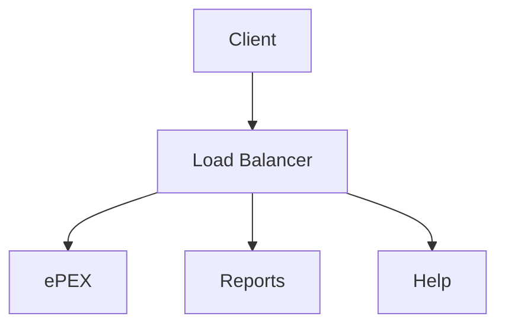
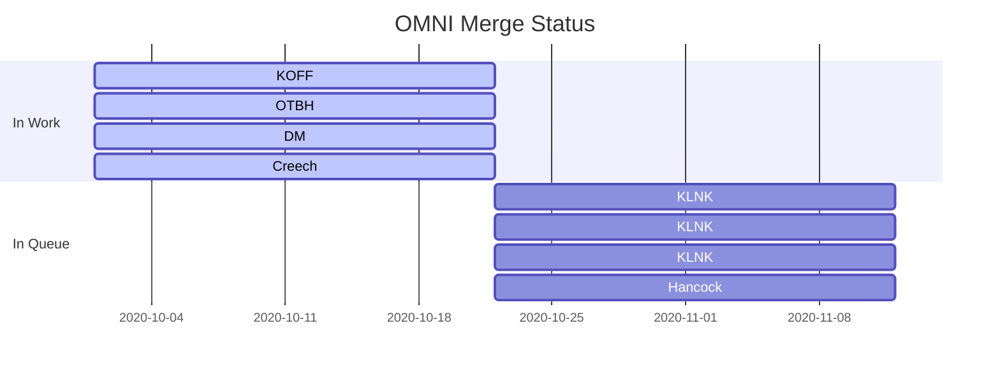

## Operational Status

| Commercial Server Software Versions | Build | Service Pack | 
| :------------ | :-------------: | :------------: | 
| Microsoft Server 2016 | ? | ? | 
| Microsoft SQL Server 2016 | ? | ? |
| Microsoft PowerBI Reports Server | Dec 2019 | N/A | 
| HPE SPP Drivers / Firmware | Oct 2019 | N/A |
| HPE OneView | 5.0.1 | N/A |

| Government Software Description | Version | 
| :------------: | :------------: | 
| ePEX | 5.16.3 | 
| WinPEX | 5.16.3 |
| OMNI Help | 1.0 | 

| Network Hardware Baseline | Hardware Model | Version | 
| :------------: | :------------: | :------------: | 
| F5 | i5800 | 15.1: APM+LTM |  
| Cisco |	Nexus 93880 | NXOS 15 |

| Database Hardware Baseline | Hardware Model | Version | Quantity | 
| :------------: | :------------: | :------------: | :------------: |
| Chassis |	DL 380 | Gen 10 | 2 |
| Firmware | SPP | Oct2019 | N/A |
| Memory |	DDR4 | LRDIMM | 32 x 32GB = 768GB |
| NVDIMM | SCM | N/A | 16 x 8GB = 384GB |
| Storage | NVME | PCIE 3.0 | 2 x 16.42 TB |
| Network | Ethernet | 40 Gb/s | 1 |
| iLO | OneView Advanced | 5.0 | 1 |

| Application Hardware Baseline | Hardware Model | Version | Quantity | 
| :------------: | :------------: | :------------: | :------------: |
| Chassis |	DL 385 | Gen 9 | 10|
| Firmware | SPP | Oct2019 | N/A |
| Memory |	DDR4 | LRDIMM | 4 x 16GB = 64GB |
| Boot Storage | NVME | RAID0 | 250GB |
| Database Bulk Storage | NVME | RAID0 | 30.86TB |
| Network | Ethernet | 10 Gb/s | 1 |
| iLO | OneView Advanced | 4.0 | 1 |

---

## Mobile Device Baseline

**Operating System**

| Operating System | Version |
| :------------: | :-------------: |
| iOS | 13.3 |
| iPadOS | 13.3 |

**Applications**

| Application Name | Version |
| :------------: | :-------------: |
| MaaS360 | 5.4.1 |
| ForeFlight | 11.9 |
| Goodreader | 5.3.1 | 

**Hardware**

| Hardware Model | MIL-STD-810G | MIL-STD-461F | TEMPEST |Apple Model Number| Apple Model ID |
| :------------ | :-------------: | :------------: | :------------: | -------------: | :------------: |
| iPad Air (Gen 3) | X | X | X | A1438 | iPad5,1 |
|	|	|	|	| A1439 |
|	|	|	|	| A1440 |
| iPad Mini 4 | X | X | X | A1516, A1517 |
| iPad Mini 5 | X | X | I | A1700, A1701, A1804 |

**Accessories**

| Brand | Accessory Description | C-135 | A-10 | F-15 | F-16 | F-22 | F-35 |
| :------------: | :------------: | :------------: | :------------: | :------------: | :------------: | :------------: | :------------: |
| YouFly | Kneeboard Thingy | X | X | X | X | X | X |
| RAM | Mount 21 G Model | X | X | X | X | X | X |
| Stratus | ADBS Receiver | X | X | X | X | X | X |

**Use Cases**

  * HQ Chaplain Corps  
  * EFB  
  * Remote Workers (Office)  
  * BIG SAFARI Dev  
  * AFE  
  * Mx  
  * AMOPS  
  * HQ Chaplain Corps  

---

## Status Dashboard

If you are experiencing an issue not listed here, contact [Support](/Contact/)

## Diagram Test

## Gantt Example

