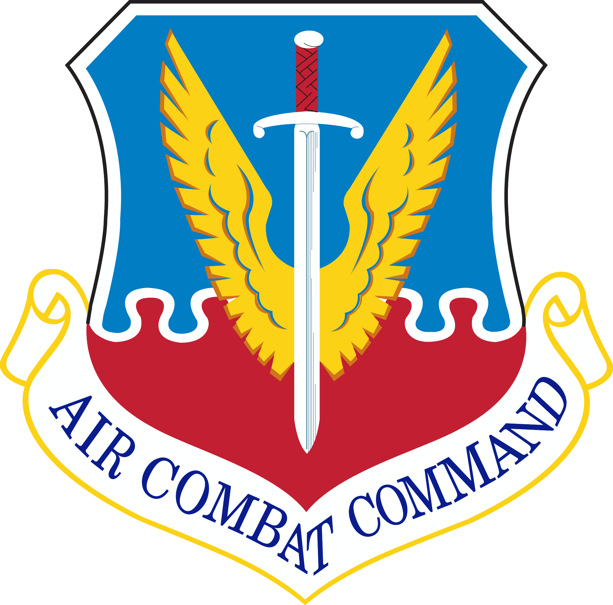
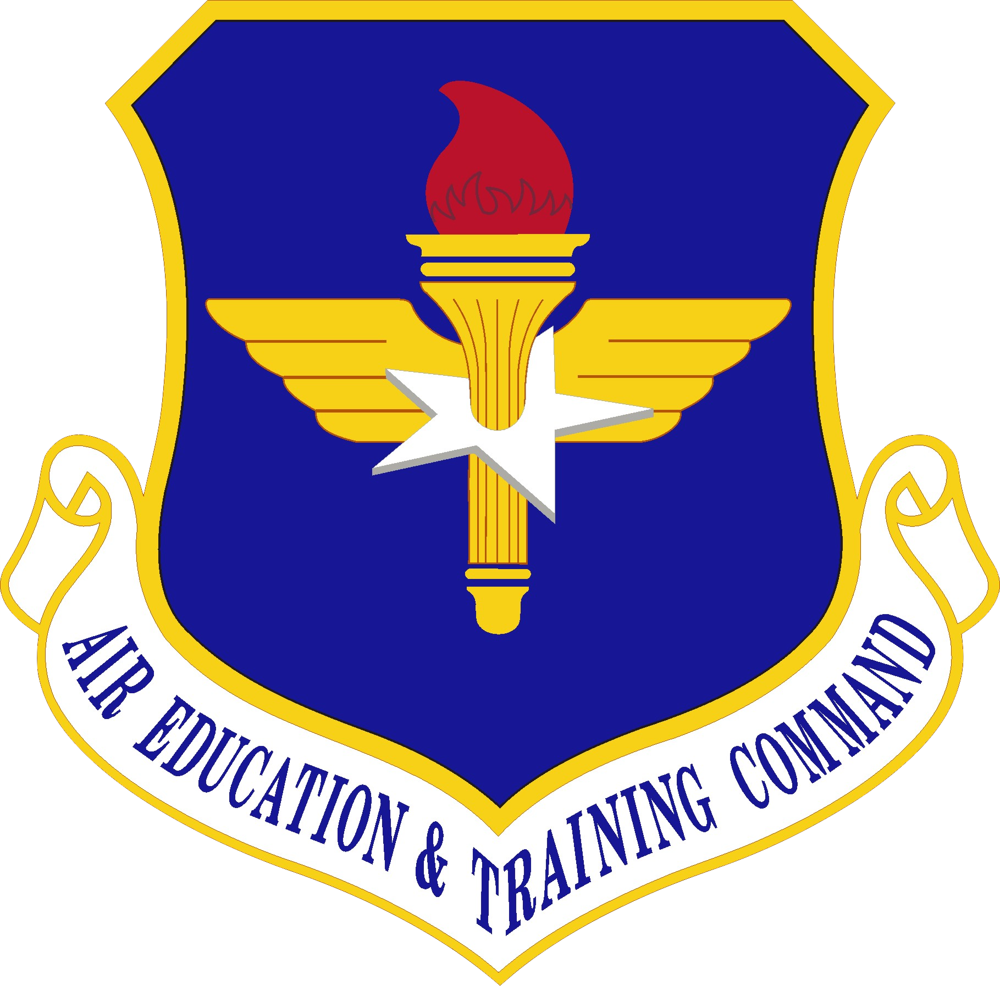
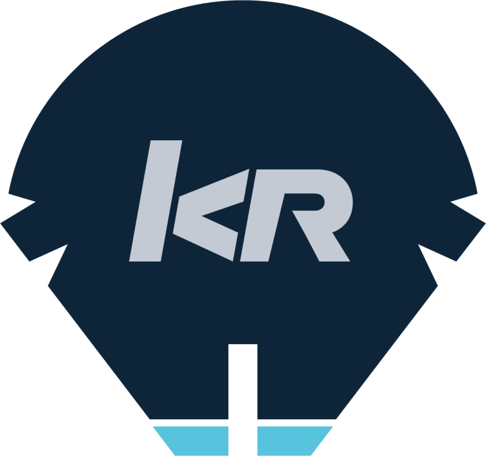

# About
{: style="height:50%;width:50%" .center}
The _Operations Management Networking Initiative_ (OMNI) is a dynamic platform that leverages new and existing products to enable various operations types. OMNI's goal is to provide global connectivity to mission elements through improved Scheduling, Data Science, Native Mobile, and other interactive/disruptive technologies.

---

# Current Status

| Status | Projects | URL |
| :------------: | :------------: | ------------: | 
| Complete | OMNI Test - Patriot Excaliber (PEX) | <https://test.omni.af.mil> |
| In Progress | OMNI Production - Patriot Excaliber (PEX) | https://www.omni.af.mil || In Progress | OMNI Staging - Patriot Excaliber (PEX) | https://devops.omni.af.mil | 
| Active | PowerBI Reports | <https://reports.omni.af.mil> | 
|  | Interactive Documentation Interface | <https://help.omni.af.mil> |
| In Progress | HPE OneView Global Monitoring Dashboard | https://dashboard.omni.af.mil | 
| In Progress | HPE OneView Admin | https://oneview.omni.af.mil | 
| In Progress | WinPEX Direct Access | https://direct.omni.af.mil |
| In Progress | Mobile Enable API | https://api.omni.af.mil |
| In Progress | OMNI-Chat (Mattermost) | https://chat.omni.af.mil |
||||

---

# Partners

| Air National Guard | Air Combat Command | Air Education and Training Command | AFLCMC/ Det 12 (KESSEL RUN) | PEO-BES (BESPIN) |
| :------------: | :------------: | :------------: | :------------: | :------------: |
| {: style="height:75px;width:70px"} | {: style="height:75px;width:70px"} | {: style="height:75px;width:70px"} | {: style="height:75px;width:70px"} | {: style="height:75px;width:70px"} |

---

Last update: {{ git_revision_date_localized }}