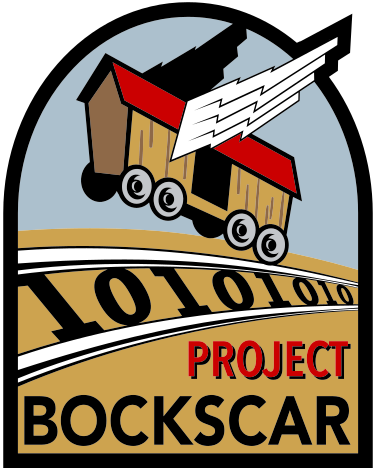

# About
{: style="height:50%;width:50%"}  
The _Operations Management Networking Initiative_ (OMNI) is a dynamic platform that leverages new and existing products to enable various operations types. OMNI's goal is to provide global connectivity to mission elements through improved Scheduling, Data Science, Native Mobile, and other interactive/disruptive technologies.

| Status | Projects | URL |
| :------------: | :------------: | :------------: |
| In Progress | Patriot Excaliber (PEX) | https://www.omni.af.mil |
| Active | PowerBI Reports | https://reports.omni.af.mil |
| In Progress | Interactive Documentation Interface | https://help.omni.af.mil |
| In Progress | HPE OneView Global Monitoring Dashboard | https://dashboard.omni.af.mil |
| In Progress | HPE OneView Admin | https://oneview.omni.af.mil |
| In Progress | WinPEX Direct Access | https://direct.omni.af.mil |
| In Progress | Mobile Enable API | https://api.omni.af.mil |
| In Progress | Mobile Device Integration Toolkit (MDIT) | AKA OMNI-Mobile	|
| In Progress | OMNI-Chat (Mattermost) | https://chat.omni.af.mil	|

|	|	|

---

{: style="height:25%;width:25%"}  
_Project BOCKSCAR_ is a Joint Partnership...

* Nebraska Air National Guard  
* 55th Wing (ACC) at Offutt AFB, Nebraska
* Air Education and Training Command (AETC)
* AFLCMC/Det 12 (KESSEL RUN)

---
